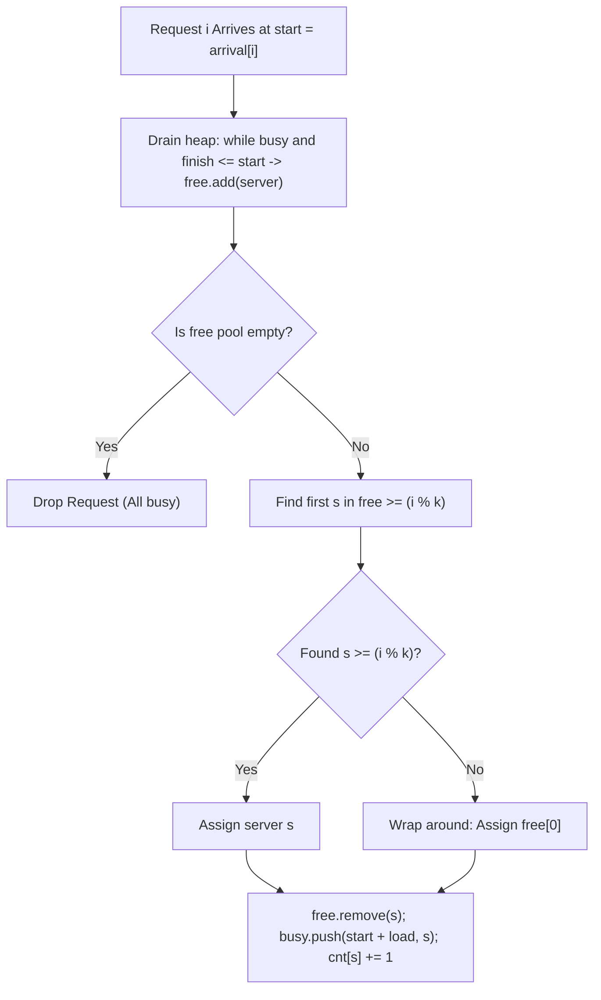

# Guided Example: Find Servers That Handled Most Number of Requests

This guide traces the dual-data-structure simulation (min-heap for busy servers and ordered set for available servers) used to allocate incoming requests under cyclic server preference and capacity constraints.

- **Number of Servers:** $k = 3$ (Server IDs $\{0, 1, 2\}$)
- **Arrival Times:** `arrival = [1, 2, 3, 4, 5]`
- **Processing Loads:** `load = [5, 2, 3, 3, 3]`
- **Target Output:** `[1]` (Server $1$ handles $2$ requests; all others handle $1$)

---

## 1. Instance & Teaching Goal

A cluster of $k$ servers processes a stream of requests. For request $i$:
1. Its ideal target is server $i \pmod k$.
2. If server $i \pmod k$ is available at time $\text{arrival}[i]$, it accepts the request.
3. Otherwise, the request checks the next available server with an index greater than $i \pmod k$, wrapping around cyclically to index $0$ if necessary.
4. If all $k$ servers are busy, the request is permanently dropped.
5. Servers finishing at or before $\text{arrival}[i]$ become free immediately.

```
Cluster Simulation:
  t = 1: Req 0 (arr=1, len=5, pref=0) -> Server 0 busy until t=6.
  t = 2: Req 1 (arr=2, len=2, pref=1) -> Server 1 busy until t=4.
  t = 3: Req 2 (arr=3, len=3, pref=2) -> Server 2 busy until t=6.
  t = 4: Server 1 finishes! Req 3 (arr=4, len=3, pref=0) -> Server 1 busy until t=7.
  t = 5: Req 4 (arr=5, len=3, pref=1) -> All servers busy [0,1,2] -> Dropped!
```

Our teaching goal is to coordinate a min-heap (ordered by release time) with a balanced ordered set (ordered by server ID) to process arrivals and cyclic searches in $\mathcal{O}((R + K) \log K)$ time.

---

## 2. Conceptual Foundation & Invariants

```
+-------------------------------------------------------------------------+
|                  DUAL-STRUCTURE DISPATCH ARCHITECTURE                   |
|                                                                         |
|  1. Busy Min-Heap (busy):                                               |
|     Stores (finish_time, server_id) sorted by finish_time ascending.    |
|     Enables O(log K) extraction of all servers finishing by current t.  |
|                                                                         |
|  2. Free Ordered Set (free):                                            |
|     Stores available server IDs {s0, s1, ...} in sorted order.          |
|     Enables O(log K) cyclic lower-bound search for index >= (i % k).    |
|                                                                         |
|  Cyclic Dispatch Logic:                                                 |
|     target = i % k                                                      |
|     idx = free.bisect_left(target)                                      |
|     if idx < len(free): server = free[idx]       (Direct successor)     |
|     else:               server = free[0]         (Cyclic wrap to min)   |
+-------------------------------------------------------------------------+
```

| Component | Storage Type | Ordering Principle | Algorithmic Responsibility |
|---|---|---|---|
| Active Tasks (`busy`) | Min-Heap | By `finish_time` ascending | Detects and releases idle servers at arrival $t$ |
| Idle Pool (`free`) | Ordered Set / BST | By `server_id` ascending | Fast successor and wraparound queries |
| Load Tracker (`cnt`) | Integer Array | Index $0$ to $k-1$ | Records total completed requests per server |

> **Cyclic Successor Invariant.** In an ordered set of available server IDs, the first server $\ge (i \pmod k)$ represents the shortest forward clockwise distance in the cyclic server ring. If no available ID satisfies this lower bound, wrapping to the minimum element `free[0]` yields the first available server clockwise from zero.



---

## 3. Step-by-Step Worked Execution

### Initialization
- Cluster size: $k = 3$.
- `free = [0, 1, 2]`.
- `busy = []`.
- `cnt = [0, 0, 0]`.

---

### Request 0 ($i = 0$): $\text{arrival} = 1, \text{load} = 5$
1. **Release Phase:** `busy` is empty.
2. **Preference:** $0 \pmod 3 = 0$.
3. **Dispatch:** Smallest ID in `free` $\ge 0$ is $0$.
4. **State Transition:**
   - Remove $0$ from `free` $\implies \text{free} = [1, 2]$.
   - Push to `busy`: $(1 + 5, 0) = (6, 0)$.
   - Update handled tally: $\text{cnt}[0] \leftarrow 0 + 1 = 1$.

---

### Request 1 ($i = 1$): $\text{arrival} = 2, \text{load} = 2$
1. **Release Phase:** Top of `busy` is $(6, 0)$. Finish $6 > 2$; no servers released.
2. **Preference:** $1 \pmod 3 = 1$.
3. **Dispatch:** Smallest ID in `free` $\ge 1$ is $1$.
4. **State Transition:**
   - Remove $1$ from `free` $\implies \text{free} = [2]$.
   - Push to `busy`: $(2 + 2, 1) = (4, 1)$.
   - Update handled tally: $\text{cnt}[1] \leftarrow 0 + 1 = 1$.

---

### Request 2 ($i = 2$): $\text{arrival} = 3, \text{load} = 3$
1. **Release Phase:** Min finish in `busy` is $4 > 3$; no servers released.
2. **Preference:** $2 \pmod 3 = 2$.
3. **Dispatch:** Smallest ID in `free` $\ge 2$ is $2$.
4. **State Transition:**
   - Remove $2$ from `free` $\implies \text{free} = []$.
   - Push to `busy`: $(3 + 3, 2) = (6, 2)$.
   - Update handled tally: $\text{cnt}[2] \leftarrow 0 + 1 = 1$.

---

### Request 3 ($i = 3$): $\text{arrival} = 4, \text{load} = 3$
1. **Release Phase:** Min finish in `busy` is $(4, 1)$. Since $4 \le 4$, pop $(4, 1)$ and add $1$ back to `free`.
   - Next min in `busy` is $6 > 4$; release phase terminates.
   - Pool state: $\text{free} = [1]$.
2. **Preference:** $3 \pmod 3 = 0$.
3. **Dispatch:** Look for ID $\ge 0$ in $\text{free} = [1]$. Found server $1$.
4. **State Transition:**
   - Remove $1$ from `free` $\implies \text{free} = []$.
   - Push to `busy`: $(4 + 3, 1) = (7, 1)$.
   - Update handled tally: $\text{cnt}[1] \leftarrow 1 + 1 = 2$.

---

### Request 4 ($i = 4$): $\text{arrival} = 5, \text{load} = 3$
1. **Release Phase:** Top of `busy` is $(6, 0)$. Since $6 > 5$, no servers released.
2. **Dispatch Check:** `free` is empty ($\text{len} = 0$).
3. **Action:** All servers busy. Request 4 is **dropped**.

---

### Termination & Peak Extraction
- Handled request tallies: $\text{cnt} = [1, 2, 1]$.
- Peak volume: $\max(\text{cnt}) = 2$.
- Servers achieving peak volume: Server `1`.
- Output: `[1]`.

---

## 4. Complete Execution Trace

| Request $i$ | Arrival $t$ | Load | Release Events at $t$ | Idle Servers Before | Preferred ID | Assigned Server | New Finish Time | Handled Count Array |
|---|---|---|---|---|---|---|---|---|
| Init | — | — | — | $\{0, 1, 2\}$ | — | — | — | $[0, 0, 0]$ |
| $0$ | $1$ | $5$ | None | $\{0, 1, 2\}$ | $0$ | Server $0$ | $t = 6$ | $[1, 0, 0]$ |
| $1$ | $2$ | $2$ | None | $\{1, 2\}$ | $1$ | Server $1$ | $t = 4$ | $[1, 1, 0]$ |
| $2$ | $3$ | $3$ | None | $\{2\}$ | $2$ | Server $2$ | $t = 6$ | $[1, 1, 1]$ |
| $3$ | $4$ | $3$ | Server $1$ freed | $\{1\}$ | $0$ | Server $1$ | $t = 7$ | $[1, 2, 1]$ |
| $4$ | $5$ | $3$ | None | $\emptyset$ | $1$ | *Dropped* | — | $[1, 2, 1]$ |

---

## 5. Algorithmic Correctness

**Soundness.** A server $s$ is assigned to request $i$ if and only if: (1) its previous task completed on or before $\text{arrival}[i]$ ($\text{finish} \le \text{arrival}[i]$), and (2) it has the minimal cyclic distance $(s - (i \pmod k)) \bmod k$ among all currently available servers. Pushing $(start + load, s)$ to the min-heap ensures that server $s$ cannot be reused until its task completes.

**Completeness.** Since arrivals are strictly increasing in time, chronological processing correctly orders all server release events before evaluating incoming requests. A request is dropped if and only if every server's finish time is strictly greater than $\text{arrival}[i]$, correctly modeling complete cluster saturation.

---

## 6. Traps This Instance Exposes

- **Strict vs. Inclusive Release Boundary:** Using `< arrival[i]` instead of `\le arrival[i]` prevents a server from taking a new request immediately when its prior job finishes at the same millisecond.
- **Linear Free Search TLE:** Iterating through all $k$ servers sequentially to find the cyclic successor results in $\mathcal{O}(R \cdot k)$ runtime, which triggers Time Limit Exceeded when $R = 10^5$ and $k = 5 \times 10^4$. An ordered set (`SortedList` or balanced BST) performs this in $\mathcal{O}(\log k)$.
- **Omission of Wraparound:** Failing to select `free[0]` when `bisect_left` reaches the end of the available list causes requests to be erroneously dropped even when low-index servers are completely free.

---

## 7. Complexity Derivation

- **Time Complexity:** $\mathcal{O}((R + K) \log K)$, where $R$ is the number of requests and $K$ is the number of servers.
  - Initializing the ordered set takes $\mathcal{O}(K \log K)$ time.
  - Across the entire stream, each server is pushed and popped from the `busy` heap at most $R$ times, totaling $\mathcal{O}(R \log K)$.
  - Each request performs at most one binary search and removal in `free`, costing $\mathcal{O}(\log K)$.
- **Auxiliary Space Complexity:** $\mathcal{O}(K)$ auxiliary space, bounded by the capacity of the `busy` heap ($K$ tuples), the `free` set ($K$ IDs), and the handled request counters.
