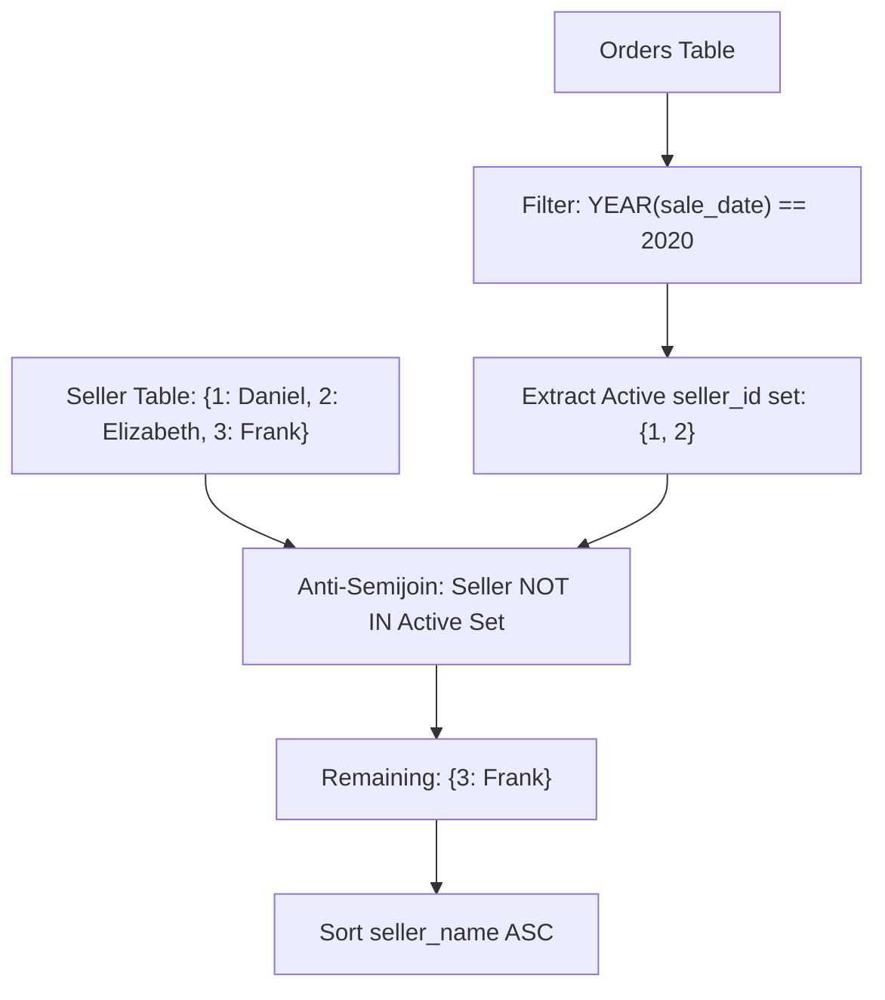

# Guided Example: Sellers With No Sales

This guide demonstrates relational anti-semijoin algebra and outer join null-filtration to identify sellers who recorded zero transactions during the calendar year 2020.

- **Sellers Relation:** `Seller(seller_id, seller_name)`
- **Orders Relation:** `Orders(order_id, order_date, customer_id, price, seller_id)`
- **Target Output:** Table containing `seller_name` of qualifying sellers ordered ascending.

---

## 1. Instance & Teaching Goal

We are given two relational tables: `Seller` and `Orders`. We need to report the names of all sellers who did not make any sales in the year 2020. Sellers who made sales in other years (e.g. 2019 or 2021) or who have never made any sales at all must be included, provided they have no sales between `2020-01-01` and `2020-12-31`.

Consider the following concrete instance:

`Seller`:
| `seller_id` | `seller_name` |
|---|---|
| $1$ | Daniel |
| $2$ | Elizabeth |
| $3$ | Frank |

`Orders`:
| `order_id` | `sale_date` | `customer_id` | `price` | `seller_id` |
|---|---|---|---|---|
| $1$ | `2020-03-01` | $1$ | $2000$ | $1$ |
| $2$ | `2020-01-30` | $2$ | $3000$ | $2$ |
| $3$ | `2019-05-21` | $3$ | $4000$ | $2$ |
| $4$ | `2019-05-13` | $3$ | $2000$ | $3$ |

Target Output:
| `seller_name` |
|---|
| Frank |

Our teaching goal is to model this query as an anti-semijoin ($\rhd$) operating in $\mathcal{O}(S + R)$ relational processing time.

---

## 2. Conceptual Foundation & Invariants

```
+-------------------------------------------------------------------------+
|                  RELATIONAL ANTI-SEMIJOIN PIPELINE                      |
|                                                                         |
|  Step 1: Partition 2020 Transactions                                    |
|    O_2020 = sigma_{YEAR(sale_date) = 2020}(Orders)                      |
|                                                                         |
|  Step 2: Project Active Sellers                                         |
|    S_active = Pi_{seller_id}(O_2020)                                    |
|                                                                         |
|  Step 3: Relational Set Difference / Anti-Semijoin                      |
|    S_clean = Seller |> S_active                                         |
|            = Seller \ (Seller <| S_active)                              |
|                                                                         |
|  Step 4: Projection & Sort                                              |
|    Result = tau_{seller_name ASC}(Pi_{seller_name}(S_clean))            |
+-------------------------------------------------------------------------+
```

| Relational Expression | Algebraic Role | Output Cardinality Bound |
|---|---|---|
| $\sigma_{\text{YEAR}(\text{sale\_date}) = 2020}(\text{Orders})$ | Filters transactions restricted to year 2020 | $\le |R|$ |
| $\Pi_{\text{seller\_id}}(\dots)$ | Distinct active vendor identifiers | $\le \min(|S|, |R|)$ |
| $\text{Seller} \rhd S_{\text{active}}$ | Retains sellers absent from the active 2020 set | $\le |S|$ |
| $\tau_{\text{seller\_name} \uparrow}(\dots)$ | Orders final vendor names alphabetically | Equivalent to $|S_{\text{clean}}|$ |

> **Anti-Join Completeness Invariant.** A seller record $s \in \text{Seller}$ is retained in $\text{Seller} \rhd S_{\text{active}}$ if and only if $\nexists o \in \text{Orders}$ such that $o.\text{seller\_id} = s.\text{seller\_id} \land \text{YEAR}(o.\text{sale\_date}) = 2020$. Sellers with sales in 2019 (such as Frank) produce $0$ matching records in $O_{2020}$ and therefore remain in the anti-semijoin result.



---

## 3. Step-by-Step Worked Execution

### Step 1: Filter Orders by Calendar Year 2020
Evaluate $\text{YEAR}(\text{sale\_date}) = 2020$ for each row in `Orders`:
- Row 1: `sale_date = '2020-03-01'` $\implies \text{YEAR} = 2020$ (Retained)
- Row 2: `sale_date = '2020-01-30'` $\implies \text{YEAR} = 2020$ (Retained)
- Row 3: `sale_date = '2019-05-21'` $\implies \text{YEAR} = 2019 \ne 2020$ (Discarded)
- Row 4: `sale_date = '2019-05-13'` $\implies \text{YEAR} = 2019 \ne 2020$ (Discarded)

Filtered relation $O_{2020}$:
| `order_id` | `sale_date` | `seller_id` |
|---|---|---|
| $1$ | `2020-03-01` | $1$ |
| $2$ | `2020-01-30` | $2$ |

---

### Step 2: Extract Distinct Active Seller IDs
Project the seller identifiers from $O_{2020}$:
$$S_{\text{active}} = \Pi_{\text{seller\_id}}(O_{2020}) = \{1, 2\}$$

---

### Step 3: Anti-Join Against `Seller`
Evaluate membership $s.\text{seller\_id} \notin S_{\text{active}}$ for each seller in `Seller`:
- Seller $1$ (Daniel): $\text{seller\_id} = 1 \in \{1, 2\} \implies$ Excluded.
- Seller $2$ (Elizabeth): $\text{seller\_id} = 2 \in \{1, 2\} \implies$ Excluded.
- Seller $3$ (Frank): $\text{seller\_id} = 3 \notin \{1, 2\} \implies$ **Retained**.

Resulting anti-semijoin relation $S_{\text{clean}}$:
| `seller_id` | `seller_name` |
|---|---|
| $3$ | Frank |

---

### Step 4: Projection and Ordering
Project column `seller_name` and sort ascending:
$$\tau_{\text{seller\_name} \uparrow} (\Pi_{\text{seller\_name}}(S_{\text{clean}})) = [\text{Frank}]$$

---

## 4. Complete Execution Trace

| Seller ID | Seller Name | Associated Orders in `Orders` | 2020 Order Count | Belongs to $S_{\text{active}}$? | Anti-Semijoin Action |
|---|---|---|---|---|---|
| $1$ | Daniel | Order 1 (`2020-03-01`) | $1$ | Yes ($1 \in \{1, 2\}$) | Discarded |
| $2$ | Elizabeth | Order 2 (`2020-01-30`), Order 3 (`2019-05-21`) | $1$ | Yes ($2 \in \{1, 2\}$) | Discarded |
| $3$ | Frank | Order 4 (`2019-05-13`) | $0$ | No ($3 \notin \{1, 2\}$) | **Retained** |

Final tabular presentation:
| `seller_name` |
|---|
| Frank |

---

## 5. Algorithmic Correctness

**Soundness.** A seller $s$ is emitted in the output if and only if no row in `Orders` associated with $s.\text{seller\_id}$ carries a `sale_date` in the calendar year 2020. This matches the exact requirement that the seller made zero sales in 2020.

**Completeness.** Every seller registered in the `Seller` table is evaluated against the set of 2020 transactions. Sellers who made transactions exclusively in other years (such as Frank in 2019) or sellers who have never logged any transactions produce zero matches in the 2020 active set and are guaranteed to be preserved.

---

## 6. Traps This Instance Exposes

- **Row-Level Filtration Error:** Attempting to filter rows via `WHERE YEAR(sale_date) != 2020` preserves Elizabeth's 2019 transaction row (`order_id = 3`), causing Elizabeth to be erroneously returned even though she recorded a 2020 sale. Year filtration must isolate 2020 transactions before applying set exclusion.
- **Three-Valued Logic in Set Negation:** If using subquery set exclusion with nullable columns, any `NULL` within the subquery causes `NOT IN` predicates to evaluate to `UNKNOWN`, silently returning empty sets. Anti-semijoins or outer joins testing for null keys provide robust null safety.
- **Omission of Sellers with Zero Total Sales:** Using an inner join between `Seller` and `Orders` automatically drops sellers who have never made a sale in any year. An outer join or anti-semijoin preserves these sellers as required.

---

## 7. Complexity Derivation

- **Time Complexity:** $\mathcal{O}(S + R \log(S + R))$, where $S$ is the cardinality of `Seller` and $R$ is the cardinality of `Orders`. Filtering 2020 transactions takes $\mathcal{O}(R)$ time. Performing a hash anti-join or indexed lookup takes $\mathcal{O}(S + R)$ time. Sorting the final output relation takes $\mathcal{O}(S \log S)$.
- **Auxiliary Space Complexity:** $\mathcal{O}(S + R)$ auxiliary working space to materialize the active seller hash set and intermediate join tables.
