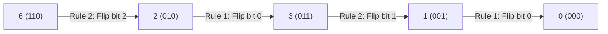

# Guided Example: Minimum One Bit Operations to Make Integers Zero

This guide demonstrates the isomorphism between the constrained one-bit transition rules and reflected binary Gray codes, proving how inverse Gray code decoding computes the minimum operations to reduce an integer to zero.

- **Initial Integer:** $n = 6$ (Binary: `110`$_2$)
- **Allowed Rules:**
  1. Flip bit $0$ (the least significant bit).
  2. Flip bit $i$ if and only if bit $i-1$ is $1$ and all lower bits $i-2, \dots, 0$ are $0$.
- **Target Value:** `4` operations (Transition sequence: $6 \to 2 \to 3 \to 1 \to 0$)

---

## 1. Instance & Teaching Goal

The problem permits exactly two deterministic bit-flip operations on an integer $n$. Reversing these operations reveals that the state space forms an unbranched linear chain rooted at zero, exactly corresponding to the canonical reflected Gray-code sequence $G(0), G(1), G(2), \dots$ where consecutive numbers differ by a single valid bit flip:
$$G(x) = x \oplus (x \gg 1)$$

```
Gray Code Sequence & Transition Graph:
  Index x:   0      1      2      3      4      5      6      7
  G(x):     000 -> 001 -> 011 -> 010 -> 110 -> 111 -> 101 -> 100
             |      |      |      |      ^
             +------+------+------+------+
                          Distance = 4 steps
```

For $n = 6 = 110_2$, $G(4) = 4 \oplus 2 = 6$. Hence, exactly $4$ backward transitions are required to reach $0$.

Our teaching goal is to trace the inverse Gray code decoding algorithm:
$$\text{ans} = n \oplus (n \gg 1) \oplus (n \gg 2) \oplus \cdots$$
executing in $\mathcal{O}(\log n)$ time and $\mathcal{O}(1)$ auxiliary memory.

---

## 2. Conceptual Foundation & Invariants

```
+-------------------------------------------------------------------------+
|                  INVERSE GRAY CODE PREFIX PARITY MODEL                  |
|                                                                         |
|  Forward Gray Encoding:                                                 |
|    g_k = b_{k+1} ^ b_k                                                  |
|                                                                         |
|  Inverse Gray Decoding (Prefix XOR):                                    |
|    b_k = g_m ^ g_{m-1} ^ ... ^ g_k                                      |
|                                                                         |
|  Bit-Parallel Accumulation:                                             |
|    ans = 0                                                              |
|    while n > 0:                                                         |
|        ans ^= n                                                         |
|        n >>= 1                                                          |
|    return ans                                                           |
+-------------------------------------------------------------------------+
```

| Bit Position $k$ | Binary Meaning | Gray Bit $g_k$ | Decoded Prefix Parity $b_k$ |
|---|---|---|---|
| $2$ ($2^2 = 4$) | Most significant bit of $6$ | $1$ | $g_2 = 1$ |
| $1$ ($2^1 = 2$) | Middle bit of $6$ | $1$ | $g_2 \oplus g_1 = 1 \oplus 1 = 0$ |
| $0$ ($2^0 = 1$) | Least significant bit of $6$ | $0$ | $g_2 \oplus g_1 \oplus g_0 = 1 \oplus 1 \oplus 0 = 0$ |

> **Gray Code Bijection Invariant.** Because the transition graph between non-negative integers defined by the two rules forms a Hamiltonian path isomorphic to the standard binary reflected Gray code, every integer $n$ has a unique position $x$ such that $G(x) = n$. Because all operations are reversible, the minimum number of steps to reduce $n$ to $0$ is precisely the integer value $x = \text{Gray}^{-1}(n)$.



---

## 3. Step-by-Step Worked Execution

### Tracing Inverse Gray Bit-Parallel Accumulation for $n = 6$ (`110`$_2$)

- Initialize accumulator: $\text{ans} = 0 = 000_2$.
- Initial state: $n = 6 = 110_2$.

---

### Iteration 1
- Accumulate: $\text{ans} \leftarrow \text{ans} \oplus n = 000_2 \oplus 110_2 = 110_2$ ($6$).
- Shift: $n \leftarrow n \gg 1 = 011_2$ ($3$).
- Remaining $n = 3 > 0 \implies$ Continue.

---

### Iteration 2
- Accumulate: $\text{ans} \leftarrow \text{ans} \oplus n = 110_2 \oplus 011_2 = 101_2$ ($5$).
- Shift: $n \leftarrow n \gg 1 = 001_2$ ($1$).
- Remaining $n = 1 > 0 \implies$ Continue.

---

### Iteration 3
- Accumulate: $\text{ans} \leftarrow \text{ans} \oplus n = 101_2 \oplus 001_2 = 100_2$ ($4$).
- Shift: $n \leftarrow n \gg 1 = 000_2$ ($0$).
- Remaining $n = 0 \implies$ Halt.

Final accumulated answer: $\text{ans} = 100_2 = 4$.

---

### Verification: Physical State Transitions

1. **Step 1:** State is $110_2$ ($6$). Bit $1$ is $1$ and bit $0$ is $0$. By Rule 2, bit $2$ can be flipped:
   $$110_2 \xrightarrow{\text{flip bit 2}} 010_2 \quad (2)$$
2. **Step 2:** State is $010_2$ ($2$). By Rule 1, bit $0$ can be flipped:
   $$010_2 \xrightarrow{\text{flip bit 0}} 011_2 \quad (3)$$
3. **Step 3:** State is $011_2$ ($3$). Bit $0$ is $1$. By Rule 2, bit $1$ can be flipped:
   $$011_2 \xrightarrow{\text{flip bit 1}} 001_2 \quad (1)$$
4. **Step 4:** State is $001_2$ ($1$). By Rule 1, bit $0$ can be flipped:
   $$001_2 \xrightarrow{\text{flip bit 0}} 000_2 \quad (0)$$

Total transitions: $4$.

---

## 4. Complete Execution Trace

| Iteration | Shifted Term $n$ (Binary) | Current Term Value | Running XOR $\text{ans} \leftarrow \text{ans} \oplus n$ | Decimal Accumulator | Condition $n > 0$ |
|---|---|---|---|---|---|
| Init | `110` | $6$ | `000` | $0$ | Active |
| 1 | `110` | $6$ | `000` $\oplus$ `110` = `110` | $6$ | True ($3 > 0$) |
| 2 | `011` | $3$ | `110` $\oplus$ `011` = `101` | $5$ | True ($1 > 0$) |
| 3 | `001` | $1$ | `101` $\oplus$ `001` = `100` | $4$ | False ($0 = 0$) |

Final result: $4$.

---

## 5. Algorithmic Correctness

**Soundness.** In the binary reflected Gray code sequence $G(x) = x \oplus (x \gg 1)$, consecutive values $G(x)$ and $G(x+1)$ differ in exactly one bit. Specifically, when $x$ is even, $G(x)$ and $G(x+1)$ differ in the $0$-th bit (matching Rule 1). When $x$ is odd, they differ in the unique bit $i$ where bit $i-1$ is $1$ and all lower bits are $0$ (matching Rule 2). Thus, the allowed operations trace the Gray code path backwards from $n$ to $0$.

**Completeness.** Since $G$ is a bijection on the set of non-negative integers, there is a unique index $x$ such that $G(x) = n$. Inverting this relationship by definition yields $b_k = \bigoplus_{j \ge k} g_j$. The bitwise loop accumulates precisely these prefix XOR sums across all bit positions simultaneously. The minimum number of steps to reach $0$ is therefore guaranteed to equal $x$.

---

## 6. Traps This Instance Exposes

- **Greedy Highest-Bit Clearing Fallacy:** Trying to directly clear the highest set bit fails because higher bits cannot be flipped unless lower bits conform to the strict pattern $100\dots0$. Clearing higher bits requires first building up the required lower-bit configuration, flipping the higher bit, and then dismantling the lower configuration.
- **Arithmetic Addition vs. Bitwise XOR:** Accumulating shifted copies using integer addition (`ans += n`) introduces unwanted arithmetic carries that corrupt the prefix parity calculations. Bitwise XOR (`ans ^= n`) must be used.
- **Recursion Depth Limits:** Implementing the recurrence $A(n) = 2^{k+1} - 1 - A(n \oplus 2^k)$ recursively without bit-parallel shifts incurs repeated highest-set-bit scans taking $\mathcal{O}(\log^2 n)$ time.

---

## 7. Complexity Derivation

- **Time Complexity:** $\mathcal{O}(\log n)$. The loop right-shifts $n$ by $1$ in each iteration until $n = 0$. For any 32-bit integer $n \le 10^9$, the loop executes at most $\approx 30$ times, each taking $\mathcal{O}(1)$ bitwise operations.
- **Auxiliary Space Complexity:** $\mathcal{O}(1)$ auxiliary space, storing only the scalar integer accumulators.
