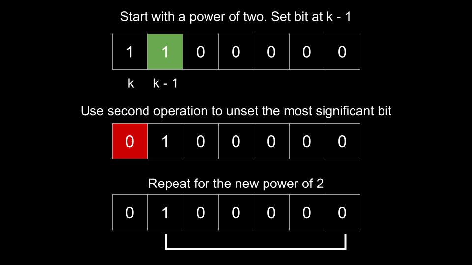
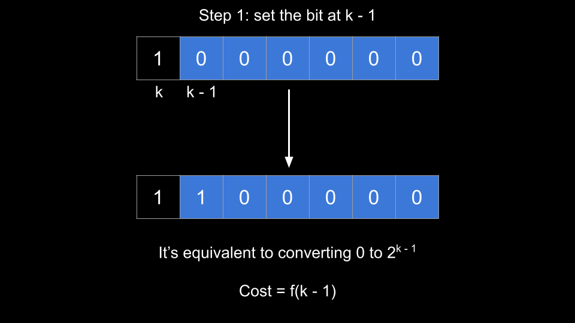
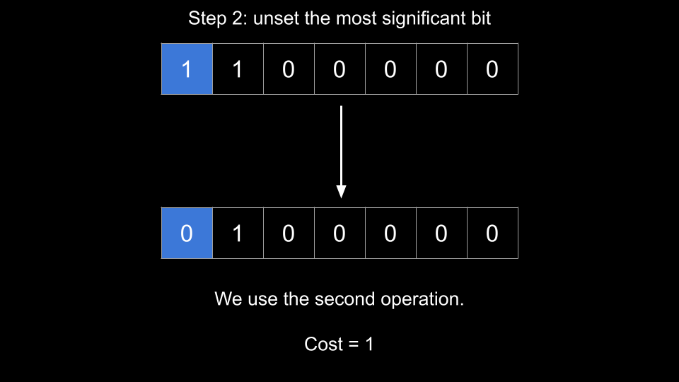
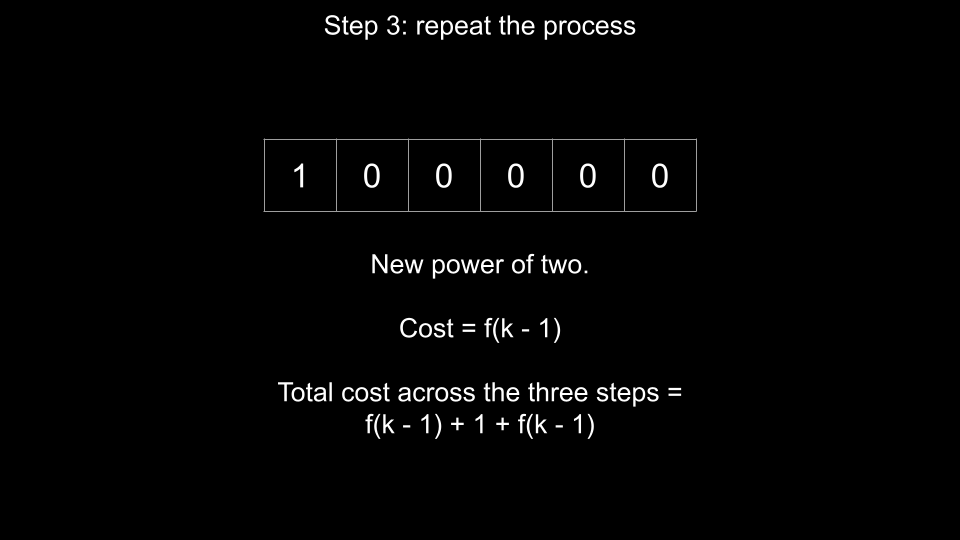
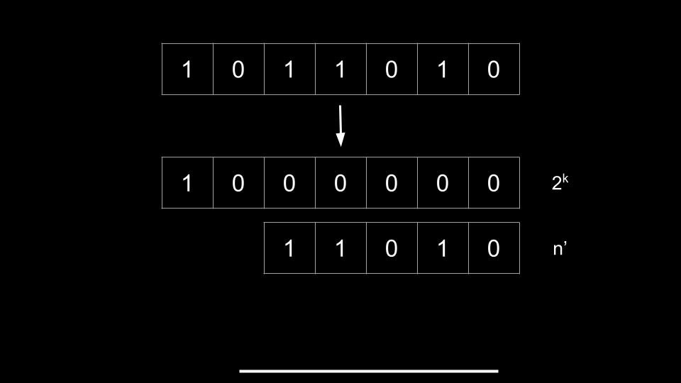
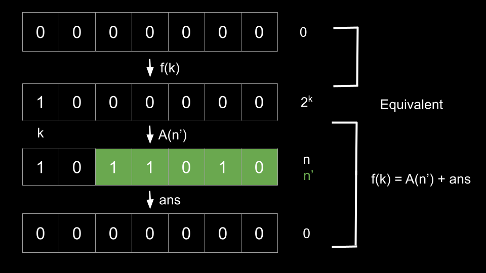

## Solution

---

### Approach 1: Math and Recursion

**Intuition**

> This is a very difficult problem! In this article, we will assume that you are familiar with the basics of bit manipulation, recursion, and mathematical analysis.

We need to develop a strategy that allows us to set bits to 0. The first observation we can make is that other than the rightmost bit, a bit can only be changed with the second operation. Thus, if we want to change a given bit (other than the rightmost one) to 0, we **must** first convert the number into the appropriate form. For example, let's say we have $n = 19$, which is `10011` in binary. If we want to unset the leftmost (most significant) bit, we must convert the number into `11000` first, and then perform the second operation.

Let's start by considering the simplest case. How many operations do we need to reduce `n` to `0` when `n` is a power of 2? We have $n = 2^k$, where $k$ is some non-negative integer. In binary, the number has one bit set to `1`, and the rest are `0`. Let's use $n = 16 = 2^4$ as an example. In binary, $n$ is $10000$, and we have $k = 4$.

There are 3 steps to reducing `n` to `0` when it is a power of 2:

1. First, we need to set the bit at position $k - 1$. In our example with $n = 16$, we need to set the bit at position `3`, thus `n` becomes $11000$
2. Next, we use the second operation to unset the most significant bit (at position `k`). Now, `n` becomes $01000$
3. Finally, we need to reduce the remaining number to `0` by unsetting the bit at position $k - 1$


<br>

Notice that after step 2, `n` is a new power of `2` and thus step 3 is the same problem (**how many operations do we need to reduce a power of 2 to `0`?**) with a smaller input. We have identified a recursive relationship.

> Before we continue, we must talk about another **critical observation**.
>
> Both operations are **reversible**. Because each of the two operations flips only one bit, if we can transform `a` into `b` with a single operation `O1`, it means we can reverse the process by applying the same type of operation to `b` flipping the same bit, to get back to `a`.

<details><summary><b>Click here to see a brief proof of the critical observation</b></summary>

Without loss of generality, let's assume that:

- `a --- O1 ---> b`
- `b --- O2 ---> c`
- `c --- O3 ---> d`
- ...
- `y --- On ---> z`

So, if a sequence of operations `[O1, O2, ..., On]` is the minimum number of steps to transform `a` into `z`, then we can also use the reversed sequence `[On, ..., O2, O1]` to transform `z` into `a` and this sequence is also the minimum number of steps to accomplish this.

To prove the above statement, let's employ a proof by contradiction:

- Given that `[O1, O2, ..., On]` is the minimum number of steps to transform `a` into `z`, let's assume that the sequence `[On, ..., O2, O1]` **is not** the minimum steps required to transform `z` into `a`.
- Now, if this is the case, there must exist some other sequence, say `[Xm, ..., X2, X1]`, that requires fewer steps to transform `z` into `a`.
- We can use the reversed sequence `[X1, X2, ..., Xm]` to transform `a` to `z`, and since it requires fewer steps than `[O1, O2, ..., On]`, this contradicts our initial assumption.
- Therefore, our assumption that `[On, ..., O2, O1]` is not the minimum number of steps to transform `z` into `a` must be false.

</details>

<br>

> To sum up, the minimum number of operations for converting `x` to `y` for arbitrary `x, y` is always the same as the minimum number of operations for converting `y` to `x`.
>
> We will make use of this observation heavily throughout the rest of the article.

Let $f(k)$ equal the number of operations required to reduce $2^k$ to `0`. We will use this definition of $f$ throughout the article. What is the value of $f(k)$? It would be the sum of the 3 steps above. Let's analyze each step separately.

1. When we start step 1, the $k$ bits to the right of the most significant bit are all `0`. After step 1, the $k$ bits to the right represent $2^{k - 1}$, because we set the bit at position $k - 1$. As you can see, step 1 is actually just converting `0` to $2^{k - 1}$. From the critical observation, we know that this will cost the same number of operations as converting $2^{k - 1}$ to `0`. Thus, step 1 costs $f(k - 1)$ operations


<br>

2. Step 2 costs one operation


<br>

3. The remaining number is $2^{k - 1}$. Reducing this to `0` will cost $f(k - 1)$ operations


<br>

Summing these values, we have

$f(k) = f(k - 1) + 1 + f(k - 1)$

$f(k) = 2 \cdot f(k - 1) + 1$

The base case of this recurrence is when $k = 0$. We have $n = $2^{0}$ = 1$, which requires using the first operation once. Thus, $f(0) = 1$.

```python
def f(k):
    if k == 0:
        return 1

    return 2 * f(k - 1) + 1
```

Calculating $f(k)$ will cost $O(k)$, although we could improve it to $O(1)$ with memoization (but then we would need more space and general overhead). Is there a way we can calculate $f(k)$ more efficiently?

With some analysis, we can show that $f(k) = 2^{k + 1} - 1$.

The value of our base case is $f(0) = 1$, which can conveniently be written in the form $2^k - 1$ where $k$ is a non-negative integer, i.e. its value is a power of 2 minus one. When we plug this back into $f$, we get $2 \cdot (2^k - 1) + 1 = 2^{k + 1} - 1$. Without loss of generality, we have another power of two minus one.

As you can see, plugging a power of two minus one into our recurrence simply gives us the next power of two minus one. Because our base case is a power of two minus one, all values of $f$ will be a power of two minus one, specifically $f(k) = 2^{k + 1} - 1$. This method is commonly known as mathematical induction.

We can easily verify this formula by looking at values of $f$.

| k | breakdown | value of f(k) |
|:---:|:---:|:--------:|
|  0  | base case  | $1 = $2^{1}$ - 1$ |
|  1  | 2 * f(0) + 1  | $3 = $2^{2}$ - 1$ |
|  2  | 2 * f(1) + 1 = 2 * 3 + 1  | $7 = $2^{3}$ - 1$ |
|  3  | 2 * f(2) + 1 = 2 * 7 + 1  | $15 = $2^{4}$ - 1$ |
|  4  | 2 * f(3) + 1 = 2 * 15 + 1 | $31 = $2^{5}$ - 1$ |
|  5  | 2 * f(4) + 1 = 2 * 31 + 1  | $63 = $2^{6}$ - 1$ |

<br>

---

Finally, we have concluded that the number of operations to reduce a power of two $2^k$ is $2^{k + 1} - 1$. But this does not solve the problem, because `n` is not necessarily a power of two!

However, we can split the problem into two parts. The first part will be to identify the most significant bit. Let's say this bit is at position `k`. Then we can consider this bit on its own, and we have a value of $2^k$. We know reducing this value will cost us $2^{k + 1} - 1$ operations.

The remaining part will be all the bits to the right. Let's call the value of this remaining part $n'$. We can get this value as $n' = n \oplus 2^k$, where $\oplus$ is the XOR operation.

How many operations do we need to reduce $n'$ to `0`? It's the original problem with a smaller input! We can simply recursively call the function with $n'$. The base case of this recursion is when $n' = 0$, we require $0$ operations.


<br>

For the sake of brevity, let's denote $A(x)$ as the number of operations to reduce an arbitrary $x$ to `0`. Thus, it would cost $A(n')$ to solve the subproblem.

You may be thinking: the answer is $f(k) + A(n')$. However, it's actually $f(k) - A(n')$. Why?

---

**Proof**

> As a reminder:
>
> $k$ is the position of the most significant bit in $n$
>
> $f(k)$ is the number of operations required to reduce $2^k$ to $0$
>
> $n'$ is the value of $n$ with the most significant bit removed
>
> $A(x)$ is the number of operations required to reduce an arbitrary $x$ to $0$

1. Let's say that we start with `0` and convert it to $2^k$. This requires $f(k)$ operations (remember the critical observation!)
2. Next, we convert $2^k$ to $n$. By the critical observation, this is equivalent to converting $n$ to $2^k$, which is in turn equivalent to reducing $n'$ to `0`. This is because all the bits in $2^k$ are `0` except for the bit at position `k`, which by definition is not considered in $n'$. We know that this conversion costs $A(n')$ operations
3. Finally, we reduce $n$ to `0`. Let's say this costs $\text{ans}$ operations

At the beginning of step 1 we have `0` and at the end of step 1 we have $2^k$. At the beginning of step 2 we have $2^k$ and at the end of step 3 we have `0`. Thus, step 2 and step 3 reverses the operations done by step 1, and by the critical observation, step 1 requires the same number of operations as step 2 and 3.

We have $f(k) = A(n') + \text{ans}$. We defined $\text{ans}$ as the answer to the problem, and we can rearrange: $\text{ans} = f(k) - A(n')$.


<br>

You may be thinking: we can also consider that it requires $f(k) + A(n')$ steps to convert `0` to `n`, then $\text{ans}$ steps to convert `n` back to `0`. Why can't we write  $\text{ans} = f(k) + A(n')$ instead?

We certainly could, and this "pathing" would be a perfectly valid way to use the operations to convert `0` to `n` or vice versa. However, the problem is asking for the minimum operations possible. As $A(n') \geq 0$, $f(k) - A(n') \leq f(k) + A(n')$ (see below for further explanation).

---

**Explanation**

While the argument we have presented here is convincing, it is not very intuitive! It is tough to understand, but the key idea is that during the $f(k)$ steps where we reduce $2^k$, the original number $n$ is actually in the middle of the process! That is, if you were to actually perform the operations to reduce $2^k$ to $0$, you would actually have the value $n$ after some operations.

Recall our function $f$ that determined the number of operations required to reduce a power of two. The first step in reducing a power of two was to set the bit at position $k - 1$, and it cost $f(k - 1)$ operations to do so.

However, these $f(k - 1)$ operations were performed under the assumption that we start with all the bits being `0` (since $f$ was defined in the context of powers of two).

With $n$, we may start with some bits set. These bits being set represent progress toward these $f(k - 1)$ operations!

For example, let's say we want to reduce $2^3$ which is $1000$ in binary. Step 1 would be to convert the number to $1100$. This is equivalent to converting $0000$ to $0100$, which we know requires $f(2)$ operations.

What if we have $n = 10$, which is $1010$ in binary? Converting this number to $1100$ is equivalent to converting $0010$ to $0100$. This will require less than $f(2)$ operations because we already have a bit set, which is progress! Basically, $0010$ is "closer" to $0100$ than $0000$ is to $0100$.

Because of the critical observation, the progress is equal to $A(n')$, since that is exactly the difference between the initial state of $n$ and the context in which $f$ was defined.

> To summarize the logic, it is more expensive to reduce $2^k$ than it is to reduce $n$.
>
> The reason we use $2^k$ in our algorithm is that we needed to break `n` into a subproblem so that we could solve it with recursion, $2^k$ has only one set bit, and this simple structure facilitates our recursive relationships. As we found a formula for reducing $2^k$, it was convenient for us to break $n$ into two subproblems: reducing $2^k$ and reducing $n'$.
>
> If we were to actually carry out the operations to go from `0` to `n` optimally, we would not first convert `0` to $2^k$ then $2^k$ to $n$. Although this would be valid, it would require $f(k) + A(n')$ operations and be a suboptimal strategy. Instead, we would go straight from `0` to `n`, since `n` is "on the way" to $2^k$. If we were to keep going until $2^k$, it would cost us $A(n')$ operations (equivalent to reducing $n'$).
>
> That's why we subtract $A(n')$ from $f(k)$. Because it would take us $f(k)$ operations to get to $2^k$, but we don't go to $2^k$. We go to $n$, which is $A(n')$ operations closer.

---

This **finally** leads us to our solution. First, we check for our base case. If $n = 0$, simply `return 0`. Otherwise, we identify `k`, the position of the most significant bit. This can be done using a while loop. Once we have `k`, we know the answer is $f(k) - A(n')$, where:

- $f(k) = 2^{k + 1} - 1$
- $A(n') = \text{minimumOneBitOperations}(n \oplus \text{curr})$, where $\oplus$ is the XOR operator and `curr` $=2^k$

**Algorithm**

1. If $n = 0$, return `0`.
2. Initialize $k = 0$, $curr = 1$. Here, `curr` represents $2^k$.
3. While $curr * 2 \le n$:
- Multiply `curr` by `2`.
- Increment `k`.
4. Return $2^{k + 1} - 1 - \text{minimumOneBitOperations}(n \oplus \text{curr})$.

**Implementation**

```python
class Solution:
    def minimumOneBitOperations(self, n: int) -> int:
        if n == 0:
            return 0

        k = 0
        curr = 1
        while (curr * 2) <= n:
            curr *= 2
            k += 1

        return 2 ** (k + 1) - 1 - self.minimumOneBitOperations(n ^ curr)
```

**Complexity Analysis**

* Time complexity: $O(\log^2{}n)$

    The worst case scenario is when $n$ can be written in the form $2^k - 1$. The while loop to find the most significant bit will iterate $\log{}n$ times. Then, we call the function again with the most significant bit removed. The while loop will then iterate $(\log{}n) - 1$ times. In the next function call, it will iterate $(\log{}n) - 2$ times, and so on.

    In total, there would be $1 + 2 + 3 + ... + \log{}n$ iterations. This is the partial sum of [this series](https://en.wikipedia.org/wiki/1_%2B_2_%2B_3_%2B_4_%2B_%E2%8B%AF#Partial_sums) for $\log{}n$, which is equal to $\frac{\log{}n \cdot ((\log{}n) + 1)}{2} = O(\log^2{}n)$.

    In addition, exponentiation has a logarithmic time complexity, which cannot be ignored in an analysis such as this.

* Space complexity: $O(\log{}n)$

    The recursion call stack can have a max depth of $O(\log{}n)$.

<br/>

---

### Approach 2: Iteration

**Intuition**

The same idea from the first approach can be implemented iteratively, in the opposite direction. Instead of reducing $n$ to `0`, we will try to convert `0` to $n$, which, as we know, is equivalent and requires the same minimum number of steps.

We start by considering the least significant bit of `n` and iterate toward the most significant bit. Let's say the current bit we are focusing on is at position $k$.

Let's say the least significant set bit is at position $k_0$. We know it represents $2^{k_0}$ by definition (as it is the least significant set bit, every other bit to the right must be 0). We also know that we require $2^{k_0 + 1} - 1$ operations to convert `0` to this power of two.

Consider the next bit on the left is at position $k_1$. To convert `0` to $2^{k_1}$ would require $2^{k_1 + 1} - 1$ operations. However, this bit does not exactly represent $2^{k_1}$ in the full context of `n`, since we have the bit at position $k_0$.

Thankfully, we learned in the previous approach that the bit being set at position $k_0$ actually represents progress toward the conversion to $2^{k_1}$. In fact, everything to the right of the current $k$ is analogous to $n'$ from the previous approach. Thus, we can subtract $A(n')$ from $2^{k_1 + 1} - 1$ to get the number of operations required to convert `0` to `n` up to $k_1$.

Let's continue: the next bit on the left is at position $k_2$. To convert `0` to $2^{k_2}$ would require $2^{k_2 + 1} - 1$ operations. Everything to the right (the bits at $k_0$ and $k_1$) represents $n'$ and gives us $A(n')$ progress toward creating `n` up to $k_2$.

The question is: what is the value of $A(n')$ at each step and how do we continuously update our answer as we iterate over the bits of `n`? We will use the following variables in our code:

1. `k`, this represents the current bit's position
2. `mask`, this represents $2^k$
3. `ans`, this represents the answer to the problem when considering `n` only up to the $k^{th}$ bit

When we are finished with the bit at $k_i$ and move to the bit at $k_{i + 1}$, `ans` now represents $A(n')$! Remember that $A(n')$ is the number of operations needed to solve the problem for $n'$, and $n'$ ignores the $k^{th}$ bit. When we move forward, `ans` is "outdated" and represents the answer for $n'$, which is exactly $A(n')$!

For any given $k$, if the $k^{th}$ bit is set, we can update `ans` as:

$2^{k + 1} - 1 - \text{ans}$

We can check if the $k^{th}$ bit is set by ANDing `n` with `mask`. After each iteration, we increment `k` and left shift `mask`.

**Algorithm**

1. Initialize $ans = 0$, $k = 0$, $mask = 1$.
2. While $mask \le n$:
- If the bit from `mask` is set in `n`, that is, $n \& mask \neq 0$, update `ans` as $2^{k + 1} - 1 - \text{ans}$.
- Left shift `mask` once.
- Increment `k`.
3. Return `ans`.

**Implementation**

```python
class Solution:
    def minimumOneBitOperations(self, n: int) -> int:
        ans = 0
        k = 0
        mask = 1

        while mask <= n:
            if n & mask:
                ans = (1 << (k + 1)) - 1 - ans

            mask <<= 1
            k += 1

        return ans
```

**Complexity Analysis**

* Time complexity: $O(\log n)$

    The loop runs once per bit of $n$, so it iterates $\log n$ times.

    Every operation inside the loop is constant time when implemented with shifts, bitwise operations, and integer arithmetic in C++ and Java.

    In Python, using $1 << (k + 1)$ instead of $2 ** (k + 1)$ also keeps the complexity at $O(\log n)$.

* Space complexity: $O(1)$

    This may be controversial. We aren't using any extra space other than a few integers. However, `mask` grows to a value linear with $n$. One could argue that such a value uses $O(\log{}n)$ space, although `mask` never has more than one bit set.

    We have written the space complexity as constant here as it is a standard convention to consider integers as using $O(1)$ space. However, there is nuance to consider when the nature of the problem focuses on bits.

<br/>

---

### Approach 3: Gray Code

**Intuition**

> Note: this approach is very advanced. You would not be expected to derive this approach in an interview. We have included it for the sake of completeness.

A [Gray code](https://en.wikipedia.org/wiki/Gray_code), named after Frank Gray, is an ordering of binary numbers such that every successive number in the ordering differs by only one bit.

You may notice that the two operations given in the problem are capable only of changing exactly one bit at a time. Thus, any sequence of numbers generated by these operations **must** also be a Gray code!

Although there can be many Gray codes, the standard encoding actually follows the exact same ordering as one that would be produced by the operations given in this problem.

Thus, this problem is actually equivalent to finding the index of $n$ in the standard Gray code sequence that starts from `0`, since reducing `n` to `0` is equivalent to converting `0` to `n`.

The [Wikipedia article](https://en.wikipedia.org/wiki/Gray_code#Converting_to_and_from_Gray_code) provides a very efficient algorithm to do this. As this approach (and certainly the derivation) is outside the scope of an interview, we will not discuss it in detail here. Interested users are encouraged to read through the Wikipedia article to learn more.

**Algorithm**

1. Initialize $ans = n$.
2. XOR `ans` with `ans >> 16`.
3. XOR `ans` with `ans >> 8`.
4. XOR `ans` with `ans >> 4`.
5. XOR `ans` with `ans >> 2`.
6. XOR `ans` with `ans >> 1`.
7. Return `ans`.

**Implementation**

```python
class Solution:
    def minimumOneBitOperations(self, n: int) -> int:
        ans = n
        ans ^= ans >> 16
        ans ^= ans >> 8
        ans ^= ans >> 4
        ans ^= ans >> 2
        ans ^= ans >> 1
        return ans
```

**Complexity Analysis**

* Time complexity: $O(1)$

    $O(1)$ for fixed-width integers

    The algorithm performs a constant number of bitwise shifts and XOR operations, so for 32-bit or 64-bit integers the running time is always constant.

    For arbitrarily large integers, let the input have $B = \log n$ bits.
    Each shift or XOR costs $O(B)$ time, and the number of such operations required is $O(\log B)$.

    Therefore, the total running time is: $O(B \cdot \log B) =$\mathcal{O}(\\log n \cdot \\log(\\log n)$)$

    The $\log(\log n)$ component grows extremely slowly, so for any real-world integer size this behaves like constant time.

* Space complexity: $O(1)$

    We aren't using any extra space. The previous approach's analysis does not apply here since we don't count the answer as part of the space complexity.

<br/>

---