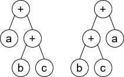
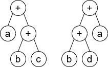

### 1. Description

A **<a href="https://en.wikipedia.org/wiki/Binary_expression_tree" target="_blank">binary expression tree</a>** is a kind of binary tree used to represent arithmetic expressions. Each node of a binary expression tree has either zero or two children. Leaf nodes (nodes with 0 children) correspond to operands (variables), and internal nodes (nodes with two children) correspond to the operators. In this problem, we only consider the `'+'` operator (i.e. addition).

You are given the roots of two binary expression trees, `root1` and `root2`. Return `true`* if the two binary expression trees are equivalent*. Otherwise, return `false`.

Two binary expression trees are equivalent if they **evaluate to the same value** regardless of what the variables are set to.

### 2. Function Contract

**Inputs**

- `root1`: The non-null root `Node` of the first addition expression tree.
- `root2`: The non-null root `Node` of the second addition expression tree.

**Return value**

Return `true` if `root1` and `root2` represent equivalent addition expressions (same variable multiset/counts), otherwise `false`.

### 3. Examples

#### Example 1

- **Input:** $root1 = [x], root2 = [x]$
- **Output:** `true`
#### Example 2

**

**

- **Input:** $root1 = [+,a,+,null,null,b,c], root2 = [+,+,a,b,c]$
- **Output:** `true`
**Explanation****:** a + (b + c) == (b + c) + a
#### Example 3

**

**

- **Input:** $root1 = [+,a,+,null,null,b,c], root2 = [+,+,a,b,d]$
- **Output:** `false`
**Explanation****:** a + (b + c) != (b + d) + a

### 4. Constraints

- The number of nodes in both trees are equal, odd and, in the range `[1, 4999]`.

- `Node.val` is `'+'` or a lower-case English letter.

- It's **guaranteed** that the tree given is a valid binary expression tree.

**Follow up:** What will you change in your solution if the tree also supports the `'-'` operator (i.e. subtraction)?