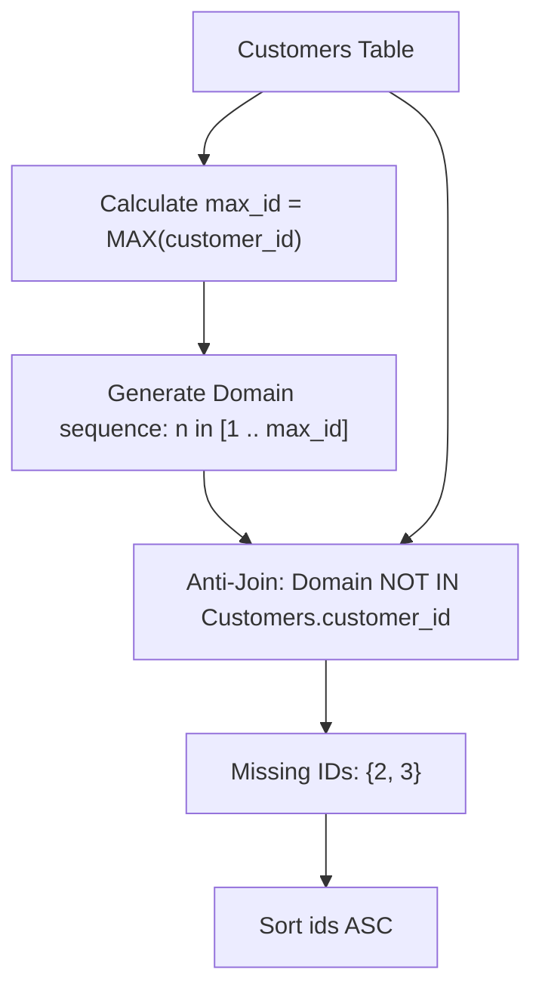

# Guided Example: Find the Missing IDs

This guide demonstrates integer sequence synthesis and relational set difference (anti-semijoin) to detect non-contiguous missing identifier gaps within a bounded primary key domain.

- **Customer Relation:** `Customers(customer_id, customer_name)`
- **Sample Key Sequence:** `customer_id` $\in \{1, 4, 5\}$
- **Maximum Bound:** $M = \max(\text{customer\_id}) = 5$
- **Target Output:** Table containing missing identifier values $\{2, 3\}$ sorted in ascending order.

---

## 1. Instance & Teaching Goal

Given a database table `Customers`, we must locate all integers in the closed range $[1, \max(\text{customer\_id})]$ that are absent from the `customer_id` column.

Consider the following concrete instance:

`Customers`:
| `customer_id` | `customer_name` |
|---|---|
| $1$ | Alice |
| $4$ | Bob |
| $5$ | Charlie |

Here, the maximum observed identifier is $M = 5$. The full dense sequence from $1$ to $5$ is:
$$\{1, 2, 3, 4, 5\}$$

Existing keys in `Customers` are $\{1, 4, 5\}$. The missing identifiers are therefore $\{2, 3\}$.

```
Complete Range [1 .. 5]:   1     2     3     4     5
Customers Present:         1     -     -     4     5
                                 ^     ^
Missing Gap IDs:                 2     3
```

Our teaching goal is to model candidate domain synthesis and relational difference ($\rhd$) in $\mathcal{O}(M + C)$ relational processing time.

---

## 2. Conceptual Foundation & Invariants

```
+-------------------------------------------------------------------------+
|                  BOUNDED DOMAIN ANTI-SEMIJOIN PIPELINE                  |
|                                                                         |
|  Step 1: Compute Domain Ceiling                                         |
|    M = gamma_{MAX(customer_id) -> max_id}(Customers)                    |
|                                                                         |
|  Step 2: Generate Dense Candidate Sequence                              |
|    Domain = {n in Z | 1 <= n <= M}                                      |
|                                                                         |
|  Step 3: Extract Existing Keys                                          |
|    Existing = Pi_{customer_id}(Customers)                               |
|                                                                         |
|  Step 4: Relational Difference / Anti-Semijoin                          |
|    Missing = Domain |> Existing = Domain \ Existing                     |
|                                                                         |
|  Step 5: Projection & Ordering                                          |
|    Result = tau_{ids ASC}(rho_{n -> ids}(Missing))                      |
+-------------------------------------------------------------------------+
```

| Relational Expression | Algebraic Meaning | Cardinality |
|---|---|---|
| $\text{Domain}(n)$ | Dense integer sequence $[1, M]$ | $M$ |
| $\Pi_{\text{customer\_id}}(\text{Customers})$ | Projection of recorded primary keys | $C$ |
| $\text{Domain} \rhd \text{Customers}$ | Set subtraction of recorded keys from candidate domain | $M - C$ |
| $\tau_{\text{ids} \uparrow}(\dots)$ | Ascending sort of missing integer identifiers | $M - C$ |

> **Bounded Domain Completeness Invariant.** For any customer identifier table with maximum key $M$, an integer $x$ belongs to the true missing set if and only if $1 \le x \le M$ and $x \notin \Pi_{\text{customer\_id}}(\text{Customers})$. Since the maximum key $M$ itself is always present in `Customers`, evaluating candidates strictly over $1 \le n < M$ produces the exact same result set while avoiding redundant membership tests against $M$.



---

## 3. Step-by-Step Worked Execution

### Step 1: Determine Upper Bound $M$
Evaluate aggregate:
$$M = \max(\Pi_{\text{customer\_id}}(\text{Customers})) = \max(1, 4, 5) = 5$$

---

### Step 2: Synthesize Dense Integer Sequence
Generate candidates $n \in [1, M]$:
$$\text{Domain} = \{1, 2, 3, 4, 5\}$$

---

### Step 3: Anti-Join Against Existing Primary Keys
Compare each candidate $n \in \text{Domain}$ against $E = \{1, 4, 5\}$:
- $n = 1$: $1 \in E \implies$ Present (Excluded)
- $n = 2$: $2 \notin E \implies$ **Missing (Retained)**
- $n = 3$: $3 \notin E \implies$ **Missing (Retained)**
- $n = 4$: $4 \in E \implies$ Present (Excluded)
- $n = 5$: $5 \in E \implies$ Present (Excluded)

Retained missing subset:
$$\text{Missing} = \{2, 3\}$$

---

### Step 4: Attribute Rename and Ascending Sort
Rename attribute $n \to \text{ids}$ and order ascending:
$$\tau_{\text{ids} \uparrow}(\{2, 3\}) = [2, 3]$$

---

## 4. Complete Execution Trace

| Candidate $n$ | Domain Range ($1 \le n \le 5$) | In `Customers` Table? | Retained by Anti-Semijoin? | Output Identifier `ids` |
|---|---|---|---|---|
| $1$ | Valid | Yes (Alice) | Discarded | — |
| $2$ | Valid | **No** | **Retained** | $2$ |
| $3$ | Valid | **No** | **Retained** | $3$ |
| $4$ | Valid | Yes (Bob) | Discarded | — |
| $5$ | Valid | Yes (Charlie) | Discarded | — |

Result Relation:
| `ids` |
|---|
| $2$ |
| $3$ |

---

## 5. Algorithmic Correctness

**Soundness.** Every emitted integer $k$ originates from the synthesized integer generator satisfying $1 \le k \le M$, where $M$ is the maximum existing primary key. The anti-semijoin condition strictly filters out any integer that exists in `Customers.customer_id`. Therefore, every returned integer is guaranteed to be a genuine gap within the specified domain.

**Completeness.** Suppose an integer $g$ is missing from `Customers` such that $1 \le g \le M$. Because the sequence generation unconditionally produces all integers up to $100$ (and $M \le 100$ per contract), $g$ is generated as a candidate. Since $g \notin \text{Customers}$, it survives the anti-join filter. Hence, no missing identifier is skipped.

---

## 6. Traps This Instance Exposes

- **Missing Lower Bound Assumption:** Assuming customer IDs begin at the minimum existing ID (e.g. starting at $\min(\text{customer\_id})$) fails if ID $1$ itself is missing. The sequence must always begin strictly at $1$.
- **Subquery Null Pitfall in Set Exclusion:** When using `NOT IN (SELECT customer_id ...)`, if any row contains `NULL` in the key column, the SQL predicate evaluates to `UNKNOWN` for all rows, returning an empty set. Ensuring primary key non-nullability or using anti-joins (`LEFT JOIN ... WHERE customer_id IS NULL`) avoids this trap.
- **Unbounded Number Generation:** Failing to cap the number generation at $\max(\text{customer\_id})$ would produce infinite or arbitrarily large missing identifiers extending beyond the customer dataset.

---

## 7. Complexity Derivation

- **Time Complexity:** $\mathcal{O}(M + C \log C)$, where $M = \max(\text{customer\_id}) \le 100$ and $C$ is the number of rows in `Customers`.
  - Computing the maximum key takes $\mathcal{O}(C)$ time (or $\mathcal{O}(1)$ with an index on `customer_id`).
  - Generating candidate sequence up to $M$ requires $\mathcal{O}(M)$ steps.
  - Set difference via hash lookup takes $\mathcal{O}(M)$ time, followed by sorting at most $M$ values in $\mathcal{O}(M \log M)$.
- **Auxiliary Space Complexity:** $\mathcal{O}(M + C)$ auxiliary space to store intermediate candidate tuples and index keys.
