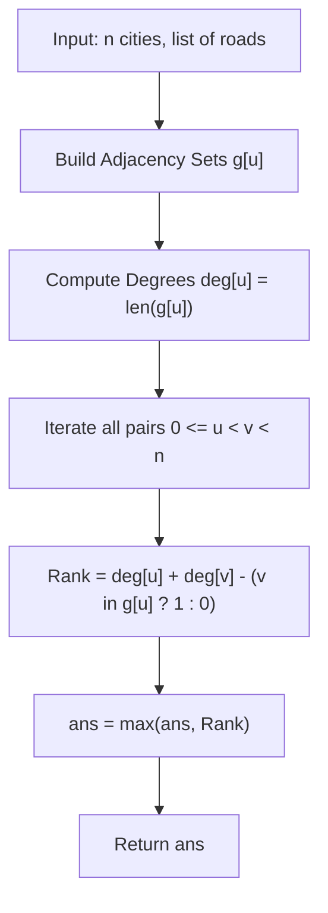

# Guided Example: Maximal Network Rank

This guide details graph degree aggregation and the Principle of Inclusion-Exclusion used to calculate the maximal network rank across all distinct city pairs.

- **Number of Cities:** $n = 4$ (Cities labeled $\{0, 1, 2, 3\}$)
- **Road Network:** `roads = [[0, 1], [0, 3], [1, 2], [1, 3]]` ($M = 4$)
- **Target Maximal Network Rank:** `4` (Achieved by pair $(0, 1)$ and pair $(1, 3)$)

---

## 1. Instance & Teaching Goal

The *network rank* of two distinct cities is the total number of directly connected roads incident to either city. If a road directly connects both cities, it touches both endpoints and must be counted exactly once, rather than twice. The cities themselves do not need to be directly connected to each other to form a valid candidate pair.

```
Graph Structure:
      (0) ======= (1)
       |         / |
       |       /   |
       |     /     |
      (3) --       (2)

Degrees:
  deg(0) = 2  (Incident: {0-1, 0-3})
  deg(1) = 3  (Incident: {0-1, 1-2, 1-3})
  deg(2) = 1  (Incident: {1-2})
  deg(3) = 2  (Incident: {0-3, 1-3})

Rank Evaluation for Pair (0, 1):
  Union of Incident Roads: {0-1, 0-3, 1-2, 1-3} -> Size = 4
```

Our teaching goal is to model degree counting combined with pairwise edge-overlap subtraction using Inclusion-Exclusion in $\mathcal{O}(N^2 + M)$ time.

---

## 2. Conceptual Foundation & Invariants

```
+-------------------------------------------------------------------------+
|                  INCLUSION-EXCLUSION RANK EVALUATION                    |
|                                                                         |
|  Let E_u be the set of roads incident to city u:                        |
|      deg(u) = |E_u|                                                     |
|                                                                         |
|  Network Rank of pair (u, v):                                           |
|      Rank(u, v) = |E_u U E_v|                                           |
|                 = |E_u| + |E_v| - |E_u \cap E_v|                        |
|                                                                         |
|  Because the graph is simple (no multiple edges or self-loops):         |
|      |E_u \cap E_v| = 1  if (u, v) in Roads                             |
|      |E_u \cap E_v| = 0  if (u, v) not in Roads                         |
|                                                                         |
|  Therefore:                                                             |
|      Rank(u, v) = deg(u) + deg(v) - [direct_road(u, v) ? 1 : 0]         |
+-------------------------------------------------------------------------+
```

| City Pair $(u, v)$ | Degree Sum $\text{deg}(u) + \text{deg}(v)$ | Direct Road? | Shared Road Deduction | Final Network Rank |
|---|---|---|---|---|
| $(0, 1)$ | $2 + 3 = 5$ | Yes | $-1$ | $4$ |
| $(0, 2)$ | $2 + 1 = 3$ | No | $-0$ | $3$ |
| $(0, 3)$ | $2 + 2 = 4$ | Yes | $-1$ | $3$ |
| $(1, 2)$ | $3 + 1 = 4$ | Yes | $-1$ | $3$ |
| $(1, 3)$ | $3 + 2 = 5$ | Yes | $-1$ | $4$ |
| $(2, 3)$ | $1 + 2 = 3$ | No | $-0$ | $3$ |

> **Shared Edge Inclusion-Exclusion Invariant.** In any simple undirected graph, two distinct vertices $u \ne v$ can share at most one mutual incident edge: the edge $(u, v)$ directly connecting them. Thus, the set intersection size $|E_u \cap E_v|$ is strictly binary ($0$ or $1$). Network rank is always $\text{deg}(u) + \text{deg}(v) - \mathbb{I}((u, v) \in E)$.



---

## 3. Step-by-Step Worked Execution

### Step 1: Construct Adjacency Sets
Read the edge list `[[0, 1], [0, 3], [1, 2], [1, 3]]`:
- `g[0] = {1, 3}` $\implies \text{deg}(0) = 2$
- `g[1] = {0, 2, 3}` $\implies \text{deg}(1) = 3$
- `g[2] = {1}` $\implies \text{deg}(2) = 1$
- `g[3] = {0, 1}` $\implies \text{deg}(3) = 2$

---

### Step 2: Enumerate Unordered Pairs $(u, v)$ with $u < v$

1. **Pair $(0, 1)$:**
   - Degrees: $\text{deg}(0) = 2, \text{deg}(1) = 3$.
   - Direct road check: $1 \in g[0]$ is **True** (deduct $1$).
   - $\text{Rank}(0, 1) = 2 + 3 - 1 = 4$.
   - $\text{ans} \leftarrow \max(0, 4) = 4$.

2. **Pair $(0, 2)$:**
   - Degrees: $\text{deg}(0) = 2, \text{deg}(2) = 1$.
   - Direct road check: $2 \in g[0]$ is **False** (deduct $0$).
   - $\text{Rank}(0, 2) = 2 + 1 - 0 = 3$.
   - $\text{ans} \leftarrow \max(4, 3) = 4$.

3. **Pair $(0, 3)$:**
   - Degrees: $\text{deg}(0) = 2, \text{deg}(3) = 2$.
   - Direct road check: $3 \in g[0]$ is **True** (deduct $1$).
   - $\text{Rank}(0, 3) = 2 + 2 - 1 = 3$.
   - $\text{ans} \leftarrow \max(4, 3) = 4$.

4. **Pair $(1, 2)$:**
   - Degrees: $\text{deg}(1) = 3, \text{deg}(2) = 1$.
   - Direct road check: $2 \in g[1]$ is **True** (deduct $1$).
   - $\text{Rank}(1, 2) = 3 + 1 - 1 = 3$.
   - $\text{ans} \leftarrow \max(4, 3) = 4$.

5. **Pair $(1, 3)$:**
   - Degrees: $\text{deg}(1) = 3, \text{deg}(3) = 2$.
   - Direct road check: $3 \in g[1]$ is **True** (deduct $1$).
   - $\text{Rank}(1, 3) = 3 + 2 - 1 = 4$.
   - $\text{ans} \leftarrow \max(4, 4) = 4$.

6. **Pair $(2, 3)$:**
   - Degrees: $\text{deg}(2) = 1, \text{deg}(3) = 2$.
   - Direct road check: $3 \in g[2]$ is **False** (deduct $0$).
   - $\text{Rank}(2, 3) = 1 + 2 - 0 = 3$.
   - $\text{ans} \leftarrow \max(4, 3) = 4$.

All $\binom{4}{2} = 6$ pairs evaluated. Maximum network rank is $4$.

---

## 4. Complete Execution Trace

| Pair $(u, v)$ | $\text{deg}(u)$ | $\text{deg}(v)$ | Sum $\text{deg}(u) + \text{deg}(v)$ | $u \text{ connected to } v$? | Overlap Penalty | Net Rank | Current $\text{ans}$ |
|---|---|---|---|---|---|---|---|
| $(0, 1)$ | $2$ | $3$ | $5$ | **Yes** | $-1$ | **$4$** | **$4$** |
| $(0, 2)$ | $2$ | $1$ | $3$ | No | $-0$ | $3$ | $4$ |
| $(0, 3)$ | $2$ | $2$ | $4$ | **Yes** | $-1$ | $3$ | $4$ |
| $(1, 2)$ | $3$ | $1$ | $4$ | **Yes** | $-1$ | $3$ | $4$ |
| $(1, 3)$ | $3$ | $2$ | $5$ | **Yes** | $-1$ | **$4$** | $4$ |
| $(2, 3)$ | $1$ | $2$ | $3$ | No | $-0$ | $3$ | $4$ |

---

## 5. Algorithmic Correctness

**Soundness.** Network rank is defined as the number of distinct edges incident to at least one of the two chosen vertices: $|E_u \cup E_v|$. By standard set theory, $|E_u \cup E_v| = |E_u| + |E_v| - |E_u \cap E_v|$. In a simple graph with no self-loops and no multi-edges, two vertices share an incident edge if and only if that edge is the direct segment $(u, v)$. Thus $|E_u \cap E_v| = 1$ if $(u, v) \in E$, and $0$ otherwise. The computation is exact for every pair.

**Completeness.** The nested loops iterate over all distinct unordered pairs $(u, v)$ with $0 \le u < v < n$. Since the maximum is tracked across all possible $\binom{n}{2}$ pairs, the globally maximal network rank cannot be missed.

---

## 6. Traps This Instance Exposes

- **Double-Counting the Shared Edge:** Failing to deduct $1$ when $u$ and $v$ are directly connected yields $\text{rank}(0, 1) = 2 + 3 = 5$, which mistakenly counts road $(0, 1)$ twice.
- **Assuming Optimal Pairs Must Be Connected:** Disconnected pairs often achieve the maximal network rank because they suffer zero penalty deduction. For example, two disjoint stars with centers of degree $D$ yield rank $2D$ without sharing an edge.
- **Unnecessary Graph Traversal:** Attempting to execute BFS or DFS to find reachable nodes is irrelevant; network rank considers exclusively *direct* incident edges, not multi-hop path reachability.

---

## 7. Complexity Derivation

- **Time Complexity:** $\mathcal{O}(N^2 + M)$, where $N$ is the number of cities and $M$ is the number of roads.
  - Building adjacency sets takes $\mathcal{O}(M)$ time.
  - Evaluating all $\binom{N}{2} = \frac{N(N-1)}{2}$ pairs takes $\mathcal{O}(N^2)$ time, where each adjacency check takes $\mathcal{O}(1)$ average time.
- **Auxiliary Space Complexity:** $\mathcal{O}(N + M)$ auxiliary space to store the adjacency lists / hash sets and vertex degree counters.
