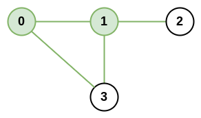
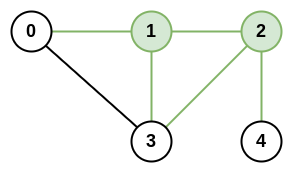

### 1. Description

There is an infrastructure of `n` cities with some number of `roads` connecting these cities. Each $\text{roads}[i] = [a_{i}, b_{i}]$ indicates that there is a bidirectional road between cities $a_{i}$ and $b_{i}$.

The **network rank*** *of **two different cities** is defined as the total number of **directly** connected roads to **either** city. If a road is directly connected to both cities, it is only counted **once**.

The **maximal network rank **of the infrastructure is the **maximum network rank** of all pairs of different cities.

Given the integer `n` and the array `roads`, return *the **maximal network rank** of the entire infrastructure*.

### 2. Function Contract

- `n`: Input parameter.
- Returns expected result.

### 3. Examples

#### Example 1

**

**

- **Input:** $n = 4, roads = [[0,1],[0,3],[1,2],[1,3]]$
- **Output:** `4`
- **Explanation:** The network rank of cities 0 and 1 is 4 as there are 4 roads that are connected to either 0 or 1. The road between 0 and 1 is only counted once.
#### Example 2

**

**

- **Input:** $n = 5, roads = [[0,1],[0,3],[1,2],[1,3],[2,3],[2,4]]$
- **Output:** `5`
- **Explanation:** There are 5 roads that are connected to cities 1 or 2.
#### Example 3

- **Input:** $n = 8, roads = [[0,1],[1,2],[2,3],[2,4],[5,6],[5,7]]$
- **Output:** `5`
- **Explanation:** The network rank of 2 and 5 is 5. Notice that all the cities do not have to be connected.

### 4. Constraints

- $2 \le n \le 100$

- $0 \le \text{roads.length} \le n * (n - 1) / 2$

- $\text{roads}[i].length = 2$

- $0 \le a_{i}, b_{i} \le n-1$

- $a_{i} \neq b_{i}$

- Each pair of cities has **at most one** road connecting them.