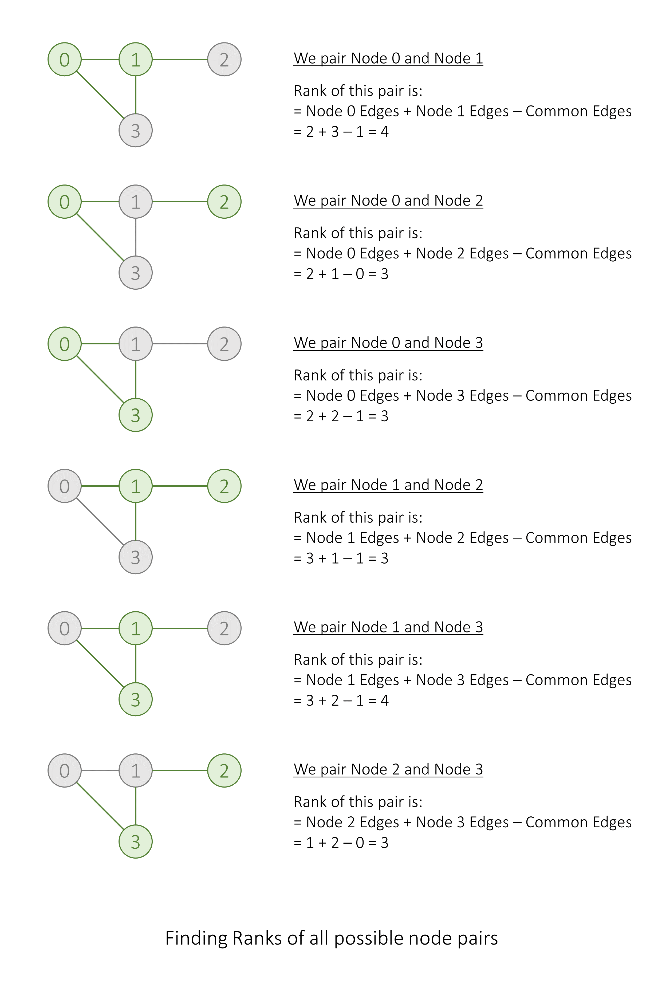
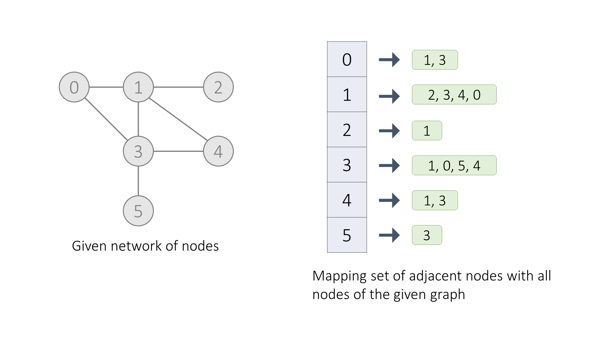

[TOC]

## Solution

---

### Overview

To solve this problem, we can transform it into a graph problem, where cities are represented as nodes and roads as bidirectional edges connecting the nodes.

The objective is to find the **maximum rank of the given network/graph**, which is the maximum of all network ranks of all pairs of different nodes.
The network rank of a pair of nodes is defined as the total number of directly connected edges to either node and if an edge is directly connected to both nodes, it is only counted once.

---

### Approach: Finding the in-degree of nodes

#### Intuition

To maximize the network rank, we can iterate over each possible pair of nodes in the graph and calculate their network rank. For each pair, we find the total number of directly connected edges to either node. If an edge connects both nodes, it is counted only once. We store the maximum network rank obtained from all pairs as the answer.

**How do we find the network rank of a pair of nodes?**
The network rank of a pair of nodes is the sum of the in-degree (number of edges connected to a node) of each node minus the number of common edges between them.

**How do we find the number of common edges between any two nodes?**
In this problem, it's given that "each pair of cities has at most one road connecting them", thus if these two nodes are directly connected then the common edges between them will be `1`, otherwise `0`.



Here are two ways to implement this approach:
1. We can keep an integer array or a hash map to map a `node` with the count of its edges, i.e. store the in-degree of each node `i` at $\text{indegree}[i]$.
And another boolean matrix in which $\text{isConnected}[node1][node2]$ represents if `node1` and `node2` are connected or not.

2. We can keep an array or hash map, which maps the `node` with the hash set of nodes it is connected to. Here, the size of the hash set will give the in-degree of the respective node and we can find if `node2` exists in the hash set of `node1` to check if they are directly connected or not.



The worst-case time and space complexity will remain the same in both implementations. Here, we will show you the implementation of the latter one.

#### Algorithm

1. Initialize variables:
- `maxRank`, a variable to store the maximum network rank found so far.
- `adj`, a hash map of the hash set to store the nodes in the hash set connected to respective nodes.
2. Using two nested for-loops iterate on each possible node pair `(node1, node2)`, and calculate its network rank as discussed earlier.
- Thus `currentRank` will be $indegree of node1 + indegree of node2 - (1 if node1 is connected to node2)$
- If `currentRank` is greater than `maxRank`, then update `maxRank`.
3. Return `maxRank`.

#### Implementation

```python
class Solution:
    def maximalNetworkRank(self, n: int, roads: List[List[int]]) -> int:
        maxRank = 0
        adj = defaultdict(set)
        # Construct adjency list 'adj', where adj[node] stores all nodes connected to 'node'.
        for road in roads:
            adj[road[0]].add(road[1])
            adj[road[1]].add(road[0])

        # Iterate on each possible pair of nodes.
        for node1 in range(n):
            for node2 in range(node1 + 1, n):
                currentRank = len(adj[node1]) + len(adj[node2])
                if node2 in adj[node1]:
                    currentRank -= 1
                # Find the current pair's respective network rank and store if it's maximum till now.
                maxRank = max(maxRank, currentRank)
        # Return the maximum network rank.
        return maxRank
```

#### Complexity Analysis

Here, $E$ is the number of edges and $V$ is the number of nodes in our graph respectively

* Time complexity: $O(E + V^2)$
- We iterate on each edge and store both its nodes in the hashmap which will take $\mathcal{O}(1)$ time. Thus, for $E$ edges, it will take us $O(E)$ time.
- Then we iterate on all possible pairs of the nodes and calculate the network rank which will take $O(1)$ time. Thus, for $V (V - 1) / 2$ pairs, it will take $O(V^2)$ time.
- Thus, overall we take $O(E + V^2)$ time.
* Space complexity: $O(E)$
- We use a hashmap that stores all the edge's nodes in it which will take $O(E)$ space in a fully connected graph.