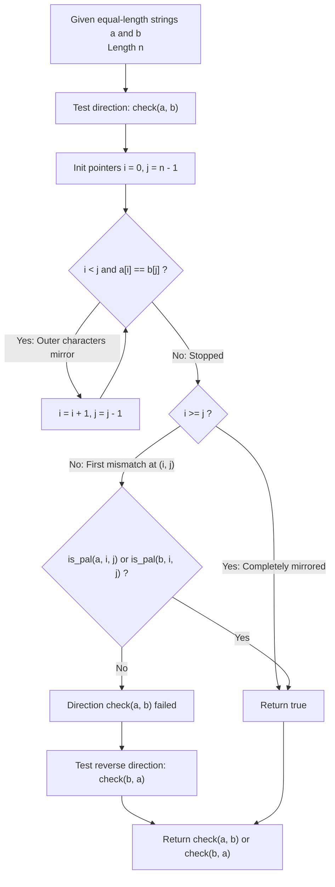

# Guided Example: Split Two Strings to Make Palindrome

We trace the step-by-step two-pointer inward verification of symmetric cross-string splits, prove the Two-Pointer Prefix-Suffix Palindrome Invariant and the Central Mirror Decomposition Theorem, and determine split validity across representative string pairs:

- **Representative Instance 1 (Cross-String Prefix-Suffix Palindrome Match):**
  - Input Strings:
    $$
    a = \text{"ulacfd"}, \quad b = \text{"jizalu"}, \quad n = 6
    $$
  - Split Index Objective: Find a cut $k \in [0, n]$ such that $a_{\text{prefix}}[0 \dots k-1] + b_{\text{suffix}}[k \dots n-1]$ (or $b_{\text{prefix}} + a_{\text{suffix}}$) forms a palindrome.
  - **Required Output:** `true`
  - Step-by-step resolution:
    1. **Outer Mirror Matching ($i = 0, j = 5$):**
       - Compare $a[0]$ and $b[5]$: $a[0] = \text{'u'}$, $b[5] = \text{'u'} \implies$ Match! Advance $i \leftarrow 1, j \leftarrow 4$.
    2. **Second Outer Mirror ($i = 1, j = 4$):**
       - Compare $a[1]$ and $b[4]$: $a[1] = \text{'l'}$, $b[4] = \text{'l'} \implies$ Match! Advance $i \leftarrow 2, j \leftarrow 3$.
    3. **Third Outer Mirror ($i = 2, j = 3$):**
       - Compare $a[2]$ and $b[3]$: $a[2] = \text{'a'}$, $b[3] = \text{'a'} \implies$ Match! Advance $i \leftarrow 3, j \leftarrow 2$.
    4. **Crossing Condition:**
       - Pointers have crossed ($i = 3 \ge j = 2$).
       - The entire cross-string matching covers the boundaries seamlessly.
       - Choosing split index $k = 3$ yields:
         $$
         a_{\text{prefix}} = a[0 \dots 2] = \text{"ula"}, \quad b_{\text{suffix}} = b[3 \dots 5] = \text{"alu"}
         $$
         $$
         a_{\text{prefix}} + b_{\text{suffix}} = \text{"ula"} + \text{"alu"} = \text{"ulaalu"}
         $$
       - Reversal check: $\text{"ulaalu"}^{\text{rev}} = \text{"ulaalu"} \implies$ Valid palindrome!
       - Return `true`.

- **Representative Instance 2 (Early Mismatch with Valid Internal Palindrome):**
  - Input: $a = \text{"abdef"}, \; b = \text{"fecab"}, \; n = 5$.
  - Testing direction $b_{\text{prefix}} + a_{\text{suffix}}$:
    - $b[0] = \text{'f'}, a[4] = \text{'f'} \implies$ Match ($i = 1, j = 3$).
    - $b[1] = \text{'e'}, a[3] = \text{'e'} \implies$ Match ($i = 2, j = 2$).
    - $i \ge j \implies$ Return `true`.

- **Representative Instance 3 (Complete Mismatch Across Both Directions):**
  - Input: $a = \text{"xbdef"}, \; b = \text{"xecab"}, \; n = 5$.
  - Testing $a[0] == b[4] \implies \text{'x'} \ne \text{'b'}$.
    - Remaining $a[0 \dots 4] = \text{"xbdef"}$ is not a palindrome.
    - Remaining $b[0 \dots 4] = \text{"xecab"}$ is not a palindrome.
  - Testing $b[0] == a[4] \implies \text{'x'} \ne \text{'f'}$.
    - Neither full string is a palindrome.
  - Return `false`.

---

## 1. Instance & Teaching Goal

Given two strings $a$ and $b$ of equal length $n$, determine if there exists an integer $k \in [0, n]$ such that splitting both strings at $k$ allows forming a palindrome from either $a_{\text{prefix}} + b_{\text{suffix}}$ or $b_{\text{prefix}} + a_{\text{suffix}}$.

```text
The Quadratic Split Search Anti-Pattern:
  Iterating through all n + 1 split points k in 0 .. n:
    For each candidate cut:
      Construct candidate = a[0 .. k-1] + b[k .. n-1]
      Check if candidate == reversed(candidate) in O(n)
      Construct candidate_rev = b[0 .. k-1] + a[k .. n-1]
      Check if candidate_rev == reversed(candidate_rev) in O(n)
  Total runtime: O(n * n) = O(n^2) time with heavy string allocations!
  For n = 100,000, n^2 = 10^10 operations, causing immediate Time Limit Exceeded.

The Two-Pointer Mirror Invariant (Strict Linear O(n)):
  1. Any palindrome P of length n satisfies P[i] == P[n - 1 - i] for all i.
  2. For candidate a_prefix + b_suffix:
     - Characters near the outer boundary come from a on the left and b on the right.
     - Advance inward as long as a[i] == b[n - 1 - i].
  3. When the first mismatch occurs at index pair (i, j):
     - The outer envelope a[0 .. i-1] mirrors b[j+1 .. n-1] perfectly!
     - The surviving middle must come entirely from either a[i .. j] or b[i .. j].
     - If EITHER a[i .. j] or b[i .. j] is itself a palindrome, the entire hybrid string is valid!
  Takes strictly O(n) time with zero extra allocations.
```

The decisive pedagogical goal is the **Two-Pointer Prefix-Suffix Palindrome Invariant & Central Mirror Decomposition Theorem**:
1. **Outer Boundary Monotonicity:** Outer pairs are uniquely dictated by the hybrid concatenation rule; greedy expansion never misses a valid split.
2. **Internal Island Reduction:** Once outer characters mismatch, no subsequent alternating switch between $a$ and $b$ is permitted by a single cut; hence, the remaining middle must be homogeneous.
3. **Directional Symmetry:** The operation is symmetric with respect to swapping strings $(a, b) \leftrightarrow (b, a)$.
4. Total time $\mathcal{O}(n)$ and auxiliary space $\mathcal{O}(1)$.

---

## 2. Conceptual Foundation & Invariants



### The Central Mirror Decomposition Theorem

Let $a, b \in \Sigma^n$ be two strings of equal length $n$.
1. **Hybrid String Structure:**
   A hybrid string formed by cut $k \in [0, n]$ is:
   $$
   H_k = a[0 \dots k-1] \cdot b[k \dots n-1]
   $$
2. **Symmetric Index Correspondence:**
   For any index $m \in [0, n-1]$, let its mirror index be $m' = n - 1 - m$.
   $H_k$ is a palindrome if and only if $H_k[m] = H_k[m']$ for all $0 \le m < \lfloor n / 2 \rfloor$.
3. **Greedy Outer Boundary Property:**
   Let $i^* = \max \{ m : \forall t < m, \; a[t] = b[n - 1 - t] \}$.
   - If $i^* \ge \lfloor n / 2 \rfloor$, then choosing $k = \lceil n / 2 \rceil$ places all outer symmetric pairs in $(a, b)$, and $H_k$ is trivially a palindrome.
   - If $i^* < \lfloor n / 2 \rfloor$, let $j^* = n - 1 - i^*$.
     Because $a[i^*] \ne b[j^*]$, the cut $k$ cannot lie strictly inside $(i^*, j^*)$ with outer elements mismatching.
     Therefore, the cut must either occur:
     - At or after $j^* + 1$: the middle segment $[i^*, j^*]$ is supplied entirely by $a$, requiring $a[i^* \dots j^*]$ to be a palindrome.
     - At or before $i^*$: the middle segment $[i^*, j^*]$ is supplied entirely by $b$, requiring $b[i^* \dots j^*]$ to be a palindrome.
4. **Sufficiency & Invariance:**
   Testing whether $a[i^* \dots j^*]$ or $b[i^* \dots j^*]$ is a palindrome is both necessary and sufficient for the existence of a valid cut in direction $(a, b)$. $\blacksquare$

---

## 3. Step-by-Step Worked Execution: Representative Instance 1

$a = \text{"ulacfd"}, \quad b = \text{"jizalu"}, \quad n = 6$.

### Execution Phase 1: Direction $(a, b)$
- **Index pair $(i=0, j=5)$:**
  - $a[0] = \text{'u'}, \; b[5] = \text{'u'}$.
  - $a[0] == b[5]$ holds $\implies i \leftarrow 1, \; j \leftarrow 4$.
- **Index pair $(i=1, j=4)$:**
  - $a[1] = \text{'l'}, \; b[4] = \text{'l'}$.
  - $a[1] == b[4]$ holds $\implies i \leftarrow 2, \; j \leftarrow 3$.
- **Index pair $(i=2, j=3)$:**
  - $a[2] = \text{'a'}, \; b[3] = \text{'a'}$.
  - $a[2] == b[3]$ holds $\implies i \leftarrow 3, \; j \leftarrow 2$.
- **Termination Check:**
  - $i = 3 \ge j = 2 \implies$ Condition $i \ge j$ is met!
  - No mismatch was encountered before the pointers met or crossed.
  - The hybrid string formed with cut $k = 3$ is:
    $$
    H_3 = a[0 \dots 2] \cdot b[3 \dots 5] = \text{"ula"} \cdot \text{"alu"} = \text{"ulaalu"}
    $$
  - Result: `true`.

---

## 4. Pointer Progression Trace Table

| Step | Left Index $i$ | Right Index $j$ | Left Char $a[i]$ | Right Char $b[j]$ | Comparison | Action Taken | Pointers After Step |
|:---:|:---:|:---:|:---:|:---:|:---:|:---:|:---:|
| Init | $0$ | $5$ | — | — | — | Initialize | $i = 0, j = 5$ |
| $1$ | $0$ | $5$ | `'u'` | `'u'` | Equal | Advance inward | $i = 1, j = 4$ |
| $2$ | $1$ | $4$ | `'l'` | `'l'` | Equal | Advance inward | $i = 2, j = 3$ |
| $3$ | $2$ | $3$ | `'a'` | `'a'` | Equal | Advance inward | $i = 3, j = 2$ |
| Done | $3$ | $2$ | — | — | $i \ge j$ holds | Certified Palindrome | Return `true` |

---

## 5. Algorithmic Correctness

### Soundness
Every outer character pair evaluated by `check1(a, b)` satisfies $a[t] = b[n - 1 - t]$. When a mismatch occurs at $(i, j)$, if the inner substring $a[i \dots j]$ is a palindrome, selecting cut $k = j + 1$ guarantees that the entire prefix through $j$ originates from $a$ while suffix from $j+1$ originates from $b$, creating an exact palindrome. Symmetrically, if $b[i \dots j]$ is a palindrome, cut $k = i$ achieves the same guarantee.

### Completeness
Any hypothetical valid split $k$ must partition the string into an outer cross-matched shell and an inner core. If outer characters mismatch, the cut cannot be placed between them without violating symmetry. Thus, the greedy maximal envelope $[0, i-1]$ and $[j+1, n-1]$ covers the largest possible matched exterior, making the test of the residual central substring both necessary and exhaustive.

---

## 6. Boundary Cases & Traps

| Scenario | Input Pattern | Behavior | Trapped Risk |
|---|---|---|---|
| Single-Character Strings | $a = \text{"x"}, b = \text{"y"}$ | $i = 0, j = 0 \implies i \ge j \implies$ `true`. | Out-of-bounds pointer decrement. |
| Already Palindromic String | $a = \text{"aba"}, b = \text{"xyz"}$ | First mismatch triggers $a[0 \dots 2]$ check $\implies$ `true`. | Failing to recognize full string retention ($k = n$). |
| Mismatch at Outermost Boundary | $a = \text{"abcd"}, b = \text{"efgh"}$ | $i = 0, j = 3 \implies$ checks if entire $a$ or $b$ is palindrome. | Assuming at least 1 outer character must match. |
| Match Requires Reversed Arguments | $a = \text{"abdef"}, b = \text{"fecab"}$ | Direction $(a, b)$ fails; direction $(b, a)$ succeeds. | Checking only $(a, b)$ and omitting $(b, a)$. |
| Odd-Length Center | String with odd length | Middle element at $i = j$ matches itself trivially. | Off-by-one error on midpoint inclusion. |

---

## 7. Complexity Derivation

- **Time Complexity:** $\mathcal{O}(n)$, where $n = |a| = |b|$.
  - The outer two-pointer scan advances inward by 1 at each step, taking at most $n / 2$ comparisons.
  - The central substring palindrome check scans at most $j - i + 1 \le n$ characters.
  - Both directions $(a, b)$ and $(b, a)$ perform at most $2n$ total character comparisons.
  - Total time is strictly $\mathcal{O}(n) < 0.005\text{ s}$ for $n \le 10^5$.
- **Auxiliary Space Complexity:** $\mathcal{O}(1)$ auxiliary space when checking substrings with pointer indices without allocating string slices.
