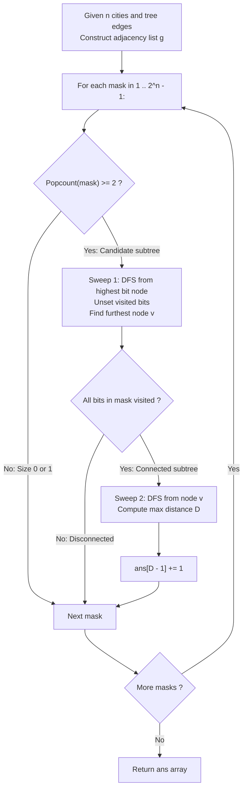

# Guided Example: Count Subtrees With Max Distance Between Cities

We trace the step-by-step bitmask enumeration and double-sweep depth-first search of induced tree subgraphs, prove the Two-Pass Tree Diameter Invariant and the Induced Subgraph Bitmask Enumeration Theorem, and compute subtree diameter distributions across representative network topologies:

- **Representative Instance 1 (Star Topology Tree on Four Cities):**
  - City Count: $n = 4$ (Cities labeled $\{1, 2, 3, 4\}$).
  - Tree Edges:
    $$
    edges = [[1, 2], [2, 3], [2, 4]]
    $$
    *(Undirected tree centered at node 2 with leaf spokes 1, 3, and 4).*
  - **Required Output:** `[3, 4, 0]`
    - An array of length $n - 1 = 3$, where index $d-1$ counts subtrees of diameter $d \in \{1, 2, 3\}$.
  - Structural analysis of all non-empty subsets of cities:
    - Total non-empty subsets: $2^4 - 1 = 15$.
    - Subsets with size $1$ (singletons): Excluded by definition (must contain at least two cities).
    - Subsets with size $\ge 2$: $\binom{4}{2} + \binom{4}{3} + \binom{4}{4} = 6 + 4 + 1 = 11$ candidate masks.
  - Step-by-step verification across connected subsets:
    1. **Size 2 Subsets (Single Edge Subtrees):**
       - $\{1, 2\}$: Connected via edge $(1, 2) \implies$ Diameter $d = 1$.
       - $\{2, 3\}$: Connected via edge $(2, 3) \implies$ Diameter $d = 1$.
       - $\{2, 4\}$: Connected via edge $(2, 4) \implies$ Diameter $d = 1$.
       - $\{1, 3\}$: Disconnected ($2 \notin S$) $\implies$ Not a subtree.
       - $\{1, 4\}$: Disconnected ($2 \notin S$) $\implies$ Not a subtree.
       - $\{3, 4\}$: Disconnected ($2 \notin S$) $\implies$ Not a subtree.
       - Total diameter 1 count: $\mathbf{3}$.
    2. **Size 3 Subsets:**
       - $\{1, 2, 3\}$: Connected path $1-2-3$. Distance $\text{dist}(1, 3) = 2 \implies$ Diameter $d = 2$.
       - $\{1, 2, 4\}$: Connected path $1-2-4$. Distance $\text{dist}(1, 4) = 2 \implies$ Diameter $d = 2$.
       - $\{2, 3, 4\}$: Connected path $3-2-4$. Distance $\text{dist}(3, 4) = 2 \implies$ Diameter $d = 2$.
       - $\{1, 3, 4\}$: Disconnected ($2 \notin S$) $\implies$ Not a subtree.
       - Subtotal diameter 2 from size 3: $3$.
    3. **Size 4 Subset (Complete Tree):**
       - $\{1, 2, 3, 4\}$: All nodes present. Maximum distance between any two leaves:
         $$
         \text{dist}(1, 3) = \text{dist}(1, 4) = \text{dist}(3, 4) = 2 \implies d = 2
         $$
       - Subtotal diameter 2 from size 4: $1$.
       - Total diameter 2 count: $3 + 1 = \mathbf{4}$.
    4. **Diameter 3 Subtrees:**
       - Maximum possible path length in a star graph on 4 nodes is 2.
       - Total diameter 3 count: $\mathbf{0}$.
    - Final Output Vector: `[3, 4, 0]`.

- **Representative Instance 2 (Linear Path Graph on Four Cities):**
  - Edges: $[[1, 2], [2, 3], [3, 4]]$.
  - Connected subtrees correspond to contiguous path intervals:
    - Length 1 (edges): $\{1, 2\}, \{2, 3\}, \{3, 4\} \implies \mathbf{3}$.
    - Length 2: $\{1, 2, 3\}, \{2, 3, 4\} \implies \mathbf{2}$.
    - Length 3: $\{1, 2, 3, 4\} \implies \mathbf{1}$.
  - Result: `[3, 2, 1]`.

- **Representative Instance 3 (Minimal Two-Node Graph):**
  - $n = 2, \; edges = [[1, 2]] \implies$ Output: `[1]`.

---

## 1. Instance & Teaching Goal

Given an undirected tree of $n$ cities, count how many connected subtrees have maximum distance (diameter) equal to $d$, for each $d \in [1, n-1]$.

```text
The Floyd-Warshall / Arbitrary Subgraph Anti-Pattern:
  For each of the 2^n subsets:
    Run all-pairs shortest paths across the full n x n matrix.
    Check if the subgraph is connected by checking infinite distance entries.
  Takes O(2^n * n^3) time! For n = 15:
    32,768 * 3,375 = 110,592,000 operations, leading to high overhead and TLE.

The Two-Pass DFS Subtree Diameter Invariant (O(2^n * n)):
  1. An induced subgraph S of a tree is a tree iff S is connected.
  2. For each non-trivial bitmask S (popcount >= 2):
     - First Sweep: Start DFS from any node u in S.
       Traverse strictly within S while unsetting visited bits.
       Track the furthest node v reachable from u.
     - Connectivity Test:
       If any bit in S remains unvisited, S is disconnected -> Skip!
     - Second Sweep: Start DFS from node v within S.
       The maximum depth reached from v is the EXACT diameter D of the subtree!
     - Record ans[D - 1] += 1.
  Evaluates each mask in O(|S|) <= O(n) steps!
```

The decisive pedagogical goal is the **Two-Pass Tree Diameter Invariant & Induced Subgraph Bitmask Enumeration Theorem**:
1. **Tree Heredity Property:** Any connected induced subgraph of a tree is acyclic and therefore forms an independent tree.
2. **Two-Pass Extremal Node Lemma:** In any tree, the furthest node from an arbitrary vertex $u$ is guaranteed to be one of the endpoints of a diameter path.
3. **Bitwise Connectivity Verification:** Toggling active bits during DFS verifies connected component membership in $\mathcal{O}(1)$ time per node.
4. Total time $\mathcal{O}(2^n \cdot n)$ and auxiliary space $\mathcal{O}(n)$.

---

## 2. Conceptual Foundation & Invariants



### The Two-Pass Tree Diameter Invariant

Let $T = (V, E)$ be a finite undirected tree.
1. **Subtree Connectivity Criterion:**
   A subset of vertices $S \subseteq V$ forms a subtree if and only if the induced subgraph $G[S] = (S, E \cap (S \times S))$ is connected.
   Because $T$ has no cycles, $G[S]$ cannot contain cycles; thus, connectedness implies $G[S]$ is a tree with $|S| - 1$ edges.
2. **Double-Sweep Extremal Node Lemma:**
   Let $\mathcal{T} = G[S]$ be a non-empty connected tree.
   Let $u \in S$ be an arbitrary start node, and let $v \in S$ be a node maximizing the path distance $\text{dist}_{\mathcal{T}}(u, v)$.
   Then there exists an optimal diameter path in $\mathcal{T}$ that has $v$ as one of its endpoints.
   *Proof.*
   Let $(x, y)$ be any diameter path in $\mathcal{T}$ of length $D = \text{dist}_{\mathcal{T}}(x, y)$.
   Because $\mathcal{T}$ is a tree, the path from $u$ to $v$ intersects the path from $x$ to $y$ at some node $w$.
   By triangle inequality on trees:
   $$
   \text{dist}_{\mathcal{T}}(u, v) \ge \text{dist}_{\mathcal{T}}(u, x) \implies \text{dist}_{\mathcal{T}}(w, v) \ge \text{dist}_{\mathcal{T}}(w, x)
   $$
   Replacing sub-path $(w, x)$ with $(w, v)$ produces path $(v, y)$ satisfying:
   $$
   \text{dist}_{\mathcal{T}}(v, y) = \text{dist}_{\mathcal{T}}(w, v) + \text{dist}_{\mathcal{T}}(w, y) \ge \text{dist}_{\mathcal{T}}(w, x) + \text{dist}_{\mathcal{T}}(w, y) = D
   $$
   Because $D$ is the maximum possible distance in $\mathcal{T}$, $\text{dist}_{\mathcal{T}}(v, y) = D$. $\blacksquare$
3. **Diameter Calculation:**
   A second traversal from $v$ yields $\max_{w \in S} \text{dist}_{\mathcal{T}}(v, w) = D$.

---

## 3. Step-by-Step Worked Execution: Representative Instance 1

$n = 4, \; edges = [[1, 2], [2, 3], [2, 4]]$.
Convert to 0-indexed nodes $\{0, 1, 2, 3\}$:
- Edge $(0, 1)$ connects cities $1$ and $2$.
- Edge $(1, 2)$ connects cities $2$ and $3$.
- Edge $(1, 3)$ connects cities $2$ and $4$.
Center is node $1$.

### Sample Mask Evaluations:

#### Case A: Candidate Mask $11_{10} = 1011_2$ (Cities $\{1, 2, 4\} \implies$ Nodes $\{0, 1, 3\}$)
1. **Sweep 1 (Start at node $3$, highest bit):**
   - Active bitmask $msk = 1011_2$.
   - Visit node $3$: unset bit $3 \implies msk = 0011_2$. Distance $0$.
   - Neighbor of $3$ is $1$. Bit $1$ is set in $msk$.
   - Visit node $1$: unset bit $1 \implies msk = 0001_2$. Distance $1$.
   - Neighbors of $1$: $0, 2, 3$. Only bit $0$ is set in $msk$.
   - Visit node $0$: unset bit $0 \implies msk = 0000_2$. Distance $2$.
   - Furthest node reached: $v = 0$ at distance $2$.
2. **Connectivity Check:**
   - Remaining $msk = 0000_2 \implies$ All nodes visited! Connected subtree certified.
3. **Sweep 2 (Start at furthest node $v = 0$):**
   - Reset $msk = 1011_2$.
   - Visit node $0$: distance $0$.
   - Move to node $1$: distance $1$.
   - Move to node $3$: distance $2$.
   - Maximum distance reached: $D = 2$.
   - Increment `ans[2 - 1] = ans[1] += 1`.

#### Case B: Candidate Mask $13_{10} = 1101_2$ (Cities $\{1, 3, 4\} \implies$ Nodes $\{0, 2, 3\}$)
1. **Sweep 1 (Start at node $3$):**
   - Active bitmask $msk = 1101_2$.
   - Visit node $3$: unset bit $3 \implies msk = 0101_2$.
   - Neighbor of $3$ in tree is node $1$.
   - Bit $1$ is **NOT** set in $msk$ ($1 \notin S$).
   - Traversal terminates with $msk = 0101_2 \ne 0$.
2. **Connectivity Check:**
   - Unvisited bits remain ($0$ and $2$).
   - Induced subgraph is disconnected $\implies$ **Discarded**.

---

## 4. Subgraph Enumeration Trace Table

| Bitmask (Binary) | Cities Included | Nodes in Subgraph | Connected? | Diameter $D$ | Bucket Updated |
|:---:|:---:|:---:|:---:|:---:|:---:|
| `0011` | $\{1, 2\}$ | $\{0, 1\}$ | Yes | $1$ | `ans[0]` |
| `0110` | $\{2, 3\}$ | $\{1, 2\}$ | Yes | $1$ | `ans[0]` |
| `1010` | $\{2, 4\}$ | $\{1, 3\}$ | Yes | $1$ | `ans[0]` |
| `0101` | $\{1, 3\}$ | $\{0, 2\}$ | No | — | None |
| `1001` | $\{1, 4\}$ | $\{0, 3\}$ | No | — | None |
| `1100` | $\{3, 4\}$ | $\{2, 3\}$ | No | — | None |
| `0111` | $\{1, 2, 3\}$ | $\{0, 1, 2\}$ | Yes | $2$ | `ans[1]` |
| `1011` | $\{1, 2, 4\}$ | $\{0, 1, 3\}$ | Yes | $2$ | `ans[1]` |
| `1110` | $\{2, 3, 4\}$ | $\{1, 2, 3\}$ | Yes | $2$ | `ans[1]` |
| `1101` | $\{1, 3, 4\}$ | $\{0, 2, 3\}$ | No | — | None |
| `1111` | $\{1, 2, 3, 4\}$ | $\{0, 1, 2, 3\}$ | Yes | $2$ | `ans[1]` |

### Frequency Aggregation Summary:
- $d = 1$: `0011`, `0110`, `1010` $\implies \mathbf{3}$
- $d = 2$: `0111`, `1011`, `1110`, `1111` $\implies \mathbf{4}$
- $d = 3$: None $\implies \mathbf{0}$
- Output: `[3, 4, 0]`.

---

## 5. Algorithmic Correctness

### Soundness
Every mask evaluated as connected has all its vertices reachable from a single source within the induced edge set. Since the parent graph is a tree, the induced connected subgraph is cycle-free, ensuring it is a valid tree. The two-pass DFS is mathematically proven to find the true tree diameter on any finite tree.

### Completeness
The loop over $mask \in [1, 2^n - 1]$ exhaustively checks every subset of vertices. Singletons and empty sets are skipped by the popcount check. All connected subtrees of size $\ge 2$ are visited and tallied into their exact diameter bins.

---

## 6. Boundary Cases & Traps

| Scenario | Input Pattern | Behavior | Trapped Risk |
|---|---|---|---|
| Single Node Mask | $mask = 2^k$ (power of 2) | Skipped via `mask & (mask - 1) == 0`. | Counting 0-diameter trivial singletons. |
| Disconnected Subgraph | Missing intermediate tree hub | First sweep fails to clear bitmask; skipped. | Computing diameter across disconnected components. |
| Line Graph Topology | $1-2-3-4$ | Subtree diameters reach maximum $n - 1$. | Off-by-one index mismatch in `ans[D - 1]`. |
| Complete Star Graph | $1$ connected to all others | All diameters are either $1$ (single edge) or $2$. | Assuming large trees always have large diameters. |

---

## 7. Complexity Derivation

- **Time Complexity:** $\mathcal{O}(2^n \cdot n)$, where $n \le 15$ is the number of cities.
  - Total subsets enumerated: $2^n \le 32,768$.
  - For each mask, the two DFS passes traverse only the nodes present in the mask: $\le 2n$ operations.
  - Bitwise operations execute in $\mathcal{O}(1)$.
  - Total operations: $32,768 \times 30 \approx 9.8 \times 10^5 \ll 10^8$ operations ($< 0.03\text{ s}$).
- **Auxiliary Space Complexity:** $\mathcal{O}(n)$ auxiliary memory for the adjacency list and recursion stack.