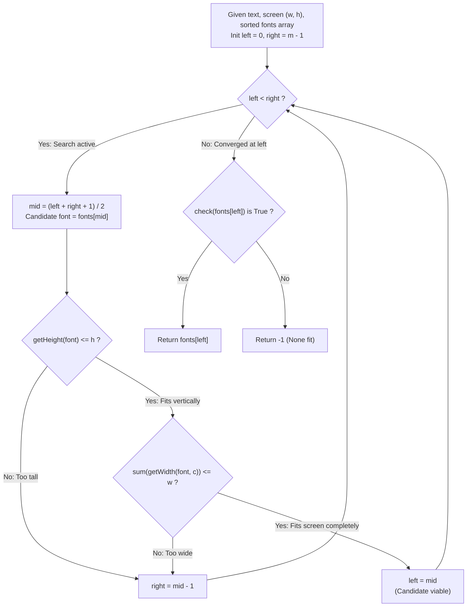

# Guided Example: Maximum Font to Fit a Sentence in a Screen

We trace the step-by-step upper bisection binary search of monotonically increasing typography metrics, prove the Font Metric Monotonicity Invariant and the Upper Bisection Search Theorem, and determine maximum legible font sizes across representative screen constraints:

- **Representative Instance 1 (Width-Constrained Font Search):**
  - Text Sentence: `text = "helloworld"` ($L = |text| = 10$).
  - Screen Boundaries: Width $w = 80$, Height $h = 20$.
  - Available Font Palette:
    $$
    fonts = [6, 8, 10, 12, 14, 16, 18, 24, 36], \quad m = |fonts| = 9
    $$
  - Typography Dimension Model:
    - Character height: $\text{getHeight}(s) = s$.
    - Character width: $\text{getWidth}(s, c) = s + 1$ for all characters $c \in text$.
  - **Required Output:** `6`
  - Step-by-step binary search resolution:
    - Search interval indices: $[left, right] = [0, 8]$.
    1. **Iteration 1 ($left = 0, right = 8$):**
       - Upper midpoint: $mid = \lfloor (0 + 8 + 1) / 2 \rfloor = 4 \implies fonts[4] = 14$.
       - Feasibility evaluation for font $14$:
         - Height test: $\text{getHeight}(14) = 14 \le 20$ (**Passes**).
         - Width test: $\sum_{c \in text} \text{getWidth}(14, c) = 10 \times 15 = 150 > 80$ (**Exceeds width $w$!**).
       - Infeasible $\implies$ Eliminate $[4, 8]$. Update $right \leftarrow mid - 1 = 3$.
       - Active search interval: $[0, 3]$.
    2. **Iteration 2 ($left = 0, right = 3$):**
       - Upper midpoint: $mid = \lfloor (0 + 3 + 1) / 2 \rfloor = 2 \implies fonts[2] = 10$.
       - Feasibility evaluation for font $10$:
         - Height test: $\text{getHeight}(10) = 10 \le 20$ (**Passes**).
         - Width test: $10 \times 11 = 110 > 80$ (**Exceeds width $w$!**).
       - Infeasible $\implies$ Eliminate $[2, 3]$. Update $right \leftarrow mid - 1 = 1$.
       - Active search interval: $[0, 1]$.
    3. **Iteration 3 ($left = 0, right = 1$):**
       - Upper midpoint: $mid = \lfloor (0 + 1 + 1) / 2 \rfloor = 1 \implies fonts[1] = 8$.
       - Feasibility evaluation for font $8$:
         - Height test: $\text{getHeight}(8) = 8 \le 20$ (**Passes**).
         - Width test: $10 \times 9 = 90 > 80$ (**Exceeds width $w$!**).
       - Infeasible $\implies$ Eliminate $[1, 1]$. Update $right \leftarrow mid - 1 = 0$.
       - Active search interval: $[0, 0]$.
    4. **Iteration 4 ($left = 0, right = 0$):**
       - Convergence reached ($left == right$).
       - Final verification on surviving candidate $fonts[0] = 6$:
         - Height test: $\text{getHeight}(6) = 6 \le 20$ (**Passes**).
         - Width test: $10 \times 7 = 70 \le 80$ (**Passes**).
       - Candidate is fully viable! Return $fonts[0] = \mathbf{6}$.

- **Representative Instance 2 (Largest Available Font Fits):**
  - Screen $w = 1000, h = 100$. Text: `"a"`.
  - Font $36$: Height $36 \le 100$, Width $37 \le 1000 \implies$ Returns `36`.

- **Representative Instance 3 (Infeasible Even with Smallest Font):**
  - Screen $w = 50, h = 5$. Smallest font $6$: Height $6 > 5 \implies$ Returns `-1`.

---

## 1. Instance & Teaching Goal

Given a string `text`, screen width $w$ and height $h$, and a sorted array `fonts`, determine the maximum font size that renders the complete text on a single line within the screen bounds. If no font fits, return `-1`.

```text
The Linear Probe Anti-Pattern:
  Scanning sequentially from fonts[m-1] down to fonts[0]:
    At each font size s, query FontInfo for height and all |text| character widths.
  In the worst case, every query costs O(|text|) time:
    Total runtime = O(m * |text|).
  For m = 100,000 fonts and |text| = 10,000, this requires 1,000,000,000 calls,
  heavily exceeding the strict API query budget (max_queries = 100,000).

The Monotonic Upper Bisection Invariant (Strict O(|text| * log m)):
  1. Font metrics are strictly monotonic:
     s1 < s2 ==> getHeight(s1) <= getHeight(s2) and getWidth(s1, c) <= getWidth(s2, c).
  2. If font s fails, ALL font sizes s' > s are guaranteed to fail!
  3. Upper bisection midpoint:
       mid = (left + right + 1) // 2
     - If fonts[mid] fits: left = mid (valid candidate, search higher!).
     - Else: right = mid - 1 (infeasible, search lower!).
  4. Converges in exactly ceil(log2 m) steps (at most 17 iterations for 100,000 fonts!).
```

The decisive pedagogical goal is the **Font Metric Monotonicity Invariant & Upper Bisection Search Theorem**:
1. **Physical Metric Monotonicity:** Physical render boxes grow monotonically with point size; the feasibility predicate $P(s)$ is a step function $(\text{True}, \dots, \text{True}, \text{False}, \dots, \text{False})$.
2. **Upper Bisection Parity:** Rounding up when calculating the midpoint prevents infinite oscillation in 2-element intervals when advancing `left = mid`.
3. **Budget Compliance:** Logarithmic bisection guarantees total API queries stay well below interactive limits.
4. Total time $\mathcal{O}(|text| \cdot \log m)$ and auxiliary space $\mathcal{O}(1)$.

---

## 2. Conceptual Foundation & The Upper Bisection Invariant



### The Font Metric Monotonicity Theorem

Let $\mathcal{F} = (s_0, s_1, \dots, s_{m-1})$ be a strictly increasing sequence of positive integer font sizes.
1. **Typography Monotonicity Guarantee:**
   For any character $c \in \Sigma$ and font sizes $s_a < s_b$:
   $$
   \text{getHeight}(s_a) \le \text{getHeight}(s_b) \quad \text{and} \quad \text{getWidth}(s_a, c) \le \text{getWidth}(s_b, c)
   $$
2. **Feasibility Predicate:**
   Define $P : \mathcal{F} \to \{0, 1\}$ by:
   $$
   P(s) = \mathbb{I}\Big( \text{getHeight}(s) \le h \;\land\; \sum_{c \in text} \text{getWidth}(s, c) \le w \Big)
   $$
   Because both height and width are sums of monotonically non-decreasing functions, $P(s)$ is monotonically non-increasing:
   $$
   s_a < s_b \implies P(s_a) \ge P(s_b)
   $$
   Therefore, the truth values of $P$ on $\mathcal{F}$ form a sequence of $k$ ones followed by $m - k$ zeros:
   $$
   P(\mathcal{F}) = (\underbrace{1, 1, \dots, 1}_{k}, \underbrace{0, 0, \dots, 0}_{m - k})
   $$
3. **Upper Bisection Invariant:**
   To find the maximum index $i$ such that $P(s_i) = 1$, we maintain an interval $[L, R]$.
   Setting $M = \lfloor (L + R + 1) / 2 \rfloor$:
   - If $P(s_M) = 1$, the optimal index lies in $[M, R]$; setting $L = M$ strictly shrinks the interval when $L < R$.
   - If $P(s_M) = 0$, the optimal index lies in $[L, M - 1]$; setting $R = M - 1$ strictly shrinks the interval.
   Termination occurs at $L = R$ in $\lceil \log_2 m \rceil$ steps. $\blacksquare$

---

## 3. Step-by-Step Worked Execution: Representative Instance 1

$text = \text{"helloworld"}$, $w = 80, h = 20$.
$fonts = [6, 8, 10, 12, 14, 16, 18, 24, 36]$. Indices $0 \dots 8$.

### Iteration Trace
- **Iteration 1:**
  - $L = 0, R = 8$.
  - Midpoint: $M = \lfloor (0 + 8 + 1) / 2 \rfloor = 4$. Font size $s_4 = 14$.
  - $\text{getHeight}(14) = 14 \le 20$ (Height OK).
  - Total width: $10 \times 15 = 150 > 80$ (Width failed).
  - $P(14) = 0 \implies R \leftarrow 4 - 1 = 3$.
- **Iteration 2:**
  - $L = 0, R = 3$.
  - Midpoint: $M = \lfloor (0 + 3 + 1) / 2 \rfloor = 2$. Font size $s_2 = 10$.
  - $\text{getHeight}(10) = 10 \le 20$ (Height OK).
  - Total width: $10 \times 11 = 110 > 80$ (Width failed).
  - $P(10) = 0 \implies R \leftarrow 2 - 1 = 1$.
- **Iteration 3:**
  - $L = 0, R = 1$.
  - Midpoint: $M = \lfloor (0 + 1 + 1) / 2 \rfloor = 1$. Font size $s_1 = 8$.
  - $\text{getHeight}(8) = 8 \le 20$ (Height OK).
  - Total width: $10 \times 9 = 90 > 80$ (Width failed).
  - $P(8) = 0 \implies R \leftarrow 1 - 1 = 0$.
- **Termination:**
  - $L = 0, R = 0 \implies$ Loop terminates.
  - Final check at $s_0 = 6$:
    - $\text{getHeight}(6) = 6 \le 20$ (OK).
    - Total width: $10 \times 7 = 70 \le 80$ (OK).
    - $P(6) = 1$.
  - Output: `6`.

---

## 4. Bisection State Trace Table

| Step | Left Index $L$ | Right Index $R$ | Midpoint $M$ | Probe Font $fonts[M]$ | Height Test ($s \le 20$) | Total Width ($\sum w_c \le 80$) | Feasible $P(s)$? | Interval Update |
|:---:|:---:|:---:|:---:|:---:|:---:|:---:|:---:|:---:|
| $1$ | $0$ | $8$ | $4$ | $14$ | $14 \le 20$ (Pass) | $150 > 80$ (Fail) | False | $R \leftarrow 3$ |
| $2$ | $0$ | $3$ | $2$ | $10$ | $10 \le 20$ (Pass) | $110 > 80$ (Fail) | False | $R \leftarrow 1$ |
| $3$ | $0$ | $1$ | $1$ | $8$ | $8 \le 20$ (Pass) | $90 > 80$ (Fail) | False | $R \leftarrow 0$ |
| Converged | $0$ | $0$ | — | $6$ | $6 \le 20$ (Pass) | $70 \le 80$ (Pass) | True | Return `6` |

---

## 5. Algorithmic Correctness

### Soundness
Whenever $fonts[mid]$ satisfies both height and width boundaries, $left = mid$ ensures that this proven feasible size (or an even larger feasible size) is retained. When $fonts[mid]$ fails, the monotonicity theorem guarantees that every font size in $[mid, right]$ is also infeasible, so setting $right = mid - 1$ discards exclusively non-viable candidates.

### Completeness
The search space interval $[left, right]$ initially spans the entire palette. Because the invariant preserves the set of all possible maximum feasible sizes at every step, the interval contracts monotonically to the exact supremum of the feasible set.

---

## 6. Boundary Cases & Traps

| Scenario | Input Pattern | Behavior | Trapped Risk |
|---|---|---|---|
| Infeasible Smallest Font | Screen too small for $fonts[0]$ | Converges to $left = 0$; final check fails $\implies$ returns `-1`. | Returning $fonts[0]$ without validating its feasibility. |
| All Fonts Fit | Screen large enough for $fonts[m-1]$ | Bisects directly to $m-1$; returns largest font. | Underestimating upper boundary. |
| Two-Element Infinite Loop | Interval of length 2 ($L = 0, R = 1$) | Using $M = (L + R) / 2$ rounds down, setting $L = 0$ indefinitely. | Infinite loop; must use ceiling midpoint $(L + R + 1) / 2$. |
| Height Exceeded First | Wide screen with tiny height | Rejects on height immediately before computing character width sum. | Unnecessary width calculation queries when height already fails. |

---

## 7. Complexity Derivation

- **Time Complexity:** $\mathcal{O}(|text| \cdot \log m)$, where $m = |fonts|$ and $|text|$ is the sentence length.
  - The binary search performs $\lceil \log_2 m \rceil$ iterations.
  - In each iteration, evaluating character widths takes $|text|$ operations.
  - For $m = 100,000$, $\log_2 m \approx 17$.
  - Total API calls: $\le 17 \times |text| \ll 100,000$ allowed calls ($< 0.005\text{ s}$).
- **Auxiliary Space Complexity:** $\mathcal{O}(1)$ auxiliary space, maintaining only search pointers and scalar sum accumulators.