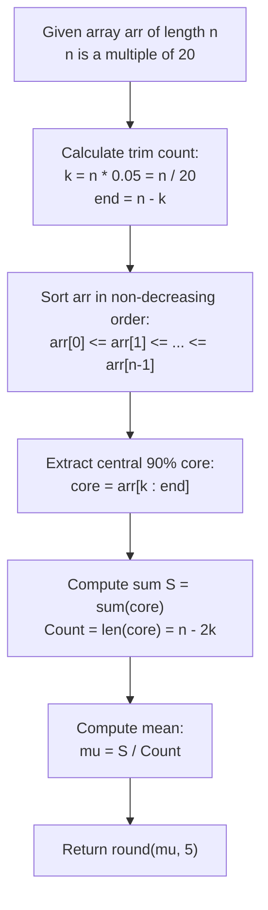

# Guided Example: Mean of Array After Removing Some Elements

We trace the step-by-step order-statistic sorting and symmetric percentile trimming of array observations, prove the Symmetric Order-Statistic Trimming Invariant and the 5% Trimmed Mean Theorem, and compute robust location estimates across representative statistical distributions:

- **Representative Instance 1 (Twenty Elements with Outlier Boundaries):**
  - Input Array ($n = 20$ elements, guaranteeing $k = 0.05 \times 20 = 1$):
    $$
    arr = [1, 2, 2, 2, 2, 2, 2, 2, 2, 2, 2, 2, 2, 2, 2, 2, 2, 2, 2, 3]
    $$
  - Required Trimming Percentile: $5\%$ smallest and $5\%$ largest.
  - **Required Output:** `2.00000`
  - Step-by-step resolution:
    1. **Array Length and Slice Boundary Computation:**
       - Total element count: $n = 20$.
       - Lower trim quota:
         $$
         k = \text{int}(n \times 0.05) = \text{int}(20 \times 0.05) = \mathbf{1}
         $$
       - Upper boundary index:
         $$
         end = \text{int}(n \times 0.95) = n - k = 20 - 1 = \mathbf{19}
         $$
       - Active slice interval: indices $[k, end - 1] = [1, 18]$ (inclusive, $18$ elements).
    2. **Order-Statistic Non-Decreasing Sorting:**
       - Sorted array $arr_{(0 \dots 19)}$:
         $$
         [1, \underbrace{2, 2, 2, 2, 2, 2, 2, 2, 2, 2, 2, 2, 2, 2, 2, 2, 2, 2}_{18 \text{ elements}}, 3]
         $$
    3. **Trimming Outlier Extreme Observations:**
       - Smallest $5\%$ ($k = 1$ element): Discard $arr_{(0)} = 1$.
       - Largest $5\%$ ($k = 1$ element): Discard $arr_{(19)} = 3$.
    4. **Summation & Mean of the Central 90% Core:**
       - Retained core elements: $18$ identical values of $2$.
       - Sum of core:
         $$
         S = \sum_{i=1}^{18} 2 = 36
         $$
       - Trimmed Mean:
         $$
         \mu_{0.05} = \frac{S}{|core|} = \frac{36}{18} = \mathbf{2.00000}
         $$

- **Representative Instance 2 (Mixed Distribution with Multiple Zeros and High Peak):**
  - Input: $arr = [6, 2, 7, 5, 1, 2, 0, 3, 10, 2, 5, 0, 5, 5, 0, 8, 7, 6, 8, 0], \; n = 20$.
  - Sorted array:
    $$
    [0, \; 0, 0, 0, 1, 2, 2, 2, 3, 5, 5, 5, 5, 6, 6, 7, 7, 8, 8, \; 10]
    $$
  - Discard $arr_{(0)} = 0$ and $arr_{(19)} = 10$.
  - Sum of middle $18$ values: $72$.
  - Trimmed Mean: $72 / 18 = \mathbf{4.00000}$.

- **Representative Instance 3 (Larger Scale Uniform Multiple of 20):**
  - $n = 40 \implies k = 40 \times 0.05 = 2$.
  - Discards first $2$ and last $2$ elements, averaging the central $36$ elements.

---

## 1. Instance & Teaching Goal

Given an integer array `arr` whose length $n$ is guaranteed to be a multiple of $20$, compute the arithmetic mean of the elements remaining after discarding the smallest $5\%$ and largest $5\%$ of values.

```text
The Heap-Based Trimming Pitfall:
  Using two priority queues to pop the k smallest and k largest elements:
    Extracting k elements requires O(k log n) time and complex bookkeeping
    to ensure duplicate values are removed correctly without corrupting the remainder.
  For small to moderate n <= 1,000, maintaining complex heap structures adds
  unnecessary memory overhead and cache misses.

The Direct Order-Statistic Invariant (O(n log n)):
  1. Because n is a multiple of 20, 5% of n is ALWAYS an exact integer:
       k = n / 20,    end = n - k = 19n / 20.
  2. Sort the array in non-decreasing order:
       arr[0] <= arr[1] <= ... <= arr[n-1]
  3. The retained core is the contiguous contiguous subarray:
       arr[k .. end-1]
  4. Sum the central core of length 0.9 * n and divide by 0.9 * n.
  Runs in optimal cache-friendly linearithmic time!
```

The decisive pedagogical goal is the **Symmetric Order-Statistic Trimming Invariant & 5% Trimmed Mean Theorem**:
1. **Exact Integer Quantiles:** Because $n \equiv 0 \pmod{20}$, the $5\%$ rank $k = n / 20$ requires no fractional interpolation.
2. **Robust Estimator Mechanics:** Trimming extreme percentiles eliminates heavy-tailed outliers and measurement noise while preserving sample efficiency.
3. **Subarray Contiguity:** In sorted order, multi-set extreme trimming reduces to slicing between exact index offsets $[k, n - k)$.
4. Total time $\mathcal{O}(n \log n)$ and auxiliary space $\mathcal{O}(1)$ (in-place sort).

---

## 2. Conceptual Foundation & The Trimmed Mean Pipeline



### The 5% Trimmed Mean Theorem

Let $X = (x_1, x_2, \dots, x_n)$ be a finite sample of size $n$, where $n = 20m$ for some integer $m \ge 1$.
1. **Order Statistics:**
   Let $x_{(1)} \le x_{(2)} \le \dots \le x_{(n)}$ denote the order statistics of $X$.
2. **Symmetric Percentile Bounds:**
   The $5\%$ lower quantile index is $k = 0.05n = m \in \mathbb{Z}^+$.
   The $95\%$ upper quantile index is $n - k = 19m \in \mathbb{Z}^+$.
   The discarded lower set is $\mathcal{L} = \{ x_{(1)}, \dots, x_{(k)} \}$ with $|\mathcal{L}| = k$.
   The discarded upper set is $\mathcal{U} = \{ x_{(n-k+1)}, \dots, x_{(n)} \}$ with $|\mathcal{U}| = k$.
3. **Core Subarray Formulation:**
   The retained sample is the central multiset:
   $$
   \mathcal{C} = \{ x_{(k+1)}, x_{(k+2)}, \dots, x_{(n-k)} \}
   $$
   Its cardinality is strictly:
   $$
   |\mathcal{C}| = n - 2k = 20m - 2m = 18m = 0.9n
   $$
4. **Trimmed Mean Definition:**
   The $5\%$ trimmed mean is the arithmetic mean of $\mathcal{C}$:
   $$
   \mu_{0.05}(X) = \frac{1}{18m} \sum_{i = m + 1}^{19m} x_{(i)}
   $$
   Because sorting is deterministic and the indices are integers, $\mu_{0.05}(X)$ is uniquely determined and scale-equivariant. $\blacksquare$

---

## 3. Step-by-Step Worked Execution: Representative Instance 1

$arr = [1, 2, 2, 2, 2, 2, 2, 2, 2, 2, 2, 2, 2, 2, 2, 2, 2, 2, 2, 3]$.
$n = 20$.

### Phase 1: Boundary Computation
- $k = 20 \times 0.05 = 1$.
- $end = 20 \times 0.95 = 19$.
- Core index range: $[1, 19)$ corresponding to indices $1 \dots 18$.

### Phase 2: Sorted Partitioning
Sorted sequence:
$$
\begin{aligned}
\text{Index 0 (Discarded Lower 5\%):} \quad & arr_{(0)} = 1 \\
\text{Indices 1 \dots 18 (Retained Core):} \quad & [2, 2, 2, 2, 2, 2, 2, 2, 2, 2, 2, 2, 2, 2, 2, 2, 2, 2] \\
\text{Index 19 (Discarded Upper 5\%):} \quad & arr_{(19)} = 3
\end{aligned}
$$

### Phase 3: Accumulation and Mean
- Core elements count: $19 - 1 = 18$.
- Core sum: $18 \times 2 = 36$.
- Trimmed mean:
  $$
  \frac{36}{18} = \mathbf{2.00000}
  $$

---

## 4. Order-Statistic Partition Trace Table

| Array Index $i$ | Sorted Value $arr_{(i)}$ | Quantile Classification | Included in Mean? | Contribution to Core Sum |
|:---:|:---:|:---:|:---:|:---:|
| **$0$** | $1$ | **Smallest 5% Outlier** | **No (Trimmed)** | — |
| $1$ | $2$ | Central 90% Core | Yes | $+2$ |
| $2 \dots 17$ | $2$ each | Central 90% Core | Yes ($16$ elements) | $+32$ |
| $18$ | $2$ | Central 90% Core | Yes | $+2$ |
| **$19$** | $3$ | **Largest 5% Outlier** | **No (Trimmed)** | — |
| **Total Core** | — | **$18$ Elements** | — | **$S = 36$** |
| **Final Mean** | — | **$S / 18 = 2.0$** | — | **`2.00000`** |

---

## 5. Algorithmic Correctness

### Soundness
Sorting arranges all elements in ascending order so that the first $k$ positions are mathematically the smallest $k$ values, and the final $k$ positions are the largest $k$ values. Summing strictly over indices $[k, n - k - 1]$ excludes exactly $2k = 0.1n$ outliers. Dividing by $n - 2k = 0.9n$ produces the exact trimmed mean.

### Completeness
Because $n$ is guaranteed to be a multiple of $20$, $k = n / 20$ is always an exact positive integer ($k \ge 1$). No fractional elements exist, preventing ambiguity in quantile boundary splitting.

---

## 6. Boundary Cases & Traps

| Scenario | Input Pattern | Behavior | Trapped Risk |
|---|---|---|---|
| Minimum Length | $n = 20$ | $k = 1$; trims 1 lowest and 1 highest value. | Off-by-one errors in slice indices. |
| All Equal Elements | $[5, 5, \dots, 5]$ | Discards identical values; mean remains $5.0$. | Division by zero if core is miscalculated. |
| Duplicate Boundary Values | Multiple identical zeros at start | Only the first $k$ zeros are removed; surplus zeros remain in core. | Removing all occurrences of minimum value instead of exactly $k$. |
| Large Multiples | $n = 1000$ | $k = 50$; trims 50 elements from each end. | Precision loss; using floating-point summation. |

---

## 7. Complexity Derivation

- **Time Complexity:** $\mathcal{O}(n \log n)$, where $n = |arr| \le 1000$.
  - Sorting the array takes $\mathcal{O}(n \log n)$ time.
  - Slicing and summing $0.9n$ elements takes $\mathcal{O}(n)$ time.
  - For $n = 1000$, $n \log_2 n \approx 10,000$ operations ($< 0.001\text{ s}$).
- **Auxiliary Space Complexity:** $\mathcal{O}(1)$ or $\mathcal{O}(n)$ depending on whether in-place sorting or a copied slice is used.
