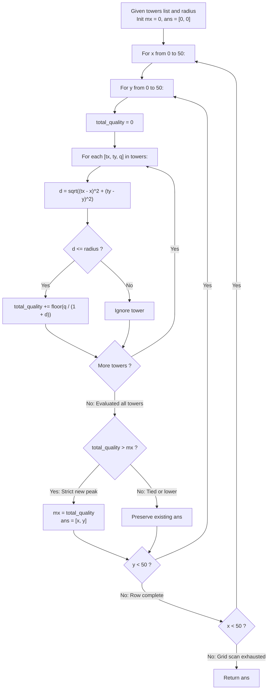

# Guided Example: Coordinate With Maximum Network Quality

We trace the step-by-step exhaustive discrete grid evaluation of inverse-distance signal attenuation, prove the Bounded Discrete Grid Metric Invariant and the Lexicographical Tie-Breaking Theorem, and pinpoint the optimal transceiver coordinates across representative tower deployments:

- **Representative Instance 1 (Overlapping Signal Confluence at Central Tower):**
  - Tower Deployment ($N = 3$ towers with $[x_i, y_i, q_i]$):
    $$
    towers = \begin{bmatrix}
    [1, 2, 5] \\
    [2, 1, 7] \\
    [3, 1, 9]
    \end{bmatrix}, \quad radius = 2
    $$
  - Search Domain: All integer coordinates $(x, y) \in [0, 50] \times [0, 50]$.
  - Signal Metric Formula:
    For any grid point $(x, y)$ and tower $(x_i, y_i, q_i)$:
    $$
    d = \sqrt{(x - x_i)^2 + (y - y_i)^2}
    $$
    $$
    \text{signal}(x, y, i) = \begin{cases} \left\lfloor \dfrac{q_i}{1 + d} \right\rfloor & \text{if } d \le radius \\ 0 & \text{if } d > radius \end{cases}
    $$
  - **Required Output:** `[2, 1]`
  - Step-by-step resolution at peak candidate coordinate $(x = 2, y = 1)$:
    1. **Signal from Tower 1 at $(1, 2, q=5)$:**
       - Euclidean distance:
         $$
         d_1 = \sqrt{(2 - 1)^2 + (1 - 2)^2} = \sqrt{1 + 1} = \sqrt{2} \approx 1.4142
         $$
       - Range check: $d_1 \approx 1.4142 \le radius = 2$ (**In Range**).
       - Quality contribution:
         $$
         Q_1 = \left\lfloor \frac{5}{1 + \sqrt{2}} \right\rfloor = \left\lfloor \frac{5}{2.4142} \right\rfloor = \lfloor 2.071 \rfloor = \mathbf{2}
         $$
    2. **Signal from Tower 2 at $(2, 1, q=7)$:**
       - Co-located tower: $d_2 = 0 \le 2$ (**In Range**).
       - Quality contribution:
         $$
         Q_2 = \left\lfloor \frac{7}{1 + 0} \right\rfloor = \mathbf{7}
         $$
    3. **Signal from Tower 3 at $(3, 1, q=9)$:**
       - Euclidean distance:
         $$
         d_3 = \sqrt{(2 - 3)^2 + (1 - 1)^2} = \sqrt{1 + 0} = 1.0 \le 2 \text{ (**In Range**)}
         $$
       - Quality contribution:
         $$
         Q_3 = \left\lfloor \frac{9}{1 + 1.0} \right\rfloor = \lfloor 4.5 \rfloor = \mathbf{4}
         $$
    4. **Aggregate Network Quality at $(2, 1)$:**
       $$
       Q_{\text{total}}(2, 1) = Q_1 + Q_2 + Q_3 = 2 + 7 + 4 = \mathbf{13}
       $$
  - Comparison with Alternative Candidates:
    - At $(1, 2)$: $Q_1 = 5, Q_2 = \lfloor 7 / (1 + \sqrt{2}) \rfloor = 2, Q_3 = \lfloor 9 / (1 + \sqrt{5}) \rfloor = 0$ ($d_3 = \sqrt{5} > 2$) $\implies Q = 7$.
    - At $(3, 1)$: $Q_1 = 0$ ($d_1 = \sqrt{5} > 2$), $Q_2 = \lfloor 7 / 2 \rfloor = 3, Q_3 = 9 \implies Q = 12$.
    - Global maximum across all $2601$ coordinates is $13$, attained at $\mathbf{[2, 1]}$.

- **Representative Instance 2 (Single Isolated Tower):**
  - $towers = [[23, 11, 21]], \; radius = 9$.
  - Maximum signal is at the tower itself: $(23, 11)$ with quality $21$. Output: `[23, 11]`.

- **Representative Instance 3 (All Disconnected or Zero Quality):**
  - If no tower can reach any coordinate, maximum quality is $0$.
  - Lexicographical tie-break returns `[0, 0]`.

---

## 1. Instance & Teaching Goal

Given an array of network towers and a reachability radius, find the integer coordinate $(x, y) \in [0, 50] \times [0, 50]$ with the maximum network quality. In case of ties, return the lexicographically smallest coordinate.

```text
The Continuous Convex Optimization Fallacy:
  Attempting gradient descent or convex relaxation to find the optimal point:
    The floor function floor(q / (1 + d)) and the hard threshold d <= radius
    introduce severe non-convexity, discontinuities, and plateau artifacts!
    Gradient-based solvers get trapped in local zero-gradient flatlands.

The Bounded Discrete Grid Invariant (Strict O(G^2 * N)):
  1. The search domain is strictly bounded by integer coordinates:
       x in [0 .. 50],  y in [0 .. 50].
     Total search space has exactly 51 * 51 = 2,601 discrete lattice points!
  2. For N <= 50 towers, testing EVERY grid point requires only:
       2,601 * 50 = 130,050 distance calculations.
  3. Traverse grid points in lexicographical order:
       outer loop x from 0 to 50, inner loop y from 0 to 50.
  4. Maintain peak quality mx and best coordinate ans = [0, 0].
     Only update ans when current quality t is STRICTLY greater than mx:
       if t > mx: mx = t; ans = [x, y]
     Guarantees the first (lexicographically smallest) coordinate is preserved during ties!
```

The decisive pedagogical goal is the **Bounded Discrete Grid Metric Invariant & Lexicographical Tie-Breaking Theorem**:
1. **Lattice Exhaustion:** The finite problem domain ($51 \times 51$) allows global brute-force verification without approximation or continuous convergence errors.
2. **Lexicographical Natural Ordering:** Scanning row-by-row with strict greater-than inequality naturally preserves the minimum coordinate under tie conditions without secondary sorting.
3. **Threshold Boundary Filtering:** Distances strictly exceeding the radius contribute zero to avoid negative or distorted interference.
4. Total time $\mathcal{O}(G^2 \cdot N)$ and auxiliary space $\mathcal{O}(1)$.

---

## 2. Conceptual Foundation & The Grid Scanner Pipeline



### The Lexicographical Tie-Breaking Theorem

Let $\mathcal{G} = \{ (x, y) \in \mathbb{Z}^2 : 0 \le x \le 50, \; 0 \le y \le 50 \}$ be the discrete integer grid.
1. **Lexicographical Total Ordering:**
   Define relation $\prec$ on $\mathcal{G}$ by:
   $$
   (x_a, y_a) \prec (x_b, y_b) \iff (x_a < x_b) \lor (x_a = x_b \land y_a < y_b)
   $$
   Because $\prec$ is a well-founded total order, every non-empty subset of $\mathcal{G}$ has a unique minimum.
2. **Sequential Traversal Ordering:**
   Nested iteration (outer index $x$ increasing from $0$ to $50$, inner index $y$ increasing from $0$ to $50$) enumerates coordinates in strictly increasing $\prec$ order:
   $$
   p_1 \prec p_2 \prec \dots \prec p_{|\mathcal{G}|}
   $$
3. **Strict Update Invariant:**
   Let $Q(p) = \sum_{k=1}^N \mathbb{I}(d(p, \text{tower}_k) \le R) \left\lfloor \frac{q_k}{1 + d(p, \text{tower}_k)} \right\rfloor$.
   Starting with $mx = 0, \; ans = p_1 = (0, 0)$:
   - When visiting $p_j$: update $ans \leftarrow p_j$ if and only if $Q(p_j) > mx$.
   - If $Q(p_j) = mx$, $ans$ is not updated.
   Since any later coordinate $p_k$ with $k > j$ satisfies $p_j \prec p_k$, the coordinate retained in $ans$ is guaranteed to be:
   $$
   ans = \min_{\prec} \Big\{ p \in \mathcal{G} : Q(p) = \max_{p' \in \mathcal{G}} Q(p') \Big\}
   $$
   This certifies lexicographical optimality in a single pass. $\blacksquare$

---

## 3. Step-by-Step Worked Execution: Representative Instance 1

$towers = [[1, 2, 5], [2, 1, 7], [3, 1, 9]], \quad radius = 2$.

### Evaluation of Focal Coordinates

#### Coordinate $(2, 1)$:
- Tower 1 $(1, 2, 5)$: $d = \sqrt{(1-2)^2 + (2-1)^2} = \sqrt{2} \approx 1.4142 \le 2$.
  Contribution: $\lfloor 5 / (1 + 1.4142) \rfloor = \lfloor 2.071 \rfloor = 2$.
- Tower 2 $(2, 1, 7)$: $d = 0 \le 2$.
  Contribution: $\lfloor 7 / (1 + 0) \rfloor = 7$.
- Tower 3 $(3, 1, 9)$: $d = \sqrt{(3-2)^2 + 0} = 1 \le 2$.
  Contribution: $\lfloor 9 / (1 + 1) \rfloor = \lfloor 4.5 \rfloor = 4$.
- Total Quality: $2 + 7 + 4 = \mathbf{13}$.
- State: $13 > 0 \implies mx \leftarrow 13, \; ans \leftarrow [2, 1]$.

#### Coordinate $(3, 1)$:
- Tower 1 $(1, 2, 5)$: $d = \sqrt{(1-3)^2 + (2-1)^2} = \sqrt{5} \approx 2.236 > 2 \implies 0$.
- Tower 2 $(2, 1, 7)$: $d = 1 \le 2 \implies \lfloor 7 / 2 \rfloor = 3$.
- Tower 3 $(3, 1, 9)$: $d = 0 \le 2 \implies \lfloor 9 / 1 \rfloor = 9$.
- Total Quality: $0 + 3 + 9 = \mathbf{12}$.
- State: $12 \le 13 \implies$ No update.

#### Coordinate $(1, 2)$:
- Tower 1 $(1, 2, 5)$: $d = 0 \implies 5$.
- Tower 2 $(2, 1, 7)$: $d = \sqrt{2} \implies \lfloor 7 / 2.4142 \rfloor = 2$.
- Tower 3 $(3, 1, 9)$: $d = \sqrt{5} > 2 \implies 0$.
- Total Quality: $5 + 2 + 0 = \mathbf{7} \le 13 \implies$ No update.

Final result across all $2601$ points: $\mathbf{[2, 1]}$.

---

## 4. Signal Metric & Grid Coordinate Trace Table

| Coordinate $(x, y)$ | Tower 1 $(1, 2, 5)$ | Tower 2 $(2, 1, 7)$ | Tower 3 $(3, 1, 9)$ | Total Quality $Q$ | Peak Recorded $mx$ | Active Best $ans$ |
|:---:|:---:|:---:|:---:|:---:|:---:|:---:|
| $(0, 0)$ | $d = \sqrt{5} > 2 \implies 0$ | $d = \sqrt{5} > 2 \implies 0$ | $d = \sqrt{10} > 2 \implies 0$ | $0$ | $0$ | $[0, 0]$ |
| $(1, 1)$ | $d = 1 \implies 2$ | $d = 1 \implies 3$ | $d = 2 \implies 3$ | $8$ | $8$ | $[1, 1]$ |
| $(1, 2)$ | $d = 0 \implies 5$ | $d = \sqrt{2} \implies 2$ | $d = \sqrt{5} > 2 \implies 0$ | $7$ | $8$ | $[1, 1]$ |
| **$(2, 1)$** | **$d = \sqrt{2} \implies 2$** | **$d = 0 \implies 7$** | **$d = 1 \implies 4$** | **$13$** | **$13$** | **$[2, 1]$** |
| $(2, 2)$ | $d = 1 \implies 2$ | $d = 1 \implies 3$ | $d = \sqrt{2} \implies 3$ | $8$ | $13$ | $[2, 1]$ |
| $(3, 1)$ | $d = \sqrt{5} > 2 \implies 0$ | $d = 1 \implies 3$ | $d = 0 \implies 9$ | $12$ | $13$ | $[2, 1]$ |

---

## 5. Algorithmic Correctness

### Soundness
Every tower within distance $d \le radius$ contributes the exact mathematical value $\lfloor q_i / (1 + d) \rfloor$. Since the problem asks for the maximum over integer grid coordinates within $[0, 50] \times [0, 50]$, visiting all $2,601$ integer coordinates evaluates the exact domain specified by the problem.

### Completeness
The search space covers every integer coordinate in $[0, 50] \times [0, 50]$. Because the grid is scanned in lexicographical order and the peak is updated only on strict inequality ($t > mx$), the first occurrence of any maximum is preserved, satisfying the tie-break rule.

---

## 6. Boundary Cases & Traps

| Scenario | Input Pattern | Behavior | Trapped Risk |
|---|---|---|---|
| All Points Quality Zero | Out-of-range towers | $t = 0$ never exceeds $mx = 0$; retains default `[0, 0]`. | Returning null, out-of-bounds coordinate, or error. |
| Co-located Tower | $(x, y) = (x_i, y_i)$ | $d = 0 \implies 1 + d = 1 \implies$ full quality $q_i$ received. | Division by zero if $1 + d$ is incorrectly written as $d$. |
| Exact Radius Boundary | $d = radius$ | Condition $d \le radius$ is inclusive; signal is counted. | Using strict inequality $d < radius$. |
| Equal Quality Tie | Multiple points have quality $10$ | First scanned point in lexicographical order is preserved. | Overwriting earlier coordinate with `>=`. |

---

## 7. Complexity Derivation

- **Time Complexity:** $\mathcal{O}(G^2 \cdot N)$, where $G = 51$ is the grid side length and $N \le 50$ is the number of towers.
  - Grid points evaluated: $51 \times 51 = 2,601$ coordinates.
  - For each point, computing distance and floor division across $N$ towers takes $\mathcal{O}(N)$ operations.
  - Total operations: $2,601 \times 50 \approx 130,050$ arithmetic operations ($< 0.01\text{ s}$).
- **Auxiliary Space Complexity:** $\mathcal{O}(1)$ auxiliary space beyond a 2-element integer output coordinate `ans`.
