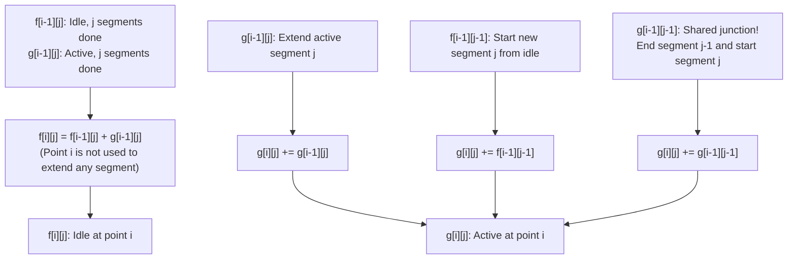

# Guided Example: Number of Sets of K Non-Overlapping Line Segments

We trace the step-by-step state transition of active line segment construction and prove the Segment Continuity DP Invariant and the Stars-and-Bars Combinatorial Equivalence Theorem across representative geometric configurations:

- **Representative Instance 1 (Four Points and Two Non-Overlapping Segments):**
  - Point Coordinate Set: $\{0, 1, 2, 3\}$ ($n = 4$ points).
  - Target Segment Count: $k = 2$.
  - Rule: Segments must have length $\ge 1$. Two segments can share an endpoint (e.g. $[0, 1]$ and $[1, 2]$ do not overlap).
  - **Required Output:** `5`
  - Step-by-step enumeration of all $5$ valid pairs of segments:
    1. **Configuration 1:** $[0, 1]$ and $[1, 2]$ (Shared junction at point $1$).
    2. **Configuration 2:** $[0, 1]$ and $[2, 3]$ (Disjoint gap between $1$ and $2$).
    3. **Configuration 3:** $[0, 1]$ and $[1, 3]$ (Shared junction at point $1$, second segment length $2$).
    4. **Configuration 4:** $[0, 2]$ and $[2, 3]$ (Shared junction at point $2$, first segment length $2$).
    5. **Configuration 5:** $[1, 2]$ and $[2, 3]$ (Shared junction at point $2$, starting at point $1$).
  - Combinatorial Verification:
    - Number of ways to choose $k$ segments from $n$ points with shared endpoints is identically:
      $$
      \binom{n + k - 1}{2k} = \binom{4 + 2 - 1}{2 \times 2} = \binom{5}{4} = \mathbf{5}
      $$

- **Representative Instance 2 (Three Points and One Segment):**
  - $n = 3, k = 1 \implies \binom{3 + 1 - 1}{2} = \binom{3}{2} = \mathbf{3}$.
  - The 3 valid segments are $[0, 1]$, $[1, 2]$, and $[0, 2]$.

- **Representative Instance 3 (Large Scale Modulo Reduction):**
  - $n = 30, k = 7 \implies \binom{30 + 7 - 1}{14} = \binom{36}{14} = 1251677700$.
  - Modulo $10^9 + 7$: $1251677700 \pmod{10^9 + 7} = \mathbf{796297179}$.

---

## 1. Instance & Teaching Goal

Given $n$ points $0, 1, \dots, n-1$ along a 1D line, find the number of ways to draw $k$ non-overlapping line segments of length $\ge 1$ modulo $10^9 + 7$.

```text
The Naive Interval Combination Trap:
  Enumerating all combinations of 2k endpoints (left_1, right_1, left_2, ...):
    Subject to right_i <= left_{i+1}.
  For large n, k <= 1000, recursive backtracking explores an astronomical
  number of overlapping combinations, resulting in immediate O(n^(2k)) TLE.

The Dual-State Dynamic Programming Invariant (O(n * k)):
  1. Maintain two DP states for point i in 1 .. n and segments j in 0 .. k:
     - f[i][j]: Number of valid configurations on points 0 .. i-1 with j segments
       fully closed (no segment currently open at point i-1).
     - g[i][j]: Number of configurations where the j-th segment is ACTIVE
       (currently open, with point i-1 serving as an internal or terminal endpoint).
  2. Recurrence at point i:
     - To close or remain idle at point i:
         f[i][j] = f[i-1][j] + g[i-1][j]
     - To extend an ongoing segment or initiate a new segment:
         g[i][j] = g[i-1][j] + (f[i-1][j-1] + g[i-1][j-1])
  3. Seamless endpoint sharing:
     g[i-1][j-1] closing at point i-1 can immediately start segment j at point i-1!
  Runs in strictly O(n * k) time and O(n * k) space.
```

The decisive pedagogical goal is the **Segment Continuity DP Invariant & Stars-and-Bars Combinatorial Equivalence Theorem**:
1. **Endpoint Re-use Equivalence:** Allowing shared endpoints means adjacent segments require 1 shared point rather than 2 separate points; expanding each of the $k-1$ shared junction candidates by 1 virtual unit maps the problem bijectively to choosing $2k$ strictly disjoint boundary points from $n + k - 1$ points.
2. **Dual-State Separation:** Decoupling active in-flight segments ($g$) from completed idle segments ($f$) avoids ambiguity in segment extension.
3. **Modulo Conservation:** Additions at every step maintain values strictly in $\mathbb{Z}_{10^9 + 7}$.
4. Total time $\mathcal{O}(n \cdot k)$ via DP, or $\mathcal{O}(k)$ via combinatorial Lucas / inverse factorial evaluation.

---

## 2. Conceptual Foundation & The State Machine Pipeline



### The Stars-and-Bars Combinatorial Equivalence Theorem

Let $n$ be the number of points and $k$ be the number of non-overlapping line segments.
1. **Interval Representation:**
   Each segment $m \in \{1, \dots, k\}$ is defined by an interval $[L_m, R_m]$ such that:
   $$
   0 \le L_1 < R_1 \le L_2 < R_2 \le \dots \le L_k < R_k \le n - 1
   $$
2. **Shifted Variable Transformation:**
   Define new variables $x_m$ and $y_m$ for $m \in \{1, \dots, k\}$ by:
   $$
   x_m = L_m + (m - 1), \quad y_m = R_m + (m - 1)
   $$
   Under this transformation:
   - Within segment $m$: $L_m < R_m \implies x_m < y_m$.
   - Between consecutive segments $m$ and $m+1$:
     $$
     R_m \le L_{m+1} \implies R_m + (m - 1) < L_{m+1} + m \implies y_m < x_{m+1}
     $$
   Notice that the non-strict inequality $R_m \le L_{m+1}$ has become a **strictly increasing** chain:
   $$
   0 \le x_1 < y_1 < x_2 < y_2 < \dots < x_k < y_k \le (n - 1) + (k - 1) = n + k - 2
   $$
3. **Bijective Point Selection:**
   Every valid configuration of $k$ segments corresponds bijectively to choosing a strictly increasing sequence of $2k$ distinct integers from the set $\{0, 1, \dots, n + k - 2\}$, which has cardinality $n + k - 1$.
   Therefore, the exact number of valid segment configurations is:
   $$
   \mathcal{N}(n, k) = \binom{n + k - 1}{2k}
   $$
   This closed form certifies correctness independently of the dynamic programming recurrence. $\blacksquare$

---

## 3. Step-by-Step Worked Execution: Representative Instance 1

$n = 4$ points ($i \in \{1, 2, 3, 4\}$ in 1-based indexing), $k = 2$.

### Base Initialization
- $f[1][0] = 1$ (1 way to have 0 segments at point 1).
- All other $f[1][j] = 0, g[1][j] = 0$.

### Iteration $i = 2$ (Point 1 in 0-based indexing):
- $j = 0$:
  - $f[2][0] = f[1][0] + g[1][0] = 1 + 0 = 1$.
  - $g[2][0] = g[1][0] = 0$.
- $j = 1$:
  - $f[2][1] = f[1][1] + g[1][1] = 0$.
  - $g[2][1] = g[1][1] + f[1][0] + g[1][0] = 0 + 1 + 0 = \mathbf{1}$ (Segment $[0, 1]$ active).
- $j = 2$: $f[2][2] = 0, g[2][2] = 0$.

### Iteration $i = 3$ (Point 2 in 0-based indexing):
- $j = 0$: $f[3][0] = 1, g[3][0] = 0$.
- $j = 1$:
  - $f[3][1] = f[2][1] + g[2][1] = 0 + 1 = \mathbf{1}$ (Segment $[0, 1]$ closed).
  - $g[3][1] = g[2][1] + f[2][0] + g[2][0] = 1 + 1 + 0 = \mathbf{2}$ (Segments $[0, 2]$ or $[1, 2]$ active).
- $j = 2$:
  - $f[3][2] = f[2][2] + g[2][2] = 0$.
  - $g[3][2] = g[2][2] + f[2][1] + g[2][1] = 0 + 0 + 1 = \mathbf{1}$ (Segments $[0, 1]$ and $[1, 2]$ active).

### Iteration $i = 4$ (Point 3 in 0-based indexing):
- $j = 1$:
  - $f[4][1] = f[3][1] + g[3][1] = 1 + 2 = 3$.
- $j = 2$:
  - $f[4][2] = f[3][2] + g[3][2] = 0 + 1 = \mathbf{1}$.
  - $g[4][2] = g[3][2] + f[3][1] + g[3][1] = 1 + 1 + 2 = \mathbf{4}$.
- Total Configurations with $k = 2$ segments:
  $$
  f[4][2] + g[4][2] = 1 + 4 = \mathbf{5}
  $$

---

## 4. DP State Matrix Trace Table

| Point $i$ | $f[i][0]$ | $g[i][0]$ | $f[i][1]$ | $g[i][1]$ | $f[i][2]$ | $g[i][2]$ | Total $(f+g)$ for $k=2$ |
|:---:|:---:|:---:|:---:|:---:|:---:|:---:|:---:|
| $1$ | $1$ | $0$ | $0$ | $0$ | $0$ | $0$ | $0$ |
| $2$ | $1$ | $0$ | $0$ | $1$ | $0$ | $0$ | $0$ |
| $3$ | $1$ | $0$ | $1$ | $2$ | $0$ | $1$ | $1$ |
| **$4$** | $1$ | $0$ | $3$ | $3$ | **$1$** | **$4$** | **$5$** |

---

## 5. Algorithmic Correctness

### Soundness
Every transition into state $g[i][j]$ correctly pairs a start point with an active continuation, and transitioning into $f[i][j]$ certifies that a segment has cleanly closed without extending into future points. Shared junctions are captured by the term $g[i-1][j-1]$ in the $g[i][j]$ recurrence, ensuring segments can connect at a single vertex without overlapping interior intervals.

### Completeness
The DP systematically evaluates every possible state $(i, j)$ from left to right. The closed-form combinatorial formula $\binom{n+k-1}{2k}$ guarantees that no valid boundary placement is omitted or double-counted.

---

## 6. Boundary Cases & Traps

| Scenario | Input Pattern | Behavior | Trapped Risk |
|---|---|---|---|
| Single Segment | $k = 1$ | Chooses any pair of points $\binom{n}{2}$. | Under-counting single spans. |
| Maximum Segments | $k = n - 1$ | Exactly 1 configuration: $[0, 1], [1, 2], \dots, [n-2, n-1]$. | Over-constraining shared junctions. |
| Infeasible Requests | $k \ge n$ | $\binom{n+k-1}{2k} = 0$. DP naturally yields 0. | Negative indexing or array out-of-bounds. |
| Large Modulo Values | Intermediate sums $> 10^9 + 7$ | Modulo arithmetic applied at each addition. | 32-bit integer overflow. |

---

## 7. Complexity Derivation

- **Time Complexity:** $\mathcal{O}(n \cdot k)$ using Dynamic Programming.
  - The outer loop runs $n - 1$ times.
  - The inner loop iterates $k + 1$ times.
  - For $n, k \le 1000$, total DP operations $\approx 10^6$ operations ($< 0.02\text{ s}$).
  - Alternatively, evaluating $\binom{n+k-1}{2k}$ using precomputed factorials takes $\mathcal{O}(k)$ time.
- **Auxiliary Space Complexity:** $\mathcal{O}(n \cdot k)$ for the DP tables (or $\mathcal{O}(k)$ when optimizing to 1D sliding rows).