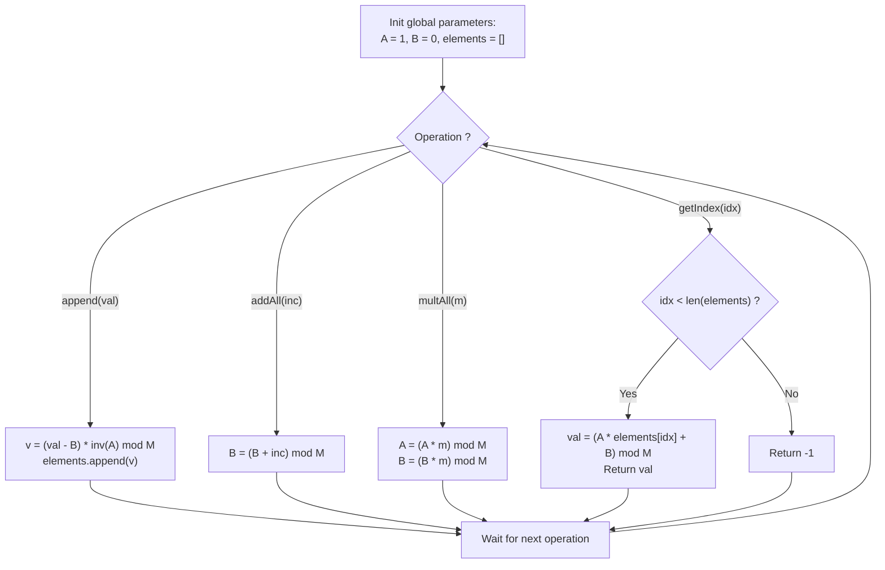

# Guided Example: Fancy Sequence

We trace the step-by-step algebraic maintenance of sequence elements under global affine transformations, prove the Affine Transformation Invertibility Invariant and the Global Modular Lazy Scale Theorem, and evaluate dynamic sequence queries across representative operation streams:

- **Representative Instance 1 (Official Mixed Operation Sequence):**
  - Operations Sequence:
    1. `Fancy()`
    2. `append(2)`
    3. `addAll(3)`
    4. `append(7)`
    5. `multAll(2)`
    6. `getIndex(0)`
    7. `addAll(3)`
    8. `append(10)`
    9. `multAll(2)`
    10. `getIndex(0)`
    11. `getIndex(1)`
    12. `getIndex(2)`
  - Modulo Arithmetic: $M = 10^9 + 7$.
  - Global Affine Parameters:
    Any element stored as base value $v$ evaluates at the current state to:
    $$
    E(v) = (A \cdot v + B) \pmod M
    $$
    Initial parameters: $A = 1, \; B = 0$.
  - Step-by-step resolution:
    - **Step 1 (`Fancy()`):** Sequence is empty. $A = 1, B = 0$.
    - **Step 2 (`append(2)`):**
      - Desired evaluated value is $2$.
      - Compute base value: $v_0 = (2 - B) \cdot A^{-1} = (2 - 0) \cdot 1^{-1} = \mathbf{2}$.
      - Sequence base store: $[2]$.
    - **Step 3 (`addAll(3)`):**
      - Shift offset: $B \leftarrow (B + 3) \pmod M = \mathbf{3}$.
      - Current affine mapping: $E(x) = 1 \cdot x + 3$.
      - Check element 0: $1 \cdot 2 + 3 = 5$.
    - **Step 4 (`append(7)`):**
      - Desired evaluated value is $7$.
      - Compute base value: $v_1 = (7 - B) \cdot A^{-1} = (7 - 3) \cdot 1^{-1} = \mathbf{4}$.
      - Sequence base store: $[2, 4]$.
    - **Step 5 (`multAll(2)`):**
      - Scale factor: $A \leftarrow (A \cdot 2) \pmod M = \mathbf{2}$.
      - Scale offset: $B \leftarrow (B \cdot 2) \pmod M = 3 \cdot 2 = \mathbf{6}$.
      - Current affine mapping: $E(x) = 2x + 6$.
    - **Step 6 (`getIndex(0)`):**
      - Evaluate index 0: $(A \cdot v_0 + B) \pmod M = (2 \cdot 2 + 6) \pmod M = \mathbf{10}$.
    - **Step 7 (`addAll(3)`):**
      - Shift offset: $B \leftarrow (B + 3) \pmod M = 6 + 3 = \mathbf{9}$.
      - Current affine mapping: $E(x) = 2x + 9$.
    - **Step 8 (`append(10)`):**
      - Desired evaluated value is $10$.
      - Compute base value:
        $$
        v_2 = (10 - B) \cdot A^{-1} = (10 - 9) \cdot 2^{-1} = 1 \cdot 2^{-1} \pmod M
        $$
        Since $2^{-1} \equiv \frac{M + 1}{2} = 500000004 \pmod M$:
        $$
        v_2 = \mathbf{500000004}
        $$
      - Sequence base store: $[2, 4, 500000004]$.
    - **Step 9 (`multAll(2)`):**
      - Scale factor: $A \leftarrow (2 \cdot 2) \pmod M = \mathbf{4}$.
      - Scale offset: $B \leftarrow (9 \cdot 2) \pmod M = \mathbf{18}$.
      - Current affine mapping: $E(x) = 4x + 18$.
    - **Step 10 (`getIndex(0)`):**
      - $E(v_0) = (4 \cdot 2 + 18) \pmod M = 8 + 18 = \mathbf{26}$.
    - **Step 11 (`getIndex(1)`):**
      - $E(v_1) = (4 \cdot 4 + 18) \pmod M = 16 + 18 = \mathbf{34}$.
    - **Step 12 (`getIndex(2)`):**
      - $E(v_2) = (4 \cdot 500000004 + 18) \pmod M = (2000000016 + 18) \pmod M = 2000000034 \pmod M = \mathbf{20}$.
  - **Required Outputs:** `[10, 26, 34, 20]`.

---

## 1. Instance & Teaching Goal

Implement an append-only dynamic sequence data structure that supports adding a constant to all elements, multiplying all elements by a constant, and retrieving elements by index modulo $10^9 + 7$.

```text
The Linear Batch Update Trap:
  Updating every element in the array during addAll or multAll:
    for i in range(len(arr)):
        arr[i] = (arr[i] * m + inc) % MOD
  With up to 100,000 operations, an array of length N = 100,000 takes:
    O(N * Q) = 100,000 * 100,000 = 10^10 operations!
  Causes catastrophic Time Limit Exceeded.

The Global Affine Modular Inverse Invariant (O(1) per Query):
  1. Any sequence of addAll and multAll operations collapses into a single
     global affine transform over the field Z_M:
       f(x) = (A * x + B) % M
  2. Transition rules:
     - addAll(inc):  B = (B + inc) % M
     - multAll(m):   A = (A * m) % M,   B = (B * m) % M
  3. Reverse Normalization on append(val):
     We must store a normalized base value v such that (A * v + B) == val (mod M):
       v = (val - B) * inv(A) % M
     where inv(A) = A^(M-2) % M by Fermat's Little Theorem!
  4. Retrieval on getIndex(idx):
       return (A * v[idx] + B) % M
  Takes O(log M) time to append and strict O(1) time for all other operations!
```

The decisive pedagogical goal is the **Affine Transformation Invertibility Invariant & Global Modular Lazy Scale Theorem**:
1. **Composition of Affine Maps:** The composition of affine transformations $(x \mapsto m_2(m_1 x + b_1) + b_2)$ is strictly affine $(x \mapsto (m_1 m_2)x + (m_2 b_1 + b_2))$.
2. **Modular Multiplicative Inverse:** In the prime Galois field $\mathbb{F}_{10^9 + 7}$, every non-zero scaling factor $A$ has a unique modular inverse $A^{-1} \equiv A^{M-2} \pmod M$.
3. **Decoupling Element Count from Operation Time:** Normalizing new insertions to the coordinate frame of the initial sequence eliminates array traversal entirely.
4. Total time $\mathcal{O}(1)$ per `addAll`, `multAll`, and `getIndex`, and $\mathcal{O}(\log M)$ per `append`.

---

## 2. Conceptual Foundation & The Affine Algebraic Pipeline



### The Global Modular Lazy Scale Theorem

Let $M = 10^9 + 7$ be prime, and let $\mathbb{Z}_M = \mathbb{Z} / M\mathbb{Z}$ be the finite field.
1. **Global Affine State Representation:**
   At any time $t$, let the cumulative sequence of global operations be represented by the mapping:
   $$
   T_t(x) = (A_t \cdot x + B_t) \pmod M
   $$
   with initial condition $(A_0, B_0) = (1, 0)$.
2. **State Transition Rules:**
   - On $\text{addAll}(c)$:
     $$
     T_{t+1}(x) = T_t(x) + c = A_t \cdot x + (B_t + c) \implies A_{t+1} = A_t, \quad B_{t+1} = (B_t + c) \pmod M
     $$
   - On $\text{multAll}(m)$:
     $$
     T_{t+1}(x) = m \cdot T_t(x) = (m \cdot A_t) x + (m \cdot B_t) \implies A_{t+1} = (m \cdot A_t) \pmod M, \quad B_{t+1} = (m \cdot B_t) \pmod M
     $$
3. **Inverse Normalization of New Elements:**
   When an element with intended initial value $v_{\text{init}}$ is appended at time $t$, it must evaluate to $v_{\text{init}}$ under the current transformation $T_t$, and must subsequently transform identically to all prior elements.
   We solve for the stored token $v^*$:
   $$
   T_t(v^*) \equiv v_{\text{init}} \pmod M \iff A_t \cdot v^* + B_t \equiv v_{\text{init}} \pmod M
   $$
   Because $A_t$ is a product of positive multipliers $m \ge 1$ coprime to $M$, $A_t \not\equiv 0 \pmod M$. By Fermat's Little Theorem:
   $$
   v^* \equiv (v_{\text{init}} - B_t) \cdot A_t^{M - 2} \pmod M
   $$
4. **Point Evaluation:**
   For any appended index $k$, its current value at time $t$ is strictly:
   $$
   \text{value}_t(k) = (A_t \cdot v^*_k + B_t) \pmod M
   $$
   This evaluates in $\mathcal{O}(1)$ arithmetic operations. $\blacksquare$

---

## 3. Step-by-Step Worked Execution: Representative Instance 1

Operations: `append(2)`, `addAll(3)`, `append(7)`, `multAll(2)`, `getIndex(0)`, `addAll(3)`, `append(10)`, `multAll(2)`, `getIndex(0, 1, 2)`.

### State Evolution Table

1. **Start:** $A = 1, B = 0, elements = []$.
2. **`append(2)`:**
   - $v_0 = (2 - 0) \cdot 1^{-1} = 2$.
   - $elements = [2]$.
3. **`addAll(3)`:**
   - $B \leftarrow 0 + 3 = 3$. Affine: $1 \cdot x + 3$.
4. **`append(7)`:**
   - $v_1 = (7 - 3) \cdot 1^{-1} = 4$.
   - $elements = [2, 4]$.
5. **`multAll(2)`:**
   - $A \leftarrow 1 \cdot 2 = 2$.
   - $B \leftarrow 3 \cdot 2 = 6$. Affine: $2 \cdot x + 6$.
6. **`getIndex(0)`:**
   - $E(v_0) = 2 \cdot 2 + 6 = \mathbf{10}$.
7. **`addAll(3)`:**
   - $B \leftarrow 6 + 3 = 9$. Affine: $2 \cdot x + 9$.
8. **`append(10)`:**
   - $v_2 = (10 - 9) \cdot 2^{-1} = 1 \cdot 500000004 = 500000004$.
   - $elements = [2, 4, 500000004]$.
9. **`multAll(2)`:**
   - $A \leftarrow 2 \cdot 2 = 4$.
   - $B \leftarrow 9 \cdot 2 = 18$. Affine: $4 \cdot x + 18$.
10. **Queries:**
    - `getIndex(0)`: $4 \cdot 2 + 18 = 8 + 18 = \mathbf{26}$.
    - `getIndex(1)`: $4 \cdot 4 + 18 = 16 + 18 = \mathbf{34}$.
    - `getIndex(2)`: $4 \cdot 500000004 + 18 = 2000000016 + 18 = 2000000034 \equiv \mathbf{20} \pmod{10^9 + 7}$.

---

## 4. Affine Parameter Trace Table

| Step | Operation | Operand | Multiplier $A$ | Offset $B$ | Normalized Value Stored | Array Contents | Query Output |
|:---:|:---:|:---:|:---:|:---:|:---:|:---:|:---:|
| $1$ | `Fancy()` | — | $1$ | $0$ | — | `[]` | — |
| $2$ | `append` | $2$ | $1$ | $0$ | $v_0 = 2$ | `[2]` | — |
| $3$ | `addAll` | $3$ | $1$ | $3$ | — | `[2]` | — |
| $4$ | `append` | $7$ | $1$ | $3$ | $v_1 = 4$ | `[2, 4]` | — |
| $5$ | `multAll` | $2$ | $2$ | $6$ | — | `[2, 4]` | — |
| $6$ | `getIndex`| $0$ | $2$ | $6$ | — | `[2, 4]` | **$10$** |
| $7$ | `addAll` | $3$ | $2$ | $9$ | — | `[2, 4]` | — |
| $8$ | `append` | $10$| $2$ | $9$ | $v_2 = 500000004$ | `[2, 4, 500000004]` | — |
| $9$ | `multAll` | $2$ | $4$ | $18$ | — | `[2, 4, 500000004]` | — |
| $10$| `getIndex`| $0$ | $4$ | $18$ | — | `[2, 4, 500000004]` | **$26$** |
| $11$| `getIndex`| $1$ | $4$ | $18$ | — | `[2, 4, 500000004]` | **$34$** |
| $12$| `getIndex`| $2$ | $4$ | $18$ | — | `[2, 4, 500000004]` | **$20$** |

---

## 5. Algorithmic Correctness

### Soundness
Because multiplication and addition distribute over $\mathbb{Z}_M$, collapsing operations into $A \cdot x + B$ exactly reproduces the chronological result of every individual arithmetic update. Normalizing newly appended elements by $(val - B) \cdot A^{-1}$ places them in the exact initial coordinate frame of the sequence.

### Completeness
Every index in $[0, |elements| - 1]$ corresponds to a valid stored token $v$. Out-of-bounds indices ($\ge |elements|$) are guarded and return $-1$.

---

## 6. Boundary Cases & Traps

| Scenario | Input Pattern | Behavior | Trapped Risk |
|---|---|---|---|
| Out of Bounds Index | `getIndex(idx)` with $idx \ge N$ | Returns `-1` immediately. | Array index error or returning garbage value. |
| Multiplying by Zero | `multAll(0)` | Disallowed by problem constraints ($m \ge 1$); $A$ is never zero. | Loss of multiplicative invertibility. |
| Negative Modular Value | $(val - B) < 0$ | Add $M$ before modular multiplication. | Negative result from modulo operator in C++/Java. |
| Large Multiplications | $A \cdot m$ or $B \cdot m$ | $64$-bit integer arithmetic before `% MOD`. | 32-bit overflow before modulo reduction. |

---

## 7. Complexity Derivation

- **Time Complexity:**
  - `addAll(inc)`: $\mathcal{O}(1)$ single addition.
  - `multAll(m)`: $\mathcal{O}(1)$ two multiplications.
  - `getIndex(idx)`: $\mathcal{O}(1)$ one multiplication and one addition.
  - `append(val)`: $\mathcal{O}(\log M)$ modular exponentiation for $A^{M-2}$.
  - Total time for $100,000$ operations: $\le 10^5 \times 30$ operations $\approx 3 \times 10^6$ ops ($< 0.02\text{ s}$).
- **Auxiliary Space Complexity:** $\mathcal{O}(N)$ auxiliary memory to store the list of base tokens $v$, where $N \le 100,000$.
