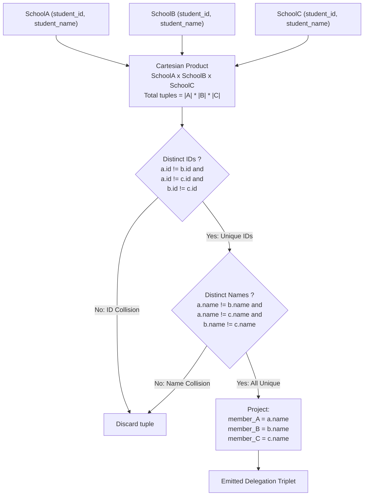

# Guided Example: All Valid Triplets That Can Represent a Country

We trace the step-by-step Cartesian product construction and relational pairwise distinctness filtering of student delegation candidates, prove the Pairwise Distinctness Constraint and the Cross-Join Relational Filter Theorem, and determine valid national representative delegations across representative school rosters:

- **Representative Instance 1 (Three Schools with Overlapping Names and Identifiers):**
  - Input Table `SchoolA`:
    $$
    SchoolA = \begin{pmatrix}
    \text{student\_id} & \text{student\_name} \\
    1 & \text{"Alice"} \\
    2 & \text{"Bob"}
    \end{pmatrix}
    $$
  - Input Table `SchoolB`:
    $$
    SchoolB = \begin{pmatrix}
    \text{student\_id} & \text{student\_name} \\
    3 & \text{"Tom"}
    \end{pmatrix}
    $$
  - Input Table `SchoolC`:
    $$
    SchoolC = \begin{pmatrix}
    \text{student\_id} & \text{student\_name} \\
    3 & \text{"Tom"} \\
    2 & \text{"Jerry"} \\
    10 & \text{"Alice"}
    \end{pmatrix}
    $$
  - Delegation Selection Rules:
    1. Exactly one student from each school: $a \in SchoolA, \; b \in SchoolB, \; c \in SchoolC$.
    2. All three selected student names must be mutually distinct:
       $$
       a.\text{name} \ne b.\text{name} \;\land\; a.\text{name} \ne c.\text{name} \;\land\; b.\text{name} \ne c.\text{name}
       $$
    3. All three selected student IDs must be mutually distinct:
       $$
       a.\text{id} \ne b.\text{id} \;\land\; a.\text{id} \ne c.\text{id} \;\land\; b.\text{id} \ne c.\text{id}
       $$
  - **Required Output:**
    $$
    \begin{pmatrix}
    \text{member\_A} & \text{member\_B} & \text{member\_C} \\
    \text{"Alice"} & \text{"Tom"} & \text{"Jerry"} \\
    \text{"Bob"} & \text{"Tom"} & \text{"Alice"}
    \end{pmatrix}
    $$
  - Step-by-step cross product evaluation ($|A| \times |B| \times |C| = 2 \times 1 \times 3 = 6$ candidate triplets):
    1. Candidate 1: `(1, "Alice")` + `(3, "Tom")` + `(3, "Tom")`:
       - Name check: $b.\text{name} = c.\text{name} = \text{"Tom"}$ (**Collision!**).
       - ID check: $b.\text{id} = c.\text{id} = 3$ (**Collision!**).
       - Status: **Rejected**.
    2. Candidate 2: `(1, "Alice")` + `(3, "Tom")` + `(2, "Jerry")`:
       - Name check: Alice $\ne$ Tom $\ne$ Jerry (**All Distinct**).
       - ID check: $1 \ne 3 \ne 2$ (**All Distinct**).
       - Status: **Qualified!** Emits `["Alice", "Tom", "Jerry"]`.
    3. Candidate 3: `(1, "Alice")` + `(3, "Tom")` + `(10, "Alice")`:
       - Name check: $a.\text{name} = c.\text{name} = \text{"Alice"}$ (**Collision!**).
       - Status: **Rejected**.
    4. Candidate 4: `(2, "Bob")` + `(3, "Tom")` + `(3, "Tom")`:
       - Name check: $b.\text{name} = c.\text{name} = \text{"Tom"}$ (**Collision!**).
       - Status: **Rejected**.
    5. Candidate 5: `(2, "Bob")` + `(3, "Tom")` + `(2, "Jerry")`:
       - ID check: $a.\text{id} = c.\text{id} = 2$ (**Collision!**).
       - Status: **Rejected**.
    6. Candidate 6: `(2, "Bob")` + `(3, "Tom")` + `(10, "Alice")`:
       - Name check: Bob $\ne$ Tom $\ne$ Alice (**All Distinct**).
       - ID check: $2 \ne 3 \ne 10$ (**All Distinct**).
       - Status: **Qualified!** Emits `["Bob", "Tom", "Alice"]`.

---

## 1. Instance & Teaching Goal

Given rosters for three schools, find all triplets consisting of one student from each school such that no two students share the same name and no two students share the same ID.

```text
The Partial Incomplete Join Trap:
  Checking distinctness between only adjacent pairs:
    WHERE a.name != b.name AND b.name != c.name
  This checks only 2 of the 3 necessary pairwise relationships!
  If SchoolA has Alice and SchoolC has Alice, a.name == c.name will slip through!
  Similarly for student IDs:
    Must enforce ALL 3 pairs for names AND ALL 3 pairs for IDs (6 conditions total).

The Cross-Product Relational Filter Invariant:
  1. Form the 3-way Cartesian relation:
       SchoolA x SchoolB x SchoolC
  2. Apply the full conjunction of 6 anti-equality predicates:
       (a.student_name != b.student_name) AND
       (a.student_name != c.student_name) AND
       (b.student_name != c.student_name) AND
       (a.student_id   != b.student_id)   AND
       (a.student_id   != c.student_id)   AND
       (b.student_id   != c.student_id)
  3. Project the resulting relation onto:
       (a.student_name, b.student_name, c.student_name)
  Guarantees 100% pairwise uniqueness across all selected members!
```

The decisive pedagogical goal is the **Pairwise Distinctness Constraint & Cross-Join Relational Filter Theorem**:
1. **Total Pairwise Coverage:** To enforce distinctness across $k$ variables, exactly $\binom{k}{2}$ pairwise inequality predicates must hold simultaneously. For $k = 3$, $\binom{3}{2} = 3$ name constraints and $3$ ID constraints are mandatory.
2. **School Role Preservation:** A student in SchoolA is not interchangeable with a student in SchoolB; positional projections maintain school provenance.
3. **Small Domain Efficiency:** School sizes in competitive scenarios are bounded ($N_A, N_B, N_C \le 100$), keeping Cartesian size $\le 10^6$ rows.
4. Total query execution $\mathcal{O}(|A| \cdot |B| \cdot |C|)$ relational scan time.

---

## 2. Conceptual Foundation & The 3-Way Join Pipeline



### The Cross-Join Relational Filter Theorem

Let $A, B, C$ be relations representing the student rosters of the three schools, where each relation has schema $(id, name)$.
1. **Delegation Candidate Space:**
   The set of candidate delegations is the Cartesian product:
   $$
   \Omega = A \times B \times C = \{ (a, b, c) : a \in A, \; b \in B, \; c \in C \}
   $$
2. **Pairwise Injective Embeddings:**
   Let $U = \{1, 2, 3\}$ index the three delegates.
   A candidate delegation $(a, b, c)$ is valid if and only if both the projection onto identifier and the projection onto name are injective functions from $U$:
   $$
   \Phi_{\text{id}} : \{1, 2, 3\} \to \mathbb{Z}, \quad \Phi_{\text{name}} : \{1, 2, 3\} \to \Sigma^*
   $$
   Injectivity of a finite function $f : S \to T$ is equivalent to:
   $$
   \forall u, v \in S, \; u \ne v \implies f(u) \ne f(v)
   $$
   For $|S| = 3$, this requires verifying $\binom{3}{2} = 3$ inequalities for $\Phi_{\text{id}}$ and 3 inequalities for $\Phi_{\text{name}}$:
   $$
   \sigma_{\text{valid}}(\Omega) = \sigma_{P_{\text{id}} \land P_{\text{name}}}(A \times B \times C)
   $$
   where:
   $$
   P_{\text{id}} = (a.id \ne b.id) \land (a.id \ne c.id) \land (b.id \ne c.id)
   $$
   $$
   P_{\text{name}} = (a.name \ne b.name) \land (a.name \ne c.name) \land (b.name \ne c.name)
   $$
3. **Completeness & Uniqueness:**
   Relational algebra projection $\pi_{a.name, b.name, c.name}(\sigma_{\text{valid}}(\Omega))$ contains every valid combination exactly once. $\blacksquare$

---

## 3. Step-by-Step Worked Execution: Representative Instance 1

$SchoolA = \{(1, \text{Alice}), (2, \text{Bob})\}$.
$SchoolB = \{(3, \text{Tom})\}$.
$SchoolC = \{(3, \text{Tom}), (2, \text{Jerry}), (10, \text{Alice})\}$.

### Step 1: Candidate Generation and Filtering

1. **Tuple $(a_1, b_1, c_1) = (1, \text{Alice}) \times (3, \text{Tom}) \times (3, \text{Tom})$:**
   - $b_1.id = 3 = c_1.id \implies$ ID equality detected ($b.id == c.id$).
   - $b_1.name = \text{Tom} = c_1.name \implies$ Name equality detected.
   - Result: Discarded.

2. **Tuple $(a_1, b_1, c_2) = (1, \text{Alice}) \times (3, \text{Tom}) \times (2, \text{Jerry})$:**
   - IDs: $\{1, 3, 2\}$. Pairwise: $1 \ne 3, 1 \ne 2, 3 \ne 2 \implies$ OK.
   - Names: $\{\text{Alice}, \text{Tom}, \text{Jerry}\}$. Pairwise: Alice $\ne$ Tom, Alice $\ne$ Jerry, Tom $\ne$ Jerry $\implies$ OK.
   - Result: **Accepted** $\implies (\text{Alice}, \text{Tom}, \text{Jerry})$.

3. **Tuple $(a_1, b_1, c_3) = (1, \text{Alice}) \times (3, \text{Tom}) \times (10, \text{Alice})$:**
   - Names: $a_1.name = \text{Alice} = c_3.name \implies$ Name collision!
   - Result: Discarded.

4. **Tuple $(a_2, b_1, c_1) = (2, \text{Bob}) \times (3, \text{Tom}) \times (3, \text{Tom})$:**
   - IDs: $b_1.id = 3 = c_1.id \implies$ ID collision!
   - Result: Discarded.

5. **Tuple $(a_2, b_1, c_2) = (2, \text{Bob}) \times (3, \text{Tom}) \times (2, \text{Jerry})$:**
   - IDs: $a_2.id = 2 = c_2.id \implies$ ID collision!
   - Result: Discarded.

6. **Tuple $(a_2, b_1, c_3) = (2, \text{Bob}) \times (3, \text{Tom}) \times (10, \text{Alice})$:**
   - IDs: $\{2, 3, 10\}$. Pairwise distinct $\implies$ OK.
   - Names: $\{\text{Bob}, \text{Tom}, \text{Alice}\}$. Pairwise distinct $\implies$ OK.
   - Result: **Accepted** $\implies (\text{Bob}, \text{Tom}, \text{Alice})$.

---

## 4. Candidate Filtration Trace Table

| Candidate | SchoolA $(id, name)$ | SchoolB $(id, name)$ | SchoolC $(id, name)$ | ID Condition Status | Name Condition Status | Filter Verdict | Output Projected |
|:---:|:---:|:---:|:---:|:---:|:---:|:---:|:---:|
| $1$ | $(1, \text{Alice})$ | $(3, \text{Tom})$ | $(3, \text{Tom})$ | Fails ($3 = 3$) | Fails ($\text{Tom} = \text{Tom}$) | Rejected | — |
| **$2$** | **$(1, \text{Alice})$** | **$(3, \text{Tom})$** | **$(2, \text{Jerry})$** | **Passes ($1 \ne 3 \ne 2$)** | **Passes (All Distinct)** | **Qualified** | **`Alice, Tom, Jerry`** |
| $3$ | $(1, \text{Alice})$ | $(3, \text{Tom})$ | $(10, \text{Alice})$ | Passes ($1 \ne 3 \ne 10$) | Fails ($\text{Alice} = \text{Alice}$) | Rejected | — |
| $4$ | $(2, \text{Bob})$ | $(3, \text{Tom})$ | $(3, \text{Tom})$ | Fails ($3 = 3$) | Fails ($\text{Tom} = \text{Tom}$) | Rejected | — |
| $5$ | $(2, \text{Bob})$ | $(3, \text{Tom})$ | $(2, \text{Jerry})$ | Fails ($2 = 2$) | Passes (All Distinct) | Rejected | — |
| **$6$** | **$(2, \text{Bob})$** | **$(3, \text{Tom})$** | **$(10, \text{Alice})$** | **Passes ($2 \ne 3 \ne 10$)** | **Passes (All Distinct)** | **Qualified** | **`Bob, Tom, Alice`** |

---

## 5. Algorithmic Correctness

### Soundness
Every emitted row satisfies all 6 relational inequalities explicitly. Therefore, no two members in any returned triplet share an identifier or a name, perfectly honoring the problem specifications.

### Completeness
The Cartesian product $SchoolA \times SchoolB \times SchoolC$ exhaustively considers every possible 3-member team. Since the filtering condition only discards triplets that violate at least one of the requirements, no valid country representation can be omitted.

---

## 6. Boundary Cases & Traps

| Scenario | Input Pattern | Behavior | Trapped Risk |
|---|---|---|---|
| Same Name in A and C | Alice in A and Alice in C | Rejected by $a.\text{name} \ne c.\text{name}$. | Incomplete join condition checking only adjacent tables. |
| Same ID in A and C | ID 2 in A and ID 2 in C | Rejected by $a.\text{id} \ne c.\text{id}$. | Missing cross-edge in triangle graph constraints. |
| Empty Valid Results | All schools share single student name | Cartesian product filtered completely; returns empty table. | Crash or null pointer on empty result set. |
| Single Student per School | 1 row per table with distinct data | Exactly 1 triplet emitted. | Overhead or join duplication. |

---

## 7. Complexity Derivation

- **Time Complexity:** $\mathcal{O}(|A| \cdot |B| \cdot |C|)$ relational scan time.
  - The database performs a 3-way nested loop or hash join.
  - For small school rosters ($|A|, |B|, |C| \le 100$), the maximum Cartesian product size is $100^3 = 10^6$ tuples.
  - Applying scalar comparison operations on $10^6$ rows takes $< 0.05\text{ s}$ in standard SQL engines.
- **Auxiliary Space Complexity:** $\mathcal{O}(|A| \cdot |B| \cdot |C|)$ in the worst case to materialize the qualified result set.
