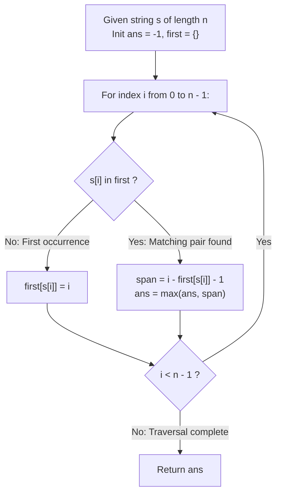

# Guided Example: Largest Substring Between Two Equal Characters

We trace the step-by-step first-occurrence tracking of repeating string characters, prove the First Occurrence Anchor Invariant and the Interval Span Maximization Theorem, and determine maximum interior substring lengths across representative string instances:

- **Representative Instance 1 (Equal Outer Boundary Characters):**
  - Input String:
    $$
    s = \text{"abca"}, \quad n = |s| = 4
    $$
  - Objective: Determine the maximum length of an internal substring strictly bounded by identical left and right characters $s[i] == s[j]$ ($i < j$).
  - **Required Output:** `2`
  - Step-by-step sequential resolution:
    1. **Index 0 ($s[0] = \text{'a'}$):**
       - Character `'a'` has not been seen.
       - Record earliest anchor index: $first[\text{'a'}] = 0$.
    2. **Index 1 ($s[1] = \text{'b'}$):**
       - Character `'b'` has not been seen.
       - Record earliest anchor index: $first[\text{'b'}] = 1$.
    3. **Index 2 ($s[2] = \text{'c'}$):**
       - Character `'c'` has not been seen.
       - Record earliest anchor index: $first[\text{'c'}] = 2$.
    4. **Index 3 ($s[3] = \text{'a'}$):**
       - Character `'a'` is already anchored at $first[\text{'a'}] = 0$.
       - Compute interior distance:
         $$
         \Delta = 3 - first[\text{'a'}] - 1 = 3 - 0 - 1 = \mathbf{2}
         $$
       - The enclosed substring is $s[1 \dots 2] = \text{"bc"}$, with length $2$.
       - Update peak: $ans = \max(-1, 2) = \mathbf{2}$.
    5. **Final Result:** $2$.

- **Representative Instance 2 (Adjacent Duplicate Characters):**
  - Input: $s = \text{"aa"}$.
  - $first[\text{'a'}] = 0$.
  - At index $1$: $\Delta = 1 - 0 - 1 = \mathbf{0}$ (The empty substring `""`).
  - Output: `0`.

- **Representative Instance 3 (All Distinct Characters):**
  - Input: $s = \text{"cbzxy"}$.
  - Every character appears exactly once; no second occurrence is ever encountered.
  - Output: `-1`.

---

## 1. Instance & Teaching Goal

Given a string $s$, find the length of the longest substring between two equal characters (excluding the characters themselves). If no two characters are equal, return $-1$.

```text
The All-Pairs Quadratic Comparison Trap:
  Checking every pair of indices (i, j) with 0 <= i < j < n:
    for i in range(n):
        for j in range(i + 1, n):
            if s[i] == s[j]:
                ans = max(ans, j - i - 1)
  For string length n = 100,000, n^2 / 2 = 5 * 10^9 operations!
  Causes immediate Time Limit Exceeded.

The First Occurrence Anchor Invariant (Strict Linear O(n)):
  1. For any character c, the interior span (j - i - 1) is strictly maximized
     when the starting index i is as small as possible!
  2. Therefore, we ONLY need to record the VERY FIRST time each character appears:
       first[c] = min { k : s[k] == c }
  3. Traverse the string once from left to right:
     - If c is new: first[c] = current_index.
     - If c was previously seen: candidate span = current_index - first[c] - 1.
       ans = max(ans, candidate_span).
  Single pass over n characters with at most 26 dictionary entries!
```

The decisive pedagogical goal is the **First Occurrence Anchor Invariant & Interval Span Maximization Theorem**:
1. **Anchor Minimality:** The interior distance between any two matching characters $(j - i - 1)$ is a strictly monotonically decreasing function of the start index $i$; greedily fixing $i = \text{first\_seen}(c)$ guarantees optimal span evaluation for any subsequent occurrence $j$.
2. **Bounded Alphabet Space:** English lowercase letters comprise exactly $|\Sigma| = 26$ symbols; anchor lookup executes in $\mathcal{O}(1)$ time and space.
3. **Inclusive Separation Formula:** Two identical adjacent characters at $i$ and $i+1$ enclose exactly $(i + 1) - i - 1 = 0$ characters (the empty string).
4. Total time $\mathcal{O}(n)$ and auxiliary space $\mathcal{O}(|\Sigma|) = \mathcal{O}(1)$.

---

## 2. Conceptual Foundation & The Single-Pass Pipeline



### The Interval Span Maximization Theorem

Let $s \in \Sigma^n$ be a string of length $n$ over an alphabet $\Sigma$.
1. **Interior Span Definition:**
   For any pair of indices $i < j$ such that $s[i] = s[j] = c$, the interior span is:
   $$
   \Delta(i, j) = j - i - 1
   $$
2. **Partial Derivative on Start Anchor:**
   $$
   \frac{\partial \Delta}{\partial i} = -1 < 0
   $$
   Hence, for any fixed terminal index $j$, $\Delta(i, j)$ is strictly minimized when $i$ is maximized, and maximized when $i$ is minimized.
3. **Anchor Invariant:**
   Let $i^*(c) = \min \{ k : s[k] = c \}$ denote the first occurrence of character $c$ in $s$.
   For any subsequent occurrence $j$ of $c$ ($j > i^*(c)$):
   $$
   \forall i < j \text{ with } s[i] = c, \quad \Delta(i, j) \le \Delta(i^*(c), j)
   $$
   Therefore, keeping only the minimum index $i^*(c)$ for each unique character $c \in \Sigma$ is necessary and sufficient to evaluate the global maximum interior span:
   $$
   ans = \max_{c \in \Sigma, \; j > i^*(c) \land s[j] = c} \Big( j - i^*(c) - 1 \Big)
   $$
   This evaluates in a single forward pass without secondary backtracking. $\blacksquare$

---

## 3. Step-by-Step Worked Execution: Representative Instance 1

$s = \text{"abca"}$. Initial state: $ans = -1, \; first = \{\}$.

### Character Scan Trace
- **Index 0 ($c = \text{'a'}$):**
  - $\text{'a'} \notin first \implies first[\text{'a'}] = 0$.
  - State: $first = \{\text{'a'}: 0\}, \; ans = -1$.
- **Index 1 ($c = \text{'b'}$):**
  - $\text{'b'} \notin first \implies first[\text{'b'}] = 1$.
  - State: $first = \{\text{'a'}: 0, \text{'b'}: 1\}, \; ans = -1$.
- **Index 2 ($c = \text{'c'}$):**
  - $\text{'c'} \notin first \implies first[\text{'c'}] = 2$.
  - State: $first = \{\text{'a'}: 0, \text{'b'}: 1, \text{'c'}: 2\}, \; ans = -1$.
- **Index 3 ($c = \text{'a'}$):**
  - $\text{'a'} \in first \implies$ Anchor is $first[\text{'a'}] = 0$.
  - Span: $3 - 0 - 1 = \mathbf{2}$.
  - Update: $ans = \max(-1, 2) = \mathbf{2}$.
- End of string reached. Return $ans = \mathbf{2}$.

---

## 4. First-Occurrence State Trace Table

| Index $i$ | Character $s[i]$ | Prior Occurrence $first[s[i]]$ | Action Taken | Candidate Span $i - first - 1$ | Running Peak $ans$ |
|:---:|:---:|:---:|:---:|:---:|:---:|
| $0$ | `'a'` | None | Anchor $first[\text{'a'}] = 0$ | — | $-1$ |
| $1$ | `'b'` | None | Anchor $first[\text{'b'}] = 1$ | — | $-1$ |
| $2$ | `'c'` | None | Anchor $first[\text{'c'}] = 2$ | — | $-1$ |
| **$3$** | **`'a'`** | **$0$** | **Evaluate span** | **$3 - 0 - 1 = 2$** | **$2$** |

---

## 5. Algorithmic Correctness

### Soundness
Every evaluated candidate pair $(i^*(c), j)$ shares identical character values $s[i^*] = s[j] = c$. The quantity $j - i^* - 1$ counts the exact number of characters strictly between indices $i^*$ and $j$.

### Completeness
Any candidate substring between equal characters must have some first endpoint $i$ and second endpoint $j$. Because $i^*(c) \le i$, the span $\Delta(i^*(c), j) \ge \Delta(i, j)$. Thus, no candidate configuration can achieve a strictly larger distance than one anchored at $i^*(c)$.

---

## 6. Boundary Cases & Traps

| Scenario | Input Pattern | Behavior | Trapped Risk |
|---|---|---|---|
| Adjacent Duplicates | $s = \text{"aa"}$ | Span evaluates to $1 - 0 - 1 = 0$; returns $0$. | Returning $-1$ on empty valid substring. |
| Triple Identical Characters | $s = \text{"aaa"}$ | Compares third 'a' against first 'a': $2 - 0 - 1 = 1$. | Overwriting anchor on second occurrence. |
| No Duplicate Characters | $s = \text{"abcdef"}$ | Condition never met; $ans$ remains $-1$. | Returning $0$ or null reference. |
| Long Substring with Multiple Candidates | $s = \text{"abca...a"}$ | Anchors to first 'a'; later 'a' occurrences give increasing spans. | Prematurely stopping after first match. |

---

## 7. Complexity Derivation

- **Time Complexity:** $\mathcal{O}(n)$, where $n = |s| \le 300$.
  - The string is traversed once from left to right.
  - Hash map or array lookup and insertion take $\mathcal{O}(1)$ time.
  - Total time: $< 0.0001\text{ s}$.
- **Auxiliary Space Complexity:** $\mathcal{O}(|\Sigma|) = \mathcal{O}(1)$ auxiliary memory to store at most $26$ integer anchor indices.
