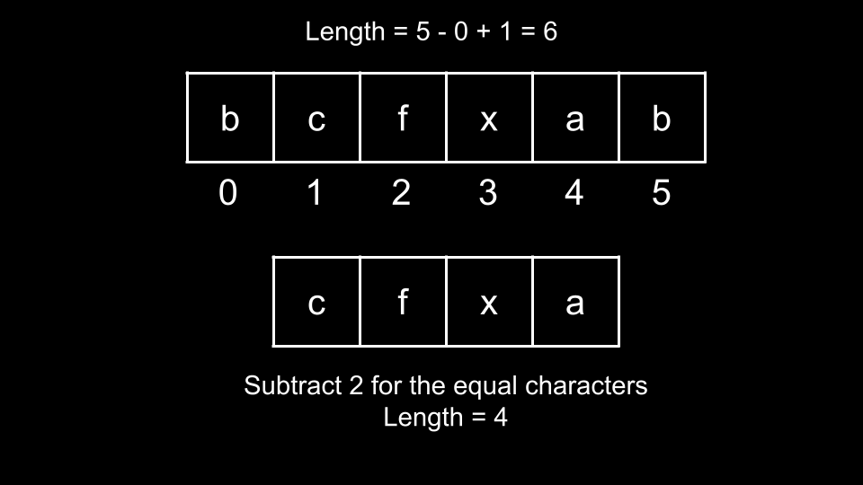
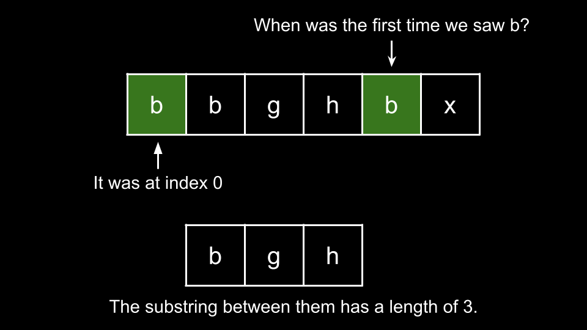

[TOC]

## Solution

---

### Approach 1: Brute Force

**Intuition**

For our first approach, we will check every substring of `s` to see if the first and last characters are equal. If they are, we will calculate the length of the substring between the first and last characters, and update the answer with it if it is larger.

A substring can be defined by two integers: its `left` bound and its `right` bound. Here, `left` represents the index of the first character and `right` represents the index of the last character.

We can iterate `left` over each index of `s`. For each value of `left`, we consider all substrings that start at `left` by iterating `right` over the indices of `s`, starting from $left + 1$. For example, if the length of `s` is `8` and we are currently considering $left = 4$, then we iterate `right` over the indices `5, 6, 7`. Each iteration represents the substring of `s` that starts at index `left` and ends at index `5, 6, 7` respectively.

If we find that $s[left] = s[right]$, we can consider the substring between `left, right` for our answer. What is the length of the substring between `left, right`?


<br>

Normally, the length of a substring defined by `left, right` would be $right - left + 1$. However, we are not considering $s[left]$ or $s[right]$. Thus, we need to subtract `2`. Therefore, we would update our answer with $right - left - 1$ if it is larger.

**Algorithm**

1. Initialize the answer $ans = -1$.
2. Iterate `left` over the indices of `s`:
- Iterate `right` over the indices of `s`, starting from $left + 1$:
- If $s[left] = s[right]$:
- Update `ans` with $right - left - 1$ if it is larger.
3. Return `ans`.

**Implementation**

```python
class Solution:
    def maxLengthBetweenEqualCharacters(self, s: str) -> int:
        ans = -1

        for left in range(len(s)):
            for right in range(left + 1, len(s)):
                if s[left] == s[right]:
                    ans = max(ans, right - left - 1)

        return ans
```

**Complexity Analysis**

Given $n$ as the length of `s`,

* Time complexity: $O(n^2)$

    We have a nested for loop over the indices of `s`.

    For $left = 0$, we have $n - 1$ iterations of `right`. For $left = 1$, we have $n - 2$ iterations of `right`. For $left = 2$, we have $n - 3$ iterations of `right`, and so on.

    Thus, in total we have $1 + 2 + 3 + ... + n - 1$ iterations of `right`. This is the partial sum of [this series](https://en.wikipedia.org/wiki/1_%2B_2_%2B_3_%2B_4_%2B_%E2%8B%AF#Partial_sums), for $n - 1$, which is equal to $\frac{n \cdot (n - 1)}{2} = O(n^2)$.

* Space complexity: $O(1)$

    We aren't using any extra space.

<br/>

---

### Approach 2: Hash Map

**Intuition**

We can solve the problem more efficiently. As we talked about in the previous approach, a substring can be described by its bounds `left, right`.

In this approach, we will consider each index `i` as the **right bound** for a substring. For a given `i`, we are interested in a `left` bound such that $s[left] = s[i]$. Note that there may be many indices that meet this criteria.

For example, let's say we had `s = "abaacda"` and we currently had $i = 6$ at the final index. We are considering substrings that have a `right` bound of `6` and are interested in finding a `left` bound such that $s[left] = 'a'$, since $s[6] = 'a'$. There are three indices: `0, 2, 3` that all represent the character `'a'`. Which one should we choose?

Since the problem is asking for the maximum length, we would choose the `left` bound with the lowest value, to maximize the distance between the bounds. Thus, we would choose $left = 0$ here.

In general, for a given `i` as the right bound, we are interested in the first index where $s[i]$ occurred. We can use a hash map `firstIndex` to record this.


<br>

We iterate `i` over the indices of `s`. For each `i`, we first check if $s[i]$ is in `firstIndex`. If it is, it means that the first character equal to $s[i]$ is at $firstIndex[s[i]]$, and the substring has a length of $i - firstIndex[s[i]] - 1$. Therefore, we update the answer with $i - firstIndex[s[i]] - 1$ if it is larger. Otherwise, this is the first time we encounter character $s[i]$, thus we set $firstIndex[s[i]] = i$.

You may be thinking: won't we be skipping a lot of valid substrings? The answer is yes, but it's OK, because the only substrings that we skip are those that could not possibly be the answer. If we are treating `i` as the right boundary, we only consider the leftmost occurrence of $s[i]$ as the left boundary because any other occurrence would result in a shorter substring.

**Algorithm**

1. Initialize a hash map `firstIndex` and the answer $ans = -1$.
2. Iterate `i` over the indices of `s`:
- If $s[i]$ is in `firstIndex`:
- Update `ans` with $i - firstIndex[s[i]] - 1$ if it is larger.
- Otherwise, set $firstIndex[s[i]] = i$.
3. Return `ans`.

**Implementation**

```python
class Solution:
    def maxLengthBetweenEqualCharacters(self, s: str) -> int:
        first_index = {}
        ans = -1

        for i in range(len(s)):
            if s[i] in first_index:
                ans = max(ans, i - first_index[s[i]] - 1)
            else:
                first_index[s[i]] = i

        return ans
```

**Complexity Analysis**

Given $n$ as the length of `s`,

* Time complexity: $O(n)$

    We iterate over each character of `s` once, performing $O(1)$ work at each iteration. With a hash map, checking if an element $s[i]$ exists costs $O(1)$.

* Space complexity: $O(1)$

    Although we are using the hash map `firstIndex`, the input consists of only lowercase English letters. Thus, the size of `firstIndex` can never exceed `26`.

<br/>

---