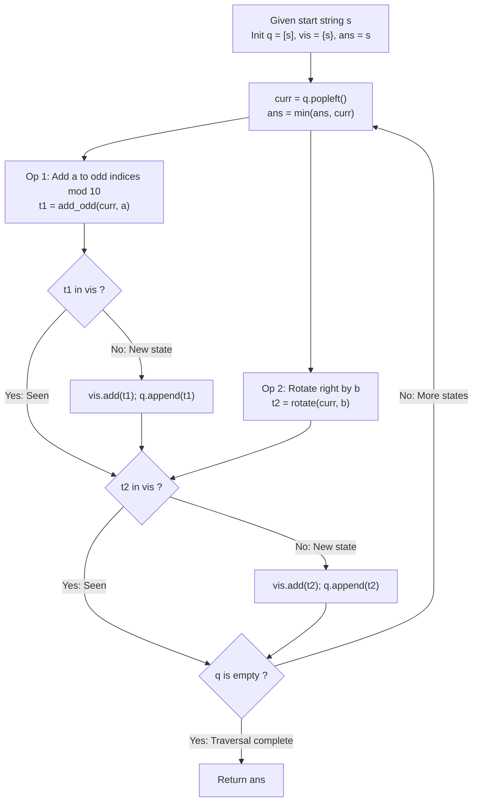

# Guided Example: Lexicographically Smallest String After Applying Operations

We trace the step-by-step state-space graph exploration of cyclic rotations and modular digit transformations, prove the State-Space Closure Invariant and the Parity-Dependent Orbit Reachability Theorem, and determine the lexicographically minimal string across representative parity configurations:

- **Representative Instance 1 (Even Rotation with Preserved Parity Partitions):**
  - Input Parameters:
    $$
    s = \text{"5525"}, \quad a = 9, \quad b = 2, \quad n = |s| = 4
    $$
  - Available Operations:
    1. **Add $a$:** Add $9 \pmod{10}$ to all digits at odd indices ($i \in \{1, 3\}$).
    2. **Rotate $b$:** Right-rotate the string by $2$ positions: $s[-2:] + s[:-2]$.
  - **Required Output:** `"2050"`
  - Parity Analysis:
    - The rotation stride $b = 2$ is even.
    - Since $n = 4$ and $b = 2$ are both even, right-rotating by $2$ maps index $i$ to $(i + 2) \pmod 4$:
      - Even indices stay even: $0 \to 2, \; 2 \to 0$.
      - Odd indices stay odd: $1 \to 3, \; 3 \to 1$.
    - Because even indices never rotate into odd positions, the digits at original even indices ($\{s[0]=5, s[2]=2\}$) **can never receive addition of $a$**!
  - Step-by-step resolution:
    1. **Rotational Orbits:**
       - Stride $b = 2$ generates exactly $n / \gcd(n, b) = 4 / \gcd(4, 2) = 2$ distinct rotation frames:
         - Frame 0 (Shift 0): `"5525"` (Leading digit is $5$).
         - Frame 1 (Shift 2): `"2555"` (Leading digit is $2$).
    2. **Minimizing Leading Digit:**
       - Frame 1 begins with $'2'$, which is strictly smaller than $'5'$. We prioritize Frame 1: `"2555"`.
    3. **Optimizing Odd Indices in Frame 1 (`"2555"`):**
       - Active odd indices are index $1$ (char `'5'`) and index $3$ (char `'5'`).
       - Repeatedly add $a = 9 \pmod{10}$:
         - Initial: $5$
         - 1 add: $(5 + 9) \pmod{10} = 4$
         - 2 adds: $(4 + 9) \pmod{10} = 3$
         - 3 adds: $(3 + 9) \pmod{10} = 2$
         - 4 adds: $(2 + 9) \pmod{10} = 1$
         - 5 adds: $(1 + 9) \pmod{10} = \mathbf{0}$
       - Both odd indices become $'0'$.
       - String becomes: $\mathbf{\text{"2050"}}$.
    4. **Global Lexicographical Check:**
       - Comparing `"2050"` with all reachable configurations in Frame 0 (minimum `"5020"`):
         $$
         \text{"2050"} < \text{"5020"} \implies \mathbf{\text{"2050"}}
         $$

- **Representative Instance 2 (Odd Rotation Enabling Full Parity Modification):**
  - Input: $s = \text{"74"}, \; a = 5, \; b = 1$.
  - Because $b = 1$ is odd, rotating by $1$ shifts even index $0$ into odd index $1$.
  - Both positions can be independently shifted by multiples of $5 \pmod{10}$.
  - State trace: `"74"` $\to$ `"47"` $\to$ `"42"` $\to$ `"24"`.
  - Output: `"24"`.

- **Representative Instance 3 (Already Optimal String):**
  - Input: $s = \text{"0011"}, \; a = 4, \; b = 2$.
  - Initial string `"0011"` is already the global minimum across the reachable orbit.
  - Output: `"0011"`.

---

## 1. Instance & Teaching Goal

Given a string $s$ of even length $n$ and integers $a$ and $b$, find the lexicographically smallest string reachable by repeatedly adding $a$ to odd indices and rotating by $b$.

```text
The Unbounded Search Space Fallacy:
  Treating the state space as arbitrarily large or infinite:
    Operations can be applied in an infinite sequence of combinations.
  However, both rotation and digit addition are cyclic finite groups!
    - Rotations form a cyclic permutation group of order at most n <= 100.
    - Additions mod 10 form a cyclic subgroup of Z_10 of order at most 10.
    - If b is even: total reachable states <= 10 * n <= 1,000.
    - If b is odd: total reachable states <= 10 * 10 * n <= 10,000.

The Breadth-First State Closure Invariant (Strict O(n * |S|)):
  1. Initialize a queue q = [s], visited set vis = {s}, and ans = s.
  2. While q is non-empty, pop state curr:
     - ans = min(ans, curr)
     - Generate neighbor 1 (Add): Add a to odd indices of curr.
     - Generate neighbor 2 (Rotate): Right-rotate curr by b.
     - For each neighbor not in vis:
         vis.add(neighbor)
         q.append(neighbor)
  Explores the entire finite connected component in at most 10,000 visits!
```

The decisive pedagogical goal is the **State-Space Closure Invariant & Parity-Dependent Orbit Reachability Theorem**:
1. **Parity Preservation vs Inversion:** Even strides preserve coordinate parity ($i \pmod 2 \equiv (i + b) \pmod 2$), locking original even indices from ever receiving additions; odd strides alternate parities, granting independent modular addition to both sets.
2. **Finite Group Closure:** The Cartesian product of rotation cycles and modular arithmetic cycles forms a compact finite graph.
3. **Exhaustive BFS Discovery:** Standard graph search guarantees encountering the exact lexicographical minimum without heuristic guessing.
4. Total time $\mathcal{O}(n \cdot |\mathcal{S}|)$ and auxiliary space $\mathcal{O}(n \cdot |\mathcal{S}|)$, where $|\mathcal{S}| \le 10,000$.

---

## 2. Conceptual Foundation & The Transition Graph



### The Parity-Dependent Orbit Reachability Theorem

Let $s \in \{0, \dots, 9\}^n$ be a string of even length $n$, and let $a, b \in \mathbb{Z}^+$.
1. **Rotational Permutation Subgroup:**
   The rotation operator $R_b : s \mapsto s[-b:] + s[:-b]$ generates a cyclic subgroup of order:
   $$
   |\langle R_b \rangle| = \frac{n}{\gcd(n, b)} \le n
   $$
2. **Parity Permutation Action:**
   For any index $i \in \{0, \dots, n-1\}$, its position after one rotation is $i' \equiv (i + b) \pmod n$.
   - **Case 1 ($b$ is even):** $i' \equiv i + b \equiv i \pmod 2$.
     The parity of every index is invariant under $R_b$. Because additions are restricted to odd indices, digits initially at even indices can **never** occupy odd positions and therefore never change their value.
     The reachable state space is bounded by:
     $$
     |\mathcal{S}_{\text{even}}| \le \frac{n}{\gcd(n, b)} \times \frac{10}{\gcd(10, a)} \le 10n
     $$
   - **Case 2 ($b$ is odd):** $i' \equiv i + 1 \pmod 2$.
     Every rotation toggles parity. Original even indices can be rotated into odd positions, modified by $a$, and rotated back. Both index classes can be modified independently:
     $$
     |\mathcal{S}_{\text{odd}}| \le \frac{n}{\gcd(n, b)} \times \left( \frac{10}{\gcd(10, a)} \right)^2 \le 100n
     $$
3. **Graph Connectedness and BFS Optimality:**
   Because all operations are invertible in finite cyclic groups, the state transition graph consists of connected components. Starting from $s$, BFS explores the exact reachability orbit $\mathcal{O}(s)$ and identifies $\min_{\text{lex}} \mathcal{O}(s)$. $\blacksquare$

---

## 3. Step-by-Step Worked Execution: Representative Instance 1

$s = \text{"5525"}, \; a = 9, \; b = 2$.
$n = 4$ (even), $b = 2$ (even).

### Transition Trace Sample

1. **Root State $s_0 = \text{"5525"}$:**
   - $vis = \{\text{"5525"}\}, \; ans = \text{"5525"}$.
   - Add $9$ to odd indices $\{1, 3\}$:
     - $s[1] = (5 + 9) \pmod{10} = 4$.
     - $s[3] = (5 + 9) \pmod{10} = 4$.
     - Neighbor $t_1 = \text{"5424"}$.
   - Rotate right by $2$:
     - $s[-2:] = \text{"25"}$, $s[:-2] = \text{"55"}$.
     - Neighbor $t_2 = \text{"2555"}$.
   - Enqueue $t_1 = \text{"5424"}$ and $t_2 = \text{"2555"}$.

2. **Evaluate State $t_2 = \text{"2555"}$:**
   - $\text{"2555"} < \text{"5525"} \implies ans \leftarrow \text{"2555"}$.
   - Add $9$ to odd indices $\{1, 3\}$ of `"2555"`:
     - Index $1$: $(5 + 9) \pmod{10} = 4$.
     - Index $3$: $(5 + 9) \pmod{10} = 4$.
     - Yields $\text{"2454"}$. Enqueued.
     - Next addition yields $\text{"2353"}$, then $\text{"2252"}$, then $\text{"2151"}$, then $\mathbf{\text{"2050"}}$.

3. **Evaluate State $\text{"2050"}$:**
   - $\text{"2050"} < ans \implies ans \leftarrow \mathbf{\text{"2050"}}$.
   - Further addition yields $\text{"2959"}$ (larger).
   - Rotation yields $\text{"5020"}$ (larger).

4. **Termination:**
   - Queue exhausts after visiting all $2 \times 10 = 20$ reachable states.
   - Global minimum certified: $\mathbf{\text{"2050"}}$.

---

## 4. State-Space Traversal Trace Table

| Step | Current State $s$ | Active Rotation Shift | Odd-Digit Value | Lexicographical Comparison vs $ans$ | Action Taken |
|:---:|:---:|:---:|:---:|:---:|:---:|
| $0$ | `"5525"` | $0$ | $5$ | Initial state | $ans \leftarrow \text{"5525"}$ |
| $1$ | `"5424"` | $0$ | $4$ | $\text{"5424"} < \text{"5525"}$ | $ans \leftarrow \text{"5424"}$ |
| $2$ | `"2555"` | $2$ | $5$ | $\text{"2555"} < \text{"5424"}$ | $ans \leftarrow \text{"2555"}$ |
| $3$ | `"2454"` | $2$ | $4$ | $\text{"2454"} < \text{"2555"}$ | $ans \leftarrow \text{"2454"}$ |
| $4$ | `"2353"` | $2$ | $3$ | $\text{"2353"} < \text{"2454"}$ | $ans \leftarrow \text{"2353"}$ |
| $5$ | `"2252"` | $2$ | $2$ | $\text{"2252"} < \text{"2353"}$ | $ans \leftarrow \text{"2252"}$ |
| $6$ | `"2151"` | $2$ | $1$ | $\text{"2151"} < \text{"2252"}$ | $ans \leftarrow \text{"2151"}$ |
| **$7$** | **`"2050"`** | **$2$** | **$0$** | **$\text{"2050"} < \text{"2151"}$** | **$ans \leftarrow \text{"2050"}$** |
| $8$ | `"5020"` | $0$ | $0$ | $\text{"5020"} > \text{"2050"}$ | Discarded |

---

## 5. Algorithmic Correctness

### Soundness
Every state explored by the BFS is generated strictly through legal applications of operation 1 (adding $a$ to odd indices) and operation 2 (right-rotating by $b$). Any minimum candidate found is guaranteed to be physically reachable from the start string.

### Completeness
The BFS visits all vertices in the connected component of the transition graph containing $s$. Because the state space is finite ($\le 10,000$ states), the queue completely drains, ensuring no reachable candidate string is omitted.

---

## 6. Boundary Cases & Traps

| Scenario | Input Pattern | Behavior | Trapped Risk |
|---|---|---|---|
| Even Stride $b$ | $b = 2$ on $n = 4$ | Even positions never change; only odd digits cycle. | Assuming all digits can be modified. |
| Odd Stride $b$ | $b = 1$ on $n = 4$ | Rotations swap parity; both even and odd digits cycle. | Restricting digit modifications to only half the string. |
| Coprime Additions | $\gcd(10, a) = 1$ | Subgroup generated is all $10$ digits $\{0 \dots 9\}$. | Missing optimal digit 0. |
| Non-Coprime Additions | $a = 2$ | Generates only $5$ digits (even or odd). | Infinite loop waiting for unattainable digit 0. |

---

## 7. Complexity Derivation

- **Time Complexity:** $\mathcal{O}(n \cdot |\mathcal{S}|)$, where $n = |s| \le 100$ and $|\mathcal{S}|$ is the number of reachable states.
  - $|\mathcal{S}| \le 10n$ for even $b$, and $|\mathcal{S}| \le 100n$ for odd $b$.
  - Maximum states: $|\mathcal{S}| \le 10,000$.
  - Each state takes $\mathcal{O}(n)$ time for string rotation and slice construction.
  - Total operations: $\le 10,000 \times 100 = 10^6$ operations ($< 0.05\text{ s}$).
- **Auxiliary Space Complexity:** $\mathcal{O}(n \cdot |\mathcal{S}|)$ auxiliary space to store visited states in `vis` and the BFS queue `q`.
