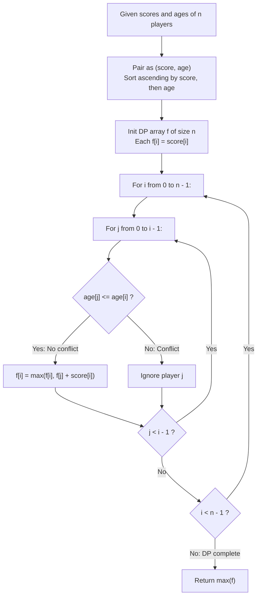

# Guided Example: Best Team With No Conflicts

We trace the step-by-step score-ordered dynamic programming aggregation of non-conflicting athletes, prove the Score-Sorted Non-Decreasing Age Subsequence Invariant and the Weighted LIS Dynamic Programming Theorem, and determine optimal roster selections across representative team configurations:

- **Representative Instance 1 (Mixed Scores with Conflicting Age Orders):**
  - Athlete Data ($n = 5$ players):
    $$
    scores = [1, 3, 5, 10, 15], \quad ages = [1, 2, 3, 4, 5]
    $$
  - Conflict Rule: A younger athlete cannot have a strictly higher score than an older athlete. If two athletes have the same age, no conflict exists regardless of scores.
  - **Required Output:** `34`
  - Step-by-step resolution:
    1. **Ascending Score-Age Pairing and Lexicographical Sorting:**
       - Pair each athlete as $(score_i, age_i)$:
         $$
         [(1, 1), (3, 2), (5, 3), (10, 4), (15, 5)]
         $$
       - Because scores and ages are both strictly non-decreasing, no conflict exists between any pair of players.
       - Selecting all $5$ players yields:
         $$
         \text{Total Score} = 1 + 3 + 5 + 10 + 15 = \mathbf{34}
         $$

- **Representative Instance 2 (Young Outlier with Dominant Score):**
  - Input: $scores = [4, 5, 6, 5], \; ages = [2, 1, 2, 1]$.
  - Sorted pairs $(score, age)$:
    $$
    [(4, 2), (5, 1), (5, 1), (6, 2)]
    $$
  - Conflicts:
    - Player with score $5$ and age $1$ conflicts with player with score $4$ and age $2$ ($score_1 > score_2$ while $age_1 < age_2$).
  - Viable Teams:
    - Age 1 athletes: $(5, 1) + (5, 1) \implies \text{Score } 10$.
    - Age 2 athletes: $(4, 2) + (6, 2) \implies \text{Score } 10$.
    - Mixed optimal: Player $(5, 1) + (5, 1) + (6, 2) \implies$ Since $5 \le 6$ and $1 \le 2$, no conflict!
      $$
      \text{Total Score} = 5 + 5 + 6 = \mathbf{16}
      $$
  - Output: `16`.

- **Representative Instance 3 (Extreme Score Outlier Disqualifying Predecessors):**
  - Input: $scores = [1, 2, 3, 5], \; ages = [8, 9, 10, 1]$.
  - The young prodigy $(5, 1)$ outscores $(1, 8), (2, 9), (3, 10)$, conflicting with all of them.
  - Team with only older players: $1 + 2 + 3 = \mathbf{6}$.
  - Team with prodigy alone: $\mathbf{5}$.
  - Optimal Score: $\max(6, 5) = \mathbf{6}$.

---

## 1. Instance & Teaching Goal

Given two integer arrays `scores` and `ages` representing $n$ basketball players, choose a subset of players to maximize the sum of scores such that no younger player has a strictly higher score than an older player.

```text
The Unsorted Conflict Graph Anti-Pattern:
  Forming a graph of pairwise compatibility and seeking the maximum weight clique:
    Arbitrary Maximum Weight Clique is NP-hard!
  Evaluating all 2^n team subsets takes O(2^n) time:
    For n = 1000, 2^1000 exceeds the number of atoms in the observable universe!

The Score-Sorted Non-Decreasing Age Invariant (Strict O(n^2)):
  1. Sort all players primarily by score ascending, and secondarily by age ascending:
       arr = sorted(zip(scores, ages))
  2. For any j < i, we know score_j <= score_i by sorting!
     - If age_j <= age_i:
         Player j is younger (or equal) and has score_j <= score_i.
         Zero conflict! Player j and player i can play together.
     - If age_j > age_i:
         Player i is younger but has score_i >= score_j.
         Conflict whenever score_i > score_j!
  3. The problem reduces to finding a Maximum Weight Non-Decreasing Subsequence on AGES:
       f[i] = score_i + max({f[j] : j < i and age_j <= age_i} U {0})
  Transforms NP-hard clique into polynomial dynamic programming!
```

The decisive pedagogical goal is the **Score-Sorted Non-Decreasing Age Subsequence Invariant & Weighted LIS Dynamic Programming Theorem**:
1. **Dimension Collapsing via Pre-Sorting:** Sorting along the score dimension eliminates one-half of the two-variable conflict condition, transforming a 2D compatibility constraint into a 1D monotonic sequence constraint.
2. **Weighted Longest Increasing Subsequence:** The recurrence generalizes classical LIS by accumulating athlete scores rather than incrementing a unit count.
3. **Monotonic Boundary Extension:** Players with identical ages and identical scores never conflict and accumulate sequentially.
4. Total time $\mathcal{O}(n^2)$ (or $\mathcal{O}(n \log (\max age))$ with a Fenwick tree) and auxiliary space $\mathcal{O}(n)$.

---

## 2. Conceptual Foundation & The Dynamic Programming Pipeline



### The Weighted LIS Dynamic Programming Theorem

Let $\mathcal{P} = \{ p_1, p_2, \dots, p_n \}$ be a set of $n$ players, where each player $p_k = (s_k, a_k)$ has score $s_k$ and age $a_k$.
1. **Conflict Definition:**
   Two players $p_u$ and $p_v$ conflict if and only if:
   $$
   (a_u < a_v \land s_u > s_v) \quad \lor \quad (a_v < a_u \land s_v > s_u)
   $$
2. **Lexicographical Order Pre-Condition:**
   Sort $\mathcal{P}$ such that:
   $$
   p_1 \le p_2 \le \dots \le p_n \quad \text{under lexicographical key } (s_k, a_k)
   $$
   Under this ordering, for any pair $j < i$, $s_j \le s_i$ holds unconditionally.
3. **Compatibility Invariance:**
   For $j < i$:
   - If $a_j \le a_i$: since $s_j \le s_i$ and $a_j \le a_i$, no conflict exists.
   - If $a_j > a_i$: player $i$ is younger ($a_i < a_j$) but has $s_i \ge s_j$. If $s_i > s_j$, a conflict exists. If $s_i = s_j$, sorting placed $a_j \le a_i$, a contradiction. Thus, $s_i > s_j$ strictly, which violates compatibility.
   Therefore:
   $$
   \forall j < i, \quad p_j \text{ and } p_i \text{ are mutually compatible} \iff a_j \le a_i
   $$
4. **Bellman Optimality Recurrence:**
   Let $f[i]$ be the maximum team score among compatible subsets whose score-maximal player is $p_i$:
   $$
   f[i] = s_i + \max \Big( \{ 0 \} \cup \{ f[j] : 0 \le j < i \land a_j \le a_i \} \Big)
   $$
   The optimal team score across all possible rosters is $\max_{0 \le i < n} f[i]$. $\blacksquare$

---

## 3. Step-by-Step Worked Execution: Representative Instance 2

$scores = [4, 5, 6, 5], \; ages = [2, 1, 2, 1]$.

### Step 1: Lexicographical Sorting
Pair and sort by $(score, age)$:
- $p_0 = (4, 2)$
- $p_1 = (5, 1)$
- $p_2 = (5, 1)$
- $p_3 = (6, 2)$
Array: $arr = [(4, 2), (5, 1), (5, 1), (6, 2)]$.

### Step 2: DP State Progression
- **$i = 0$ ($p_0 = (4, 2)$):**
  - Base score: $f[0] = 4$.
- **$i = 1$ ($p_1 = (5, 1)$):**
  - Check $j = 0$: $a_0 = 2, a_1 = 1 \implies 2 \le 1$ is False (Conflict!).
  - $f[1] = 5$.
- **$i = 2$ ($p_2 = (5, 1)$):**
  - Check $j = 0$: $a_0 = 2 > a_2 = 1$ (Conflict!).
  - Check $j = 1$: $a_1 = 1 \le a_2 = 1$ (Compatible!).
    - $f[2] = f[1] + score_2 = 5 + 5 = \mathbf{10}$.
- **$i = 3$ ($p_3 = (6, 2)$):**
  - Check $j = 0$: $a_0 = 2 \le a_3 = 2 \implies f[0] + 6 = 4 + 6 = 10$.
  - Check $j = 1$: $a_1 = 1 \le a_3 = 2 \implies f[1] + 6 = 5 + 6 = 11$.
  - Check $j = 2$: $a_2 = 1 \le a_3 = 2 \implies f[2] + 6 = 10 + 6 = \mathbf{16}$.
  - $f[3] = \max(6, 10, 11, 16) = \mathbf{16}$.

Global optimal score: $\max(f) = \mathbf{16}$ (Team: $p_1, p_2, p_3$).

---

## 4. DP State Matrix Trace Table

| Index $i$ | Player $p_i = (score, age)$ | Compatible Predecessors $\{j : a_j \le a_i\}$ | Transition Calculations | Active DP Value $f[i]$ |
|:---:|:---:|:---:|:---:|:---:|
| $0$ | $(4, 2)$ | None | Initial baseline | $4$ |
| $1$ | $(5, 1)$ | None ($a_0 = 2 > 1$) | Initial baseline | $5$ |
| $2$ | $(5, 1)$ | $j = 1$ ($a_1 = 1 \le 1$) | $f[1] + 5 = 5 + 5 = 10$ | $10$ |
| **$3$** | **$(6, 2)$** | **$j \in \{0, 1, 2\}$ (all ages $\le 2$)** | **$\max(4, 5, 10) + 6 = 10 + 6$** | **$16$** |

---

## 5. Algorithmic Correctness

### Soundness
Any sequence of indices $j_1 < j_2 < \dots < j_k$ forming a chain in the DP table satisfies both $s_{j_1} \le s_{j_2} \le \dots \le s_{j_k}$ (guaranteed by sorting) and $a_{j_1} \le a_{j_2} \le \dots \le a_{j_k}$ (guaranteed by the transition condition). Thus, no pairwise conflict can exist among any chosen athletes.

### Completeness
Every compatible subset of athletes, when sorted by score, forms a non-decreasing sequence of ages. Because the DP checks all valid predecessors $j < i$, the optimal compatible subset is guaranteed to be realized as the chain ending at its score-maximal element.

---

## 6. Boundary Cases & Traps

| Scenario | Input Pattern | Behavior | Trapped Risk |
|---|---|---|---|
| Identical Ages | All players have age $20$ | All pairs compatible; selects every player. | Imposing spurious restrictions on same-age peers. |
| Decreasing Scores with Increasing Ages | Scores $[10, 8, 6]$, Ages $[1, 2, 3]$ | Sorted: $[(6, 3), (8, 2), (10, 1)]$; ages strictly decrease; max team size is $1$. | Pairing incompatible high-score young players. |
| Negative or Zero Scores | Scores $\le 0$ | Disallowed by problem constraints ($score_i \ge 1$). | Accumulator underflow. |
| Single Player | $n = 1$ | Returns that player's score immediately. | Loop boundary exceptions. |

---

## 7. Complexity Derivation

- **Time Complexity:** $\mathcal{O}(n^2)$, where $n \le 1000$ is the number of players.
  - Sorting $n$ elements takes $\mathcal{O}(n \log n)$ time.
  - The nested loops execute $n(n - 1) / 2 \approx 5 \times 10^5$ iterations.
  - Each transition is $\mathcal{O}(1)$ arithmetic.
  - Total time: $< 0.01\text{ s}$.
- **Auxiliary Space Complexity:** $\mathcal{O}(n)$ auxiliary memory for the DP table and sorted player list.