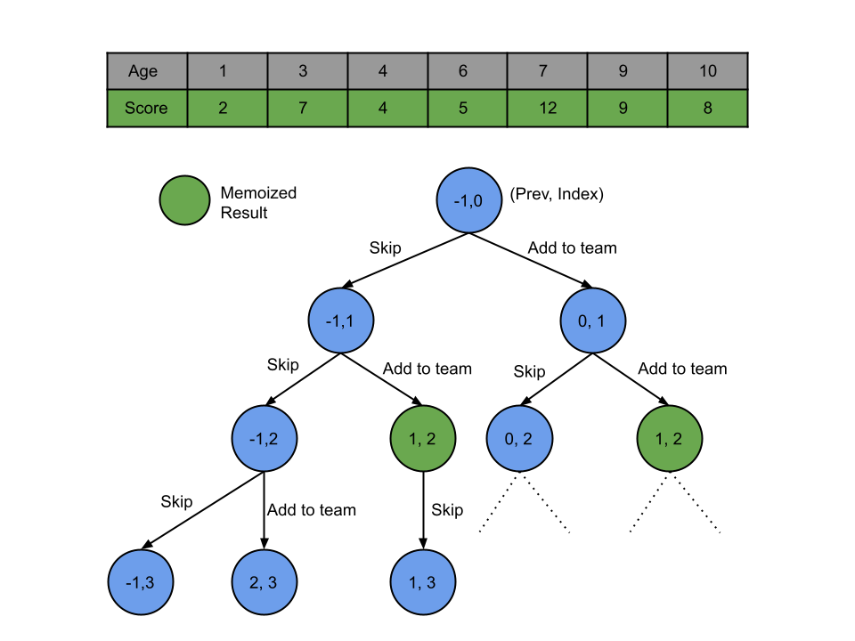

## Solution

---

### Approach 1: Top-Down Dynamic Programming

#### Intuition

We are given two lists of integers. These lists represent the score and age, respectively, of each of the $N$ players. We need to find the highest score of the non-conflicting team. A team has conflict if a younger player has a strictly higher score than an older player.

Whether a player stays in the team depends on his age and score, as well as the age and score of other players in the team. So we need to consider these two parameters before making any decision. We can reduce these two considerable parameters to one by sorting the players according to the other parameter, i.e., if we sort by age, then we only need to consider score and vice versa. In this approach, we will sort the players in ascending order of age. The benefit of sorting is that now when we start choosing players from left to right, we know that the age of the player we choose will always be greater than the age of the players we have already chosen. Hence we only need to think about the score of players.

Once we have sorted the players in ascending order of age, we will iterate them from smallest to largest age. For each player in the iteration, we either:
- Add this player to the team if he doesn't conflict with the team.
- Do not add the player to the team.

To check if the current player makes the team conflicting, we need to have the previous player we have chosen. The reason is that the players we have already chosen are non-conflicting. Since the players are in increasing order of their age, they would also need to be in non-decreasing order of the score (because that's necessary for the team to be non-conflicting). Hence the last player we have chosen will have the highest age and score. Now, if the score of the current player is more than the last player we have chosen, we can add this player to the team; otherwise, not.

For this recursive approach, what are the parameters that we need to track? The first parameter is the `index` of the player we are currently considering as we traverse the players. Secondly, we must keep track of the last player index `prev` we chose.

In this approach, we will have to iterate over all the $2^N$ possibilities and hence is not efficient. If we observe the below figure, there are repeated subproblems. Notice the green nodes are repeated subproblems signifying that we have already solved these subproblems before. To avoid recalculating results for previously seen subproblems, we will memoize the result for each subproblem. So the next time we need to calculate the result for the same set of parameters `{index, prev}`, we can simply look up the result in constant time instead of recalculating the result.



#### Algorithm

1. Store the ages and scores of all the players in the list `ageScorePair`.
2. Sort the list `ageScorePair` in ascending order of age and then in ascending order of score.
3. Iterate over the players; start with $index = 0$ and $prev = -1$, as we haven't chosen any player yet.
4. If it's the first player ($prev = -1$) or the player's score at `index` is more than the score of the player at index `prev`. Then we can add this player, and the score will be the maximum of the two choices we have.

- If we add this player, we will add the score, and the value of `prev` will be the current index `index`, and move on to the next player, i.e., $index + 1$.
- If we don't add this player, the value of `prev` won't change and move on to the next player.
5. If the above two conditions are not satisfied, we only have the option to leave this player and move on to the next one.
6. Base condition: If we have iterated over all the players, we should return `0`.

#### Implementation

```cpp
class Solution {
public:
    int findMaxScore(vector<vector<int>>& dp, vector<pair<int, int>>& ageScorePair, int prev, int index) {
        // Return 0 if we have iterated over all the players.
        if (index >= ageScorePair.size()) {
            return 0;
        }

        // We have already calculated the answer, so no need to go into recursion.
        if (dp[prev + 1][index] != -1) {
            return dp[prev + 1][index];
        }

        // If we can add this player, return the maximum of two choices we have.
        if (prev == -1 || ageScorePair[index].second >= ageScorePair[prev].second) {
            return dp[prev + 1][index] = max(findMaxScore(dp, ageScorePair, prev, index + 1),
                       ageScorePair[index].second + findMaxScore(dp, ageScorePair, index, index + 1));
        }

        // This player cannot be added; return the corresponding score.
        return dp[prev + 1][index] = findMaxScore(dp, ageScorePair, prev, index + 1);
    }

    int bestTeamScore(vector<int>& scores, vector<int>& ages) {
        vector<pair<int, int>> ageScorePair;
        for (int i = 0; i < scores.size(); i++) {
            ageScorePair.push_back({ages[i], scores[i]});
        }

        // Sort in ascending order of age and then by score.
        sort(ageScorePair.begin(), ageScorePair.end());
        // Mark all the states as -1, denoting not yet calculated.
        vector<vector<int>> dp(scores.size(), vector<int>(scores.size(), -1));
        return findMaxScore(dp, ageScorePair, -1, 0);
    }
};
```

#### Complexity Analysis

Here, $N$ is the number of players.

* Time complexity: $O(N ^ 2)$.

  Sorting the list `ageScorePair` will take $O(N \log N)$ time. In the recursion, each state is defined by the `index` and the `prev`. Hence, there will be $O(N * N)$ states, and at worst, we must visit most of the states to solve the original problem. Each recursive call will require $O(1)$ time due to the memoization. Therefore, the total time required equals $O(N * N)$.

* Space complexity: $O(N ^ 2)$.

  The list `ageScorePair` will take $2 * N$ space. The memoization results are stored in the table memo with size $N * N$. Also, stack space in the recursion equals the maximum number of active functions. The maximum number of active functions will be at most $N$, i.e., one function call for every player. Hence, the space complexity is $O(N * N)$.

---

### Approach 2: Bottom-Up Dynamic Programming

#### Intuition

If we observe closely, after sorting the list of pairs (age, score) by age, we need to find the highest sum of a non-decreasing subsequence of scores in the list. This is because after sorting, the list has the ages in ascending order, and in order to be non-conflicting, the score also has to be in non-decreasing order. Therefore we need to find the largest sum of scores in any non-decreasing subsequence of scores in the list of pairs. This is a typical dynamic programming problem very similar to [[309] Longest Increasing Subsequence](https://leetcode.com/problems/longest-increasing-subsequence/).

Similar to the previous approach, we will first sort the pairs in ascending order of age and then by score. Then we will iterate over the players from left to right. For each player, we will try to find the previous player it could be paired with. We will iterate over the players on the left and find the pairing that provides the maximum score for this player. The maximum score of any player will be the answer.

#### Algorithm

1. Store the ages and scores of all the players in the list `ageScorePair`.
2. Sort the list `ageScorePair` in ascending order of age and then in ascending order of score.
3. Initialize the array `dp` of size `N`. The $\text{dp}[i]$ represents the maximum score possible by taking `ith` player and possible players before it. All values initially will be equal to the score of individual players.
4. Iterate over players from `0` to $N - 1$ for each player at index `i`

- Iterate over the players on the left, i.e., from `0` to $i - 1$. For each such player, `j`, check if the score of the `ith` player is greater than or equal to the `jth` player's score. If it is, we can add the total score of the `jth` player ($\text{dp}[j]$) to the score of the `ith` player and update the maximum score of the `ith` player $\text{dp}[i]$ accordingly.

5. Store the maximum of all $\text{dp}[i]$ in the variable `answer`.
6. Return `answer`.

#### Implementation

```cpp
class Solution {
public:
    int findMaxScore(vector<pair<int, int>>& ageScorePair) {
        int n = (int) ageScorePair.size();
        int answer = 0;

        vector<int> dp(n);
        // Initially, the maximum score for each player will be equal to the individual scores.
        for (int i = 0; i < n; i++) {
            dp[i] = ageScorePair[i].second;
            answer = max(answer, dp[i]);
        }

        for (int i = 0; i < n; i++) {
            for (int j = i - 1; j >= 0; j--) {
                // If the players j and i could be in the same team.
                if (ageScorePair[i].second >= ageScorePair[j].second) {
                    // Update the maximum score for the ith player.
                    dp[i] = max(dp[i], ageScorePair[i].second + dp[j]);
                }
            }
            // Maximum score among all the players.
            answer = max(answer, dp[i]);
        }

        return answer;
    }

    int bestTeamScore(vector<int>& scores, vector<int>& ages) {
        vector<pair<int, int>> ageScorePair;
        for (int i = 0; i < scores.size(); i++) {
            ageScorePair.push_back({ages[i], scores[i]});
        }

        // Sort in ascending order of age and then by score.
        sort(ageScorePair.begin(), ageScorePair.end());
        return findMaxScore(ageScorePair);
    }
};
```

#### Complexity Analysis

Here, $N$ is the number of players.

* Time complexity: $O(N ^ 2)$.

  Sorting the list `ageScorePair` will take $O(N \log N)$ time. Then for the `ith` player, we iterate $i - 1$ players on the left, hence the total number of operations will be equal to $(0 + 1 + 2 + ...... + N - 1)$, which is equivalent to $((N - 1) * N) / 2$. Therefore the total time complexity equals $O(N * N)$.

* Space complexity: $O(N)$.

  The list `ageScorePair` will take $2 * N$ space. We have another list `dp`, to store the maximum score up to the particular index. Therefore the total space complexity equals $O(N)$.

---

### Approach 3: Binary Indexed Tree (BIT) / Fenwick Tree

**Intuition**

> **Note:** This approach is more advanced and added for the sake of completion. In an interview setting, generally, this approach will not be expected from the candidate.

For this approach, we will assume you are already familiar with a [Binary Indexed Tree/Fenwick Tree](https://en.wikipedia.org/wiki/Fenwick_tree), and not talk about the detailed inner workings.

In the binary indexed tree, we store some information which will be the score in our case, corresponding to indices which will be the age here. Hence, a node in the binary indexed tree with index `x` will store the maximum score possible with players with $\text{age} <= x$.

We will sort the players in ascending order of their score and then by age. Then we will iterate over each player, and for each player with age `x`, we will find the maximum score with players having age less than or equal to `x` by querying the BIT. This maximum score can be added to the current player score as we have sorted the players, so the current score will be the maximum seen so far and won't cause a conflict.

Now that the maximum score with age `x` is the above addition `currentBest` (current player score and the BIT returned query result), we need to update the BIT so that all the nodes with age greater than `x` have the updated values. The maximum of all the `currentBest` is the maximum score we can get.

This approach is similar to the previous two where we iterate over the players and for each player, find the maximum non-conflicting score. In the previous two approaches, we needed linear time to find the non-conflicting score, but with a BIT we only need logarithmic time.

**Algorithm**

1. Store the ages and scores of all the players in the list `ageScorePair`.
2. Sort the list `ageScorePair` in ascending order of score and then in ascending order of age.
3. Find the maximum age in the list and store it as `highestAge`. Create an array `BIT` with size $highestAge + 1$; this is the binary indexed tree.
4. Iterate over players from `0` to $N - 1$ for each player pair `ageScore`:

- Store the maximum score possible with this player as the `currentBest`. This will be equal to the sum of the current player score and the score returned by querying BIT with a score up to this age.

- Update the score in BIT with an age greater than the current player age if their score is smaller than `currentBest`.
5. Store the maximum of all `currentBest` in the variable `answer`.
6. Return `answer`.

**Implementation**

```cpp
class Solution {
public:
    int bestTeamScore(vector<int>& scores, vector<int>& ages) {
        vector<pair<int, int>> ageScorePair;
        for (int i = 0; i < scores.size(); i++) {
            ageScorePair.push_back({scores[i], ages[i]});
        }
        // Sort in ascending order of score and then by age.
        sort(ageScorePair.begin(), ageScorePair.end());

        int highestAge = 0;
        for (int i : ages) {
            highestAge = max(highestAge, i);
        }
        vector<int> BIT(highestAge + 1, 0);

        int answer = INT_MIN;
        for (pair<int, int> ageScore : ageScorePair) {
            // Maximum score up to this age might not have all the players of this age.
            int currentBest = ageScore.first + queryBIT(BIT, ageScore.second);
            // Update the tree with the current age and its best score.
            updateBIT(BIT, ageScore.second, currentBest);

            answer = max(answer, currentBest);
        }

        return answer;
    }

    // Query tree to get the maximum score up to this age.
    int queryBIT(vector<int>& BIT, int age) {
        int maxScore = INT_MIN;
        for (int i = age; i > 0; i -= i & (-i)) {
            maxScore = max(maxScore, BIT[i]);
        }
        return maxScore;
    }

    // Update the maximum score for all the nodes with an age greater than the given age.
    void updateBIT(vector<int>& BIT, int age, int currentBest) {
        for (int i = age; i < BIT.size(); i += i & (-i)) {
            BIT[i] = max(BIT[i], currentBest);
        }
    }
};

```

**Complexity Analysis**

Here, $N$ is the number of players, and $K$ is the maximum age in the list.

* Time complexity: $(N \log N + N \log K)$.

  Sorting the list `ageScorePair` will take $O(N \log N)$ time. Then for each player, we query and update the BIT, which takes $O(\log K)$ and therefore will take $(N \log K)$ for all the players. Hence the total time complexity equals $(N \log N + N \log K)$.

* Space complexity: $O(N + K)$.

  The list `ageScorePair` will take $2 * N$ space. BIT array will need $O(K)$ space. Therefore the total space complexity equals $O(N + K)$.

<br/>

---