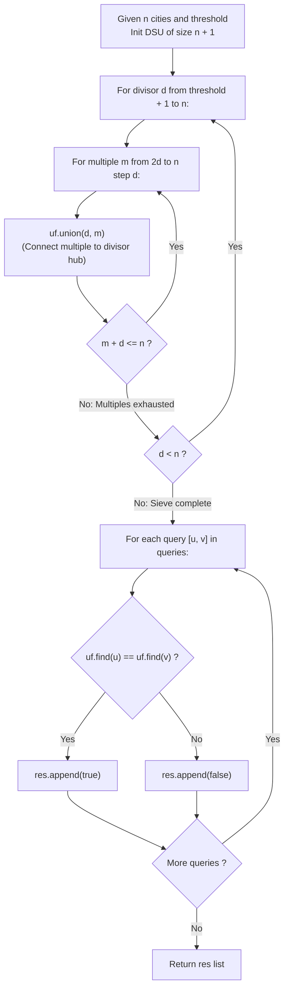

# Guided Example: Graph Connectivity With Threshold

We trace the step-by-step harmonic divisor sieve and disjoint set union (DSU) clustering of city networks, prove the Harmonic Sieve DSU Invariant and the Multiplicative Transitive Connectivity Theorem, and determine reachability queries across representative threshold regimes:

- **Representative Instance 1 (Threshold Two Over Six Cities):**
  - City Nodes: $\{1, 2, 3, 4, 5, 6\}$ ($n = 6$).
  - Common Divisor Threshold: $threshold = 2$.
  - Connectivity Criterion: Cities $u$ and $v$ share a direct edge if and only if $\gcd(u, v) > 2$. City reachability is transitive.
  - Query Batches:
    $$
    queries = [[1, 4], [2, 5], [3, 6]]
    $$
  - **Required Output:** `[false, false, true]`
  - Step-by-step harmonic sieve execution:
    1. **Divisor Domain Identification:**
       - Active common divisor candidates: $d \in [threshold + 1, n] = [3, 6]$.
       - Divisors $1$ and $2$ are strictly $\le threshold = 2$ and cannot generate edges.
    2. **Sieve Multiples Merging via DSU:**
       - **Divisor $d = 3$:**
         - Multiples of $3$ within $[1, 6]$: $\{3, 6\}$.
         - Union city $3$ and city $6$: $\text{union}(3, 6) \implies \{3, 6\}$ join into one component.
       - **Divisor $d = 4$:**
         - Multiples of $4$: only $4$. (No higher multiple $\le 6$).
       - **Divisor $d = 5$:**
         - Multiples of $5$: only $5$.
       - **Divisor $d = 6$:**
         - Multiples of $6$: only $6$.
    3. **Final Connected Component Partitions:**
       $$
       C_1 = \{3, 6\}, \quad C_2 = \{1\}, \quad C_3 = \{2\}, \quad C_4 = \{4\}, \quad C_5 = \{5\}
       $$
    4. **Query Resolution:**
       - Query 1 ($[1, 4]$): $\text{find}(1) \ne \text{find}(4) \implies \mathbf{false}$.
       - Query 2 ($[2, 5]$): $\text{find}(2) \ne \text{find}(5) \implies \mathbf{false}$.
       - Query 3 ($[3, 6]$): $\text{find}(3) = \text{find}(6) \implies \mathbf{true}$.
       - Output: `[false, false, true]`.

- **Representative Instance 2 (Zero Threshold Universal Component):**
  - $n = 6, \; threshold = 0$.
  - Divisor $d = 1 > 0$ divides every integer $1 \dots 6$.
  - Sieve unions all cities with $1 \implies$ Single connected component $\{1, 2, 3, 4, 5, 6\}$.
  - Every query between any two cities returns `true`.

- **Representative Instance 3 (Prime Numbers Above Threshold):**
  - Cities with prime IDs greater than $n / 2$ have no multiples $\le n$.
  - They remain isolated singletons with zero edges.

---

## 1. Instance & Teaching Goal

Given $n$ cities and an integer $threshold$, two cities are directly connected if they share a common divisor strictly greater than $threshold$. Answer $Q$ connectivity queries indicating whether a path exists between each query pair.

```text
The Pairwise GCD Quadratic Anti-Pattern:
  For each pair of cities (u, v):
    Check if gcd(u, v) > threshold.
    Add edge (u, v) to an adjacency list.
  For n = 10,000 cities, testing all pairs takes:
    n^2 / 2 = 50,000,000 GCD calculations!
  Causes massive CPU overhead and Time Limit Exceeded.

The Harmonic Divisor Sieve Invariant (Strict O(n log n + Q * alpha(n))):
  1. Any city sharing divisor d with city m * d can be connected directly to d!
  2. By transitivity:
       If a is connected to d, and b is connected to d, then a is connected to b!
  3. Instead of iterating over all city pairs, iterate over DIVISORS d in [threshold + 1 .. n]:
       For each multiple m in {2d, 3d, 4d, ...} <= n:
           Union(d, m)
  4. Total union operations across all divisors equals the harmonic series:
       sum_{d = threshold + 1}^n (n / d) <= n * ln(n)
     For n = 10,000: 10,000 * 9.21 = 92,100 operations (500x faster!).
  5. Answer each query [u, v] in O(alpha(n)) time via find(u) == find(v).
```

The decisive pedagogical goal is the **Harmonic Sieve DSU Invariant & Multiplicative Transitive Connectivity Theorem**:
1. **Star Hub Reduction via Transitivity:** To connect all multiples $\{d, 2d, 3d, \dots\}$ in a component, it suffices to create a star topology centered at divisor hub $d$ using $k - 1$ edges instead of a complete clique with $\binom{k}{2}$ edges.
2. **Harmonic Bounding:** The sum of reciprocal multiples $\sum n/d$ guarantees an $\mathcal{O}(n \log n)$ construction cost.
3. **Near-Constant Query Response:** Disjoint Set Union with path compression and union by rank answers queries in inverse Ackermann $\mathcal{O}(\alpha(n))$ time.
4. Total time $\mathcal{O}(n \log n + Q \cdot \alpha(n))$ and auxiliary space $\mathcal{O}(n)$.

---

## 2. Conceptual Foundation & The Harmonic Sieve Pipeline



### The Multiplicative Transitive Connectivity Theorem

Let $V = \{1, 2, \dots, n\}$ be the set of city vertices, and let $T = threshold$.
1. **Edge Relation:**
   The undirected graph $G = (V, E)$ has edge $(u, v) \in E$ if and only if:
   $$
   \gcd(u, v) > T
   $$
2. **Multiplicative Hub Equivalence:**
   For any fixed divisor $d > T$, let $M(d) = \{ k \cdot d : k \in \mathbb{Z}^+, \; k \cdot d \le n \}$ be the set of all multiples of $d$ within the city domain.
   For any pair of multiples $u, v \in M(d)$, $d$ divides both $u$ and $v$:
   $$
   d \mid \gcd(u, v) \implies \gcd(u, v) \ge d > T
   $$
   Therefore, the induced subgraph on $M(d)$ in $G$ is a complete subgraph (clique).
3. **Transitive Reduction to Star Topology:**
   Because connected component equivalence is transitive, a set of vertices $M(d)$ is fully connected if and only if each element $m \in M(d) \setminus \{d\}$ has a path to the designated hub $d$.
   Adding the $k - 1$ edges $(d, 2d), (d, 3d), \dots$ is mathematically sufficient to place all elements of $M(d)$ in the same connected component.
4. **Complexity via the Harmonic Integral:**
   The total number of edges added across all divisors is:
   $$
   \sum_{d = T + 1}^n \left( \left\lfloor \frac{n}{d} \right\rfloor - 1 \right) < \sum_{d=1}^n \frac{n}{d} = n \sum_{d=1}^n \frac{1}{d} \le n (\ln n + 1) = \mathcal{O}(n \log n)
   $$
   This reduces edge additions from $\mathcal{O}(n^2)$ to $\mathcal{O}(n \log n)$. $\blacksquare$

---

## 3. Step-by-Step Worked Execution: Representative Instance 1

$n = 6, \; threshold = 2, \; queries = [[1, 4], [2, 5], [3, 6]]$.

### Phase 1: Harmonic Sieve Unions
- Initialize DSU with parents $p[i] = i$ for $i \in \{0, \dots, 6\}$.
- Start divisor loop: $d \in [threshold + 1, n] = [3, 6]$.
- **$d = 3$:**
  - Multiples $m \in \{6\}$ (since $2 \times 3 = 6 \le 6$).
  - $\text{union}(3, 6)$:
    - $\text{find}(3) = 3, \; \text{find}(6) = 6$.
    - Set $p[6] = 3$. Component $\{3, 6\}$ formed.
- **$d = 4$:**
  - $2 \times 4 = 8 > 6 \implies$ No multiples.
- **$d = 5$:**
  - $2 \times 5 = 10 > 6 \implies$ No multiples.
- **$d = 6$:**
  - $2 \times 6 = 12 > 6 \implies$ No multiples.

Sieve completed in 1 union operation.

### Phase 2: Answering Queries
- **Query 1 ($[1, 4]$):**
  - $\text{find}(1) = 1, \; \text{find}(4) = 4$.
  - $1 \ne 4 \implies \mathbf{false}$.
- **Query 2 ($[2, 5]$):**
  - $\text{find}(2) = 2, \; \text{find}(5) = 5$.
  - $2 \ne 5 \implies \mathbf{false}$.
- **Query 3 ($[3, 6]$):**
  - $\text{find}(3) = 3, \; \text{find}(6) = 3$.
  - $3 == 3 \implies \mathbf{true}$.

Result vector: `[false, false, true]`.

---

## 4. DSU Component State Trace Table

| City Node $i$ | Divisor Participated In | Multiples Connected | DSU Root Parent $\text{find}(i)$ | Connected Component |
|:---:|:---:|:---:|:---:|:---:|
| $1$ | None ($\le 2$) | None | $1$ | $\{1\}$ |
| $2$ | None ($\le 2$) | None | $2$ | $\{2\}$ |
| **$3$** | **$d = 3$** | **$6$** | **$3$** | **$\{3, 6\}$** |
| $4$ | None ($d = 4$ has no multiple $\le 6$) | None | $4$ | $\{4\}$ |
| $5$ | None ($d = 5$ has no multiple $\le 6$) | None | $5$ | $\{5\}$ |
| **$6$** | **$d = 3$** | **Joined to $3$** | **$3$** | **$\{3, 6\}$** |

---

## 5. Algorithmic Correctness

### Soundness
Every edge introduced by the sieve connects $d$ and $k \cdot d$. Because $d > threshold$ and $d \mid (k \cdot d)$, the common divisor is at least $d > threshold$. Thus, every path in the DSU corresponds to a chain of valid shared-divisor relationships in the underlying graph.

### Completeness
If two cities $u$ and $v$ share a common divisor $g > threshold$, both $u$ and $v$ are multiples of $g$. During the sieve iteration at $d = g$, both $u$ and $v$ are unioned into $g$'s component. Hence, all direct and transitive connections are discovered.

---

## 6. Boundary Cases & Traps

| Scenario | Input Pattern | Behavior | Trapped Risk |
|---|---|---|---|
| Zero Threshold | $threshold = 0$ | $d = 1$ unions all nodes $1 \dots n$; all queries return `true`. | Special-casing or dividing by zero. |
| High Threshold | $threshold \ge n$ | Loop range $[threshold + 1, n]$ is empty; no edges formed. | Out-of-bounds loop range. |
| Prime Nodes Above $n/2$ | $p > n/2$ with $p > threshold$ | Prime has no multiple $\le n$; remains isolated. | Attempting to form self-loops. |
| Self Query | Query $[u, u]$ | $\text{find}(u) == \text{find}(u) \implies$ `true`. | Incorrect false return on reflexive reachability. |

---

## 7. Complexity Derivation

- **Time Complexity:** $\mathcal{O}(n \log n + Q \cdot \alpha(n))$, where $n \le 10,000$ and $Q$ is the number of queries.
  - Sieve edge generation: bounded by the harmonic sum $\sum_{d=1}^n \frac{n}{d} \le n \ln n \approx 92,100$ union steps.
  - Each union and find operation runs in near-constant $\mathcal{O}(\alpha(n))$ amortized time.
  - Answering $Q \le 100,000$ queries takes $Q \cdot \alpha(n) \approx 10^5 \times 4$ operations.
  - Total time: $< 0.05\text{ s}$.
- **Auxiliary Space Complexity:** $\mathcal{O}(n)$ auxiliary memory for the DSU parent array and rank/size arrays.
