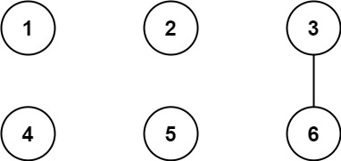
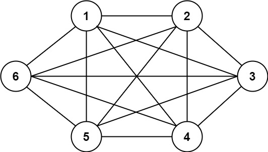
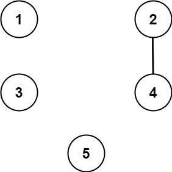

## Description

We have `n` cities labeled from `1` to `n`. Two different cities with labels `x` and `y` are directly connected by a bidirectional road if and only if `x` and `y` share a common divisor **strictly greater** than some `threshold`. More formally, cities with labels `x` and `y` have a road between them if there exists an integer `z` such that all of the following are true:

- $x \% z = 0$,

- $y \% z = 0$, and

- `z > threshold`.

Given the two integers, `n` and `threshold`, and an array of `queries`, you must determine for each $\text{queries}[i] = [a_{i}, b_{i}]$ if cities $a_{i}$ and $b_{i}$ are connected directly or indirectly. (i.e. there is some path between them).

Return *an array *`answer`*, where *$\text{answer.length} = \text{queries.length}$* and *$\text{answer}[i]$* is *`true`* if for the *$$i^{\text{th}}$$* query, there is a path between *$a_{i}$* and *$b_{i}$*, or *$\text{answer}[i]$* is *`false`* if there is no path.*
### Function Contract

- `n`: Input parameter.
- Returns expected result.

### Examples
#### Example 1

- **Input:** $n = 6, threshold = 2, queries = [[1,4],[2,5],[3,6]]$
- **Output:** `[false,false,true]`
- **Explanation:** The divisors for each number:
1:   1
2:   1, 2
3:   1, <u>3</u>
4:   1, 2, <u>4</u>
5:   1, <u>5</u>
6:   1, 2, <u>3</u>, <u>6</u>
Using the underlined divisors above the threshold, only cities 3 and 6 share a common divisor, so they are the
only ones directly connected. The result of each query:
[1,4]   1 is not connected to 4
[2,5]   2 is not connected to 5
[3,6]   3 is connected to 6 through path 3--6
#### Example 2

- **Input:** $n = 6, threshold = 0, queries = [[4,5],[3,4],[3,2],[2,6],[1,3]]$
- **Output:** `[true,true,true,true,true]`
- **Explanation:** The divisors for each number are the same as the previous example. However, since the threshold is 0,
all divisors can be used. Since all numbers share 1 as a divisor, all cities are connected.
#### Example 3

- **Input:** $n = 5, threshold = 1, queries = [[4,5],[4,5],[3,2],[2,3],[3,4]]$
- **Output:** `[false,false,false,false,false]`
- **Explanation:** Only cities 2 and 4 share a common divisor 2 which is strictly greater than the threshold 1, so they are the only ones directly connected.
Please notice that there can be multiple queries for the same pair of nodes [x, y], and that the query [x, y] is equivalent to the query [y, x].
### Constraints

- $2 \le n \le 10^{4}$

- $0 \le threshold \le n$

- $1 \le \text{queries.length} \le 10^{5}$

- $\text{queries}[i].length = 2$

- $1 \le a_{i}, b_{i} \le cities$

- $a_{i} \neq b_{i}$