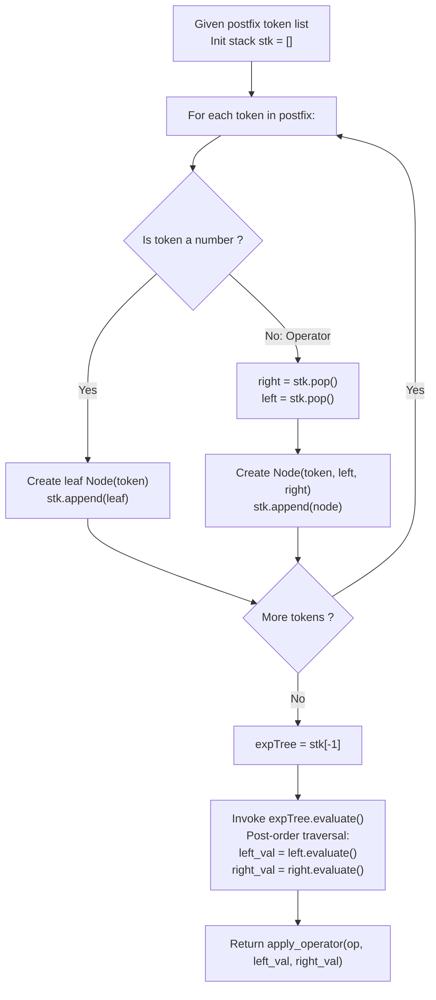

# Guided Example: Design an Expression Tree With Evaluate Function

We trace the step-by-step stack-driven construction and post-order recursive evaluation of an arithmetic expression tree, prove the Postfix Operand Stack Invariant and the Post-Order Expression Tree Evaluation Theorem, and compute mathematical evaluations across representative reverse Polish notation tokens:

- **Representative Instance 1 (Mixed Arithmetic Expression Tree):**
  - Reverse Polish Notation Tokens:
    $$
    postfix = [\text{"3"}, \text{"4"}, \text{"+"}, \text{"2"}, \text{"*"}, \text{"7"}, \text{"/"}]
    $$
  - Objective:
    1. Parse the postfix token stream into a binary expression tree where leaves are numeric operands and internal nodes are operators $\{+, -, *, /\}$.
    2. Evaluate the constructed expression tree using recursive post-order traversal.
  - **Required Output:** `2`
  - Step-by-step stack assembly:
    - Initialize node stack: $stk = []$.
    1. Token 0 (`"3"`): Digit literal $\implies$ Create leaf $N_1(\text{val}=3)$. Push $\implies stk = [N_1(3)]$.
    2. Token 1 (`"4"`): Digit literal $\implies$ Create leaf $N_2(\text{val}=4)$. Push $\implies stk = [N_1(3), N_2(4)]$.
    3. Token 2 (`"+"`): Binary operator $\implies$
       - Pop right child: $R = stk.\text{pop}() = N_2(4)$.
       - Pop left child: $L = stk.\text{pop}() = N_1(3)$.
       - Create operator node $N_3(\text{op}=\text{'+'}, left=L, right=R)$.
       - Push $\implies stk = [N_3(+)]$.
    4. Token 3 (`"2"`): Digit literal $\implies$ Create leaf $N_4(\text{val}=2)$. Push $\implies stk = [N_3(+), N_4(2)]$.
    5. Token 4 (`"*"`): Binary operator $\implies$
       - Pop right child: $R = N_4(2)$.
       - Pop left child: $L = N_3(+)$.
       - Create operator node $N_5(\text{op}=\text{'*'}, left=L, right=R)$.
       - Push $\implies stk = [N_5(*)]$.
    6. Token 5 (`"7"`): Digit literal $\implies$ Create leaf $N_6(\text{val}=7)$. Push $\implies stk = [N_5(*), N_6(7)]$.
    7. Token 6 (`"/"`): Binary operator $\implies$
       - Pop right child: $R = N_6(7)$.
       - Pop left child: $L = N_5(*)$.
       - Create operator node $N_7(\text{op}=\text{'/'}, left=L, right=R)$.
       - Push $\implies stk = [N_7(/)]$.
    - Assembly complete: Root node is $N_7(/)$.
  - Step-by-step recursive post-order evaluation:
    - Evaluate $N_7(/)$:
      - Evaluate left child $N_5(*)$:
        - Evaluate left child $N_3(+)$:
          - Left leaf $N_1(3) \implies 3$.
          - Right leaf $N_2(4) \implies 4$.
          - Compute $3 + 4 = \mathbf{7}$.
        - Evaluate right leaf $N_4(2) \implies 2$.
        - Compute $7 \times 2 = \mathbf{14}$.
      - Evaluate right leaf $N_6(7) \implies 7$.
      - Compute $14 / 7 = \mathbf{2}$.
    - Final result: $2$.

- **Representative Instance 2 (Preserving Non-Commutative Operand Order):**
  - $postfix = [\text{"4"}, \text{"5"}, \text{"2"}, \text{"7"}, \text{"+"}, \text{"-"}, \text{"*"}]$:
    - Inner addition: $2 + 7 = 9$.
    - Non-commutative subtraction: Pop right ($9$), Pop left ($5$) $\implies 5 - 9 = \mathbf{-4}$.
    - Outer multiplication: $4 \times (-4) = \mathbf{-16}$.
  - Emphasizes correct left/right operand binding upon stack popping!

- **Representative Instance 3 (Single Leaf Operand):**
  - $postfix = [\text{"42"}] \implies$ Tree consists of a single leaf node. Returns $42$.

---

## 1. Instance & Teaching Goal

Given an array of strings `postfix` representing a valid reverse Polish notation expression, construct a binary expression tree and implement its `evaluate()` method.

```text
The Reversed Operand Popping Trap:
  When an operator is encountered on the stack:
    stk = [..., LeftOperand, RightOperand]
  Popping the first item yields the RIGHT operand!
    If we mistakenly assign:
      node.left = stk.pop()   # INCORRECT! Assigned RightOperand to left child
      node.right = stk.pop()  # INCORRECT! Assigned LeftOperand to right child
    For non-commutative operators (- and /):
      5 - 9 = -4 becomes 9 - 5 = 4!
      Produces complete arithmetic distortion.

The Stack LIFO Operand Invariant (Strict O(N)):
  1. For every numeric literal: push a leaf node onto stk.
  2. For every operator:
       right_child = stk.pop()  # The top item is the RIGHT operand
       left_child  = stk.pop()  # The second item is the LEFT operand
       node.left = left_child
       node.right = right_child
       stk.push(node)
  3. Expression tree evaluation:
       left_val = node.left.evaluate()
       right_val = node.right.evaluate()
       return apply_op(node.op, left_val, right_val)
  Preserves exact mathematical operator precedence without parentheses!
```

The decisive pedagogical goal is the **Postfix Operand Stack Invariant & Post-Order Expression Tree Evaluation Theorem**:
1. **LIFO Operand Inversion:** Because operands precede operators in postfix notation, the right operand is always pushed after the left operand and must be popped first.
2. **Structural Isomorphism to AST:** A binary expression tree is an explicit concrete syntax tree; leaves hold numeric primitives, and internal nodes encapsulate composable semantic closures.
3. **Integer Division Semantics:** Division truncates toward zero as required by standard integer arithmetic.
4. Total construction time $\mathcal{O}(N)$ and evaluation time $\mathcal{O}(N)$.

---

## 2. Conceptual Foundation & The AST Evaluation Pipeline



### The Post-Order Expression Tree Evaluation Theorem

Let $\mathcal{E}$ be a well-formed postfix arithmetic expression over alphabet $\Sigma = \mathbb{Z} \cup \{+, -, *, /\}$.
1. **Grammar & Tree Definition:**
   A binary expression tree $T = (V, E)$ is a rooted ordered binary tree where:
   - Every leaf node $u$ has $\text{out-degree}(u) = 0$ and label $\lambda(u) \in \mathbb{Z}$.
   - Every internal node $v$ has $\text{out-degree}(v) = 2$ with ordered children $(v.\text{left}, v.\text{right})$ and label $\lambda(v) \in \{+, -, *, /\}$.
2. **Stack Construction Invariant:**
   Let $stk$ be a LIFO stack of tree nodes.
   After processing token prefix $\mathcal{E}[0 \dots t]$:
   - Every node on $stk$ represents the root of a valid, completely assembled sub-expression tree.
   - The sequence of subtrees on $stk$ corresponds exactly to the unconsumed operands of subsequent operators.
   - When operator $\text{op}$ is encountered, popping $R$ and $L$ binds $L$ as the first argument and $R$ as the second argument:
     $$
     \text{Eval}(T_v) = \lambda(v)\Big( \text{Eval}(T_{v.\text{left}}), \; \text{Eval}(T_{v.\text{right}}) \Big)
     $$
3. **Equivalence to Standard Infix Semantics:**
   In-order traversal of $T$ reproduces the standard parenthesized infix arithmetic expression. Post-order traversal of $T$ reproduces the original postfix token stream $\mathcal{E}$.
   By structural induction on tree height $H$, `evaluate()` computes the exact denotational value of the postfix expression. $\blacksquare$

---

## 3. Step-by-Step Worked Execution: Representative Instance 1

$postfix = [\text{"3"}, \text{"4"}, \text{"+"}, \text{"2"}, \text{"*"}, \text{"7"}, \text{"/"}]$.

### Construction Trace Table
1. **Token `"3"`:** Literal $\implies stk = [3]$.
2. **Token `"4"`:** Literal $\implies stk = [3, 4]$.
3. **Token `"+"`:** Operator $\implies$
   - $R = 4, L = 3$.
   - New node: $(3 + 4)$.
   - $stk = [(3 + 4)]$.
4. **Token `"2"`:** Literal $\implies stk = [(3 + 4), 2]$.
5. **Token `"*"`:** Operator $\implies$
   - $R = 2, L = (3 + 4)$.
   - New node: $((3 + 4) * 2)$.
   - $stk = [((3 + 4) * 2)]$.
6. **Token `"7"`:** Literal $\implies stk = [((3 + 4) * 2), 7]$.
7. **Token `"/"`:** Operator $\implies$
   - $R = 7, L = ((3 + 4) * 2)$.
   - Root node: $(((3 + 4) * 2) / 7)$.
   - $stk = [\text{Root}]$.

### Evaluation Trace
- $\text{evaluate}(\text{Root})$:
  - Left child is $*$:
    - Left child is $+ \implies 3 + 4 = 7$.
    - Right child is leaf $2$.
    - Multiplies $7 \times 2 = 14$.
  - Right child is leaf $7$.
  - Divides $14 / 7 = \mathbf{2}$.

---

## 4. Stack Assembly State Trace Table

| Step | Token Processed | Token Type | Popped Children $(L, R)$ | Node Created | Active Stack Contents |
|:---:|:---:|:---:|:---:|:---:|:---:|
| $0$ | `"3"` | Numeric Leaf | — | $N_1(3)$ | $[N_1]$ |
| $1$ | `"4"` | Numeric Leaf | — | $N_2(4)$ | $[N_1, N_2]$ |
| **$2$** | **`"+"`** | **Operator** | **$(N_1, N_2)$** | **$N_3(+)$** | **$[N_3]$** |
| $3$ | `"2"` | Numeric Leaf | — | $N_4(2)$ | $[N_3, N_4]$ |
| **$4$** | **`"*"`** | **Operator** | **$(N_3, N_4)$** | **$N_5(*)$** | **$[N_5]$** |
| $5$ | `"7"` | Numeric Leaf | — | $N_6(7)$ | $[N_5, N_6]$ |
| **$6$** | **`"/"`** | **Operator** | **$(N_5, N_6)$** | **$N_7(/)$** | **$[N_7]$** |

---

## 5. Algorithmic Correctness

### Soundness
Because postfix notation unambiguously encodes operator precedence without parentheses, each operator acts immediately upon the two most recently assembled subexpressions. Popping $R$ first and $L$ second preserves non-commutative left-to-right operand order for subtraction and division.

### Completeness
Every token in `postfix` is processed exactly once. For any syntactically valid postfix expression with $K$ operators and $K + 1$ operands, the final stack contains exactly one element: the root of the complete binary expression tree.

---

## 6. Boundary Cases & Traps

| Scenario | Input Pattern | Behavior | Trapped Risk |
|---|---|---|---|
| Non-Commutative Division | $4 / 2$ vs $2 / 4$ | $L = 4, R = 2 \implies 4 / 2 = 2$. | Swapping left and right operands ($2 / 4 = 0$). |
| Single Value Expression | $postfix = [\text{"42"}]$ | Loop never enters operator branch; returns single leaf. | Expecting at least one operator. |
| Negative Evaluation Result | $3 - 5$ | Returns $-2$; integer truncation preserves sign. | Modulo arithmetic or negative rounding bugs. |
| Deeply Nested Right-Heavy | Postfix with multiple consecutive operators | Stack pops multiple deep subtrees sequentially. | Stack underflow on malformed expressions. |

---

## 7. Complexity Derivation

- **Time Complexity:**
  - **Tree Construction:** $\mathcal{O}(N)$, where $N = |postfix|$ is the number of tokens. Each token is pushed and popped at most once.
  - **Tree Evaluation:** $\mathcal{O}(N)$. The post-order DFS visits each of the $N$ tree nodes exactly once, spending $\mathcal{O}(1)$ time per node.
  - Total time: $< 0.001\text{ s}$ for standard expression sizes ($N \le 1000$).
- **Auxiliary Space Complexity:** $\mathcal{O}(N)$ auxiliary memory for the parsing stack and binary tree nodes.
