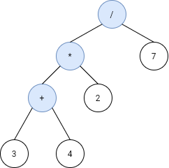
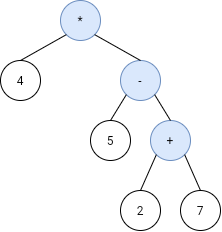

## Description

Given the `postfix` tokens of an arithmetic expression, build and return *the binary expression tree that represents this expression.*

**Postfix** notation is a notation for writing arithmetic expressions in which the operands (numbers) appear before their operators. For example, the postfix tokens of the expression `4*(5-(7+2))` are represented in the array $postfix = ["4","5","7","2","+","-","*"]$.

The class `Node` is an interface you should use to implement the binary expression tree. The returned tree will be tested using the `evaluate` function, which is supposed to evaluate the tree's value. You should not remove the `Node` class; however, you can modify it as you wish, and you can define other classes to implement it if needed.

A **<a href="https://en.wikipedia.org/wiki/Binary_expression_tree" target="_blank">binary expression tree</a>** is a kind of binary tree used to represent arithmetic expressions. Each node of a binary expression tree has either zero or two children. Leaf nodes (nodes with 0 children) correspond to operands (numbers), and internal nodes (nodes with two children) correspond to the operators `'+'` (addition), `'-'` (subtraction), `'*'` (multiplication), and `'/'` (division).

It's guaranteed that no subtree will yield a value that exceeds $10^{9}$ in absolute value, and all the operations are valid (i.e., no division by zero).

**Follow up:** Could you design the expression tree such that it is more modular? For example, is your design able to support additional operators without making changes to your existing `evaluate` implementation?
### Function Contract

**Platform interface**

- `Node.evaluate()` abstract method returning the integer evaluation of the expression tree rooted at `self`.
- `TreeBuilder.buildTree(postfix)` builds and returns the root `Node` of the expression tree constructed from a postfix token array.

**Return value**

`evaluate()` returns an integer value representing the evaluated result of the expression.

### Examples

#### Example 1

- **Input:** $s = ["3","4","+","2","*","7","/"]$
- **Output:** `2`
- **Explanation:** this expression evaluates to the above binary tree with expression ((3+4)*2)/7) = 14/7 = 2.
#### Example 2

- **Input:** $s = ["4","5","2","7","+","-","*"]$
- **Output:** `-16`
- **Explanation:** this expression evaluates to the above binary tree with expression 4*(5-(2+7)) = 4*(-4) = -16.
### Constraints

- $1 \le \text{s.length} < 100$

- `s.length` is odd.

- `s` consists of numbers and the characters `'+'`, `'-'`, `'*'`, and `'/'`.

- If $s[i]$ is a number, its integer representation is no more than $10^{5}$.

- It is guaranteed that `s` is a valid expression.

- The absolute value of the result and intermediate values will not exceed $10^{9}$.

- It is guaranteed that no expression will include division by zero.