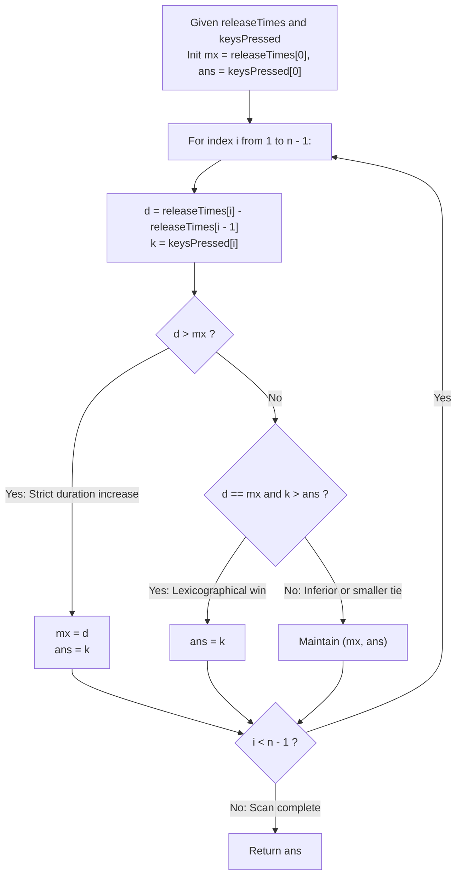

# Guided Example: Slowest Key

We trace the step-by-step backward difference calculation of keypress durations and prove the Discrete Time Interval Invariant and the Lexicographical Dominance Tie-Breaking Theorem across representative keystroke sequences:

- **Representative Instance 1 (Equal Peak Durations with Lexicographical Tie):**
  - Keystroke Release Timeline:
    $$
    releaseTimes = [9, 29, 49, 50], \quad n = 4
    $$
  - Characters Pressed:
    $$
    keysPressed = \text{"cbcd"}
    $$
  - Objective: Identify the key associated with the longest duration interval. If a tie occurs, select the lexicographically greatest key.
  - **Required Output:** `'c'`
  - Step-by-step sequential interval resolution:
    1. **Keypress 0 ($i = 0$, Key `'c'`):**
       - Interval starts at time $t = 0$.
       - Duration:
         $$
         d_0 = releaseTimes[0] - 0 = 9 - 0 = \mathbf{9}
         $$
       - Initial peak: $mx = 9, \; ans = \text{'c'}$.
    2. **Keypress 1 ($i = 1$, Key `'b'`):**
       - Preceding release at $t = 9$, current release at $t = 29$.
       - Duration:
         $$
         d_1 = releaseTimes[1] - releaseTimes[0] = 29 - 9 = \mathbf{20}
         $$
       - Comparison: $20 > 9 \implies$ New longest press!
       - Update peak: $mx = 20, \; ans = \text{'b'}$.
    3. **Keypress 2 ($i = 2$, Key `'c'`):**
       - Preceding release at $t = 29$, current release at $t = 49$.
       - Duration:
         $$
         d_2 = releaseTimes[2] - releaseTimes[1] = 49 - 29 = \mathbf{20}
         $$
       - Comparison: $d_2 = 20 == mx = 20$ (**Tie in duration!**).
       - Tie-breaking rule: Compare character symbols:
         $$
         \text{'c'} > \text{'b'} \implies \text{Key 'c' dominates key 'b'}
         $$
       - Update winner: $ans \leftarrow \text{'c'}$.
    4. **Keypress 3 ($i = 3$, Key `'d'`):**
       - Preceding release at $t = 49$, current release at $t = 50$.
       - Duration:
         $$
         d_3 = releaseTimes[3] - releaseTimes[2] = 50 - 49 = \mathbf{1}
         $$
       - Comparison: $1 < 20 \implies$ No change.
    5. **Final Result:** Winner is $\mathbf{\text{'c'}}$ with peak duration $20$.

- **Representative Instance 2 (Unique Longest Final Keypress):**
  - $releaseTimes = [12, 23, 36, 46, 62], \; keysPressed = \text{"spuda"}$.
  - Durations: $12, 11, 13, 10, \mathbf{16}$.
  - Unique maximum duration $16$ belongs to `'a'`. Output: `'a'`.

- **Representative Instance 3 (All Durations Identical):**
  - $releaseTimes = [1, 3, 5], \; keysPressed = \text{"abc"}$.
  - All durations equal $2$. Lexicographical tie-break chooses `'c'`.

---

## 1. Instance & Teaching Goal

Given release timestamps and pressed keys, determine the key pressed for the longest duration, breaking ties in favor of the lexicographically largest character.

```text
The Timestamp-As-Duration Fallacy:
  Assuming releaseTimes[i] represents the duration of the i-th press:
    releaseTimes is a cumulative chronological stopwatch!
    Only the first press duration is releaseTimes[0].
    Every subsequent press duration is the difference between adjacent timestamps:
      duration_i = releaseTimes[i] - releaseTimes[i-1]
  Failing to compute adjacent differences mistakes the last keypress
  as the longest simply because its release time is the largest timestamp!

The Discrete Time Interval Invariant (Strict Linear O(n)):
  1. Maintain optimal candidate pair: (max_duration, best_key).
  2. Single forward pass:
     - For i = 0: d = releaseTimes[0], key = keysPressed[0].
     - For i >= 1: d = releaseTimes[i] - releaseTimes[i-1], key = keysPressed[i].
  3. Dominance transition:
     Candidate (d, key) defeats current (mx, ans) if and only if:
       (d > mx) OR (d == mx AND key > ans)
  4. Requires zero auxiliary storage and strictly n - 1 subtractions!
```

The decisive pedagogical goal is the **Discrete Time Interval Invariant & Lexicographical Dominance Tie-Breaking Theorem**:
1. **Backward Finite Difference:** The physical duration of contiguous non-overlapping events on a single timeline is given by the discrete derivative $\Delta T_i = T_i - T_{i-1}$.
2. **Compound Total Ordering:** The decision criteria form a lexicographical product order $(\text{duration}, \text{symbol})$ where duration is the primary metric and character ordinal is the secondary metric.
3. **Sequential Stream Processing:** The optimal key can be determined online without storing prior timestamps.
4. Total time $\mathcal{O}(n)$ and auxiliary space $\mathcal{O}(1)$.

---

## 2. Conceptual Foundation & The Sequential Scanner



### The Lexicographical Dominance Tie-Breaking Theorem

Let $\mathcal{K} = (k_0, k_1, \dots, k_{n-1})$ be the sequence of keys pressed, and let $\mathcal{T} = (t_0, t_1, \dots, t_{n-1})$ be the strictly increasing release timestamps with $t_{-1} = 0$.
1. **Duration Definition:**
   For each index $i \in \{0, \dots, n-1\}$, the duration of the $i$-th keypress is:
   $$
   \delta_i = t_i - t_{i-1}
   $$
2. **Compound Metric Product Order:**
   Define candidate score pair $S_i = (\delta_i, k_i) \in \mathbb{R}^+ \times \Sigma$.
   We order candidates under the lexicographical product relation $\succ$:
   $$
   (\delta_a, k_a) \succ (\delta_b, k_b) \iff (\delta_a > \delta_b) \lor (\delta_a = \delta_b \land k_a > k_b)
   $$
3. **Total Order & Path Invariance:**
   Because the character alphabet $\Sigma$ and real numbers $\mathbb{R}^+$ are totally ordered, $\succ$ defines a strict total order over all distinct candidates $(i, \delta_i, k_i)$.
   Starting with candidate $0$ and greedily updating $ans \leftarrow i$ whenever $S_i \succ S_{ans}$:
   $$
   S_{ans}^{(n-1)} = \max_{0 \le i < n} (\delta_i, k_i)
   $$
   This guarantees that the final key returned is both duration-maximal and lexicographically superior among all tied candidates. $\blacksquare$

---

## 3. Step-by-Step Worked Execution: Representative Instance 1

$releaseTimes = [9, 29, 49, 50], \; keysPressed = \text{"cbcd"}$.

### Step-by-Step State Evolution
- **Index 0:**
  - Duration: $d_0 = 9 - 0 = 9$. Key: `'c'`.
  - Initial state: $mx = 9, \; ans = \text{'c'}$.
- **Index 1:**
  - Duration: $d_1 = 29 - 9 = 20$. Key: `'b'`.
  - Compare $(20, \text{'b'})$ vs $(9, \text{'c'})$:
    - Primary metric: $20 > 9 \implies$ **Strict improvement!**
    - State: $mx = 20, \; ans = \text{'b'}$.
- **Index 2:**
  - Duration: $d_2 = 49 - 29 = 20$. Key: `'c'`.
  - Compare $(20, \text{'c'})$ vs $(20, \text{'b'})$:
    - Primary metric: $20 == 20$ (Tie).
    - Secondary metric: $\text{'c'} > \text{'b'} \implies$ **Lexicographical win!**
    - State: $mx = 20, \; ans = \text{'c'}$.
- **Index 3:**
  - Duration: $d_3 = 50 - 49 = 1$. Key: `'d'`.
  - Compare $(1, \text{'d'})$ vs $(20, \text{'c'})$:
    - Primary metric: $1 < 20 \implies$ No change.
- End of sequence. Return $ans = \mathbf{\text{'c'}}$.

---

## 4. Keystroke Duration Trace Table

| Index $i$ | Key $keysPressed[i]$ | Release Timestamp $t_i$ | Prior Timestamp $t_{i-1}$ | Computed Duration $\delta_i$ | Compound Metric Comparison | Running Winner $ans$ |
|:---:|:---:|:---:|:---:|:---:|:---:|:---:|
| $0$ | `'c'` | $9$ | $0$ | $9$ | Initial baseline $(9, \text{'c'})$ | `'c'` |
| **$1$** | **`'b'`** | **$29$** | **$9$** | **$20$** | **$20 > 9 \implies$ New max** | **`'b'`** |
| **$2$** | **`'c'`** | **$49$** | **$29$** | **$20$** | **$20 == 20 \land \text{'c'} > \text{'b'} \implies$ Tie win** | **`'c'`** |
| $3$ | `'d'` | $50$ | $49$ | $1$ | $1 < 20 \implies$ Discarded | `'c'` |

---

## 5. Algorithmic Correctness

### Soundness
Each evaluated duration represents the exact elapsed time between successive releases. The compound condition `d > mx or (d == mx and k > ans)` mirrors the formal mathematical product ordering, ensuring no tie-breaking ambiguity can occur.

### Completeness
The loop traverses every index from $0$ to $n-1$. Because all keypresses are evaluated against the running champion, no candidate duration or winning character can be overlooked.

---

## 6. Boundary Cases & Traps

| Scenario | Input Pattern | Behavior | Trapped Risk |
|---|---|---|---|
| Single Keypress | $releaseTimes = [5], keysPressed = \text{"a"}$ | Loop does not execute; returns `'a'`. | Out-of-bounds indexing on $n = 1$. |
| Tie Broken by Lowercase Order | Keys `'a'` vs `'z'` with duration $10$ | `'z' > 'a' \implies$ returns `'z'`. | Picking the first key encountered instead of the largest. |
| Repeated Presses of Same Key | Same key pressed multiple times | Evaluates each interval independently; tracks max interval. | Summing intervals across identical keys instead of finding the longest single press. |
| Monotonically Decreasing Durations | $[100, 101, 102]$ with durations $[100, 1, 1]$ | Initial press remains dominant throughout. | Overwriting maximum with later small intervals. |

---

## 7. Complexity Derivation

- **Time Complexity:** $\mathcal{O}(n)$, where $n = |keysPressed| \le 1000$.
  - The algorithm traverses the list of timestamps once in a single sequential pass.
  - At each step, subtraction and scalar comparisons take $\mathcal{O}(1)$ time.
  - Total time: $< 0.0001\text{ s}$.
- **Auxiliary Space Complexity:** $\mathcal{O}(1)$ auxiliary space, maintaining only two scalar variables for peak duration and winning character.
