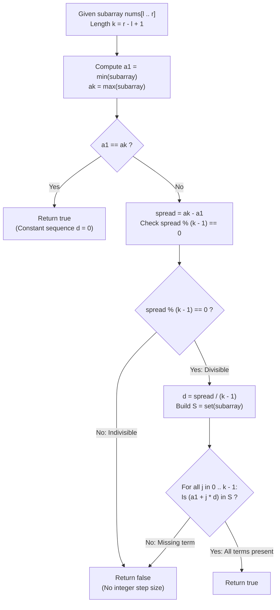

# Guided Example: Arithmetic Subarrays

We trace the step-by-step mathematical verification of rearrangeable arithmetic progressions, prove the Extremal Spread Divisibility Invariant and the Hash Set Arithmetic Progression Theorem, and evaluate subarray range queries across representative numeric instances:

- **Representative Instance 1 (Three Range Queries on Mixed Array):**
  - Array Data:
    $$
    nums = [4, 6, 5, 9, 3, 7], \quad n = 6
    $$
  - Range Query Batches ($m = 3$ queries):
    $$
    l = [0, 0, 2], \quad r = [2, 3, 5]
    $$
  - Objective: For each query range $[l_i, r_i]$, determine if the subarray $nums[l_i \dots r_i]$ can be permuted to form an arithmetic sequence.
  - **Required Output:** `[true, false, true]`
  - Step-by-step query resolution:
    1. **Query 0 ($l = 0, r = 2$):**
       - Subarray slice: $A = nums[0 \dots 2] = [4, 6, 5]$. Length $k = 3$.
       - Extremal bounds:
         $$
         a_1 = \min(A) = 4, \quad a_k = \max(A) = 6
         $$
       - Step divisibility check:
         $$
         \Delta = a_k - a_1 = 6 - 4 = 2, \quad 2 \pmod{k - 1} = 2 \pmod 2 = 0 \quad (\mathbf{Divisible!})
         $$
       - Common difference:
         $$
         d = \frac{a_k - a_1}{k - 1} = \frac{2}{2} = \mathbf{1}
         $$
       - Expected progression terms:
         $$
         \{4 + 0 \cdot 1, \; 4 + 1 \cdot 1, \; 4 + 2 \cdot 1\} = \{4, 5, 6\}
         $$
       - Set containment test: All terms $\{4, 5, 6\}$ exist in $\text{set}(A) = \{4, 5, 6\}$ (**Passes**).
       - Permutation $[4, 5, 6]$ is an arithmetic progression. Output: $\mathbf{true}$.
    2. **Query 1 ($l = 0, r = 3$):**
       - Subarray slice: $A = nums[0 \dots 3] = [4, 6, 5, 9]$. Length $k = 4$.
       - Extremal bounds:
         $$
         a_1 = \min(A) = 4, \quad a_k = \max(A) = 9
         $$
       - Step divisibility check:
         $$
         \Delta = a_k - a_1 = 9 - 4 = 5, \quad 5 \pmod{k - 1} = 5 \pmod 3 = 2 \ne 0 \quad (\mathbf{Indivisible!})
         $$
       - Because the spread $5$ cannot be partitioned into $3$ equal integer steps, no permutation can ever form an arithmetic progression.
       - Output: $\mathbf{false}$.
    3. **Query 2 ($l = 2, r = 5$):**
       - Subarray slice: $A = nums[2 \dots 5] = [5, 9, 3, 7]$. Length $k = 4$.
       - Extremal bounds:
         $$
         a_1 = \min(A) = 3, \quad a_k = \max(A) = 9
         $$
       - Step divisibility check:
         $$
         \Delta = 9 - 3 = 6, \quad 6 \pmod{k - 1} = 6 \pmod 3 = 0 \quad (\mathbf{Divisible!})
         $$
       - Common difference:
         $$
         d = \frac{6}{3} = \mathbf{2}
         $$
       - Expected progression terms:
         $$
         \{3, 5, 7, 9\}
         $$
       - Set containment test: $\{3, 5, 7, 9\} \subseteq \text{set}(A) = \{3, 5, 7, 9\}$ (**Passes**).
       - Permutation $[3, 5, 7, 9]$ is an arithmetic progression. Output: $\mathbf{true}$.
    - Consolidated Result: `[true, false, true]`.

- **Representative Instance 2 (Negative Integer Progression):**
  - Subarray $[-25, -20, -15, -10]$: $\min = -25, \max = -10, k = 4$.
  - Common difference $d = (-10 - (-25)) / 3 = 15 / 3 = 5$.
  - Progression: $-25, -20, -15, -10 \implies \mathbf{true}$.

- **Representative Instance 3 (All Equal Identical Elements):**
  - Subarray $[7, 7, 7, 7]$: $\min = 7, \max = 7$.
  - $a_k - a_1 = 0 \implies d = 0$.
  - Constant sequence has common difference $0 \implies \mathbf{true}$.

---

## 1. Instance & Teaching Goal

Given an array `nums` and query index arrays `l` and `r`, determine for each query whether the subarray $nums[l \dots r]$ can be rearranged to form an arithmetic sequence.

```text
The Repeated Subarray Sorting Anti-Pattern:
  For each of the m queries:
    Extract sub = nums[l : r + 1]
    Sort sub in non-decreasing order: O(k log k)
    Check if sub[i] - sub[i-1] is constant: O(k)
  For m = 500 queries on length k = 500:
    Total time = O(m * k log k) = 500 * 500 * 9 = 2,250,000 operations
    with heavy memory copying and sorting allocations.

The Direct Spread & Hash Set Invariant (Strict O(k) per Query):
  1. Let k = r - l + 1 be the query subarray length.
  2. Compute min_val and max_val in a single pass of length k.
  3. If max_val == min_val: all elements equal ==> Arithmetic with d = 0 (True).
  4. Spread Divisibility Invariant:
       The total span (max_val - min_val) MUST be divisible by (k - 1)!
       If (max_val - min_val) % (k - 1) != 0: CANNOT be arithmetic ==> Return False!
  5. Required common difference:
       d = (max_val - min_val) // (k - 1)
  6. In an arithmetic sequence, every value min_val + j * d must appear in the set:
       S = set(nums[l : r + 1])
       Check if all (min_val + j * d) in S for j in 1 .. k-1.
  Evaluates in O(k) time per query without sorting!
```

The decisive pedagogical goal is the **Extremal Spread Divisibility Invariant & Hash Set Arithmetic Progression Theorem**:
1. **Total Span Divisibility:** An arithmetic sequence of $k$ terms spanning from $a_1$ to $a_k$ must have an integer step size $d = (a_k - a_1) / (k - 1)$; fractional step sizes are impossible.
2. **Cardinality & Collision Conservation:** If $(a_k - a_1) / (k - 1) = d > 0$ and all $k$ distinct values $\{a_1, a_1 + d, \dots, a_k\}$ are present in a multiset of size $k$, Dirichlet's principle guarantees each appears with multiplicity exactly $1$.
3. **Zero-Step Degeneracy:** The boundary condition $a_k = a_1$ represents a constant progression with step $d = 0$.
4. Total time $\mathcal{O}(m \cdot k)$ across all queries without comparison sorting overhead.

---

## 2. Conceptual Foundation & The Arithmetic Query Pipeline



### The Hash Set Arithmetic Progression Theorem

Let $A = (x_1, x_2, \dots, x_k)$ be a multiset of $k$ integers ($k \ge 2$).
1. **Arithmetic Progression Definition:**
   $A$ can be permuted into an arithmetic progression if and only if there exist $a \in \mathbb{Z}$ and $d \in \mathbb{Z}$ such that:
   $$
   A \equiv \{ a, \; a + d, \; a + 2d, \; \dots, \; a + (k - 1)d \} \quad \text{as multisets}
   $$
2. **Necessary Extremal Relations:**
   Without loss of generality, assume $d \ge 0$.
   The minimum element of $A$ is $a_1 = a$, and the maximum element of $A$ is $a_k = a + (k - 1)d$.
   Therefore:
   $$
   a_k - a_1 = (k - 1)d \implies (a_k - a_1) \equiv 0 \pmod{k - 1}
   $$
   If this divisibility condition fails, $A$ cannot be arithmetic.
3. **Sufficiency of Hash Set Verification:**
   Suppose $(a_k - a_1) \equiv 0 \pmod{k - 1}$ with $d = \frac{a_k - a_1}{k - 1} > 0$.
   Let $P = \{ a_1 + j \cdot d : 0 \le j < k \}$ be the target arithmetic set of size $k$.
   If every element of $P$ belongs to the set $\mathcal{S} = \text{set}(A)$:
   $$
   P \subseteq \mathcal{S} \subseteq A
   $$
   Because $|P| = k$ and $|A| = k$, we have $|P| = |A|$.
   Since all elements in $P$ are mutually distinct, $A$ must contain each element of $P$ with multiplicity exactly $1$:
   $$
   A = P
   $$
   Hence, membership check of all $k$ points in $\text{set}(A)$ is necessary and sufficient. $\blacksquare$

---

## 3. Step-by-Step Worked Execution: Representative Instance 1

$nums = [4, 6, 5, 9, 3, 7]$, queries $(l, r) \in \{ (0, 2), (0, 3), (2, 5) \}$.

### Query-by-Query Trace

#### Query 0 ($l = 0, r = 2$):
- Subarray: $[4, 6, 5]$. $k = 3$.
- Extremes: $a_1 = 4, a_k = 6$.
- Spread: $6 - 4 = 2$.
- Divisibility: $2 \pmod{3 - 1} = 2 \pmod 2 = 0$ (Passes).
- Step size: $d = 2 / 2 = 1$.
- Set membership:
  - $j = 0: 4 \in \{4, 5, 6\}$ (OK).
  - $j = 1: 5 \in \{4, 5, 6\}$ (OK).
  - $j = 2: 6 \in \{4, 5, 6\}$ (OK).
- Verdict: **`true`**.

#### Query 1 ($l = 0, r = 3$):
- Subarray: $[4, 6, 5, 9]$. $k = 4$.
- Extremes: $a_1 = 4, a_k = 9$.
- Spread: $9 - 4 = 5$.
- Divisibility: $5 \pmod{4 - 1} = 5 \pmod 3 = 2 \ne 0$ (Fails!).
- Verdict: **`false`**.

#### Query 2 ($l = 2, r = 5$):
- Subarray: $[5, 9, 3, 7]$. $k = 4$.
- Extremes: $a_1 = 3, a_k = 9$.
- Spread: $9 - 3 = 6$.
- Divisibility: $6 \pmod{4 - 1} = 6 \pmod 3 = 0$ (Passes).
- Step size: $d = 6 / 3 = 2$.
- Set membership:
  - $j = 0: 3 \in \{3, 5, 7, 9\}$ (OK).
  - $j = 1: 5 \in \{3, 5, 7, 9\}$ (OK).
  - $j = 2: 7 \in \{3, 5, 7, 9\}$ (OK).
  - $j = 3: 9 \in \{3, 5, 7, 9\}$ (OK).
- Verdict: **`true`**.

---

## 4. Query Range Arithmetic Verification Trace Table

| Query Index | Range $[l, r]$ | Subarray Elements | Length $k$ | Spread $(a_k - a_1)$ | Spread Divisible by $(k-1)$? | Step Size $d$ | Set Test Status | Query Output |
|:---:|:---:|:---:|:---:|:---:|:---:|:---:|:---:|:---:|
| **$0$** | $[0, 2]$ | $[4, 6, 5]$ | $3$ | $6 - 4 = 2$ | $2 \pmod 2 == 0$ (Yes) | $1$ | All in $\{4, 5, 6\}$ | **`true`** |
| **$1$** | $[0, 3]$ | $[4, 6, 5, 9]$ | $4$ | $9 - 4 = 5$ | $5 \pmod 3 == 2 \ne 0$ (No) | — | Indivisible spread | **`false`** |
| **$2$** | $[2, 5]$ | $[5, 9, 3, 7]$ | $4$ | $9 - 3 = 6$ | $6 \pmod 3 == 0$ (Yes) | $2$ | All in $\{3, 5, 7, 9\}$ | **`true`** |

---

## 5. Algorithmic Correctness

### Soundness
If the spread is divisible by $k - 1$ and all $k$ arithmetic terms $a_1 + j \cdot d$ are confirmed to exist in the subarray, then the subarray contains a permutation of an arithmetic progression.

### Completeness
Every arithmetic sequence must have an integer common difference $d = (a_k - a_1) / (k - 1)$. Any subarray lacking this divisibility or missing one of the arithmetic points cannot be an arithmetic sequence.

---

## 6. Boundary Cases & Traps

| Scenario | Input Pattern | Behavior | Trapped Risk |
|---|---|---|---|
| Constant Sequence | $[5, 5, 5]$ | $a_1 = a_k = 5 \implies$ returns `true` immediately. | Division by zero when computing $(a_k - a_1) / (k - 1)$. |
| Duplicate Values in Non-Constant | $[1, 2, 2, 4]$ | $k = 4, d = 1$. Expected $\{1, 2, 3, 4\}$. Value $3 \notin S \implies$ `false`. | Assuming duplicates can form arithmetic progression with $d > 0$. |
| Negative Integers | $[-12, -9, -6, -3]$ | $d = (-3 - (-12)) / 3 = 9 / 3 = 3 \implies$ `true`. | Negative arithmetic modulo bugs. |
| Two Elements Subarray | $[10, 2]$ | $k = 2$. Always forms an arithmetic sequence with $d = a_k - a_1$. | Special-casing minimum length. |

---

## 7. Complexity Derivation

- **Time Complexity:** $\mathcal{O}(m \cdot k)$, where $m = |l| = |r|$ is the number of queries and $k \le n$ is the average query subarray length.
  - Finding min and max: $\mathcal{O}(k)$ time.
  - Building the hash set: $\mathcal{O}(k)$ time.
  - Checking membership of $k$ terms: $k \times \mathcal{O}(1) = \mathcal{O}(k)$ time.
  - Total time for $m = 500$ queries on $n = 500$: $\le 500 \times 500 = 2.5 \times 10^5$ operations ($< 0.01\text{ s}$).
- **Auxiliary Space Complexity:** $\mathcal{O}(k)$ auxiliary memory per query to store the set of subarray values.
