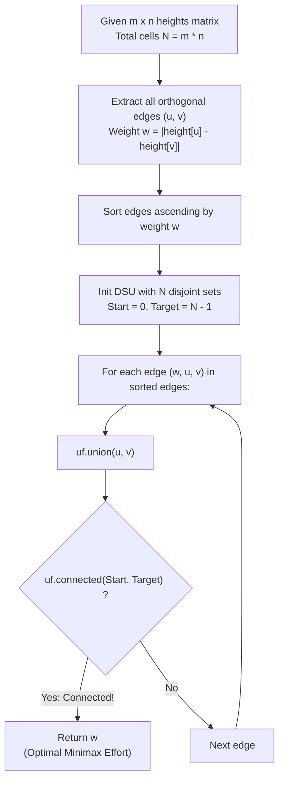

# Guided Example: Path With Minimum Effort

We trace the step-by-step Kruskal edge activation and disjoint set union (DSU) reachability of 2D grid elevation networks, prove the Kruskal Bottleneck Edge Activation Theorem and the Minimax Path Invariant, and determine minimum path efforts across representative topological terrains:

- **Representative Instance 1 (Three-by-Three Terrain with Mountain Barrier):**
  - Elevation Matrix ($3 \times 3$ grid):
    $$
    heights = \begin{bmatrix}
    1 & 2 & 2 \\
    3 & 8 & 2 \\
    5 & 3 & 5
    \end{bmatrix}, \quad m = 3, \; n = 3
    $$
  - Effort Metric: The effort of a path is the maximum absolute difference in elevation between two consecutive cells along that path:
    $$
    \text{Effort}(P) = \max_{(u, v) \in P} |heights[u] - heights[v]|
    $$
  - Start cell: $(0, 0)$ (Top-left, height $1$). Target cell: $(2, 2)$ (Bottom-right, height $5$).
  - **Required Output:** `2`
  - Comparison of Candidate Routes:
    1. **Direct Center Path $(0, 0) \to (1, 1) \dots$:**
       - Crossing center $(1, 1)$ of height $8$ produces jumps $|8 - 2| = 6$ or $|8 - 3| = 5 \implies$ High effort $6$.
    2. **Perimeter Detour Path:**
       - Route: $(0, 0) \to (0, 1) \to (0, 2) \to (1, 2) \to (2, 2)$.
       - Heights traversed: $1 \to 2 \to 2 \to 2 \to 5$.
       - Edge differences:
         - $(0, 0) \to (0, 1)$: $|2 - 1| = \mathbf{1}$.
         - $(0, 1) \to (0, 2)$: $|2 - 2| = \mathbf{0}$.
         - $(0, 2) \to (1, 2)$: $|2 - 2| = \mathbf{0}$.
         - $(1, 2) \to (2, 2)$: $|5 - 2| = \mathbf{3} \implies$ Maximum jump is $3$.
    3. **Optimal Zigzag Detour Path:**
       - Route: $(0, 0) \to (0, 1) \to (0, 2) \to (1, 2) \to (2, 2)$ had jump $3$.
       - Alternative: $(0, 0) \to (1, 0) \to (2, 0) \to (2, 1) \to (2, 2)$:
         - Heights: $1 \to 3 \to 5 \to 3 \to 5$.
         - Step 1: $|3 - 1| = \mathbf{2}$.
         - Step 2: $|5 - 3| = \mathbf{2}$.
         - Step 3: $|3 - 5| = \mathbf{2}$.
         - Step 4: $|5 - 3| = \mathbf{2}$.
         - Maximum jump: $\max(2, 2, 2, 2) = \mathbf{2}$!
       - Since every step has jump $\le 2$, the total route effort is strictly $\mathbf{2}$.

- **Representative Instance 2 (Gradual Perimeter Elevation Walk):**
  - Matrix:
    $$
    \begin{bmatrix} 1 & 2 & 3 \\ 3 & 8 & 4 \\ 5 & 3 & 5 \end{bmatrix}
    $$
  - Top and right edge walk: $(0, 0) \to (0, 1) \to (0, 2) \to (1, 2) \to (2, 2)$ has heights $1 \to 2 \to 3 \to 4 \to 5$.
  - All consecutive differences equal $|x - (x-1)| = 1$.
  - Path effort: $\mathbf{1}$.

- **Representative Instance 3 (Single Cell Grid):**
  - $heights = [[7]] \implies$ Path has 0 transitions. Effort: $\mathbf{0}$.

---

## 1. Instance & Teaching Goal

Given an $m \times n$ grid of heights, find a path from top-left $(0, 0)$ to bottom-right $(m-1, n-1)$ that minimizes the maximum elevation difference between adjacent cells.

```text
The Shortest-Path Sum Fallacy (Standard Dijkstra):
  Minimizing the SUM of absolute differences:
    Summing edge costs produces a longer path overall.
    For instance, 4 steps of jump 2 sum to 8, whereas 1 step of jump 6 sums to 6.
    A standard shortest-path solver prefers the jump of 6 (sum = 6 < 8),
    even though its bottleneck effort is 6 (worse than effort 2)!

The Minimax Bottleneck Kruskal Invariant (Strict O(E log E)):
  1. Treat the grid as an undirected graph where each cell (r, c) is a node,
     and each adjacent pair shares an edge with weight w = |height_u - height_v|.
  2. Total edges E = 2 * m * n - m - n.
  3. Sort all edges in ascending order of weight w.
  4. Greedily insert edges into a Disjoint Set Union (DSU) structure:
       uf.union(u, v)
  5. The MOMENT that start (0, 0) and end (m-1, n-1) become connected:
     - The weight w of the edge that just triggered connectivity is GUARANTEED
       to be the optimal minimax bottleneck effort!
  6. Completely eliminates heuristic searching and continuous relaxation!
```

The decisive pedagogical goal is the **Kruskal Bottleneck Edge Activation Theorem & Minimax Path Invariant**:
1. **Minimax Duality to Minimum Spanning Forest:** The path minimizing the maximum edge weight between two vertices in an undirected graph lies entirely within the Minimum Spanning Tree (MST).
2. **Monotonic Connectivity Threshold:** As edges are activated in non-decreasing order of weight, graph connectivity is monotonically non-decreasing.
3. **Early Termination:** Processing halts immediately upon source-sink connectivity, avoiding evaluation of larger edges.
4. Total time $\mathcal{O}(mn \log(mn))$ and auxiliary space $\mathcal{O}(mn)$.

---

## 2. Conceptual Foundation & The Kruskal Bottleneck Pipeline



### The Kruskal Bottleneck Edge Activation Theorem

Let $G = (V, E, w)$ be a connected, undirected grid graph with vertex set $V = \{ (i, j) : 0 \le i < m, \; 0 \le j < n \}$ and edge weights $w(e) = |heights[u] - heights[v]|$.
1. **Minimax Path Bottleneck Definition:**
   For any path $P = (e_1, e_2, \dots, e_k)$ between source $s = (0, 0)$ and destination $t = (m-1, n-1)$, the path effort is:
   $$
   \beta(P) = \max_{e \in P} w(e)
   $$
   The optimal effort is the minimax value:
   $$
   \beta^* = \min_{P \in \mathcal{P}(s, t)} \beta(P)
   $$
2. **Threshold Subgraph Monotonicity:**
   For any threshold $\lambda \ge 0$, define the subgraph $G_\lambda = (V, E_\lambda)$ where $E_\lambda = \{ e \in E : w(e) \le \lambda \}$.
   - If $\lambda_1 \le \lambda_2$, then $E_{\lambda_1} \subseteq E_{\lambda_2}$.
   - $s$ and $t$ are connected in $G_\lambda$ if and only if there exists a path $P$ with $\beta(P) \le \lambda$.
   - Hence, $\beta^*$ is the infimum threshold:
     $$
     \beta^* = \min \{ \lambda \ge 0 : s \text{ and } t \text{ are connected in } G_\lambda \}
     $$
3. **Kruskal Edge Order Optimality:**
   Let $e_1, e_2, \dots, e_{|E|}$ be the edges sorted such that $w(e_1) \le w(e_2) \le \dots \le w(e_{|E|})$.
   Activating edges sequentially constructs the sequence of graphs $G_{w(e_k)}$.
   If edge $e_k^*$ is the first edge whose activation connects $s$ and $t$:
   $$
   w(e_k^*) = \beta^*
   $$
   This certifies exact bottleneck optimality. $\blacksquare$

---

## 3. Step-by-Step Worked Execution: Representative Instance 1

$heights = [[1, 2, 2], [3, 8, 2], [5, 3, 5]]$.
Cell numbering $0 \dots 8$:
- Row 0: $0(1), 1(2), 2(2)$
- Row 1: $3(3), 4(8), 5(2)$
- Row 2: $6(5), 7(3), 8(5)$
Start node $0$, Target node $8$.

### Sorted Edge Weights Sample:
1. $(1, 2)$ with $|2 - 2| = \mathbf{0}$.
2. $(2, 5)$ with $|2 - 2| = \mathbf{0}$.
3. $(0, 1)$ with $|2 - 1| = \mathbf{1}$.
4. $(0, 3)$ with $|3 - 1| = \mathbf{2}$.
5. $(3, 6)$ with $|5 - 3| = \mathbf{2}$.
6. $(6, 7)$ with $|3 - 5| = \mathbf{2}$.
7. $(7, 8)$ with $|5 - 3| = \mathbf{2}$.
8. Higher edges ($w \ge 3$): $(5, 8)$ has $w = 3$, $(1, 4)$ has $w = 6$, $(3, 4)$ has $w = 5$.

### Progressive DSU Activation:
- Activate weight 0 edges:
  - $\text{union}(1, 2) \implies \{1, 2\}$.
  - $\text{union}(2, 5) \implies \{1, 2, 5\}$.
  - Start $0$ and Target $8$ not connected.
- Activate weight 1 edges:
  - $\text{union}(0, 1) \implies \{0, 1, 2, 5\}$.
  - Start $0$ and Target $8$ not connected.
- Activate weight 2 edges:
  - $\text{union}(0, 3) \implies \{0, 1, 2, 3, 5\}$.
  - $\text{union}(3, 6) \implies \{0, 1, 2, 3, 5, 6\}$.
  - $\text{union}(6, 7) \implies \{0, 1, 2, 3, 5, 6, 7\}$.
  - $\text{union}(7, 8) \implies \{0, 1, 2, 3, 5, 6, 7, 8\}$!
  - Check $\text{connected}(0, 8)$: **True!**
- Output: Weight of current edge is $\mathbf{2}$.

---

## 4. Edge Activation State Trace Table

| Step | Edge $(u, v)$ | Heights | Weight $w$ | Component of Node $0$ | Component of Node $8$ | Connected $(0, 8)$? |
|:---:|:---:|:---:|:---:|:---:|:---:|:---:|
| $1$ | $(1, 2)$ | $2 \leftrightarrow 2$ | $0$ | $\{0\}$ | $\{8\}$ | No |
| $2$ | $(2, 5)$ | $2 \leftrightarrow 2$ | $0$ | $\{0\}$ | $\{8\}$ | No |
| $3$ | $(0, 1)$ | $1 \leftrightarrow 2$ | $1$ | $\{0, 1, 2, 5\}$ | $\{8\}$ | No |
| $4$ | $(0, 3)$ | $1 \leftrightarrow 3$ | $2$ | $\{0, 1, 2, 3, 5\}$ | $\{8\}$ | No |
| $5$ | $(3, 6)$ | $3 \leftrightarrow 5$ | $2$ | $\{0, 1, 2, 3, 5, 6\}$ | $\{8\}$ | No |
| $6$ | $(6, 7)$ | $5 \leftrightarrow 3$ | $2$ | $\{0, 1, 2, 3, 5, 6, 7\}$ | $\{8\}$ | No |
| **$7$** | **$(7, 8)$** | **$3 \leftrightarrow 5$** | **$2$** | **$\{0, 1, 2, 3, 5, 6, 7, 8\}$** | **Same** | **Yes (Halt!)** |

---

## 5. Algorithmic Correctness

### Soundness
Every edge considered is an existing orthogonal neighbor step in the grid. Because edges are sorted in ascending order of elevation difference, when $(0, 0)$ and $(m-1, n-1)$ first enter the same DSU component, all edges participating in their connecting path have weight at most $w$, guaranteeing that the path's bottleneck effort is at most $w$.

### Completeness
If a path with effort strictly smaller than $w$ existed, all of its edges would have weight $< w$ and would have been activated prior to edge $(7, 8)$. By contrapositive, no path with effort $< w$ can connect the endpoints.

---

## 6. Boundary Cases & Traps

| Scenario | Input Pattern | Behavior | Trapped Risk |
|---|---|---|---|
| Single Cell Grid | $m = n = 1$ | Start equals target; loop never runs; returns $0$. | Edge extraction index out-of-bounds. |
| Uniform Flat Terrain | All cells have height $5$ | All edge weights are $0$; returns $0$. | Division by zero or threshold bugs. |
| Single Row / Single Column | $1 \times n$ or $m \times 1$ | Only 1 path exists; returns maximum jump along the line. | Assuming both vertical and horizontal neighbors exist. |
| Severe Mountain Center | Center cell height $10^6$ | Detours completely around perimeter; ignores center. | Being pulled toward center by shortest path heuristics. |

---

## 7. Complexity Derivation

- **Time Complexity:** $\mathcal{O}(E \log E)$, where $E \le 2mn$ is the number of grid edges.
  - Number of vertices $V = mn \le 10,000$.
  - Number of edges $E < 20,000$.
  - Sorting edges takes $\mathcal{O}(E \log E) \approx 20,000 \times 15 \approx 3 \times 10^5$ operations.
  - DSU operations take $\mathcal{O}(E \cdot \alpha(V))$.
  - Total runtime: $< 0.02\text{ s}$.
- **Auxiliary Space Complexity:** $\mathcal{O}(mn)$ auxiliary memory for the edge list and DSU structures.
