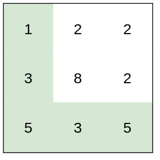
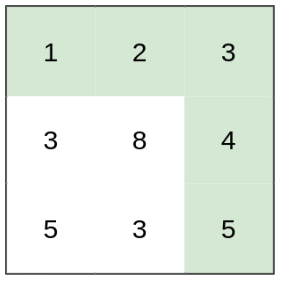
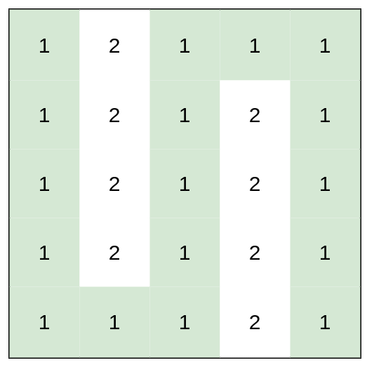

### 1. Description

You are a hiker preparing for an upcoming hike. You are given `heights`, a 2D array of size `rows x columns`, where $\text{heights}[row][col]$ represents the height of cell `(row, col)`. You are situated in the top-left cell, `(0, 0)`, and you hope to travel to the bottom-right cell, `(rows-1, columns-1)` (i.e., **0-indexed**). You can move **up**, **down**, **left**, or **right**, and you wish to find a route that requires the minimum **effort**.

A route's **effort** is the **maximum absolute difference**** **in heights between two consecutive cells of the route.

Return *the minimum **effort** required to travel from the top-left cell to the bottom-right cell.*

### 2. Function Contract

**Inputs**

- `heights`: Input parameter (`List[List[int]]`).

**Return value**

- Returns `int`.

### 3. Examples

#### Example 1

- **Input:** $heights = [[1,2,2],[3,8,2],[5,3,5]]$
- **Output:** `2`
- **Explanation:** The route of [1,3,5,3,5] has a maximum absolute difference of 2 in consecutive cells.
This is better than the route of [1,2,2,2,5], where the maximum absolute difference is 3.

#### Example 2

- **Input:** $heights = [[1,2,3],[3,8,4],[5,3,5]]$
- **Output:** `1`
- **Explanation:** The route of [1,2,3,4,5] has a maximum absolute difference of 1 in consecutive cells, which is better than route [1,3,5,3,5].

#### Example 3

- **Input:** $heights = [[1,2,1,1,1],[1,2,1,2,1],[1,2,1,2,1],[1,2,1,2,1],[1,1,1,2,1]]$
- **Output:** `0`
- **Explanation:** This route does not require any effort.

### 4. Constraints

- $rows = \text{heights.length}$

- $columns = \text{heights}[i].length$

- $1 \le rows, columns \le 100$

- $1 \le \text{heights}[i][j] \le 10^{6}$
