[TOC]

## Solution
---

#### Overview ####

The problem is that given a 2D matrix $\text{heights}$ of size $\text{row} \cdot \text{col}$ representing the height of each cell, we have travel from top right corner `(0, 0)` to bottom right corner `(row-1, col-1)` of the matrix and find a path with minimum effort. The effort to move from one cell to another is the absolute difference in the heights of those cells.

The following example illustrates the effort required to travel from cell `A` to all the neighboring cells `B`,`C`, `D`, and `E`.  The first matrix represents the heights of each cell and the second represents the absolute difference from cell `A` to all the adjacent cells. The path with minimum effort is from cell `A` to cell `E`.

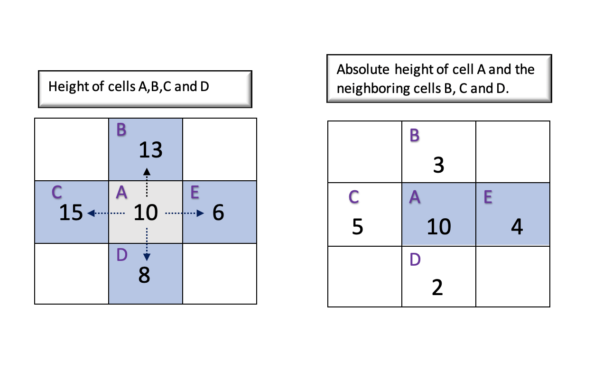

Let's understand the different approaches to implement the solution in detail.

---

#### Approach 1: Brute Force using Backtracking

**Intuition**

The brute force approach would be to traverse all the possible paths from the source cell to the destination cell and track the path with minimum efforts. To try all possible paths, the first thing that comes in our mind is [Backtracking](https://leetcode.com/explore/learn/card/recursion-ii/472/backtracking/2654/). Backtracking incrementally builds the candidates for a solution using depth first search and discards the candidates (backtrack) if it doesn't satisfy the condition.

The backtracking algorithms consists of the following steps,

- _Choose_: Choose the potential candidate. For any given cell A, we must choose the adjacent cells in all 4 directions (up, down, left, right) as a potential candidate.
- _Constraint_: Define a constraint that must be satisfied by the chosen candidate. In this case, a chosen cell is valid if it is within the boundaries of the matrix and it is not visited before.
- _Goal_: We must define the goal that determines if we have found the required solution and we must backtrack. Here, our goal is achieved once we have reached the destination cell. On reaching the destination cell, we must track the maximum absolute difference in that path and backtrack.

> To make the algorithm more efficient, once we find any path from source to destination, we track the maximum absolute difference of all adjacent cells in that path in a variable $\text{maxSoFar}$. With this, we can avoid going into other paths in the future where effort is greater than or equal to $\text{maxSoFar}$.
>
>In other words, if we have already found a path to reach the destination cell with $\text{maxSoFar}$, then, we would only explore other paths if it takes efforts less than $\text{maxSoFar}$.

**Algorithm**

We must begin the Depth First Search traversal from source cell $(x = 0 and y = 0)$. Using the intuition discussed above, we must explore all the potential paths using the following steps,

- For a given cell `(x, y)`, explore the adjacent cells in all the 4 directions defined by `directions` and choose the one with minimum effort.
- The `maxDifference` keeps track of the maximum absolute difference seen so far in the current path. On every move to the adjacent cell, we must update the `maxDifference` if it is lesser than the `currentDifference` (The absolute difference between current cell`(x, y)` and adjacent cell`(adjacentX, adjacentY)`).
-  We must backtrack from the depth first search traversal once we reach the destination cell `(row-1)` and `(col-1)` and return the maximum absolute difference of the current path.

Thus, for each cell, we recursively calculate the effort required to reach the destination cell from all the adjacent cells and find the minimum effort.

**Note**

It must be noted that we mark the current cell as visited by setting the height of the current cell `(x,y)` as 0. We must update the height back to the previous value once we backtrack from the current path. This is necessary because the cell must be visited again for other paths.

**Implementation**

```python
class Solution:
    def minimumEffortPath(self, heights: List[List[int]]) -> int:
        row = len(heights)
        col = len(heights[0])
        self.max_so_far = math.inf

        def dfs(x, y, max_difference):
            if x == row-1 and y == col-1:
                self.max_so_far = min(self.max_so_far, max_difference)
                return max_difference
            current_height = heights[x][y]
            heights[x][y] = 0
            min_effort = math.inf
            for dx, dy in [[0, 1], [1, 0], [0, -1], [-1, 0]]:
                adjacent_x = x + dx
                adjacent_y = y + dy
                if 0 <= adjacent_x < row and 0 <= adjacent_y < col and heights[
                        adjacent_x][adjacent_y] != 0:
                    current_difference = abs(
                        heights[adjacent_x][adjacent_y]-current_height)
                    max_current_difference = max(
                        max_difference, current_difference)
                    if max_current_difference < self.max_so_far:
                        result = dfs(adjacent_x, adjacent_y,
                                     max_current_difference)
                        min_effort = min(min_effort, result)
            heights[x][y] = current_height
            return min_effort

        return dfs(0, 0, 0)
```

**Complexity Analysis**

Let $m$ be the number of rows and $n$ be the number of columns in the matrix $\text{heights}$.
- Time Complexity : $\mathcal{O}(3^{m \cdot n})$. The total number of cells in the matrix is given by $m \cdot n$. For the backtracking, there are at most 4 possible directions to explore, but further, the choices are reduced to 3 (since we won't go back to where we come from). Thus, considering 3 possibilities for every cell in the matrix the time complexity would be $\mathcal{O}(3^{m \cdot n})$.

The time complexity is exponential, hence this approach is exhaustive and results in _Time Limit Exceeded (TLE)_.

- Space Complexity: $\mathcal{O}(m \cdot n)$ This space will be used to store the recursion stack. As we recursively move to the adjacent cells, in the worst case there could be $m \cdot n$ cells in the recursive call stack.

---

#### Approach 2: Variations of Dijkstra's Algorithm

**Intuition**

The previous approach is exhaustive as it traverses all the paths. If we observe, the problem is similar to finding the shortest path from a source cell to a destination cell. Here, the shortest path is the one with **minimum absolute difference** between every adjacent cells in that path. Also, since there is height associated with each cell, simple BFS traversal won't be sufficient.

The _absolute difference_ between adjacent cells `A` and `B` can be perceived as the weight of an edge from cell `A` to cell `B`. Thus, we could use [Dijkstra's Algorithm](https://en.wikipedia.org/wiki/Dijkstra%27s_algorithm) which is used to find the shortest path in a weighted graph with a slight modification of criteria for the shortest path.

Let's look at the algorithm in detail.

**Algorithm**

-  We use a `differenceMatrix` of size $\text{row} \cdot \text{col}$ where each cell represents the minimum effort required to reach that cell from all the possible paths.
Also, initialize we all the cells in the `differenceMatrix` to infinity $\text{(MAX\\\_INT)}$ since none of the cells are reachable initially.

- As we start visiting each cell, all the adjacent cells are now reachable. We update the _absolute difference_ between the current cell and adjacent cells in the `differenceMatrix`. At the same time, we also push all the adjacent cells in a priority queue. The priority queue holds all the reachable cells sorted by its value in `differenceMatrix`, i.e the cell with  _minimum absolute difference_ with its adjacent cells would be at the top of the queue.
- We begin by adding the source cell `(x=0, y=0)` in the queue. Now, until we have visited the destination cell or the queue is not empty, we visit each cell in the queue sorted in the order of priority. The less is the difference value(absolute difference with adjacent cell) of a cell, the higher is its priority.

     - Get the cell from the top of the queue `curr` and visit the current cell.

     - For each of the 4 cells adjacent to the current cell, calculate the `maxDifference` which is the _maximum absolute difference_  to reach the adjacent cell `(adjacentX, adjacentY)` from current cell `(curr.x, curr.y)`.

      - If the current value of the adjacent cell `(adjacentX, adjacentY)` in the difference matrix is greater than the `maxDifference`, we must update that value with `maxDifference`. In other words, we have found that the path from the current cell to the adjacent cell takes lesser efforts than the other paths that have reached the adjacent cell so far. Also, we must add this updated difference value in the queue.

>Ideally, for updating the priority queue, we must delete the old value and reinsert with the new `maxDifference` value. But, as we know that the updated maximum value is always lesser than the old value and would be popped from the queue and visited before the old value, we could save time and avoid removing the old value from the queue.

- At the end, the value at $differenceMatrix[row - 1][col - 1]$ is the minimum effort required to reach the destination cell `(row-1,col-1)`.

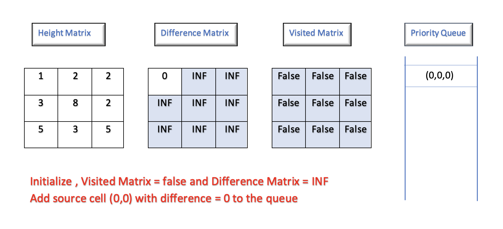

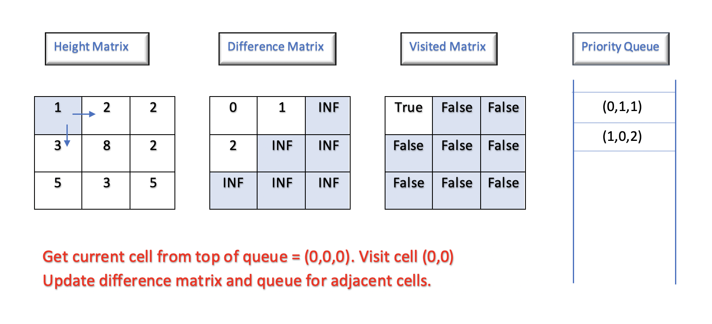

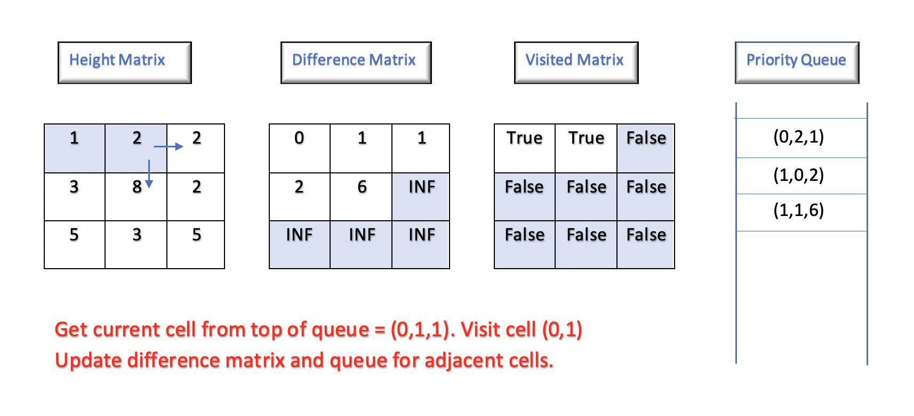

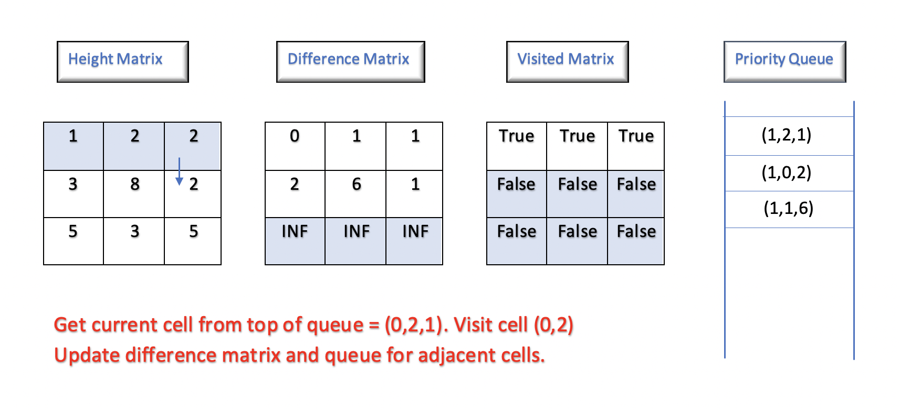

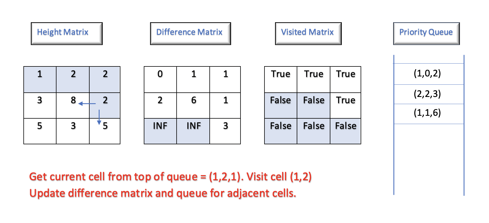

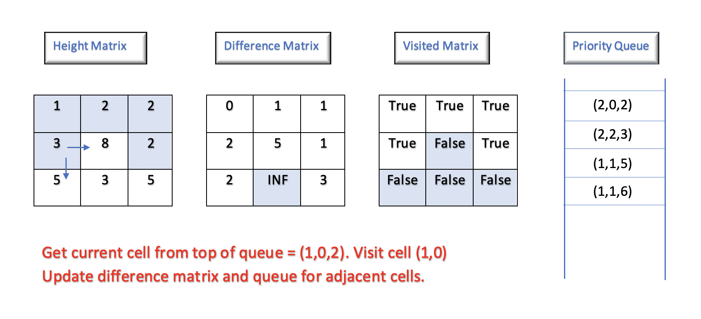

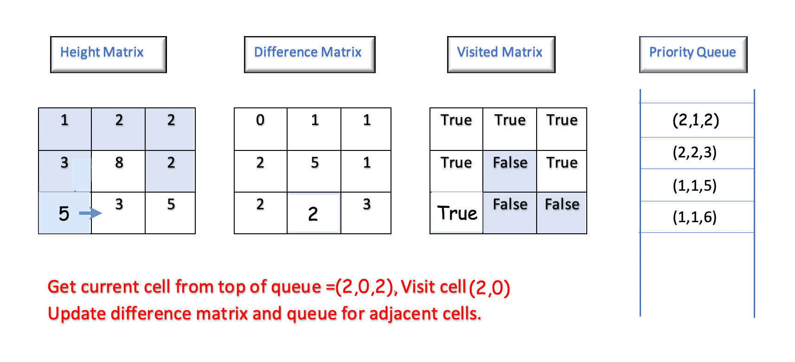

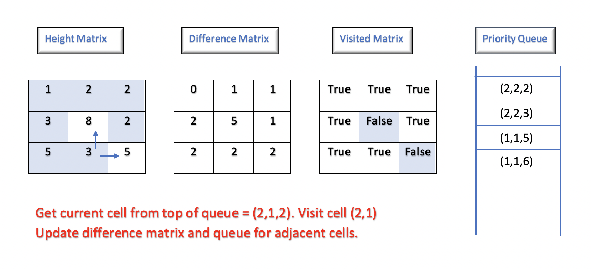

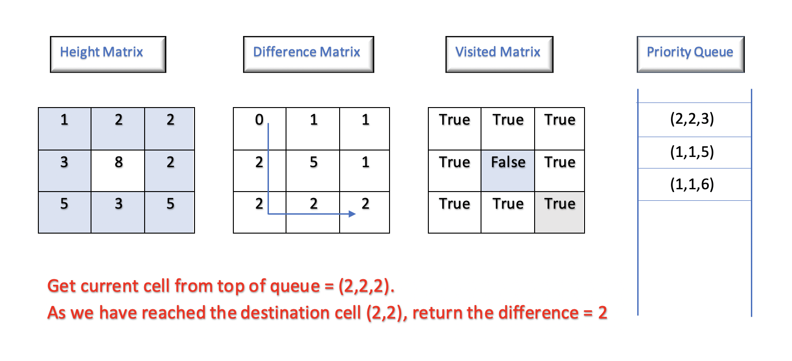

**Implementation**

```python
class Solution:
    def minimumEffortPath(self, heights: List[List[int]]) -> int:
        row = len(heights)
        col = len(heights[0])
        difference_matrix = [[math.inf]*col for _ in range(row)]
        difference_matrix[0][0] = 0
        visited = [[False]*col for _ in range(row)]
        queue = [(0, 0, 0)]  # difference, x, y
        while queue:
            difference, x, y = heapq.heappop(queue)
            visited[x][y] = True
            for dx, dy in [[0, 1], [1, 0], [0, -1], [-1, 0]]:
                adjacent_x = x + dx
                adjacent_y = y + dy
                if 0 <= adjacent_x < row and 0 <= adjacent_y < col and not visited[
                        adjacent_x][adjacent_y]:
                    current_difference = abs(
                        heights[adjacent_x][adjacent_y]-heights[x][y])
                    max_difference = max(
                        current_difference, difference_matrix[x][y])
                    if difference_matrix[adjacent_x][adjacent_y] > max_difference:
                        difference_matrix[adjacent_x][adjacent_y] = max_difference
                        heapq.heappush(
                            queue, (max_difference, adjacent_x, adjacent_y))
        return difference_matrix[-1][-1]
```

**Complexity Analysis**

- Time Complexity : $\mathcal{O}(m \cdot n \log (m \cdot n))$, where $m$ is the number of rows and $n$ is the number of columns in matrix $\text{heights}$.
It will take $\mathcal{O}(m \cdot n)$ time to visit every cell in the matrix. The priority queue will contain at most $m \cdot n$ cells, so it will take $\mathcal{O}(\log (m \cdot n))$ time to re-sort the queue after every adjacent cell is added to the queue.
This given as total time complexiy as $\mathcal{O}(m \cdot n \log(m \cdot n))$.

- Space Complexity: $\mathcal{O}(m \cdot n)$, where $m$ is the number of rows and $n$ is the number of columns in matrix $\text{heights}$.
The maximum queue size is equal to the total number of cells in the matrix $\text{height}$ which is given by $m \cdot n$. Also, we use a difference matrix of size $m \cdot n$. This gives as time complexity as $\mathcal{O}(m \cdot n + m \cdot n)$ = $\mathcal{O}(m \cdot n)$

---

#### Approach 3: Union Find - Disjoint Set

**Intuition**

Using [Disjoint Set](https://en.wikipedia.org/wiki/Disjoint-set_data_structure) is another intuitive way to solve the problem. Each cell in the matrix is a single node/component in a graph. The path from the current cell to adjacent cells is an edge connecting the 2 cells. Using this intuition, we could use _Union Find_ algorithm to form a connected component from the source cell to the destination cell.

Initially, every cell is a disconnected component and we aim to form a single connected component that connects the source cell to the destination cell.  Each connected component connects multiple cells and is identified by a parent. We must continue connecting components until the source cell and destination cell shares the same parent.

The union find algorithm performs 2 operations,

`Find(x)`: Returns the parent of the connected component to which `x` belongs.

`Union(x, y)`: Merges the two disconnected components to which `x` and `y` belongs.

To efficiently implement the above operations, we could use _Union By Rank_ and _Path Compression_ strategy.

**Algorithm**

- Initially, each cell is a disconnected component, so we initialize each cell as a parent of itself. Also we flatten a 2D matrix into a 1D matrix of size $row * col$ and each cell `(currentRow, currentCol)` in a 2D matrix can be stored at $(currentRow * col + currentCol)$ in a 1D matrix.
The below figure illustrates this idea.

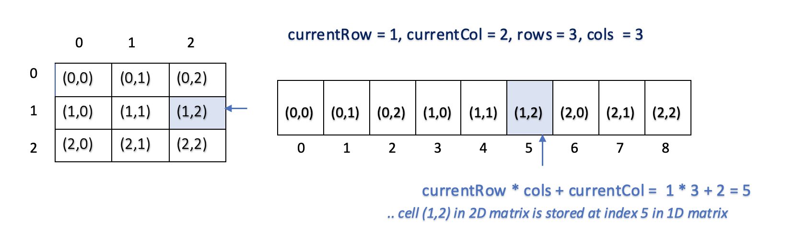

- We also build an `edgeList` which consists of the _absolute difference_ between every adjacent cell in the matrix. We also sort the edge list in non-decreasing order of difference. The below example illustrates the edge list of given heights matrix `[[1,2,2],[3,8,2],[5,3,5]]` sorted by difference.

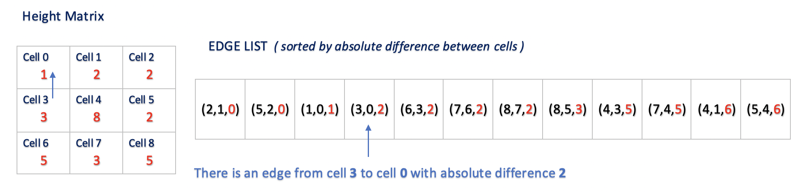

- Start iterating over the sorted edge list and connect each edge to form a connected component using Union Find Algorithm.

- After every union, check if the source cell `(0)` and destination cell $(row * col - 1)$ are connected. If yes, the absolute difference between the current edge is our result.
Since we access the edges in increasing order of difference, and the current edge connected the source and destination cell, we are sure that the current difference is the maximum absolute difference in our path with minimum efforts.

**Implementation**

```python
class Solution:
    def minimumEffortPath(self, heights: List[List[int]]) -> int:
        class UnionFind:
            def __init__(self, size):
                self.parent = [x for x in range(size)]
                self.rank = [0]*(size)

            def find(self, i):
                if self.parent[i] != i:
                    self.parent[i] = self.find(self.parent[i])
                return self.parent[i]

            def union(self, x, y):
                parent_x = self.find(x)
                parent_y = self.find(y)
                if parent_x != parent_y:
                    if self.rank[parent_x] > self.rank[parent_y]:
                        self.parent[parent_y] = parent_x
                    elif self.rank[parent_x] < self.rank[parent_y]:
                        self.parent[parent_x] = parent_y
                    else:
                        self.parent[parent_y] = parent_x
                        self.rank[parent_x] += 1

        row = len(heights)
        col = len(heights[0])
        if row == 1 and col == 1:
            return 0

        edge_list = []
        for current_row in range(row):
            for current_col in range(col):
                if current_row > 0:
                    difference = abs(
                        heights[current_row][current_col] -
                        heights[current_row - 1][current_col])
                    edge_list.append(
                        (difference, current_row * col + current_col,
                         (current_row - 1) * col + current_col))
                if current_col > 0:
                    difference = abs(
                        heights[current_row][current_col] -
                        heights[current_row][current_col - 1])
                    edge_list.append(
                        (difference, current_row * col + current_col, current_row
                         * col + current_col - 1))
        edge_list.sort()
        union_find = UnionFind(row*col)

        for difference, x, y in edge_list:
            union_find.union(x, y)
            if union_find.find(0) == union_find.find(row*col-1):
                return difference
        return -1
```

**Complexity Analysis**

Let $m$ be the number of rows and $n$ be the number of columns of the matrix $\text{height}$.
- Time Complexity : $\mathcal{O}(m\cdot n(\log(m\cdot n)))$. We iterate each edge in the matrix. From the above example, it is evident that for a matrix of size $3 \cdot3$, the total number of edges are $12$.  Thus, for a $m \cdot n$ matrix,  the total number of edges could be given by $(m\cdot n \cdot 2)-(m+n)$ $(3*3*2) - (3+3))$, which is roughly equivalent to $m \cdot n$.

For every edge, we `find` the parent of each cell and perform the `union` (Union Find). For $n$ elements, the time complexity of Union Find is $\log n$. (Refer [Proof Of Time Complexity Of Union Find](https://en.wikipedia.org/wiki/Proof_of_O(log*n)_time_complexity_of_union%E2%80%93find)). Thus for $m \cdot n$ cells, the time taken to perform Union Find would be $\log m \cdot n$.  This gives us total time complexity as, $\mathcal{O}(m\cdot n(\log(m\cdot n)))$.
- Space Complexity : $\mathcal{O}(m \cdot n)$ , we use arrays `edgeList`, `parent`, and `rank` of size $m \cdot n$.

---

#### Approach 4: Binary Search Using BFS

**Intuition**

Our aim to find the minimum effort required to travel from source cell to destination cell. We know from the given constraints that the maximum height could be $10^6 (1000000)$. So we know that our required absolute difference values would between $0$ and  $10^6$. We could use [Binary Search](https://leetcode.com/explore/learn/card/binary-search/) and reduce our search space by half.

Given the lower bound as $0$ and upper bound as $10^6$, we could repeatedly calculate the middle value. Let this middle value be `mid`. We could divide our search space based on the following condition,

- If there exists a path from the source cell to the destination cell with the effort less than the value `mid`, we know that the required minimum effort value lies between lower bound $0$ and `mid`.
- Similarly, if there doesn't exist any path from a source cell to destination cell with the effort less than the value `mid`, we know that the required minimum effort value lies between `mid` and upper bound $10^6$ .

To find if there exists a path from the source cell to the destination cell for a given `mid` value, we could use simple graph traversal. In this approach, we use [Breadth First Search](https://leetcode.com/explore/learn/card/queue-stack/231/practical-application-queue/1376/) traversal.

**Algorithm**

- Intialize the lower bound `left` as $0$ and upper bound `right` as $10^6$. Calculate the middle value  `mid ` of  the `left` and `right` value.

- Using Breadth First Search, check if there exists a path from source cell `(x=0, y=0)` to destination cell `(x=row-1, y=column-1)` with effort less than or equal to `mid` using method `canReachDestination` which returns a boolean value.
- If a path exists from the source to the destination with the current `mid` value as the maximum allowed effort,the `result` is updated to the minimum of the current `result` and `mid`. This is because `mid` represents a potential solution, and you want to find the minimum possible effort.
- To continue searching for potentially smaller valid efforts, the right boundary of the binary search range is updated to $mid - 1$.
- If no path exists with the current `mid`, then you need to increase the effort, so you update the left boundary of the search range to $mid + 1$.

**Implementation**

```python
class Solution:
    def minimumEffortPath(self, heights: List[List[int]]) -> int:
        row = len(heights)
        col = len(heights[0])

        def canReachDestinaton(mid):
            visited = [[False]*col for _ in range(row)]
            queue = [(0, 0)]  # x, y
            while queue:
                x, y = queue.pop(0)
                if x == row-1 and y == col-1:
                    return True
                visited[x][y] = True
                for dx, dy in [[0, 1], [1, 0], [0, -1], [-1, 0]]:
                    adjacent_x = x + dx
                    adjacent_y = y + dy
                    if 0 <= adjacent_x < row and 0 <= adjacent_y < col and not visited[adjacent_x][adjacent_y]:
                        current_difference = abs(
                            heights[adjacent_x][adjacent_y]-heights[x][y])
                        if current_difference <= mid:
                            visited[adjacent_x][adjacent_y] = True
                            queue.append((adjacent_x, adjacent_y))

        left = 0
        right = 10000000
        while left < right:
            mid = (left + right)//2
            if canReachDestinaton(mid):
                right = mid
            else:
                left = mid + 1
        return left
```

**Complexity Analysis**

Let $m$ be the number of rows and $n$ be the number of columns for the matrix $\text{height}$.
- Time Complexity : $\mathcal{O}(m \cdot n)$. We do a binary search to calculate the `mid` values and then do Breadth First Search on the matrix for each of those values.

_Binary Search_:To perform Binary search on numbers in range $(0.. 10^{6})$, the time taken would be $\mathcal{O}(\log 10^{6})$.

_Breadth First Search_: The time complexity for the Breadth First Search for vertices V and edges E is $\mathcal{O}(V+E)$  ([See our Explore Card on BFS](https://leetcode.com/explore/learn/card/queue-stack/231/practical-application-queue/1376/))
Thus, in the matrix of size $m \cdot n$, with $m \cdot n$ vertices and $m \cdot n$ edges (Refer time complexity of _Approach 3_), the time complexity to perform Breadth First Search would be $\mathcal{O}(m \cdot n + m \cdot n)$ = $\mathcal{O}(m \cdot n)$.

This gives us total time complexity as $\mathcal{O}(\log10^{6}\cdot(m \cdot n))$ which is equivalent to $\mathcal{O}(m \cdot n)$.
- Space Complexity: $\mathcal{O}(m \cdot n)$, as we use a queue and visited array of size $m \cdot n$

---

#### Approach 5: Binary Search Using DFS

**Intuition and Algorithm**

The solution is similar to _Approach 4_. Except that, here, we use a Depth First Search traversal to find if there exists a path from the source cell to destination cell for a given value middle value `mid`.

**Implementation**

```python
class Solution:
    def minimumEffortPath(self, heights: List[List[int]]) -> int:
        row = len(heights)
        col = len(heights[0])

        def canReachDestinaton(x, y, mid):
            if x == row-1 and y == col-1:
                return True
            visited[x][y] = True
            for dx, dy in [[0, 1], [1, 0], [0, -1], [-1, 0]]:
                adjacent_x = x + dx
                adjacent_y = y + dy
                if 0 <= adjacent_x < row and 0 <= adjacent_y < col and not visited[
                        adjacent_x][adjacent_y]:
                    current_difference = abs(
                        heights[adjacent_x][adjacent_y]-heights[x][y])
                    if current_difference <= mid:
                        visited[adjacent_x][adjacent_y] = True
                        if canReachDestinaton(adjacent_x, adjacent_y, mid):
                            return True
        left = 0
        right = 10000000
        while left < right:
            mid = (left + right)//2
            visited = [[False]*col for _ in range(row)]
            if canReachDestinaton(0, 0, mid):
                right = mid
            else:
                left = mid + 1
        return left
```

**Complexity Analysis**

- Time Complexity : $\mathcal{O}(m \cdot n)$. As in _Approach 4_. The only difference is that we are using Depth First Search instead of Breadth First Search and have similar time complexity.

- Space Complexity: $\mathcal{O}(m \cdot n)$, As in _Approach 4_. In Depth First Search, we use the internal call stack (instead of the queue in Breadth First Search).