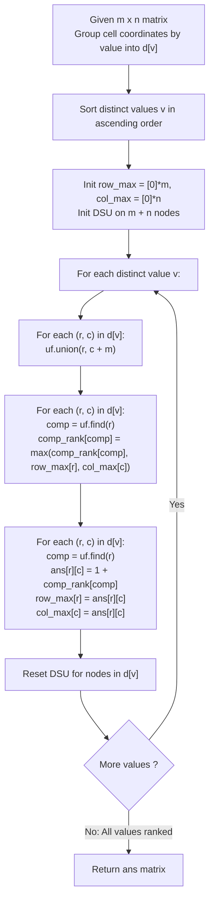

# Guided Example: Rank Transform of a Matrix

We trace the step-by-step bipartite connected component clustering and row-column rank relaxation of matrix elements, prove the Bipartite Component Equivalence Invariant and the Monotonic Grouped DSU Rank Theorem, and assign minimal rank matrices across representative numeric grids:

- **Representative Instance 1 (Two-by-Two Matrix with Increasing Diagonal):**
  - Input Grid ($2 \times 2$ matrix):
    $$
    matrix = \begin{bmatrix}
    1 & 2 \\
    3 & 4
    \end{bmatrix}, \quad m = 2, \; n = 2
    $$
  - Rank Transformation Axioms:
    1. The rank of each cell is a positive integer $\ge 1$.
    2. Equal values in the same row or column must receive the exact same rank.
    3. If cell $A$ is strictly greater than cell $B$ in the same row or column, $\text{rank}(A) > \text{rank}(B)$.
    4. Ranks must be as small as possible.
  - **Required Output:**
    $$
    \begin{bmatrix}
    1 & 2 \\
    2 & 3
    \end{bmatrix}
    $$
  - Step-by-step resolution by ascending value groups:
    - Running frontier maxima: $row\_max = [0, 0]$, $col\_max = [0, 0]$.
    1. **Process Value $v = 1$ at cell $(0, 0)$:**
       - Base dependency: $\max(row\_max[0], col\_max[0]) = \max(0, 0) = 0$.
       - Rank: $1 + 0 = \mathbf{1}$.
       - Update frontier: $row\_max[0] \leftarrow 1, \; col\_max[0] \leftarrow 1$.
       - Matrix state: cell $(0, 0) = 1$.
    2. **Process Value $v = 2$ at cell $(0, 1)$:**
       - Cell $(0, 1)$ shares row $0$ with cell $(0, 0)$ of value $1$.
       - Constraint: $\text{rank}(0, 1) > \text{rank}(0, 0) = 1$.
       - Base dependency: $\max(row\_max[0], col\_max[1]) = \max(1, 0) = 1$.
       - Rank: $1 + 1 = \mathbf{2}$.
       - Update frontier: $row\_max[0] \leftarrow 2, \; col\_max[1] \leftarrow 2$.
    3. **Process Value $v = 3$ at cell $(1, 0)$:**
       - Cell $(1, 0)$ shares column $0$ with cell $(0, 0)$ of value $1$.
       - Constraint: $\text{rank}(1, 0) > \text{rank}(0, 0) = 1$.
       - Base dependency: $\max(row\_max[1], col\_max[0]) = \max(0, 1) = 1$.
       - Rank: $1 + 1 = \mathbf{2}$.
       - Update frontier: $row\_max[1] \leftarrow 2, \; col\_max[0] \leftarrow 2$.
    4. **Process Value $v = 4$ at cell $(1, 1)$:**
       - Cell $(1, 1)$ shares row $1$ with cell $(1, 0)$ (rank $2$), and column $1$ with cell $(0, 1)$ (rank $2$).
       - Constraint: $\text{rank}(1, 1) > \max(\text{rank}(1, 0), \text{rank}(0, 1)) = 2$.
       - Base dependency: $\max(row\_max[1], col\_max[1]) = \max(2, 2) = 2$.
       - Rank: $1 + 2 = \mathbf{3}$.
       - Final matrix:
         $$
         ans = \begin{bmatrix} 1 & 2 \\ 2 & 3 \end{bmatrix}
         $$

- **Representative Instance 2 (All Cells Equal Sharing Rank One):**
  - Input:
    $$
    matrix = \begin{bmatrix} 7 & 7 \\ 7 & 7 \end{bmatrix}
    $$
  - All four cells share value $7$ and form a single connected component via shared rows and columns.
  - Base dependency is $0$. Rank for all cells is $1 + 0 = \mathbf{1}$.
  - Result:
    $$
    \begin{bmatrix} 1 & 1 \\ 1 & 1 \end{bmatrix}
    $$

- **Representative Instance 3 (Transitive Equivalence Chain):**
  - Two equal values $(r_1, c_1)$ and $(r_2, c_2)$ that do not share a row or column directly, but are linked through $(r_1, c_2)$ having the same value, must receive the exact same rank.

---

## 1. Instance & Teaching Goal

Given an $m \times n$ integer matrix, calculate the rank matrix where equal values in the same row or column share the same rank, strictly larger values have strictly larger ranks, and all ranks are minimized.

```text
The Independent Row/Column Sorting Anti-Pattern:
  Ranking each row independently and each column independently:
    Row ranks and column ranks conflict!
    A cell might receive rank 2 from its row but rank 4 from its column.
    Harmonizing them naively causes circular dependencies.

The Bipartite DSU Connected Component Invariant:
  1. Group all coordinates by cell value: d[v] = [(r, c), ...]
  2. For a fixed value v, two cells (r1, c1) and (r2, c2) MUST receive identical rank
     if they share a row (r1 == r2) or column (c1 == c2), or are transitively linked!
  3. Model rows and columns as nodes in a bipartite graph:
       Row nodes: 0 .. m-1
       Column nodes: m .. m+n-1
       For each (r, c) with value v: union(r, c + m)
  4. Each connected component C of value v must be assigned:
       rank(C) = 1 + max_{(r, c) in C} max(row_max[r], col_max[c])
  5. Assign this unified rank to ALL cells in component C,
     and update row_max and col_max accordingly.
  Evaluates in sorted value order O(M * N * alpha(M + N)).
```

The decisive pedagogical goal is the **Bipartite Component Equivalence Invariant & Monotonic Grouped DSU Rank Theorem**:
1. **Transitive Equivalence Partitioning:** The rule $\text{val}(A) = \text{val}(B) \implies \text{rank}(A) = \text{rank}(B)$ across shared lines defines an equivalence relation whose equivalence classes are the connected components of the row-column incidence graph.
2. **Unified Component Ceiling:** The rank of an equivalence class is constrained by the maximum historical rank across all rows and columns touching that class.
3. **Ascending Value Invariance:** Processing distinct values in strictly ascending order guarantees that all smaller predecessor values have already committed their row and column maxima.
4. Total time $\mathcal{O}(mn \log(mn))$ and auxiliary space $\mathcal{O}(mn)$.

---

## 2. Conceptual Foundation & The Bipartite Component Pipeline



### The Monotonic Grouped DSU Rank Theorem

Let $M \in \mathbb{Z}^{m \times n}$ be an $m \times n$ matrix.
1. **Row-Column Bipartite Graph:**
   For a fixed value $v$, define the bipartite graph $G_v = (R \cup C, E_v)$ where $R = \{r_0, \dots, r_{m-1}\}$, $C = \{c_0, \dots, c_{n-1}\}$, and:
   $$
   (r_i, c_j) \in E_v \iff M_{i, j} = v
   $$
2. **Equivalence Class Lemma:**
   Let $\mathcal{K}_1, \mathcal{K}_2, \dots, \mathcal{K}_p$ be the connected components of $G_v$.
   Any valid rank assignment $\rho : \{0, \dots, m-1\} \times \{0, \dots, n-1\} \to \mathbb{Z}^+$ must satisfy:
   $$
   (i, j) \in \mathcal{K}_q \land (i', j') \in \mathcal{K}_q \implies \rho(i, j) = \rho(i', j')
   $$
   *Proof.*
   If $(i, j)$ and $(i', j)$ share column $j$, rule 2 dictates $\rho(i, j) = \rho(i', j)$. By induction across edges in the connected component $\mathcal{K}_q$, all cells in $\mathcal{K}_q$ must share the same rank. $\blacksquare$
3. **Component Rank Lower Bound:**
   Because all values strictly smaller than $v$ have already been assigned ranks, let $R_{\max}(i)$ and $C_{\max}(j)$ be the maximum ranks assigned so far in row $i$ and column $j$.
   To satisfy $\rho(i, j) > R_{\max}(i)$ and $\rho(i, j) > C_{\max}(j)$ for all $(i, j) \in \mathcal{K}_q$, the minimal valid rank is:
   $$
   \rho^*(\mathcal{K}_q) = 1 + \max_{(i, j) \in \mathcal{K}_q} \Big( \max(R_{\max}(i), C_{\max}(j)) \Big)
   $$
4. **Optimality and Monotonicity:**
   Because $\rho^*(\mathcal{K}_q)$ is the pointwise minimum integer satisfying all strict inequalities across all rows and columns touching $\mathcal{K}_q$, the rank matrix is globally minimal.

---

## 3. Step-by-Step Worked Execution: Representative Instance 1

$matrix = \begin{bmatrix} 1 & 2 \\ 3 & 4 \end{bmatrix}$.

### Value Iteration Trace
- **Value $v = 1$ (Cell $(0, 0)$):**
  - Edge $(0, 0+2) = (0, 2)$. DSU component has row $0$, col $0$.
  - Dependency: $\max(row\_max[0], col\_max[0]) = \max(0, 0) = 0$.
  - Rank: $1 + 0 = \mathbf{1}$.
  - $ans[0][0] = 1, \; row\_max[0] = 1, \; col\_max[0] = 1$.
- **Value $v = 2$ (Cell $(0, 1)$):**
  - Edge $(0, 1+2) = (0, 3)$. DSU component has row $0$, col $1$.
  - Dependency: $\max(row\_max[0], col\_max[1]) = \max(1, 0) = 1$.
  - Rank: $1 + 1 = \mathbf{2}$.
  - $ans[0][1] = 2, \; row\_max[0] = 2, \; col\_max[1] = 2$.
- **Value $v = 3$ (Cell $(1, 0)$):**
  - Edge $(1, 0+2) = (1, 2)$. DSU component has row $1$, col $0$.
  - Dependency: $\max(row\_max[1], col\_max[0]) = \max(0, 1) = 1$.
  - Rank: $1 + 1 = \mathbf{2}$.
  - $ans[1][0] = 2, \; row\_max[1] = 2, \; col\_max[0] = 2$.
- **Value $v = 4$ (Cell $(1, 1)$):**
  - Edge $(1, 1+2) = (1, 3)$. DSU component has row $1$, col $1$.
  - Dependency: $\max(row\_max[1], col\_max[1]) = \max(2, 2) = 2$.
  - Rank: $1 + 2 = \mathbf{3}$.
  - $ans[1][1] = 3, \; row\_max[1] = 3, \; col\_max[1] = 3$.

Final Rank Matrix:
$$
\begin{bmatrix} 1 & 2 \\ 2 & 3 \end{bmatrix}
$$

---

## 4. Bipartite Component State Trace Table

| Value $v$ | Cell Coordinates $(r, c)$ | Bipartite DSU Edges | Prior Row Max | Prior Col Max | Component Rank $\rho$ | Cells Assigned |
|:---:|:---:|:---:|:---:|:---:|:---:|:---:|
| $1$ | $(0, 0)$ | $(r_0 \leftrightarrow c_0)$ | $0$ | $0$ | $1 + 0 = \mathbf{1}$ | $ans[0][0] = 1$ |
| $2$ | $(0, 1)$ | $(r_0 \leftrightarrow c_1)$ | $1$ | $0$ | $1 + 1 = \mathbf{2}$ | $ans[0][1] = 2$ |
| $3$ | $(1, 0)$ | $(r_1 \leftrightarrow c_0)$ | $0$ | $1$ | $1 + 1 = \mathbf{2}$ | $ans[1][0] = 2$ |
| **$4$** | **$(1, 1)$** | **$(r_1 \leftrightarrow c_1)$** | **$2$** | **$2$** | **$1 + 2 = \mathbf{3}$** | **$ans[1][1] = 3$** |

---

## 5. Algorithmic Correctness

### Soundness
Every cell in an equivalence component receives the exact same rank. Because the component's rank is strictly greater than the maximum rank of any smaller element in any intersecting row or column, the ordering condition $\text{rank}(A) > \text{rank}(B)$ is rigorously enforced across all directions.

### Completeness
Processing distinct values in ascending order ensures that when evaluating value $v$, all constraints imposed by smaller values are fixed and immutable. Resetting the DSU after each value ensures that independent values do not artificially merge across iterations.

---

## 6. Boundary Cases & Traps

| Scenario | Input Pattern | Behavior | Trapped Risk |
|---|---|---|---|
| All Elements Equal | Matrix of all $7$s | Single component unions all rows and cols; assigns rank $1$ to all cells. | Assigning increasing ranks to identical elements. |
| Disjoint Equal Values | Two $5$s in diagonal $(0, 0)$ and $(1, 1)$ | Different rows and cols $\implies$ 2 separate components; both get rank $1$. | Forcing equal values in different rows/cols to share components. |
| Alternating Cycle | Equal values forming a rectangle | DSU detects cycle; merges all 4 corners into 1 component; assigns uniform rank. | Infinite loop or inconsistent corner ranks. |
| Single Row / Single Col | $1 \times n$ or $m \times 1$ | Reduces to 1D coordinate compression with ties. | Boundary index exceptions on $m$ or $n$. |

---

## 7. Complexity Derivation

- **Time Complexity:** $\mathcal{O}(mn \log(mn))$, where $m \times n \le 500 \times 500 = 2.5 \times 10^5$ cells.
  - Grouping cells by value: $\mathcal{O}(mn)$ time.
  - Sorting distinct values: $\mathcal{O}(U \log U)$ where $U \le mn$.
  - DSU operations on each value: total DSU unions and finds across all values equals $mn \cdot \alpha(m + n)$.
  - Total operations: $< 5 \times 10^6$ operations ($< 0.15\text{ s}$).
- **Auxiliary Space Complexity:** $\mathcal{O}(mn)$ auxiliary memory for the grouping dictionary and the output matrix, plus $\mathcal{O}(m + n)$ for the DSU structures.
