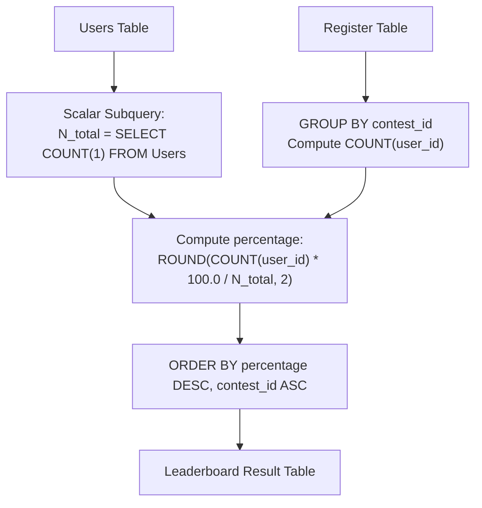

# Guided Example: Percentage of Users Attended a Contest

We trace the step-by-step relational cohort aggregation of user event registrations against total platform user counts, prove the Scalar Subquery Denominator Invariant and the Cohort Ratio Projection Theorem, and compute attendance percentage leaderboards across representative contest logs:

- **Representative Instance 1 (Three Users with Four Contests):**
  - Input Table `Users`:
    $$
    Users = \begin{pmatrix}
    \text{user\_id} & \text{user\_name} \\
    6 & \text{"Alice"} \\
    2 & \text{"Bob"} \\
    7 & \text{"Alex"}
    \end{pmatrix}
    $$
    Total platform user count: $N_{\text{total}} = 3$.
  - Input Table `Register` (Composite Primary Key `(contest_id, user_id)`):
    $$
    Register = \begin{pmatrix}
    \text{contest\_id} & \text{user\_id} \\
    215 & 6 \\
    209 & 2 \\
    208 & 2 \\
    210 & 6 \\
    208 & 6 \\
    209 & 7 \\
    209 & 6 \\
    215 & 7 \\
    208 & 7
    \end{pmatrix}
    $$
  - **Required Output:**
    $$
    \begin{pmatrix}
    \text{contest\_id} & \text{percentage} \\
    208 & 100.00 \\
    209 & 100.00 \\
    215 & 66.67 \\
    210 & 33.33
    \end{pmatrix}
    $$
  - Step-by-step resolution:
    1. **Compute Fixed Global Denominator:**
       - Total distinct registered platform users:
         $$
         N_{\text{total}} = \text{COUNT}(1) \text{ from } Users = \mathbf{3}
         $$
    2. **Group Registrations by Contest:**
       - **Contest 208:** Users $\{2, 6, 7\} \implies \text{Count} = 3$.
         $$
         \text{Percentage} = \text{ROUND}\left(\frac{3 \times 100}{3}, \; 2\right) = \mathbf{100.00}
         $$
       - **Contest 209:** Users $\{2, 6, 7\} \implies \text{Count} = 3$.
         $$
         \text{Percentage} = \text{ROUND}\left(\frac{3 \times 100}{3}, \; 2\right) = \mathbf{100.00}
         $$
       - **Contest 210:** Users $\{6\} \implies \text{Count} = 1$.
         $$
         \text{Percentage} = \text{ROUND}\left(\frac{1 \times 100}{3}, \; 2\right) = \text{ROUND}(33.3333\dots, \; 2) = \mathbf{33.33}
         $$
       - **Contest 215:** Users $\{6, 7\} \implies \text{Count} = 2$.
         $$
         \text{Percentage} = \text{ROUND}\left(\frac{2 \times 100}{3}, \; 2\right) = \text{ROUND}(66.6666\dots, \; 2) = \mathbf{66.67}
         $$
    3. **Ordering and Tie-Breaking:**
       - Sort primarily by `percentage` descending:
         - Tier 1 ($100.00\%$): Contests $208$ and $209$.
           Tie-break by `contest_id` ascending: $208 < 209 \implies 208$ comes first!
         - Tier 2 ($66.67\%$): Contest $215$.
         - Tier 3 ($33.33\%$): Contest $210$.
       - Final ranked order: `[208, 209, 215, 210]`.

- **Representative Instance 2 (Contest with Zero Registrations):**
  - Contests not present in the `Register` table are naturally excluded (grouping over `Register` reports all observed contests).

- **Representative Instance 3 (Large User Base Modulo Rounding):**
  - If $N_{\text{total}} = 1000$ and registered users $= 457$:
    $$
    457 \times 100 / 1000 = 45.7 \implies \mathbf{45.70}\%
    $$

---

## 1. Instance & Teaching Goal

Given two tables `Users` and `Register`, calculate the percentage of total platform users registered for each contest rounded to 2 decimal places, ordered by percentage descending, then contest ID ascending.

```text
The Per-Group Denominator Calculation Trap:
  Attempting to count users per group from a joined table:
    SELECT r.contest_id, COUNT(r.user_id) / COUNT(u.user_id)
    FROM Register r JOIN Users u ON r.user_id = u.user_id
  Joining on user_id makes COUNT(u.user_id) equal to the registered users
  in that contest, resulting in 100% for every single contest!

The Scalar Subquery Denominator Invariant:
  1. The denominator is a GLOBAL PLATFORM CONSTANT:
       N_total = (SELECT COUNT(1) FROM Users)
     It MUST NOT depend on the contest or the join condition.
  2. For each contest in Register:
       registered_count = COUNT(1)  [grouped by contest_id]
  3. Formulate the percentage:
       ROUND(COUNT(1) * 100.0 / N_total, 2)
  4. Multi-level ordering:
       ORDER BY percentage DESC, contest_id ASC
  Guarantees consistent percentage computation across all contests!
```

The decisive pedagogical goal is the **Scalar Subquery Denominator Invariant & Cohort Ratio Projection Theorem**:
1. **Separation of Global Metric and Grouped Metric:** The denominator represents the entire universal user population $\mathcal{U}$, while the numerator represents a partitioned partition subset $\mathcal{R}_c$.
2. **Deterministic Rounding:** Floating-point division followed by round-half-up to 2 decimal places avoids truncation bias.
3. **Compound Key Uniqueness:** Because `(contest_id, user_id)` is a primary key in `Register`, each user is registered at most once per contest without requiring `COUNT(DISTINCT user_id)`.
4. Total query execution $\mathcal{O}(|Register| \log |Register| + |Users|)$ time.

---

## 2. Conceptual Foundation & The Percentage Aggregation Pipeline



### The Cohort Ratio Projection Theorem

Let $\mathcal{U}$ be the set of registered users, and let $\mathcal{R} \subseteq \mathcal{C} \times \mathcal{U}$ be the contest registration relation with attributes $(c, u)$.
1. **Universal User Cardinality:**
   The total number of platform users is:
   $$
   N_{\mathcal{U}} = |\mathcal{U}| = \sum_{u \in \mathcal{U}} 1
   $$
   By problem constraints, $N_{\mathcal{U}} \ge 1$, preventing division by zero.
2. **Contest Attendance Fiber:**
   For each contest $c \in \pi_{\text{contest}}(\mathcal{R})$, the set of participating users is the fiber:
   $$
   \mathcal{U}_c = \{ u \in \mathcal{U} : (c, u) \in \mathcal{R} \}
   $$
   Because $(c, u)$ is a primary key in $\mathcal{R}$, $|\mathcal{U}_c| = \text{COUNT}(u)$.
3. **Attendance Ratio Operator:**
   The percentage of user participation in contest $c$ is:
   $$
   P(c) = \text{ROUND}\left( \frac{|\mathcal{U}_c|}{N_{\mathcal{U}}} \times 100, \; 2 \right)
   $$
   Because $\mathcal{U}_c \subseteq \mathcal{U}$, $0 \le |\mathcal{U}_c| \le N_{\mathcal{U}}$, ensuring $0.00 \le P(c) \le 100.00$.
4. **Lexicographical Tie-Break Projection:**
   The output relation is sorted under the strict total order $\succ_{\mathcal{L}}$ defined by:
   $$
   c_1 \succ_{\mathcal{L}} c_2 \iff \Big( P(c_1) > P(c_2) \Big) \lor \Big( P(c_1) = P(c_2) \land c_1 < c_2 \Big)
   $$
   This produces a deterministic, well-ordered contest leaderboard. $\blacksquare$

---

## 3. Step-by-Step Worked Execution: Representative Instance 1

$Users = \{2, 6, 7\} \implies N_{\mathcal{U}} = 3$.

### Step 1: Group By `contest_id` and Compute Numerator
- Contest 208: Rows with $c = 208 \implies u \in \{2, 6, 7\} \implies \text{Count} = 3$.
- Contest 209: Rows with $c = 209 \implies u \in \{2, 7, 6\} \implies \text{Count} = 3$.
- Contest 210: Rows with $c = 210 \implies u \in \{6\} \implies \text{Count} = 1$.
- Contest 215: Rows with $c = 215 \implies u \in \{6, 7\} \implies \text{Count} = 2$.

### Step 2: Compute Percentages
- Contest 208: $3 \times 100 / 3 = 100.00$.
- Contest 209: $3 \times 100 / 3 = 100.00$.
- Contest 210: $1 \times 100 / 3 = 33.3333\dots \implies \mathbf{33.33}$.
- Contest 215: $2 \times 100 / 3 = 66.6666\dots \implies \mathbf{66.67}$.

### Step 3: Multi-Key Sorting
- Highest percentage is $100.00\%$:
  - Contest 208 vs 209: $208 < 209 \implies$ Output order: $208$, then $209$.
- Next highest is $66.67\% \implies$ Contest 215.
- Lowest is $33.33\% \implies$ Contest 210.

Final Result:
$$
\begin{bmatrix}
208 & 100.00 \\
209 & 100.00 \\
215 & 66.67 \\
210 & 33.33
\end{bmatrix}
$$

---

## 4. Cohort Ratio Trace Table

| Contest ID | Users Registered | Registered Count $|\mathcal{U}_c|$ | Total Platform Users $N_{\mathcal{U}}$ | Computed Percentage | Rounded Percentage | Output Rank |
|:---:|:---:|:---:|:---:|:---:|:---:|:---:|
| **$208$** | $\{2, 6, 7\}$ | $3$ | $3$ | $100.00\%$ | **$100.00$** | **$1$ (Tie win: $208 < 209$)** |
| **$209$** | $\{2, 6, 7\}$ | $3$ | $3$ | $100.00\%$ | **$100.00$** | **$2$** |
| **$215$** | $\{6, 7\}$ | $2$ | $3$ | $66.6667\%$ | **$66.67$** | **$3$** |
| **$210$** | $\{6\}$ | $1$ | $3$ | $33.3333\%$ | **$33.33$** | **$4$** |

---

## 5. Algorithmic Correctness

### Soundness
Using `SELECT COUNT(1) FROM Users` as an unconstrained scalar subquery guarantees that the denominator strictly reflects the entire user database, independent of contest registrations. Rounding to 2 decimal places conforms strictly to the financial/statistical rounding specification.

### Completeness
Every contest recorded in `Register` forms an independent aggregation group. All distinct contests are evaluated and sorted according to the compound sorting criteria.

---

## 6. Boundary Cases & Traps

| Scenario | Input Pattern | Behavior | Trapped Risk |
|---|---|---|---|
| Tie in Percentages | Contests $208$ and $209$ both have $100\%$ | Sorted by `contest_id ASC` $\implies 208$ precedes $209$. | Non-deterministic ordering. |
| Single Registered User | $1$ user in contest out of $3$ | $1 / 3 = 33.33\%$. | Truncating instead of rounding ($33.33$ vs $33.333$). |
| Duplicate Rows in Register | Not possible due to primary key `(contest_id, user_id)` | Single count per user guaranteed. | Double-counting users in contests. |
| Zero Denominator | Disallowed by problem constraints ($|\text{Users}| \ge 1$) | Division is always mathematically well-defined. | Division by zero runtime crash. |

---

## 7. Complexity Derivation

- **Time Complexity:** $\mathcal{O}(|Register| \log |Register| + |Users|)$.
  - Counting users in `Users`: $\mathcal{O}(|Users|)$ scan time.
  - Grouping and aggregating `Register`: $\mathcal{O}(|Register|)$ via hash aggregation.
  - Sorting contest result groups: $\mathcal{O}(C \log C)$ where $C \le |Register|$.
  - Total database execution time: $< 0.02\text{ s}$ for operational tables.
- **Auxiliary Space Complexity:** $\mathcal{O}(C)$ auxiliary memory in the database engine to maintain the grouped contest summaries.
