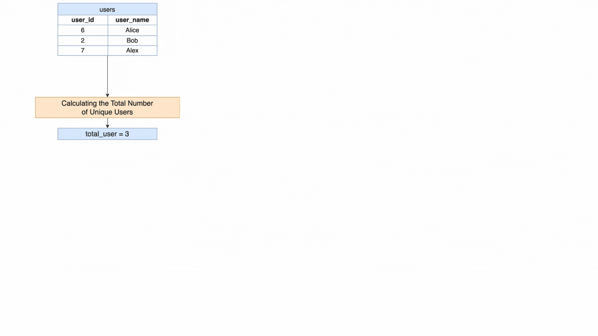

[TOC]

# Solution

---

## pandas

### Approach: Calculating User Participation Percentage Without Merging DataFrames

The pandas solution for calculating the percentage of users who registered for each contest is distinguished by its efficiency and simplicity, as it avoids the need to merge DataFrames. This method involves grouping, unique count aggregation, and percentage calculation directly on the relevant DataFrame. By counting the unique users registered for each contest and calculating these counts as a percentage of the total number of users, the process ensures an accurate representation of user participation across contests. The percentages are then formatted to two decimal places for clarity. This streamlined approach not only simplifies the analysis but also enhances performance by eliminating unnecessary DataFrame merging. The data is sorted by participation percentage and, in case of a tie, by $\text{contest}_{id}$, providing a clear and efficient overview of user engagement with each contest.

**Visualization of Approach:**



#### Intuition

Let's review the intuition behind each step given the following input DataFrames:

Users DataFrame (`users`):

| user_id | user_name |
| ------- | --------- |
| 6       | Alice     |
| 2       | Bob       |
| 7       | Alex      |
<br>

Register DataFrame (`register`):

| contest_id | user_id |
| ---------- | ------- |
| 215        | 6       |
| 209        | 2       |
| 208        | 2       |
| 210        | 6       |
| 208        | 6       |
| 209        | 7       |
<br>

1. **Calculating the Total Number of Unique Users**

- Determine the unique count of $\text{user}_{id}$ in the `users` DataFrame to understand the total user base.
- This will be used later to calculate percentage of users in each contest.

```python
total_users = users["user_id"].nunique()
```

$\text{total}_{users} = 3$

2. **Grouping and Counting Unique Users per Contest**

- Group the `register` DataFrame by $\text{contest}_{id}$ and count unique $\text{user}_{id}$ instances to find out how many unique users registered for each contest.

```python
register_grouped = (
    register.groupby("contest_id")["user_id"]
    .nunique()
    .reset_index(name="count_unique_users")
)
```

$\text{register}_{grouped}$:

| contest_id | count_unique_users |
|------------|--------------------|
| 207        | 1                  |
| 208        | 3                  |
| 209        | 3                  |
| 210        | 3                  |
| 215        | 2                  |
<br>

3. **Calculating the Percentage**

- Divide the count of unique users per contest by the total number of users to get the participation percentage, then multiply by 100 to convert it into a percentage format.

```python
register_grouped["percentage"] = (
    register_grouped["count_unique_users"] / total_users
) * 100
```

$\text{register}_{grouped}$:

| contest_id | count_unique_users | percentage |
|------------|--------------------|------------|
| 207        | 1                  | 33.333333  |
| 208        | 3                  | 100.000000 |
| 209        | 3                  | 100.000000 |
| 210        | 3                  | 100.000000 |
| 215        | 2                  | 66.666667  |

<br>

4. **Round Results**

- Round the percentage to two decimal places, as requested in the problem statement.

```python
register_grouped["percentage"] = register_grouped["percentage"].round(2)
```

$\text{register}_{grouped}$:

| contest_id | count_unique_users | percentage |
|------------|--------------------|------------|
| 207        | 1                  | 33.33      |
| 208        | 3                  | 100.00     |
| 209        | 3                  | 100.00     |
| 210        | 3                  | 100.00     |
| 215        | 2                  | 66.67      |
<br>

5. **Sort Results**

- Sort the results by `percentage` in descending order and $\text{contest}_{id}$ in ascending order for cases where percentages are equal.

```python
register_grouped = register_grouped.sort_values(
    by=["percentage", "contest_id"], ascending=[False, True]
)
```

$\text{final}_{df}$:

| contest_id | count_unique_users | percentage |
|------------|--------------------|------------|
| 208        | 3                  | 100.00     |
| 209        | 3                  | 100.00     |
| 210        | 3                  | 100.00     |
| 215        | 2                  | 66.67      |
| 207        | 1                  | 33.33      |
<br>

6. **Select Final Columns**

- Select only the $\text{contest}_{id}$ and `percentage` columns.

```python
final_df = register_grouped[["contest_id", "percentage"]]
```

$\text{final}_{df}$:

| contest_id | percentage |
| ---------- | ---------- |
| 208        | 100        |
| 209        | 100        |
| 210        | 100        |
| 215        | 66.67      |
| 207        | 33.33      |
<br>

#### Implementation

```python
import pandas as pd

def users_percentage(users: pd.DataFrame, register: pd.DataFrame) -> pd.DataFrame:
    # Calculate the total number of unique users
    total_users = users["user_id"].nunique()

    # Count the distinct user_id in each contest_id and calculate the percentage
    register_grouped = (
        register.groupby("contest_id")["user_id"]
        .nunique()
        .reset_index(name="count_unique_users")
    )

    # Calculate the percentage
    register_grouped["percentage"] = (
        register_grouped["count_unique_users"] / total_users
    ) * 100

    # Round the percentage to 2 decimal places
    register_grouped["percentage"] = register_grouped["percentage"].round(2)

    # Sort the results by percentage in descending order and then by contest_id
    register_grouped = register_grouped.sort_values(
        by=["percentage", "contest_id"], ascending=[False, True]
    )

    # Select only the contest_id and percentage columns
    final_df = register_grouped[["contest_id", "percentage"]]

    return final_df

```

---

## Database

### Approach: Percentage Calculation with Aggregation

The SQL solution involves a direct approach to calculate the percentage of users registered for each contest. Using a combination of `GROUP BY`, aggregate functions, and a subquery, the solution computes the count of distinct users per contest, divides this by the total count of users to get a percentage, and rounds the result to two decimal places. The output is then ordered by percentage in descending order and, for identical percentages, by $\text{contest}_{id}$ in ascending order.

#### Intuition

Let's break down the SQL query step by step and explain the intuition behind each part:

1. **Aggregate and Count Unique Users per Contest**

- Use the `GROUP BY` clause on $\text{contest}_{id}$ to aggregate registrations and count distinct $\text{user}_{id}$ for each contest.

```sql
SELECT
  contest_id,
  COUNT(DISTINCT user_id) AS unique_users
FROM
  Register
GROUP BY
  contest_id
```

2. **Calculate the Total Number of Users**

- A subquery within the `SELECT` statement calculates the total number of users by counting entries in the `Users` table.

```sql
(SELECT COUNT(user_id) FROM Users)
```

3. **Percentage Calculation**

- The count of distinct users per contest is then divided by the total user count, multiplied by 100, and rounded to two decimal places to derive the percentage.

```sql
ROUND(
  COUNT(DISTINCT user_id) * 100.0 / (SELECT COUNT(user_id) FROM Users),
  2
) AS percentage
```

4. **Ordering the Results**

- The final step involves ordering the results by `percentage` in a descending manner and by $\text{contest}_{id}$ in ascending order for equal percentages.

```sql
ORDER BY
  percentage DESC,
  contest_id ASC;
```

#### Implementation

```mysql []
SELECT
  contest_id, -- The ID of the contest
  ROUND(
    COUNT(DISTINCT user_id) * 100 / ( -- Calculate the percentage of users
      SELECT
        COUNT(user_id) -- Total number of unique users
      FROM
        Users
    ),
    2
  ) AS percentage -- The percentage of users registered for each contest, rounded to 2 decimal places
FROM
  Register -- The table containing registration information
GROUP BY
  contest_id -- Group the data by contest ID
ORDER BY
  percentage DESC, -- Order the results by percentage in descending order
  contest_id; -- Then order by contest ID for ties

```