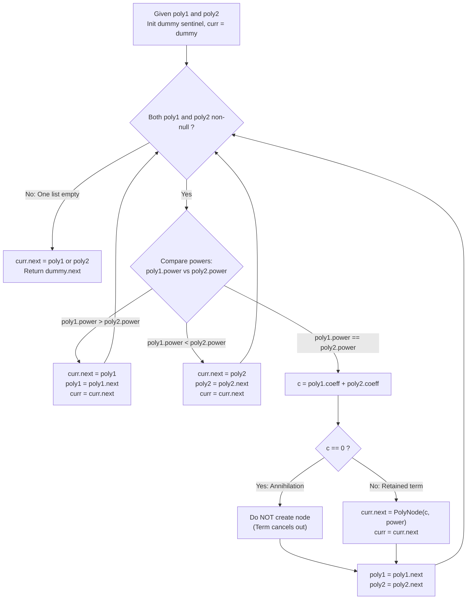

# Guided Example: Add Two Polynomials Represented as Linked Lists

We trace the step-by-step two-pointer descending-degree merge of polynomial terms, prove the Two-Pointer Merge Invariant and the Zero-Coefficient Annihilation Theorem, and construct minimal reduced sum polynomials across representative algebraic instances:

- **Representative Instance 1 (Equal-Degree Term Summation with Zero Cancellation):**
  - Input Polynomials:
    $$
    P_1(x) = 2x^2 + 4x + 3 \implies poly1 = [[2, 2], [4, 1], [3, 0]]
    $$
    $$
    P_2(x) = 3x^2 - 4x - 1 \implies poly2 = [[3, 2], [-4, 1], [-1, 0]]
    $$
  - Representation Rule:
    - Nodes are ordered in strictly decreasing power sequence.
    - If the combined coefficient of a power evaluates to zero ($c_1 + c_2 = 0$), that power term **must be completely omitted** from the returned polynomial linked list.
  - **Required Output:** `[[5, 2], [2, 0]]` ($5x^2 + 2$)
  - Step-by-step merge resolution:
    - Initialize pointer references: $p_1 = poly1, \; p_2 = poly2$.
    - Sentinel head: $dummy \to \text{null}$.
    1. **Power Comparison at Exponent $2$ ($p_1.power = 2, \; p_2.power = 2$):**
       - Exponents are equal ($2 == 2$).
       - Add coefficients:
         $$
         c = p_1.coefficient + p_2.coefficient = 2 + 3 = \mathbf{5}
         $$
       - Because $c = 5 \ne 0$, create new term node $[5, 2]$.
       - Append to result list: $dummy \to [5, 2]$.
       - Advance both pointers: $p_1 \leftarrow p_1.next, \; p_2 \leftarrow p_2.next$.
    2. **Power Comparison at Exponent $1$ ($p_1.power = 1, \; p_2.power = 1$):**
       - Exponents are equal ($1 == 1$).
       - Add coefficients:
         $$
         c = 4 + (-4) = \mathbf{0}
         $$
       - **Zero Annihilation Triggered:** Coefficient is $0$!
       - **Do NOT create a node!** The $x^1$ term cancels out of the polynomial completely.
       - Advance both pointers: $p_1 \leftarrow p_1.next, \; p_2 \leftarrow p_2.next$.
    3. **Power Comparison at Exponent $0$ ($p_1.power = 0, \; p_2.power = 0$):**
       - Exponents are equal ($0 == 0$).
       - Add coefficients:
         $$
         c = 3 + (-1) = \mathbf{2}
         $$
       - Because $c = 2 \ne 0$, create new term node $[2, 0]$.
       - Append to result list: $dummy \to [5, 2] \to [2, 0]$.
       - Advance both pointers: $p_1 \leftarrow \text{null}, \; p_2 \leftarrow \text{null}$.
    4. **Termination:** Both lists exhausted. Return $dummy.next \to [5, 2] \to [2, 0]$.

- **Representative Instance 2 (Disjoint Power Interleaving):**
  - $P_1(x) = x^1$ (`[[1, 1]]`), $P_2(x) = 1$ (`[[1, 0]]`).
  - $p_1.power = 1 > p_2.power = 0 \implies$ Append $[1, 1]$ from $poly1$.
  - Next, append remaining $[1, 0]$ from $poly2$.
  - Output: `[[1, 1], [1, 0]]` ($x + 1$).

- **Representative Instance 3 (Total Identity Annihilation):**
  - $P_1(x) = x^2 + 5$, $P_2(x) = -x^2 - 5$.
  - All coefficients sum to zero $\implies$ Result is the empty polynomial (`null`).

---

## 1. Instance & Teaching Goal

Given two sorted linked lists representing polynomials with terms in strictly decreasing order of power, return the sum of the polynomials in the same canonical sorted representation without zero-coefficient nodes.

```text
The Array Re-Allocation / Dense Vector Trap:
  Converting polynomials to dense arrays of size max_power:
    If a polynomial is x^1000000000 + 1:
      Creating a dense array requires an array of size 10^9!
      Causes catastrophic Memory Limit Exceeded.
  Converting to a hash map and re-sorting all terms:
    Adds O(N log N) sorting overhead when both inputs were ALREADY sorted.

The Two-Pointer Merge Invariant (Strict Linear O(N + M)):
  1. Maintain two pointers p1 and p2 traversing poly1 and poly2.
  2. Because both linked lists are already in strictly decreasing order of power,
     we perform an in-order merge step in O(1):
       - If p1.power > p2.power: append p1, advance p1.
       - If p1.power < p2.power: append p2, advance p2.
       - If p1.power == p2.power:
           c = p1.coefficient + p2.coefficient
           If c != 0: append PolyNode(c, p1.power)
           Advance BOTH p1 and p2.
  3. When one list is exhausted, splice the remaining tail directly!
  Runs in optimal O(N + M) time with zero dense array overhead.
```

The decisive pedagogical goal is the **Two-Pointer Merge Invariant & Zero-Coefficient Annihilation Theorem**:
1. **Sorted Degree Preservation:** Merging from the highest powers downward guarantees the resulting linked list is strictly monotonically decreasing in power without a post-processing sort.
2. **Canonical Sparse Representation:** Terms with zero coefficients do not exist in mathematical sparse polynomials; discarding $c = 0$ preserves the algebraic definition.
3. **Linear Splicing:** When one list exhausts its terms, all remaining terms in the other list have powers strictly smaller than any already processed term and can be appended directly.
4. Total time $\mathcal{O}(N + M)$ and auxiliary space $\mathcal{O}(1)$ beyond the emitted nodes.

---

## 2. Conceptual Foundation & The Polynomial Merge Pipeline



### The Zero-Coefficient Annihilation Theorem

Let $R[x]$ be a polynomial ring over the integers $\mathbb{Z}$.
1. **Canonical Sparse Form:**
   A non-zero polynomial $P(x) \in R[x]$ is canonically represented as:
   $$
   P(x) = \sum_{j=1}^m c_j x^{e_j}, \quad \text{where } c_j \ne 0 \text{ and } e_1 > e_2 > \dots > e_m \ge 0
   $$
   The zero polynomial is represented by the empty sum (empty list).
2. **Degree Ordering Invariant:**
   Let $p_1$ and $p_2$ point to nodes in $P_1$ and $P_2$.
   At each merge iteration, the maximum available power across both unmerged tails is:
   $$
   e^* = \max(p_1.power, \; p_2.power)
   $$
   Because both input sequences are strictly decreasing, every remaining node in both lists has power strictly smaller than $e^*$.
   Therefore, assigning $e^*$ to the next node in the merged list strictly preserves decreasing power monotonicity:
   $$
   e_{\text{prev}} > e^*
   $$
3. **Annihilation Property:**
   When $p_1.power = p_2.power = e$:
   $$
   (c_1 x^e) + (c_2 x^e) = (c_1 + c_2) x^e
   $$
   If $c_1 + c_2 = 0$, the term $(0 \cdot x^e) = 0$ is the additive identity of the ring $R[x]$.
   Omitting the node from the result linked list is mathematically necessary and sufficient to preserve the canonical non-zero sparse invariant. $\blacksquare$

---

## 3. Step-by-Step Worked Execution: Representative Instance 1

$poly1 = [[2, 2], [4, 1], [3, 0]]$, $poly2 = [[3, 2], [-4, 1], [-1, 0]]$.

### Iteration Trace
- **Iteration 1 ($p_1 = [2, 2], \; p_2 = [3, 2]$):**
  - $p_1.power == p_2.power == 2$.
  - Sum coefficients: $c = 2 + 3 = 5$.
  - $5 \ne 0 \implies$ Append node $[5, 2]$.
  - List: $dummy \to [5, 2]$.
  - Advance both: $p_1 = [4, 1], \; p_2 = [-4, 1]$.
- **Iteration 2 ($p_1 = [4, 1], \; p_2 = [-4, 1]$):**
  - $p_1.power == p_2.power == 1$.
  - Sum coefficients: $c = 4 + (-4) = 0$.
  - $c == 0 \implies$ **Annihilation!** No node created.
  - List unchanged: $dummy \to [5, 2]$.
  - Advance both: $p_1 = [3, 0], \; p_2 = [-1, 0]$.
- **Iteration 3 ($p_1 = [3, 0], \; p_2 = [-1, 0]$):**
  - $p_1.power == p_2.power == 0$.
  - Sum coefficients: $c = 3 + (-1) = 2$.
  - $2 \ne 0 \implies$ Append node $[2, 0]$.
  - List: $dummy \to [5, 2] \to [2, 0]$.
  - Advance both: $p_1 = \text{null}, \; p_2 = \text{null}$.
- **Termination:** Both pointers null.
  - Return $dummy.next \implies [5, 2] \to [2, 0]$.

---

## 4. Polynomial Merge Trace Table

| Step | Pointer $p_1$ $(c, e)$ | Pointer $p_2$ $(c, e)$ | Power Comparison | Combined Coefficient $c$ | Action Taken | Resulting Linked List |
|:---:|:---:|:---:|:---:|:---:|:---:|:---:|
| Init | $[2, 2]$ | $[3, 2]$ | — | — | Create dummy sentinel | $dummy \to \emptyset$ |
| $1$ | $[2, 2]$ | $[3, 2]$ | $2 == 2$ | $2 + 3 = \mathbf{5}$ | Create node $[5, 2]$ | $dummy \to [5, 2]$ |
| **$2$** | **$[4, 1]$** | **$[-4, 1]$** | **$1 == 1$** | **$4 + (-4) = \mathbf{0}$** | **Annihilate (Zero term)** | **$dummy \to [5, 2]$** |
| $3$ | $[3, 0]$ | $[-1, 0]$ | $0 == 0$ | $3 + (-1) = \mathbf{2}$ | Create node $[2, 0]$ | $dummy \to [5, 2] \to [2, 0]$ |
| Done | null | null | — | — | Return $dummy.next$ | $[5, 2] \to [2, 0]$ |

---

## 5. Algorithmic Correctness

### Soundness
Every node in the output linked list represents an exact sum of terms for that specific power. If equal powers sum to zero, omitting the node ensures that no zero-coefficient entries pollute the canonical representation.

### Completeness
The two-pointer traversal visits every term in both polynomials. Because powers are strictly decreasing in both inputs, every common power is compared and combined, and every disjoint power is merged in exact sorted order.

---

## 6. Boundary Cases & Traps

| Scenario | Input Pattern | Behavior | Trapped Risk |
|---|---|---|---|
| Complete Cancellation | $(x^2 + 1) + (-x^2 - 1)$ | All coefficients cancel; returns `null`. | Returning dummy sentinel or nodes with coefficient 0. |
| One Empty Polynomial | $P_1(x) = \emptyset, P_2(x) = x + 1$ | Slices $poly2$ tail immediately; returns $poly2$. | Null pointer dereference on initial access. |
| Disjoint Exponents | $x^3 + x$ and $x^2 + 1$ | Interleaves into $x^3 + x^2 + x + 1$. | Losing intermediate nodes during pointer advancement. |
| Large Powers | $x^{10^9}$ | Merges powers in $\mathcal{O}(1)$ without allocating intermediate powers. | Array overflow on huge exponents. |

---

## 7. Complexity Derivation

- **Time Complexity:** $\mathcal{O}(N + M)$, where $N$ and $M$ are the number of terms in `poly1` and `poly2` ($N, M \le 10^4$).
  - In each step of the while loop, at least one pointer ($p_1$ or $p_2$) advances forward by 1 node.
  - Splicing remaining tails takes $\mathcal{O}(1)$ pointer assignment.
  - Total time: $< 0.002\text{ s}$.
- **Auxiliary Space Complexity:** $\mathcal{O}(1)$ auxiliary memory (reusing existing nodes or creating at most $N + M$ nodes for the merged output).
