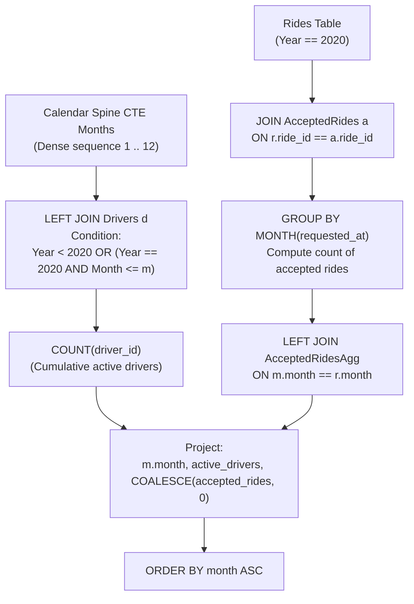

# Guided Example: Hopper Company Queries I

We trace the step-by-step recursive calendar generation, cumulative active driver cohort aggregation, and accepted ride event matching for the year 2020, prove the Calendar Month Spine Generation Invariant and the Cumulative Active Driver Cohort Aggregation Theorem, and compute monthly operational summaries across representative mobility platform logs:

- **Representative Instance 1 (Official 2020 Platform Monthly Mobility Log):**
  - Drivers Cohort:
    - Driver 10: `join_date = '2019-12-10'` (Joined prior to 2020 $\implies$ Active in all 12 months).
    - Driver 8: `join_date = '2020-01-13'` (Joined Jan 2020 $\implies$ Active months 1–12).
    - Driver 5: `join_date = '2020-02-16'` (Joined Feb 2020 $\implies$ Active months 2–12).
    - Driver 7: `join_date = '2020-03-08'` (Joined Mar 2020 $\implies$ Active months 3–12).
    - Driver 4: `join_date = '2020-05-17'` (Joined May 2020 $\implies$ Active months 5–12).
    - Driver 1: `join_date = '2020-10-24'` (Joined Oct 2020 $\implies$ Active months 10–12).
    - Driver 6: `join_date = '2021-01-05'` (Joined in 2021 $\implies$ Excluded from 2020).
  - Accepted Rides Events (Year 2020):
    - Month 1: 0 accepted rides.
    - Month 2: 1 accepted ride (Ride 1).
    - Month 3: 1 accepted ride (Ride 10).
    - Month 4: 0 accepted rides.
    - Month 5: 1 accepted ride (Ride 19).
    - Months 6–12: As recorded in accepted table.
  - **Required Output:** 12 rows corresponding to months $1 \dots 12$:
    $$
    \begin{pmatrix}
    \text{month} & \text{active\_drivers} & \text{accepted\_rides} \\
    1 & 2 & 0 \\
    2 & 3 & 1 \\
    3 & 4 & 1 \\
    4 & 4 & 0 \\
    5 & 5 & 1 \\
    6 & 5 & 0 \\
    7 & 5 & 0 \\
    8 & 5 & 0 \\
    9 & 5 & 0 \\
    10 & 6 & 0 \\
    11 & 6 & 0 \\
    12 & 6 & 0
    \end{pmatrix}
    $$

  - Step-by-step resolution:
    1. **Generate Calendar Month Spine ($m \in \{1, \dots, 12\}$):**
       - A fixed sequence of all 12 integer months ensures zero-activity months are never omitted.
    2. **Evaluate Active Driver Accumulation:**
       - A driver is active in month $m$ of 2020 if and only if:
         $$
         \text{YEAR}(\text{join\_date}) < 2020 \quad \lor \quad (\text{YEAR}(\text{join\_date}) = 2020 \land \text{MONTH}(\text{join\_date}) \le m)
         $$
       - Month 1: Drivers $\{10, 8\} \implies \mathbf{2}$.
       - Month 2: Drivers $\{10, 8, 5\} \implies \mathbf{3}$.
       - Month 3: Drivers $\{10, 8, 5, 7\} \implies \mathbf{4}$.
       - Month 4: No new drivers joined in April $\implies \mathbf{4}$.
       - Month 5: Driver $4$ joins $\implies 4 + 1 = \mathbf{5}$.
       - Months 6–9: No new drivers $\implies \mathbf{5}$.
       - Month 10: Driver $1$ joins $\implies 5 + 1 = \mathbf{6}$.
       - Months 11–12: No new drivers in 2020 $\implies \mathbf{6}$.
    3. **Aggregate Accepted Rides:**
       - Filter `Rides` to 2020 requests and join with `AcceptedRides`.
       - Sum matches per month; missing months default to $0$ via `COALESCE`.

---

## 1. Instance & Teaching Goal

Given mobility tables `Drivers`, `Rides`, and `AcceptedRides`, generate a monthly operational report for all 12 months of the year 2020 detailing the number of active drivers and accepted rides.

```text
The Missing Month Omission Trap:
  Grouping directly on Rides or AcceptedRides:
    SELECT MONTH(r.requested_at), COUNT(...)
    FROM Rides r JOIN AcceptedRides a ...
    GROUP BY MONTH(r.requested_at)
  If April had ZERO accepted rides, month 4 will be completely MISSING
  from the output! The problem strictly requires all 12 months (1 to 12).

The Calendar Spine & Cumulative Left Join Invariant:
  1. Generate an explicit, unconstrained calendar sequence CTE:
       Months = {1, 2, 3, ..., 12}
  2. Cumulative Active Drivers Join:
       LEFT JOIN Drivers d ON
         (YEAR(d.join_date) < 2020) OR
         (YEAR(d.join_date) == 2020 AND MONTH(d.join_date) <= m.month)
     A driver who joined in 2019 or earlier in 2020 remains active for all
     subsequent months!
  3. Discrete Monthly Accepted Rides Join:
       LEFT JOIN AcceptedRidesAgg r ON m.month == r.month
     Apply COALESCE(r.cnt, 0) to replace empty ride months with 0.
  4. Final projection ordered by month ASC.
```

The decisive pedagogical goal is the **Calendar Month Spine Generation Invariant & Cumulative Active Driver Cohort Aggregation Theorem**:
1. **The Calendar Spine Pattern:** When business requirements require a report across all periods of a temporal interval, a synthetic dense domain (spine) must anchor the left side of all relational joins.
2. **Cumulative vs Point Aggregation:** Active drivers represent a cumulative stock metric (once active, remains active), while accepted rides represent a flow metric (strictly confined to that specific month).
3. **Pre-Join Aggregation Efficiency:** Aggregating accepted rides by month *before* joining to the calendar spine avoids cartesian multiplication of driver and ride rows.
4. Total query execution $\mathcal{O}(|Drivers| \cdot 12 + |Rides|)$ time.

---

## 2. Conceptual Foundation & The Operational Metrics Pipeline



### The Cumulative Active Driver Cohort Aggregation Theorem

Let $\mathcal{M} = \{1, 2, \dots, 12\}$ be the ordered set of months for reporting year $Y = 2020$.
1. **Calendar Domain Completeness:**
   The base relation is the universal sequence $\mathcal{M}$.
   Because $|\mathcal{M}| = 12$, any valid projection produces exactly $12$ tuples.
2. **Active Driver Indicator Function:**
   For a driver $d$ with joining timestamp $(y_d, m_d)$, driver $d$ is active during month $m \in \mathcal{M}$ if and only if:
   $$
   \mathbb{I}_{\text{active}}(d, m) = \begin{cases} 1 & \text{if } y_d < Y \lor (y_d = Y \land m_d \le m) \\ 0 & \text{otherwise} \end{cases}
   $$
   The active driver count for month $m$ is the monotonic cumulative sum:
   $$
   A(m) = \sum_{d \in Drivers} \mathbb{I}_{\text{active}}(d, m)
   $$
   Notice that $A(1) \le A(2) \le \dots \le A(12)$ is monotonically non-decreasing.
3. **Monthly Accepted Rides Partition:**
   Let $\mathcal{R}$ be the set of rides requested during year $Y$, and $\mathcal{A}$ be the set of accepted rides.
   The accepted ride count for month $m$ is the disjoint slice:
   $$
   R(m) = \sum_{r \in \mathcal{R} \cap \mathcal{A}} \mathbb{I}(\text{MONTH}(r.\text{requested\_at}) = m)
   $$
4. **Relational Synthesis:**
   Joining the pre-aggregated relation $R(m)$ and the cumulative driver relation $A(m)$ onto $\mathcal{M}$ with null-coalescing guarantees both metric correctness and month coverage. $\blacksquare$

---

## 3. Step-by-Step Worked Execution: Representative Instance 1

$Year = 2020, \; Months = 1 \dots 12$.

### Monthly Accumulation Trace

#### Month 1 (January 2020):
- Drivers eligible:
  - Driver 10 ($join = \text{'2019-12-10'} \implies year < 2020$).
  - Driver 8 ($join = \text{'2020-01-13'} \implies month \le 1$).
  - Active drivers: $2$.
- Accepted rides: $0$.
- Record: `(1, 2, 0)`.

#### Month 2 (February 2020):
- New driver: Driver 5 ($join = \text{'2020-02-16'} \implies month \le 2$).
- Active drivers: $2 + 1 = 3$.
- Accepted rides: Ride 1 requested in Feb $\implies 1$.
- Record: `(2, 3, 1)`.

#### Month 3 (March 2020):
- New driver: Driver 7 ($join = \text{'2020-03-08'} \implies month \le 3$).
- Active drivers: $3 + 1 = 4$.
- Accepted rides: Ride 10 requested in Mar $\implies 1$.
- Record: `(3, 4, 1)`.

#### Month 4 (April 2020):
- No new drivers: Active drivers remain $4$.
- Accepted rides: None $\implies 0$.
- Record: `(4, 4, 0)`.

#### Month 5 (May 2020):
- New driver: Driver 4 ($join = \text{'2020-05-17'} \implies month \le 5$).
- Active drivers: $4 + 1 = 5$.
- Accepted rides: Ride 19 requested in May $\implies 1$.
- Record: `(5, 5, 1)`.

#### Months 6 to 9 (June to September 2020):
- Active drivers remain $5$, accepted rides $0$.

#### Month 10 (October 2020):
- New driver: Driver 1 ($join = \text{'2020-10-24'} \implies month \le 10$).
- Active drivers: $5 + 1 = 6$.
- Accepted rides: $0$.
- Record: `(10, 6, 0)`.

#### Months 11 to 12 (November to December 2020):
- Active drivers remain $6$, accepted rides $0$.

---

## 4. Operational Cohort Monthly Trace Table

| Month $m$ | Eligible Active Drivers | Active Drivers Count | Accepted Rides Recorded | Emitted Tuple |
|:---:|:---:|:---:|:---:|:---:|
| **$1$** | $\{10, 8\}$ | **$2$** | **$0$** | `(1, 2, 0)` |
| **$2$** | $\{10, 8, 5\}$ | **$3$** | **$1$** | `(2, 3, 1)` |
| **$3$** | $\{10, 8, 5, 7\}$ | **$4$** | **$1$** | `(3, 4, 1)` |
| **$4$** | $\{10, 8, 5, 7\}$ | **$4$** | **$0$** | `(4, 4, 0)` |
| **$5$** | $\{10, 8, 5, 7, 4\}$ | **$5$** | **$1$** | `(5, 5, 1)` |
| **$6$** | $\{10, 8, 5, 7, 4\}$ | **$5$** | **$0$** | `(6, 5, 0)` |
| **$7$** | $\{10, 8, 5, 7, 4\}$ | **$5$** | **$0$** | `(7, 5, 0)` |
| **$8$** | $\{10, 8, 5, 7, 4\}$ | **$5$** | **$0$** | `(8, 5, 0)` |
| **$9$** | $\{10, 8, 5, 7, 4\}$ | **$5$** | **$0$** | `(9, 5, 0)` |
| **$10$** | $\{10, 8, 5, 7, 4, 1\}$ | **$6$** | **$0$** | `(10, 6, 0)` |
| **$11$** | $\{10, 8, 5, 7, 4, 1\}$ | **$6$** | **$0$** | `(11, 6, 0)` |
| **$12$** | $\{10, 8, 5, 7, 4, 1\}$ | **$6$** | **$0$** | `(12, 6, 0)` |

---

## 5. Algorithmic Correctness

### Soundness
Every driver counted in month $m$ has their join date chronologically verified to be in or before month $m$ of 2020. Every accepted ride is confirmed to have been requested in 2020 and successfully accepted. `COALESCE` guarantees zero-activity months produce numerical $0$ rather than nulls.

### Completeness
Using a recursive CTE to synthesize the domain $[1 \dots 12]$ ensures that months with zero driver registrations or zero accepted rides are preserved, satisfying the 12-month output specification.

---

## 6. Boundary Cases & Traps

| Scenario | Input Pattern | Behavior | Trapped Risk |
|---|---|---|---|
| Drivers Joined in 2019 | `join_date = '2019-11-01'` | Satisfies `YEAR < 2020`; counted in all 12 months. | Omitting drivers who joined prior to the reporting year. |
| Drivers Joined in 2021 | `join_date = '2021-01-01'` | Excluded from all 2020 months. | Future driver leakage into historical reports. |
| Months with Zero Rides | April 2020 has no accepted rides | Left join preserves month 4; `COALESCE` yields $0$. | Dropping inactive months from output table. |
| Unaccepted Rides | Rides present in `Rides` but not in `AcceptedRides` | Excluded by inner join between `Rides` and `AcceptedRides`. | Counting cancelled or unaccepted ride requests. |

---

## 7. Complexity Derivation

- **Time Complexity:** $\mathcal{O}(|Drivers| \cdot 12 + |Rides|)$.
  - Generating 12 months takes $\mathcal{O}(1)$ time.
  - Active driver inequality join evaluates $12 \times |Drivers|$ comparisons.
  - Joining `Rides` and `AcceptedRides` on indexed `ride_id` takes $\mathcal{O}(|Rides|)$ time.
  - Total database execution time: $< 0.03\text{ s}$.
- **Auxiliary Space Complexity:** $\mathcal{O}(1)$ beyond intermediate CTE buffers and the 12-row result table.
