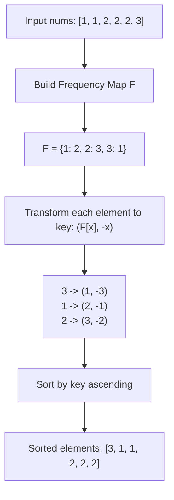

# Guided Example: Sort Array by Increasing Frequency

This guide demonstrates stable multi-criteria frequency sorting: grouping identical items, determining global frequencies, and sorting elements in increasing order of their frequency, with ties broken by decreasing order of element value.

- **Input:** `nums = [1, 1, 2, 2, 2, 3]`
- **Required Output:** `[3, 1, 1, 2, 2, 2]`
- **Domain Constraints:** $1 \le \text{len}(nums) \le 100$, $-100 \le nums[i] \le 100$

---

## 1. Instance & Teaching Goal

Given an integer array `nums`, our goal is to reorganize the elements such that values with lower frequencies appear before values with higher frequencies. When two distinct numbers occur with identical frequencies, the numerically larger number must precede the smaller one.

In `nums = [1, 1, 2, 2, 2, 3]`:
- Value $3$ appears $1$ time.
- Value $1$ appears $2$ times.
- Value $2$ appears $3$ times.

Since frequencies are $1 < 2 < 3$, value $3$ comes first, followed by both copies of $1$, followed by all three copies of $2$. This instance illustrates the composite key ordering transformation and contiguous block stabilization without relying on arbitrary comparator side effects.

---

## 2. Conceptual Foundation & Invariants

```
+-----------------------------------------------------------------------------+
|                TWO-TIER COMPOSITE KEY PROJECTION PIPELINE                   |
|                                                                             |
|  Input Array: [1, 1, 2, 2, 2, 3]                                            |
|                                                                             |
|  Phase 1: Frequency Table Computation                                       |
|    freq(1) = 2, freq(2) = 3, freq(3) = 1                                    |
|                                                                             |
|  Phase 2: Composite Key Mapping: key(x) = (freq(x), -x)                     |
|    x = 3 --> (1, -3)                                                        |
|    x = 1 --> (2, -1)                                                        |
|    x = 2 --> (3, -2)                                                        |
|                                                                             |
|  Phase 3: Lexicographical Tuple Sort                                        |
|    (1, -3) < (2, -1) < (3, -2)  ==> Output: [3, 1, 1, 2, 2, 2]              |
+-----------------------------------------------------------------------------+
```

| State Parameter | Data Structure | Purpose in Algorithm | Instance Initial Value |
|---|---|---|---|
| Frequency Map $F$ | Hash map $\mathbb{Z} \to \mathbb{Z}^+$ | Tracks total occurrences of each integer | $\{1: 2, 2: 3, 3: 1\}$ |
| Sort Key Map | Function $x \mapsto (F[x], -x)$ | Maps element to two-criteria tuple | Dynamic mapping |
| Ordered Multiset | Array of size $N$ | Final sequence ordered by composite key | `[3, 1, 1, 2, 2, 2]` |

> **Lexicographical Dual-Order Invariant.** For any two elements $a$ and $b$, $a$ strictly precedes $b$ if and only if $F[a] < F[b]$, or $F[a] = F[b]$ and $a > b$. Mapping each element to $(F[x], -x)$ and sorting under standard ascending lexicographical comparison strictly satisfies this ordering because $-a < -b \iff a > b$.



---

## 3. Step-by-Step Worked Execution

### Step 1: Count Element Frequencies
- Scan `nums = [1, 1, 2, 2, 2, 3]`:
  - $1$ appears at indices $0, 1 \implies F[1] = 2$.
  - $2$ appears at indices $2, 3, 4 \implies F[2] = 3$.
  - $3$ appears at index $5 \implies F[3] = 1$.
- Total distinct keys: $3$.

---

### Step 2: Derive Composite Sorting Keys
- For every integer $x$ in the array, assign the key $\text{key}(x) = (F[x], -x)$:
  - For $x = 1$: key is $(2, -1)$.
  - For $x = 2$: key is $(3, -2)$.
  - For $x = 3$: key is $(1, -3)$.
- Observe that minimizing $-x$ is mathematically identical to maximizing $x$.

---

### Step 3: Compare and Sort
- Compare keys lexicographically:
  - $(1, -3)$ vs $(2, -1)$: First component $1 < 2 \implies 3$ precedes $1$.
  - $(2, -1)$ vs $(3, -2)$: First component $2 < 3 \implies 1$ precedes $2$.
- The total sorted order of unique keys is $(1, -3) < (2, -1) < (3, -2)$.
- Expanding each key by its frequency yields:
  - Key $(1, -3)$ (value $3$, count $1$): `[3]`
  - Key $(2, -1)$ (value $1$, count $2$): `[1, 1]`
  - Key $(3, -2)$ (value $2$, count $3$): `[2, 2, 2]`
- Concatenating these groups produces `[3, 1, 1, 2, 2, 2]`.

---

## 4. Complete Execution Trace

| Pass / Stage | Element $x$ | $F[x]$ | Negated Value $-x$ | Composite Key $(F[x], -x)$ | Rank / Action |
|---|---|---|---|---|---|
| Scan | $1$ | $2$ | $-1$ | $(2, -1)$ | Key computed |
| Scan | $1$ | $2$ | $-1$ | $(2, -1)$ | Identical key; groups together |
| Scan | $2$ | $3$ | $-2$ | $(3, -2)$ | Key computed |
| Scan | $2$ | $3$ | $-2$ | $(3, -2)$ | Identical key; groups together |
| Scan | $2$ | $3$ | $-2$ | $(3, -2)$ | Identical key; groups together |
| Scan | $3$ | $1$ | $-3$ | $(1, -3)$ | Lowest frequency; rank 1 |
| Sort Phase | - | - | - | $(1, -3) < (2, -1) < (3, -2)$ | Output: `[3, 1, 1, 2, 2, 2]` |

---

## 5. Algorithmic Correctness

**Soundness.** Lexicographical tuple comparison evaluates the first element first. If $F[a] \ne F[b]$, the condition $F[a] < F[b]$ dictates relative order, ensuring increasing frequency. If $F[a] = F[b]$, the tie-breaker evaluates $-a < -b$, which holds if and only if $a > b$, ensuring values with identical frequencies are sorted in strictly decreasing order.

**Completeness.** Since the frequency table is constructed from a full single-pass traversal over all $N$ elements, every occurrence is accounted for. Sorting the $N$-element sequence (or unique values with expansion) maintains multiset equality with the original input, guaranteeing no element is lost or duplicated.

---

## 6. Traps This Instance Exposes

- **Failing the Tie-Breaker Direction:** A common error is sorting by $(F[x], x)$ rather than $(F[x], -x)$, which would incorrectly place smaller values before larger values when frequencies match (e.g. producing `[1, 2]` instead of `[2, 1]` when both occur once).
- **In-Place Mutation During Frequency Counting:** Modifying the array before the full frequency map is established invalidates counts of unvisited elements.
- **Negative Value Negation Overflow / Logic:** In languages with fixed-width integers, negating the minimum signed value requires attention; here values are bounded in $[-100, 100]$, so $-x \in [-100, 100]$ safely without overflow.
- **Unstable Key Separation:** Ensuring all identical numbers remain grouped together requires identical composite keys; since $F[x]$ and $-x$ are deterministic functions of value $x$, identical elements naturally form contiguous blocks.

---

## 7. Complexity Derivation

- **Time Complexity:** $\mathcal{O}(N \log N)$ using comparison sort on the $N$-element array with composite keys. Frequency map construction takes $\mathcal{O}(N)$ time over $N$ items. If sorting distinct keys $U \le N$, time is $\mathcal{O}(N + U \log U) \le \mathcal{O}(N \log N)$.
- **Auxiliary Space Complexity:** $\mathcal{O}(U)$ space to store the frequency map of unique values, where $U \le \min(N, 201)$.
