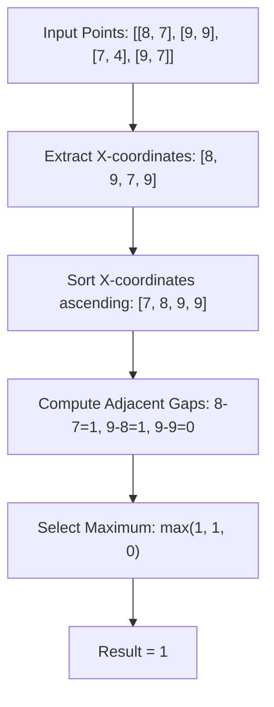

# Guided Example: Widest Vertical Area Between Two Points Containing No Points

This guide demonstrates 1D geometric projection: reducing an infinite 2D vertical strip problem to finding the maximum gap between adjacent sorted horizontal coordinates.

- **Input:** `points = [[8, 7], [9, 9], [7, 4], [9, 7]]`
- **Required Output:** `1`
- **Domain Constraints:** $2 \le n \le 10^5$, $0 \le x_i, y_i \le 10^9$

---

## 1. Instance & Teaching Goal

We are given $n$ points on a 2D plane where each point is $[x_i, y_i]$. A vertical area is defined as an infinite strip between two vertical lines $x = x_1$ and $x = x_2$ (with $x_1 < x_2$). The area contains no points if there are no input points whose $x$-coordinate satisfies $x_1 < x < x_2$. Points lying directly on the boundaries $x = x_1$ or $x = x_2$ are explicitly allowed.

In `points = [[8, 7], [9, 9], [7, 4], [9, 7]]`:
- The horizontal coordinates are $x \in \{8, 9, 7, 9\}$.
- The $y$-coordinates ($7, 9, 4, 7$) have zero effect on vertical strip emptiness because the strip extends infinitely along the $y$-axis from $-\infty$ to $+\infty$.
- The distinct sorted $x$-coordinates are $7, 8, 9$.
- The adjacent gaps between consecutive $x$-values are $8 - 7 = 1$ and $9 - 8 = 1$.
- The maximum empty strip width is $1$.

---

## 2. Conceptual Foundation & Invariants

```
+-----------------------------------------------------------------------------+
|                  1D ORTHOGONAL PROJECTION & ADJACENT GAPS                   |
|                                                                             |
|  2D Points:  [7, 4], [8, 7], [9, 9], [9, 7]                                 |
|                                                                             |
|  Projection to X-axis:                                                      |
|           x = 7         x = 8         x = 9                                 |
|             *             *             *  (9,9)                            |
|                           *             *  (9,7)                            |
|             |             |             |                                   |
|             +----gap=1----+----gap=1----+                                   |
|                                                                             |
|  Candidate strips: [7, 8] with width 1, and [8, 9] with width 1             |
|  Max valid empty width = max(8 - 7, 9 - 8) = 1                              |
+-----------------------------------------------------------------------------+
```

| State Parameter | Data Structure | Purpose in Algorithm | Instance Initial Value |
|---|---|---|---|
| Projected $X$ coordinates | Array / Generator of $x_i$ | Ignores orthogonal $y$-dimension | $[8, 9, 7, 9]$ |
| Sorted $X$ sequence | Sorted array of length $N$ | Places contiguous geometric neighbors adjacent | $[7, 8, 9, 9]$ |
| Adjacent difference | Pairwise delta $x_{i+1} - x_i$ | Represents empty vertical strip width | Evaluated over adjacent pairs |
| Maximum gap | Non-negative integer | Accumulator of maximum strip width | Initialized to $0$ |

> **Adjacency Emptiness Invariant.** In a sorted sequence of abscissas $x_0 \le x_1 \le \dots \le x_{n-1}$, the open interval $(x_i, x_{i+1})$ contains strictly zero points from the input set. Furthermore, any interval $(x_a, x_b)$ with $b > a + 1$ and $x_b > x_a$ either contains at least one intermediate point $x_{a+1}$ (if $x_a < x_{a+1} < x_b$) or can be partitioned into consecutive gaps whose widths cannot exceed the maximum adjacent gap.



---

## 3. Step-by-Step Worked Execution

### Step 1: Orthogonal Projection onto $X$-Axis
- Discard all $y$-coordinates because the definition of vertical area requires an open vertical interval $(x_1, x_2)$ across all $y \in (-\infty, \infty)$.
- The multiset of $x$-coordinates is $\{8, 9, 7, 9\}$.

---

### Step 2: Monotonic Sorting of Coordinates
- Sort the points by $x$-coordinate in non-decreasing order:
  - Sorted array: $[7, 8, 9, 9]$.
- Sorting organizes points such that all points lying strictly between any $x_i$ and $x_j$ must appear between indices $i$ and $j$ in this array.

---

### Step 3: Adjacent Difference Evaluation
- Iterate through all consecutive adjacent pairs $(x_i, x_{i+1})$:
  - Pair $(7, 8)$: Gap is $8 - 7 = 1$. Since no element exists between indices $0$ and $1$, the vertical strip $(7, 8)$ contains no points. Current maximum: $1$.
  - Pair $(8, 9)$: Gap is $9 - 8 = 1$. No points exist strictly inside $(8, 9)$. Current maximum: $\max(1, 1) = 1$.
  - Pair $(9, 9)$: Gap is $9 - 9 = 0$. Points share the same $x$-coordinate, so no positive width exists. Current maximum: $\max(1, 0) = 1$.
- Total maximum width obtained is $1$.

---

## 4. Complete Execution Trace

| Step | Pair $(x_i, x_{i+1})$ | Gap Computation | Open Interval $(x_i, x_{i+1})$ Contains Points? | Running Max Gap |
|---|---|---|---|---|
| Initial | - | - | - | $0$ |
| 1 | $(7, 8)$ | $8 - 7 = 1$ | No (Empty interior) | $\max(0, 1) = 1$ |
| 2 | $(8, 9)$ | $9 - 8 = 1$ | No (Empty interior) | $\max(1, 1) = 1$ |
| 3 | $(9, 9)$ | $9 - 9 = 0$ | No (Degenerate strip) | $\max(1, 0) = 1$ |
| Done | All pairs evaluated | - | - | **Final Answer: 1** |

---

## 5. Algorithmic Correctness

**Soundness.** For any adjacent pair $x_i$ and $x_{i+1}$ in the sorted array of $x$-coordinates, by definition of sorting, there is no index $k$ such that $x_i < x_k < x_{i+1}$. Therefore, the open vertical slab $(x_i, x_{i+1}) \times (-\infty, \infty)$ contains zero points. Thus, every difference $x_{i+1} - x_i$ represents a valid empty vertical area.

**Completeness.** Suppose an optimal empty vertical strip is bounded by $x_a$ and $x_b$ with $x_a < x_b$. If there were any point $x_c$ such that $x_a < x_c < x_b$, the strip would not be empty, contradicting validity. Thus, no input point has an $x$-coordinate strictly between $x_a$ and $x_b$. When points are sorted, $x_a$ and $x_b$ must be consecutive distinct coordinates, meaning $x_b - x_a$ is an adjacent gap. Hence, the maximum empty vertical area must coincide with some adjacent gap in the sorted sequence.

---

## 6. Traps This Instance Exposes

- **Distraction by $y$-Coordinates:** Implementing 2D distance formulas, 2D range trees, or bounding boxes adds unnecessary complexity. The problem is purely 1-dimensional along the $x$-axis.
- **Duplicate $x$-Coordinates:** Multiple points can have the same $x$-coordinate (e.g. $[9, 9]$ and $[9, 7]$). Their difference is $9 - 9 = 0$. This does not invalidate the search as long as $\max$ correctly compares non-negative gaps.
- **Strict Interior vs Boundary:** The problem states points on the boundary lines $x = x_1$ and $x = x_2$ do NOT count as inside the area. If boundary points were forbidden, no area could use existing points as borders.
- **Large Coordinate Values:** With coordinates up to $10^9$, using a boolean bucket array or counting sort requires gigabytes of memory; comparison-based sorting using $\mathcal{O}(N \log N)$ time is the optimal general-purpose approach.

---

## 7. Complexity Derivation

- **Time Complexity:** $\mathcal{O}(N \log N)$, where $N$ is the number of points. Extracting $x$-coordinates takes $\mathcal{O}(N)$ time. Sorting the $N$ coordinates requires $\mathcal{O}(N \log N)$ operations. The single linear scan computing adjacent differences requires $\mathcal{O}(N)$ comparisons. The sorting phase dominates.
- **Auxiliary Space Complexity:** $\mathcal{O}(1)$ beyond the input array if sorting in place, or $\mathcal{O}(N)$ auxiliary space if extracting $x$-coordinates into a separate array.
