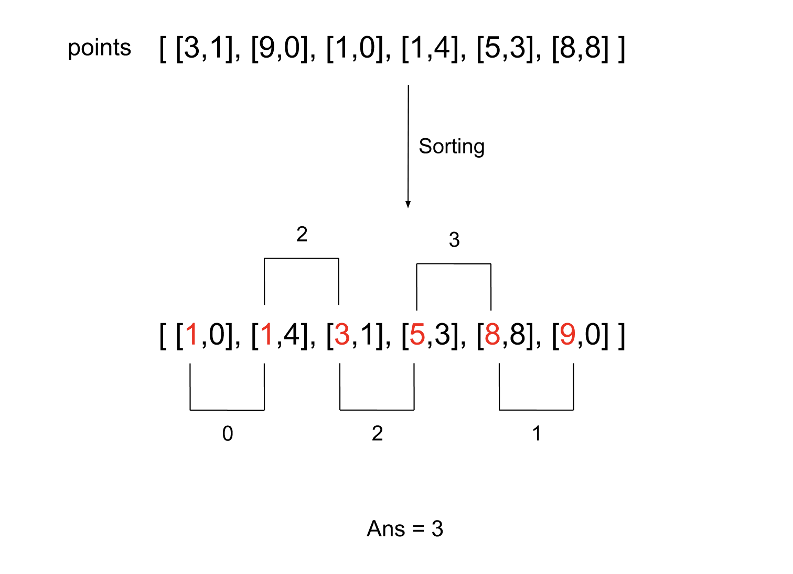

[TOC]

## Solution

---

### Approach: Sorting

**Intuition**

We have $N$ points on a 2D plane. The problem is to find the widest vertical area between any two points without having any other point in between. Vertical area implies that the area can have an infinite length over the y-axis. This means that the y-coordinate doesn't affect the result and we shall focus on the distance along the x-axis.

Therefore, we only need to find the width between every two adjacent points based on x-coordinates and the maximum width among these would be the answer. Note that there can be multiple points with the same x-coordinate but that won't affect the answer as the points on the edges can be included in the area.

Since the points do not have a specific order, we will need to sort the points in ascending order of x-coordinates first. Then we need to find the difference in x-coordinates between every two neighboring points, and their maximum value is the result we want, as shown in the picture below.



**Algorithm**

1. Sort the array `points` in ascending order of x-coordinates.
2. Initialize the variable `ans` to `0`, this will store the widest vertical area which is the answer to the problem.
3. Iterate over `points` from index `1` and store the maximum of $\text{points}[i][0] - points[i - 1][0]$ in `ans`.
4. Return `ans`.

**Implementation**

```cpp
class Solution {
public:
    int maxWidthOfVerticalArea(vector<vector<int>>& points) {
        sort(points.begin(), points.end());

        int ans = 0;
        for (int i = 1; i < points.size(); i++) {
            ans = max(ans, points[i][0] - points[i - 1][0]);
        }

        return ans;
    }
};
```

**Complexity Analysis**

Here, $N$ is the number of points in the array `points`.

* Time complexity: $O(N \log N)$

  Sorting the array will take $O(N \log N)$ time. Then iterating over it to find the value for `ans` needs $O(N)$. Hence the total time complexity is equal to $O(N \log N)$.

* Space complexity: $O(\log N)$

  We don't need any extra space other than the variable `ans`. However, there will be some space required for sorting. The space complexity of the sorting algorithm is language-specific. For instance, in Java, the Arrays.sort() for primitives is implemented as a variant of the quicksort algorithm whose space complexity is $O(\log N)$. In C++ sort() function provided by STL is a hybrid of Quick Sort, Heap Sort, and Insertion Sort and has a worst-case space complexity of $O(\log N)$. Thus, using the inbuilt sort() function might add up to $O(\log N)$ to space complexity.
  <br/>

---