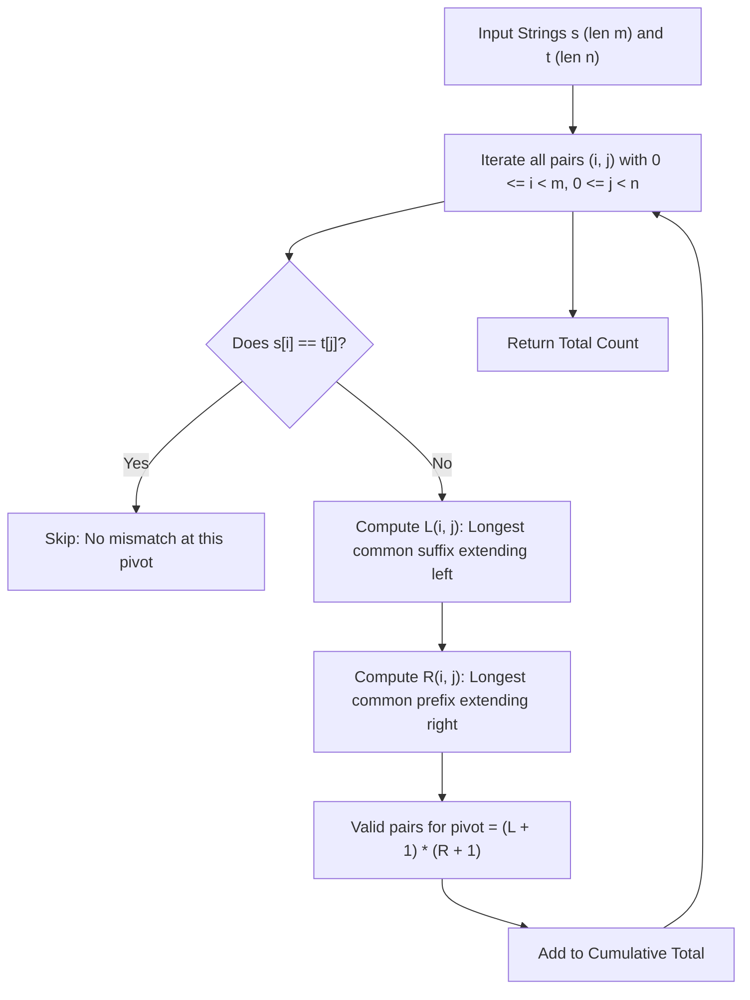

# Guided Example: Count Substrings That Differ by One Character

This guide demonstrates pivot-centered enumeration: counting valid substring pairs by fixing their unique mismatch position and multiplying the number of matching prefix extensions by matching suffix extensions.

- **Input:** $s = \text{"aba"}, t = \text{"baba"}$
- **Required Output:** $6$
- **Domain Constraints:** $1 \le |s|, |t| \le 100$, consisting only of lowercase English letters.

---

## 1. Instance & Teaching Goal

We are given two strings $s$ and $t$. We must find the total number of non-empty substring pairs $(s[i \dots i+k-1], t[j \dots j+k-1])$ of equal length $k$ such that they differ by **exactly one character** (i.e., the Hamming distance between the two substrings is $1$).

In $s = \text{"aba"}$ (length $3$) and $t = \text{"baba"}$ (length $4$):
- Substrings of length $1$:
  - $s[0..0] = \text{"a"}$ matches $t[0..0] = \text{"b"}$ (1 mismatch), $t[2..2] = \text{"b"}$ (1 mismatch).
  - $s[1..1] = \text{"b"}$ matches $t[1..1] = \text{"a"}$ (1 mismatch), $t[3..3] = \text{"a"}$ (1 mismatch).
  - $s[2..2] = \text{"a"}$ matches $t[0..0] = \text{"b"}$ (1 mismatch), $t[2..2] = \text{"b"}$ (1 mismatch).
  - Subtotal for length $1$: $2 + 2 + 2 = 6$.
- Substrings of length $2$:
  - $s[0..1] = \text{"ab"}$: compared against $\text{"ba"}$ (2 mismatches), $\text{"ab"}$ (0 mismatches), $\text{"ba"}$ (2 mismatches).
  - $s[1..2] = \text{"ba"}$: compared against $\text{"ba"}$ (0 mismatches), $\text{"ab"}$ (2 mismatches), $\text{"ba"}$ (0 mismatches).
  - Subtotal for length $2$: $0$.
- Substrings of length $3$:
  - $s[0..2] = \text{"aba"}$: compared against $t[0..2] = \text{"bab"}$ (3 mismatches) and $t[1..3] = \text{"aba"}$ (0 mismatches).
  - Subtotal for length $3$: $0$.
- The total across all lengths is $6$.

---

## 2. Conceptual Foundation & Invariants

```
+-----------------------------------------------------------------------------+
|                PIVOT-CENTERED SUBSTRING PAIR EXPANSION                      |
|                                                                             |
|  String s:  [ ... a  b  c ... ]   (mismatch at index i: s[i])               |
|  String t:  [ ... a  x  c ... ]   (mismatch at index j: t[j], s[i] != t[j]) |
|                                                                             |
|             <--- L(i,j) --->  *  <--- R(i,j) --->                           |
|             Common Suffix     |  Common Prefix                              |
|                                                                             |
|  Any valid window containing (i, j) as its SOLE difference:                 |
|    - Extends left by  delta_L in {0, 1, ..., L(i,j)}  --> (L + 1) choices   |
|    - Extends right by delta_R in {0, 1, ..., R(i,j)}  --> (R + 1) choices   |
|                                                                             |
|  Substrings centered at (i, j) = (L(i, j) + 1) * (R(i, j) + 1)             |
+-----------------------------------------------------------------------------+
```

| State Parameter | Mathematical Definition | Role in Algorithm | Instance Example |
|---|---|---|---|
| Mismatch Pivot $(i, j)$ | Pair of indices where $s[i] \neq t[j]$ | Unique locus of the single permitted difference | $(0, 0)$ where $s[0]=\text{'a'} \neq t[0]=\text{'b'}$ |
| Left Matching Span $L(i, j)$ | Longest common suffix of $s[0 \dots i-1]$ and $t[0 \dots j-1]$ | Maximum steps window can expand to the left | $L(0, 0) = 0$ |
| Right Matching Span $R(i, j)$ | Longest common prefix of $s[i+1 \dots m-1]$ and $t[j+1 \dots n-1]$ | Maximum steps window can expand to the right | $R(0, 0) = 0$ |
| Pair Multiplicity | $(L(i, j) + 1) \cdot (R(i, j) + 1)$ | Total valid pairs whose only mismatch is at $(i, j)$ | $(0+1) \cdot (0+1) = 1$ |

> **Uniqueness of Pivot Invariant.** Every valid substring pair $(s[a \dots b], t[c \dots d])$ has exactly one mismatch position $k \in [0, b-a]$. Consequently, setting $i = a + k$ and $j = c + k$, this substring pair is counted if and only if the pivot $(i, j)$ is processed, and it is never counted at any other pivot. Overlap and double counting are strictly zero.



---

## 3. Step-by-Step Worked Execution

### Step 1: Enumerate Mismatches for $i = 0$ ($s[0] = \text{'a'}$)
- Compare $s[0] = \text{'a'}$ against each character of $t = \text{"baba"}$:
  - $j = 0$ ($t[0] = \text{'b'}$): $s[0] \neq t[0]$. Left span $L = 0$. Right span $R = \text{LCP}(s[1 \dots 2], t[1 \dots 3]) = \text{LCP}(\text{"ba"}, \text{"aba"}) = 0$ (since $'b' \neq 'a'$). Valid pairs: $(0 + 1) \cdot (0 + 1) = 1$.
  - $j = 1$ ($t[1] = \text{'a'}$): $s[0] = t[1]$, identical, skip.
  - $j = 2$ ($t[2] = \text{'b'}$): $s[0] \neq t[2]$. Left span $L = 0$. Right span $R = \text{LCP}(s[1 \dots 2], t[3 \dots 3]) = \text{LCP}(\text{"ba"}, \text{"a"}) = 0$. Valid pairs: $(0 + 1) \cdot (0 + 1) = 1$.
  - $j = 3$ ($t[3] = \text{'a'}$): $s[0] = t[3]$, identical, skip.
- Subtotal from $i = 0$: $1 + 1 = 2$.

---

### Step 2: Enumerate Mismatches for $i = 1$ ($s[1] = \text{'b'}$)
- Compare $s[1] = \text{'b'}$ against each character of $t$:
  - $j = 0$ ($t[0] = \text{'b'}$): identical, skip.
  - $j = 1$ ($t[1] = \text{'a'}$): $s[1] \neq t[1]$. Left span $L = \text{LCSuff}(s[0], t[0]) = \text{LCSuff}(\text{'a'}, \text{'b'}) = 0$. Right span $R = \text{LCP}(s[2], t[2 \dots 3]) = \text{LCP}(\text{'a'}, \text{"ba"}) = 0$. Valid pairs: $(0 + 1) \cdot (0 + 1) = 1$.
  - $j = 2$ ($t[2] = \text{'b'}$): identical, skip.
  - $j = 3$ ($t[3] = \text{'a'}$): $s[1] \neq t[3]$. Left span $L = \text{LCSuff}(s[0], t[2]) = \text{LCSuff}(\text{'a'}, \text{'b'}) = 0$. Right span $R = 0$ (end of $t$). Valid pairs: $(0 + 1) \cdot (0 + 1) = 1$.
- Subtotal from $i = 1$: $1 + 1 = 2$.

---

### Step 3: Enumerate Mismatches for $i = 2$ ($s[2] = \text{'a'}$)
- Compare $s[2] = \text{'a'}$ against each character of $t$:
  - $j = 0$ ($t[0] = \text{'b'}$): $s[2] \neq t[0]$. Left span $L = 0$ (end of left for $t$). Right span $R = 0$ (end of $s$). Valid pairs: $(0 + 1) \cdot (0 + 1) = 1$.
  - $j = 1$ ($t[1] = \text{'a'}$): identical, skip.
  - $j = 2$ ($t[2] = \text{'b'}$): $s[2] \neq t[2]$. Left span $L = \text{LCSuff}(s[0 \dots 1], t[0 \dots 1]) = \text{LCSuff}(\text{"ab"}, \text{"ba"}) = 0$ (since $'b' \neq 'a'$). Right span $R = 0$ (end of $s$). Valid pairs: $(0 + 1) \cdot (0 + 1) = 1$.
  - $j = 3$ ($t[3] = \text{'a'}$): identical, skip.
- Subtotal from $i = 2$: $1 + 1 = 2$.

---

## 4. Complete Execution Trace

| Pivot $(i, j)$ | $s[i]$ vs $t[j]$ | Match Status | Left Span $L(i, j)$ | Right Span $R(i, j)$ | Contribution $(L+1)(R+1)$ | Running Total |
|---|---|---|---|---|---|---|
| $(0, 0)$ | `'a'` vs `'b'` | Mismatch | $0$ | $0$ | $(0+1)(0+1) = 1$ | $1$ |
| $(0, 1)$ | `'a'` vs `'a'` | Match | - | - | $0$ | $1$ |
| $(0, 2)$ | `'a'` vs `'b'` | Mismatch | $0$ | $0$ | $(0+1)(0+1) = 1$ | $2$ |
| $(0, 3)$ | `'a'` vs `'a'` | Match | - | - | $0$ | $2$ |
| $(1, 0)$ | `'b'` vs `'b'` | Match | - | - | $0$ | $2$ |
| $(1, 1)$ | `'b'` vs `'a'` | Mismatch | $0$ | $0$ | $(0+1)(0+1) = 1$ | $3$ |
| $(1, 2)$ | `'b'` vs `'b'` | Match | - | - | $0$ | $3$ |
| $(1, 3)$ | `'b'` vs `'a'` | Mismatch | $0$ | $0$ | $(0+1)(0+1) = 1$ | $4$ |
| $(2, 0)$ | `'a'` vs `'b'` | Mismatch | $0$ | $0$ | $(0+1)(0+1) = 1$ | $5$ |
| $(2, 1)$ | `'a'` vs `'a'` | Match | - | - | $0$ | $5$ |
| $(2, 2)$ | `'a'` vs `'b'` | Mismatch | $0$ | $0$ | $(0+1)(0+1) = 1$ | $6$ |
| $(2, 3)$ | `'a'` vs `'a'` | Match | - | - | $0$ | $6$ |
| **Final** | All $3 \times 4$ evaluated | - | - | - | - | **Total: 6** |

---

## 5. Algorithmic Correctness

**Soundness.** Let $s[i] \neq t[j]$. By definition, $L(i, j)$ is the length of the identical matching prefix to the left of $(i, j)$, and $R(i, j)$ is the length of the identical matching suffix to the right. Choosing any left extension $\Delta_L \in [0, L(i, j)]$ and any right extension $\Delta_R \in [0, R(i, j)]$ forms substrings $s[i - \Delta_L \dots i + \Delta_R]$ and $t[j - \Delta_L \dots j + \Delta_R]$. Both substrings have identical length $\Delta_L + \Delta_R + 1$. Every character at relative offset $k \neq \Delta_L$ matches by construction, and the character at relative offset $\Delta_L$ corresponds to $(i, j)$, which differs. Therefore, every generated pair has Hamming distance exactly $1$.

**Completeness.** Suppose two substrings $s[a \dots b]$ and $t[c \dots d]$ of equal length have Hamming distance exactly $1$. Then there exists a unique index $k \in [0, b-a]$ such that $s[a+k] \neq t[c+k]$ while $s[a+x] = t[c+x]$ for all $x \neq k$. Let $i = a+k$ and $j = c+k$. By construction, $s[i] \neq t[j]$. The identical matches before $k$ require $\Delta_L = k \le L(i, j)$, and the matches after $k$ require $\Delta_R = (b-a) - k \le R(i, j)$. Thus, this exact substring pair is counted in the Cartesian product of choices at pivot $(i, j)$. Since the mismatch position is unique, no substring pair can be associated with two different pivots $(i, j)$, preventing double counting.

---

## 6. Traps This Instance Exposes

- **Counting Identical Substrings:** Substrings with $0$ differences (exact matches) must be excluded; only substring pairs with Hamming distance exactly $1$ are counted.
- **Counting Substrings with $\ge 2$ Differences:** If a substring pair contains two or more mismatched characters, it must not be counted. The pivot-centered method strictly bounds the left and right expansions to terminate at the very first additional mismatch, avoiding higher Hamming distances.
- **Double Counting via Multiple Mismatches:** If an algorithm attempted to expand beyond the first mismatch, a substring pair with multiple mismatches would be generated from multiple centers. Limiting expansion to contiguous identical matches ensures disjoint partition.
- **Off-by-One on Window Boundaries:** Forgetting the empty expansion ($\Delta_L = 0$ or $\Delta_R = 0$) omits single-character substrings ($k=1$), where $L=0$ and $R=0$ must yield $(0+1)(0+1) = 1$.

---

## 7. Complexity Derivation

- **Time Complexity:** $\mathcal{O}(|s| \cdot |t|)$. The left spans $L(i, j)$ and right spans $R(i, j)$ can be precomputed using dynamic programming in $\mathcal{O}(|s| \cdot |t|)$ time, or computed on the fly along each diagonal in $\mathcal{O}(|s| \cdot |t|)$. Evaluating the sum over all $(i, j)$ takes $\mathcal{O}(|s| \cdot |t|)$ steps. For $|s|, |t| \le 100$, this requires at most $10^4$ operations.
- **Auxiliary Space Complexity:** $\mathcal{O}(|s| \cdot |t|)$ if storing $L$ and $R$ DP matrices, or $\mathcal{O}(1)$ auxiliary space if expanding along diagonals with running streak counters.