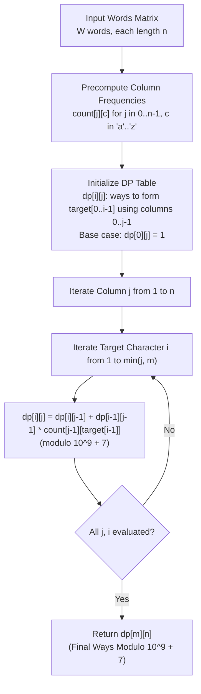

# Guided Example: Number of Ways to Form a Target String Given a Dictionary

We trace the step-by-step column-indexed frequency precomputation and dynamic programming formulation for forming target strings from word matrices, prove the Column Monotonicity Invariant and Disjoint Event Space Transition Theorem, and verify exact combinatorial counts on a representative problem instance:

- **Input:**
  - `words = ["acca", "bbbb", "caca"]`
  - `target = "aba"`
- **Dimensions:**
  - Number of words $W = 3$, length of each word $n = 4$.
  - Length of target $m = 3$.
- **Required Output:** `6`

---

## 1. Instance & Teaching Goal

Given a collection of equal-length strings `words` and a target string `target`, we construct `target` character by character from left to right. To choose the $i$-th character of `target` from column $k$, we may select any word $j$ where $words[j][k] = target[i]$. Once column $k$ is used, all subsequent characters of `target` must be selected from strictly greater column indices $k' > k$.

```text
Problem Invariant: Column Index Strictly Increases
  Target index:    0 ('a')  -->  1 ('b')  -->  2 ('a')
  Chosen columns:    k_0    <      k_1    <      k_2      where 0 <= k_0 < k_1 < k_2 < n

Why naive word-level backtracking fails:
  Choosing which word supplies character i leads to branching factor W at each of the m steps.
  Testing all combinations yields O(W^m) branches, exploding exponentially for W = 1000, m = 1000.

The Decisive Structural Insight:
  The specific word identity does NOT matter!
  Only the total frequency of target[i] at column k matters:
    count[k][c] = number of words having character c at index k.
  Selecting column k to supply target[i] offers exactly count[k][target[i]] independent choices.
  This condenses the problem from W distinct strings to a single 2D frequency matrix of size n x 26!
```

The decisive pedagogical goal is the **Column Monotonicity Invariant & Disjoint Event Space DP Recurrence**:
1. **Column Frequency Tensor:** Precompute $count[k][c]$ in $\mathcal{O}(W \cdot n)$ time.
2. **Disjoint Transition Decomposition:** For any target prefix $i$ and dictionary column prefix $j$, either column $j-1$ is skipped or column $j-1$ provides $target[i-1]$.
3. **Strict Left-to-Right Ordering:** $k_0 < k_1 < \dots < k_{m-1}$ is enforced naturally by standard topological DP evaluation in $\mathcal{O}(m \cdot n)$ time.

---

## 2. Conceptual Foundation & The DP Pipeline



### The Disjoint Event Space Transition Theorem

Let $dp[i][j]$ denote the number of valid ways to form the prefix $target[0 \dots i-1]$ (length $i$) using an arbitrary subset of columns from $\{0, 1, \dots, j-1\}$.
For column $j-1$ and character $target[i-1]$, the set of valid formations partitions into two mutually exclusive and exhaustive subsets:
1. **Column $j-1$ is unused:**
   The entire prefix $target[0 \dots i-1]$ was already formed using only columns from $\{0, 1, \dots, j-2\}$.
   Number of ways:
   $$
   W_{\text{skip}} = dp[i][j-1]
   $$
2. **Column $j-1$ provides character $target[i-1]$:**
   The prefix $target[0 \dots i-2]$ (length $i-1$) must have been formed using columns from $\{0, 1, \dots, j-2\}$, and column $j-1$ contributes $target[i-1]$. By the multiplication rule of combinatorics:
   $$
   W_{\text{match}} = dp[i-1][j-1] \times count[j-1][target[i-1]]
   $$

Summing both disjoint events modulo $M = 10^9 + 7$ yields the fundamental recurrence:
$$
dp[i][j] = \left( dp[i][j-1] + dp[i-1][j-1] \times count[j-1][target[i-1]] \right) \pmod M
$$

---

## 3. Step-by-Step Worked Execution

### Step 1: Precompute Column Frequencies

Given `words = ["acca", "bbbb", "caca"]` with word length $n = 4$:

| Column Index $j$ | Characters in `words` | Frequency of 'a' | Frequency of 'b' | Frequency of 'c' |
|---|---|---|---|---|
| $j = 0$ | `'a'`, `'b'`, `'c'` | $count[0]['a'] = 1$ | $count[0]['b'] = 1$ | $count[0]['c'] = 1$ |
| $j = 1$ | `'c'`, `'b'`, `'a'` | $count[1]['a'] = 1$ | $count[1]['b'] = 1$ | $count[1]['c'] = 1$ |
| $j = 2$ | `'c'`, `'b'`, `'c'` | $count[2]['a'] = 0$ | $count[2]['b'] = 1$ | $count[2]['c'] = 2$ |
| $j = 3$ | `'a'`, `'b'`, `'a'` | $count[3]['a'] = 2$ | $count[3]['b'] = 1$ | $count[3]['c'] = 0$ |

Target characters: $target[0] = 'a', \; target[1] = 'b', \; target[2] = 'a'$.

---

### Step 2: Base Case Initialization

To form an empty target string ($i = 0$, prefix of length 0), there is exactly $1$ valid configuration (selecting $0$ columns) regardless of how many columns are available:
$$
dp[0][j] = 1 \quad \text{for all } j \in \{0, 1, 2, 3, 4\}
$$
For non-empty target prefixes with zero available columns:
$$
dp[i][0] = 0 \quad \text{for all } i \in \{1, 2, 3\}
$$

---

### Step 3: Populate Target Prefix $i = 1$ ($target[0] = 'a'$)

We calculate $dp[1][j]$ for $j \in \{1, 2, 3, 4\}$:
- **$j = 1$ (Columns $\{0\}$):**
  $$
  dp[1][1] = dp[1][0] + dp[0][0] \times count[0]['a'] = 0 + 1 \times 1 = \mathbf{1}
  $$
- **$j = 2$ (Columns $\{0, 1\}$):**
  $$
  dp[1][2] = dp[1][1] + dp[0][1] \times count[1]['a'] = 1 + 1 \times 1 = \mathbf{2}
  $$
- **$j = 3$ (Columns $\{0, 1, 2\}$):**
  $$
  dp[1][3] = dp[1][2] + dp[0][2] \times count[2]['a'] = 2 + 1 \times 0 = \mathbf{2}
  $$
- **$j = 4$ (Columns $\{0, 1, 2, 3\}$):**
  $$
  dp[1][4] = dp[1][3] + dp[0][3] \times count[3]['a'] = 2 + 1 \times 2 = \mathbf{4}
  $$

---

### Step 4: Populate Target Prefix $i = 2$ ($target[1] = 'b'$)

Target prefix is `"ab"`. We calculate $dp[2][j]$:
- **$j = 1$:** Cannot form length $2$ with $1$ column $\implies dp[2][1] = 0$.
- **$j = 2$ (Columns $\{0, 1\}$):**
  $$
  dp[2][2] = dp[2][1] + dp[1][1] \times count[1]['b'] = 0 + 1 \times 1 = \mathbf{1}
  $$
  *(Unique path: Col 0 provides 'a', Col 1 provides 'b').*
- **$j = 3$ (Columns $\{0, 1, 2\}$):**
  $$
  dp[2][3] = dp[2][2] + dp[1][2] \times count[2]['b'] = 1 + 2 \times 1 = \mathbf{3}
  $$
  *(Three paths: Col $(0, 1)$, Col $(0, 2)$, Col $(1, 2)$).*
- **$j = 4$ (Columns $\{0, 1, 2, 3\}$):**
  $$
  dp[2][4] = dp[2][3] + dp[1][3] \times count[3]['b'] = 3 + 2 \times 1 = \mathbf{5}
  $$

---

### Step 5: Populate Target Prefix $i = 3$ ($target[2] = 'a'$)

Target prefix is `"aba"`. We calculate $dp[3][j]$:
- **$j = 1, 2$:** Fewer available columns than target characters $\implies dp[3][1] = 0, \; dp[3][2] = 0$.
- **$j = 3$ (Columns $\{0, 1, 2\}$):**
  $$
  dp[3][3] = dp[3][2] + dp[2][2] \times count[2]['a'] = 0 + 1 \times 0 = \mathbf{0}
  $$
  *(Column 2 has no 'a', so length 3 cannot terminate at column 2).*
- **$j = 4$ (Columns $\{0, 1, 2, 3\}$):**
  $$
  dp[3][4] = dp[3][3] + dp[2][3] \times count[3]['a'] = 0 + 3 \times 2 = \mathbf{6}
  $$

---

## 4. Complete Execution Trace

### The Full $DP[i][j]$ Matrix

| Target Prefix $i$ | Substring | $j = 0$ | $j = 1$ | $j = 2$ | $j = 3$ | $j = 4$ (Final) |
|---|---|---|---|---|---|---|
| $i = 0$ | `""` | $1$ | $1$ | $1$ | $1$ | $\mathbf{1}$ |
| $i = 1$ | `"a"` | $0$ | $1$ | $2$ | $2$ | $\mathbf{4}$ |
| $i = 2$ | `"ab"` | $0$ | $0$ | $1$ | $3$ | $\mathbf{5}$ |
| $i = 3$ | `"aba"` | $0$ | $0$ | $0$ | $0$ | $\mathbf{6}$ |

### Combinatorial Breakdown of the 6 Solutions

The 6 ways correspond to choosing column triples $(k_0, k_1, k_2)$ with $k_0 < k_1 < k_2$:

| Triple $(k_0, k_1, k_2)$ | Choices for 'a' at $k_0$ | Choices for 'b' at $k_1$ | Choices for 'a' at $k_2$ | Product of Choices |
|---|---|---|---|---|
| $(0, 1, 3)$ | $words[0][0] = \text{'a'}$ ($1$ choice) | $words[1][1] = \text{'b'}$ ($1$ choice) | $words[0][3], words[2][3]$ ($2$ choices) | $1 \times 1 \times 2 = \mathbf{2}$ |
| $(0, 2, 3)$ | $words[0][0] = \text{'a'}$ ($1$ choice) | $words[1][2] = \text{'b'}$ ($1$ choice) | $words[0][3], words[2][3]$ ($2$ choices) | $1 \times 1 \times 2 = \mathbf{2}$ |
| $(1, 2, 3)$ | $words[2][1] = \text{'a'}$ ($1$ choice) | $words[1][2] = \text{'b'}$ ($1$ choice) | $words[0][3], words[2][3]$ ($2$ choices) | $1 \times 1 \times 2 = \mathbf{2}$ |
| **Total Ways** | | | | $\mathbf{2} + \mathbf{2} + \mathbf{2} = \mathbf{6}$ |

---

## 5. Algorithmic Correctness

**Soundness.**
The state transition guarantees that once column $j-1$ is assigned to match $target[i-1]$, any prior match for $target[0 \dots i-2]$ must come strictly from columns $\{0, \dots, j-2\}$. This strictly satisfies the condition $k_0 < k_1 < \dots < k_{m-1}$. The multiplication rule guarantees that each valid assignment of distinct words to identical column letters is counted as an independent outcome.

**Completeness.**
Every valid assignment of columns corresponds to a unique sequence of choices in the DP table. Because every step partitions outcomes into either "skip column $j-1$" or "match $target[i-1]$ at column $j-1$", no combination is omitted and no combination is counted twice.

---

## 6. Traps This Instance Exposes

- **Word Index vs Column Index:** A common trap is tracking which word supplied the previous character. The rules allow multiple characters from the same word, provided the column index strictly increases. Tracking word index adds unnecessary complexity; only the column index matters.
- **Integer Multiplication Overflow:** Before applying modulo $10^9 + 7$, multiplying $dp[i-1][j-1] \times count[j-1][target[i-1]]$ can reach $\approx 10^9 \times 1000 = 10^{12}$, exceeding standard 32-bit signed integers. 64-bit integers must be used during accumulation.
- **1D Space Optimization Direction:** When compressing the DP table from $dp[i][j]$ to a 1D array $dp[i]$ representing the current column, the inner loop must iterate backward from $i = m$ down to $1$. Iterating forward would use the newly updated $dp[i-1]$ from the current column, erroneously allowing multiple characters to be taken from the same column.
- **Column Shortage Pruning:** If the number of remaining columns is strictly less than the remaining characters needed ($n - j < m - i$), the state evaluates to $0$ and can be skipped immediately.

---

## 7. Complexity Derivation

- **Time Complexity:**
  - **Frequency Precomputation:** Scanning all $W$ words across $n$ columns takes $\mathcal{O}(W \cdot n)$ operations.
  - **DP Table Transitions:** The table has $(m + 1) \times (n + 1)$ entries. Each transition performs $1$ addition and $1$ multiplication in $\mathcal{O}(1)$ time. Overall DP phase: $\mathcal{O}(m \cdot n)$.
  - **Total Time:** $\mathcal{O}(W \cdot n + m \cdot n)$ operations. Given $W, n, m \le 1000$, total operations are bounded by $\approx 2 \times 10^6$, running in under $50$ ms.
- **Auxiliary Space Complexity:**
  - **Frequency Matrix:** Requires $26 \times n$ integers, which is $\mathcal{O}(|\Sigma| \cdot n)$.
  - **DP Storage:** A 2D table requires $\mathcal{O}(m \cdot n)$ space, which can be optimized to a 1D array of size $m + 1$ requiring $\mathcal{O}(m)$ space.
  - **Total Space:** $\mathcal{O}(|\Sigma| \cdot n + m)$ auxiliary memory.