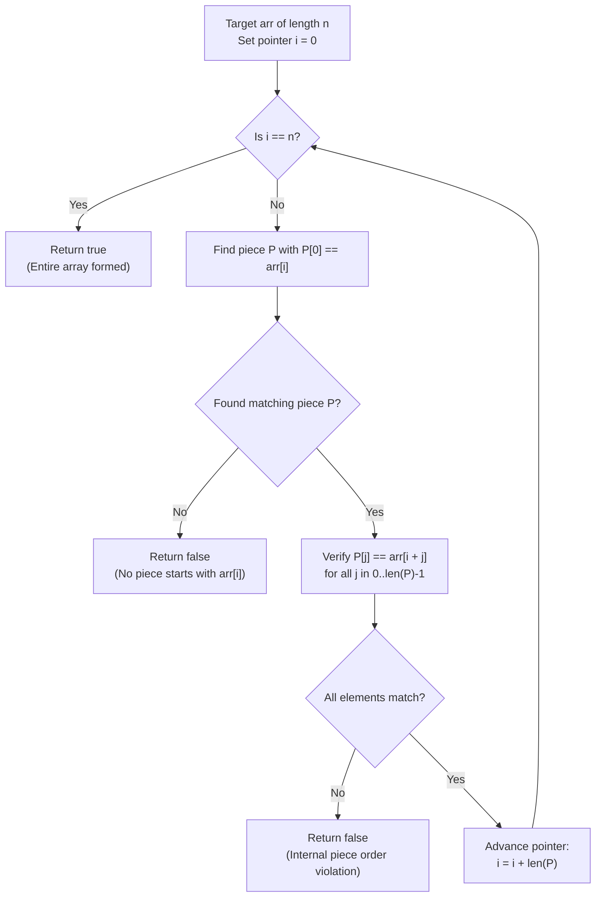

# Guided Example: Check Array Formation Through Concatenation

We trace the deterministic head-matching and contiguous segment verification of array concatenation, prove the Deterministic Prefix Decomposition Theorem and Distinct Element Invariant, and analyze both successful formations and structural ordering failures across representative problem instances:

- **Representative Instance 1 (Multi-Piece Permutation):**
  - Target Array: `arr = [91, 4, 64, 78]` ($n = 4$)
  - Available Pieces: `pieces = [[78], [4, 64], [91]]` ($p = 3$)
  - **Required Output:** `true`
  - Concatenation order: `pieces[2]` ($[91]$) followed by `pieces[1]` ($[4, 64]$) followed by `pieces[0]` ($[78]$).

- **Representative Instance 2 (Internal Order Inversion Failure):**
  - Target Array: `arr = [49, 18, 16]` ($n = 3$)
  - Available Pieces: `pieces = [[16, 18, 49]]` ($p = 1$)
  - **Required Output:** `false`
  - The pieces contain the identical set of values $\{16, 18, 49\}$, but their required sequence within the piece cannot be rearranged.

- **Representative Instance 3 (Two-Element Transposition):**
  - Target Array: `arr = [15, 88]`
  - Available Pieces: `pieces = [[88], [15]]`
  - **Required Output:** `true`

---

## 1. Instance & Teaching Goal

Given an array of **distinct** integers `arr` and a collection of integer arrays `pieces` (where all integers across all pieces are also distinct and sum to $n = \text{len}(arr)$), determine whether `arr` can be formed by concatenating the arrays in `pieces` in some order without altering the order of elements inside any piece.

```text
The Core Constraint: Rigid Internal Ordering vs Arbitrary Piece Order
  Allowed:      Permuting the pieces themselves:
                [pieces[2], pieces[1], pieces[0]]
  Forbidden:    Permuting elements within a piece:
                [4, 64] CANNOT become [64, 4]

Why the "Distinct Integers" Guarantee is Decisive:
  If values could repeat, multiple pieces could start with the same value,
  forcing recursive branching and backtracking: O(p!) search tree.
  BECAUSE ALL INTEGERS ARE DISTINCT:
  At unmatched target index i, exactly ONE piece can start with arr[i].
  Zero candidates  --> Formation is impossible (return false immediately).
  One candidate    --> That piece MUST be used next; verify its contiguous match.
  This completely eliminates branching, yielding a strictly deterministic O(n) walk!
```

The decisive pedagogical goal is the **Deterministic Prefix Decomposition Theorem & Distinct Element Invariant**:
1. **Unambiguous Anchor:** The head element of each piece acts as an injective primary key into `pieces`.
2. **Greedy Determinism:** At each step $i$, finding the piece $P$ whose head $P[0] = arr[i]$ is both necessary and sufficient.
3. **Contiguous Verification:** Once $P$ is identified, every element $P[j]$ must match $arr[i + j]$ in exact succession.

---

## 2. Conceptual Foundation & The Verification Pipeline



### The Deterministic Prefix Decomposition Theorem

Let $arr[0 \dots n-1]$ and $pieces = \{P_1, P_2, \dots, P_k\}$ satisfy the distinctness property:
$$
\bigcup_{j=1}^k \text{elements}(P_j) = \text{elements}(arr), \quad \sum_{j=1}^k |P_j| = n, \quad \text{and} \quad \forall a, b: a \ne b \implies arr[a] \ne arr[b]
$$
1. **Injectivity of Piece Heads:**
   Define $H = \{ P_j[0] : 1 \le j \le k \}$. Since all elements in $arr$ are distinct, the mapping $f: H \to pieces$ defined by $f(P_j[0]) = P_j$ is a bijection.
2. **Unique Extension Property:**
   Suppose the prefix $arr[0 \dots i-1]$ has already been successfully formed by a permutation of a subset of pieces.
   The next element in the required target is $arr[i]$.
   - If $arr[i] \notin H$, no remaining piece can start at index $i$. Since elements within a piece cannot be split, $arr$ cannot be formed.
   - If $arr[i] \in H$, the unique piece $P = f(arr[i])$ MUST be placed at index $i$.
3. **Deterministic Termination:**
   Since each piece is selected at most once and $|P| \ge 1$, the index $i$ advances by $|P|$ on each match. The process terminates in at most $k \le n$ steps without ever needing to backtrack.

---

## 3. Step-by-Step Worked Execution

### Step 1: Trace on Successful Instance (`arr = [91, 4, 64, 78]`, `pieces = [[78], [4, 64], [91]]`)

We track pointer $i$ scanning `arr`, the matching piece identified, and pointer progression:

#### Iteration 1: Target Position $i = 0$
- Current target value: $arr[0] = 91$.
- Search `pieces` for a piece starting with $91$:
  - $pieces[0] = [78] \implies 78 \ne 91$.
  - $pieces[1] = [4, 64] \implies 4 \ne 91$.
  - $pieces[2] = [91] \implies 91 == 91$. Match found!
- Contiguous element verification for $pieces[2]$:
  - $j = 0: pieces[2][0] = 91 == arr[0] = 91$.
- Length of piece is $1$. Advance index: $i \leftarrow 0 + 1 = 1$.

#### Iteration 2: Target Position $i = 1$
- Current target value: $arr[1] = 4$.
- Search `pieces` for a piece starting with $4$:
  - $pieces[0] = [78] \implies 78 \ne 4$.
  - $pieces[1] = [4, 64] \implies 4 == 4$. Match found!
- Contiguous element verification for $pieces[1]$:
  - $j = 0: pieces[1][0] = 4 == arr[1] = 4$.
  - $j = 1: pieces[1][1] = 64 == arr[2] = 64$.
- Both elements match in order. Length of piece is $2$. Advance index: $i \leftarrow 1 + 2 = 3$.

#### Iteration 3: Target Position $i = 3$
- Current target value: $arr[3] = 78$.
- Search `pieces` for a piece starting with $78$:
  - $pieces[0] = [78] \implies 78 == 78$. Match found!
- Contiguous element verification for $pieces[0]$:
  - $j = 0: pieces[0][0] = 78 == arr[3] = 78$.
- Length of piece is $1$. Advance index: $i \leftarrow 3 + 1 = 4$.

#### Iteration 4: Termination
- Pointer $i = 4 == \text{len}(arr) = 4$. All elements matched.
- Return **`true`**.

---

### Step 2: Trace on Inversion Failure (`arr = [49, 18, 16]`, `pieces = [[16, 18, 49]]`)

#### Iteration 1: Target Position $i = 0$
- Current target value: $arr[0] = 49$.
- Search `pieces` for a piece starting with $49$:
  - $pieces[0] = [16, 18, 49] \implies pieces[0][0] = 16 \ne 49$.
  - Scanned all available pieces; no piece begins with $49$.
- Immediate conclusion: Since $49$ occurs at index 2 of $pieces[0]$, utilizing $49$ would require preceding it with $16$ and $18$, which violates target order $arr[0] = 49$.
- Return **`false`**.

---

## 4. Complete Execution Trace

### State Progression Table for Successful Instance

| Step | Target Index $i$ | Target Value $arr[i]$ | Matching Piece $P$ | Piece Elements Verified | New Target Index | Status |
|---|---|---|---|---|---|---|
| Start | $0$ | $91$ | — | — | $0$ | Initialized |
| 1 | $0$ | $91$ | $pieces[2] = [91]$ | $arr[0] == 91$ | $1$ | Matched $1$ element |
| 2 | $1$ | $4$ | $pieces[1] = [4, 64]$ | $arr[1..2] == [4, 64]$ | $3$ | Matched $2$ elements |
| 3 | $3$ | $78$ | $pieces[0] = [78]$ | $arr[3] == 78$ | $4$ | Matched $1$ element |
| Final | $4$ | End of Array | — | — | $4$ | Validated $\implies$ `true` |

### State Progression Table for Failure Instance

| Step | Target Index $i$ | Target Value $arr[i]$ | Candidates Tested | Condition Evaluated | Outcome |
|---|---|---|---|---|---|
| Start | $0$ | $49$ | $pieces[0] = [16, 18, 49]$ | $pieces[0][0] = 16 \ne 49$ | No candidate starts with $49$ |
| 1 | $0$ | $49$ | End of pieces list | $k == \text{len}(pieces)$ | Mismatch $\implies$ `false` |

---

## 5. Algorithmic Correctness

**Soundness.**
Any piece matched at step $i$ has all its elements checked sequentially against $arr[i \dots i + |P| - 1]$. If all elements match, the prefix $arr[0 \dots i + |P| - 1]$ is genuinely formed by concatenating the pieces matched so far. Because the sum of piece lengths equals $n$, successfully advancing $i$ to $n$ guarantees that every piece was used exactly once without modification.

**Completeness.**
By the Distinct Element Invariant, all elements in $arr$ are distinct. Thus, at any point $i$, there is at most one piece that can possibly be placed next (the unique piece starting with $arr[i]$). If that piece fails to match or does not exist, no alternative assignment could possibly succeed. Thus, no false negatives can occur.

---

## 6. Traps This Instance Exposes

- **Set Equality Fallacy:** Checking only whether the set of numbers in `arr` equals the set of numbers across all `pieces` fails because it ignores internal piece ordering (as demonstrated in Instance 2).
- **Subarray Slicing Pitfall:** Attempting to split a piece across different parts of `arr` is forbidden. The entire piece must appear contiguously.
- **Index Out of Bounds:** When comparing $arr[i + j] == pieces[k][j]$, if $i + j \ge n$, the verification must immediately fail without throwing index errors.
- **Search Overhead (Hash Map vs Linear Scan):**
  - Linear scan of `pieces` takes $\mathcal{O}(p)$ to locate the piece head, giving $\mathcal{O}(n \cdot p)$ worst-case time.
  - Precomputing a lookup table mapping $P[0] \to P$ achieves optimal $\mathcal{O}(n)$ time.

---

## 7. Complexity Derivation

- **Time Complexity:**
  - **Using Hash Map Lookup:**
    - Constructing the dictionary mapping $P[0] \to P$: $\mathcal{O}(p)$ time.
    - Walking through `arr`: Each element of `arr` is compared exactly once.
    - Total Time: $\mathcal{O}(n)$ time, where $n = \text{len}(arr)$.
  - **Using Direct Linear Search (as in starter template):**
    - For each of the $k$ pieces, searching the array of pieces takes $\mathcal{O}(p)$ inspections.
    - Total Time: $\mathcal{O}(n \cdot p)$ time, which remains well under $10^4$ operations for $n \le 100$.
- **Auxiliary Space Complexity:**
  - **Direct Pointer Approach:** Only index pointers $i, j, k$ are maintained, requiring $\mathcal{O}(1)$ auxiliary space.
  - **Hash Map Approach:** The hash map stores $p$ references to existing pieces, requiring $\mathcal{O}(p)$ auxiliary space.
