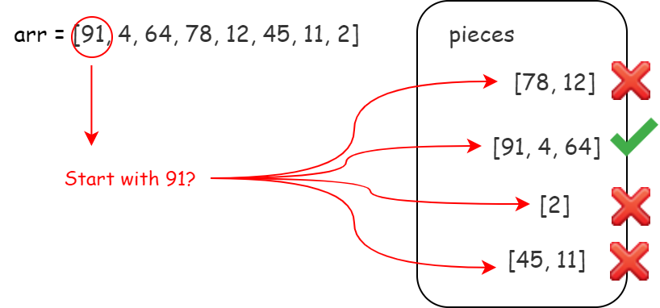
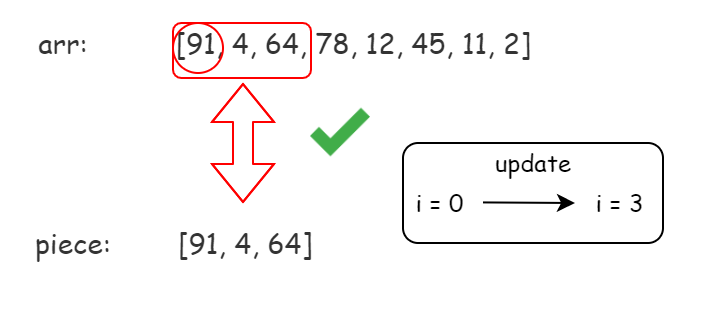
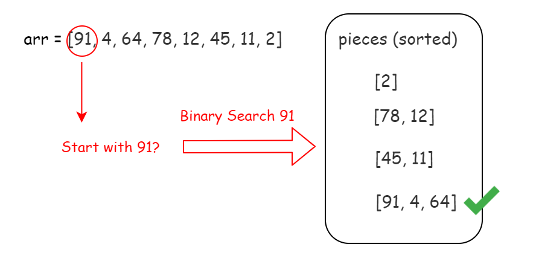
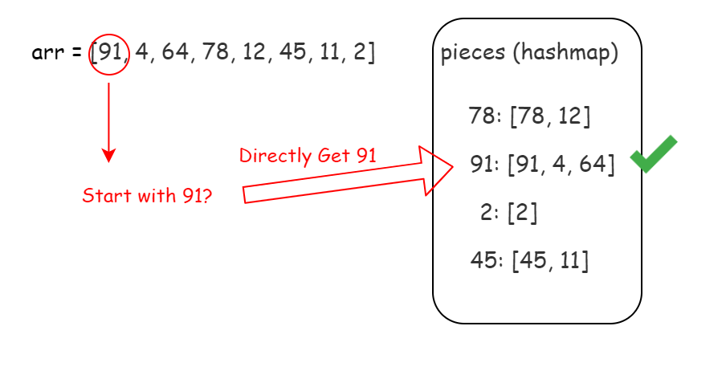

[TOC]

## Solution

---

#### Overview

Once you notice that the integers in `pieces` are distinct, the problem becomes simple. We can use several different methods to match the target array without worrying about duplicates.

Below, we will discuss three methods: *One by One*, *Binary Search*, and *HashMap*. We recommend the third approach since it's the fastest and easiest to implement.

---

#### Approach 1: One by One

**Intuition**

Let's start with the most natural approach.

For a given array `arr`, we need to find all corresponding integers from `pieces` for all integers $\text{arr}[i]$.

Let's go from left to right. Consider the leftmost element $\text{arr}[0]$.

We need to find a piece containing $\text{arr}[0]$. Of course, $\text{arr}[0]$ should be at the start of the target piece.

Now, we have an essential characteristic of our target piece: it should start with $\text{arr}[0]$.

OK. With this characteristic, we can iterate over `pieces` to find our target piece. Since there is no duplicate integer in `pieces`, we will have at most one eligible piece.



If we can not find any, return `false`. If we found one, then the piece found should be the same as the beginning of `arr`.

We should check whether each integer in the piece matches the beginning of `arr`.



If none matched, we should return `false`. If all matched, then we found the first piece!

Now, we move the `i` to the next unmatched index and repeat the operation above until we reach the end of `arr`.

>Also, because we have constraint $sum(\text{pieces}[i].length) = \text{arr.length}$ and no repeated number in `arr` or in `pieces`, if we ensure each integer in `arr` is matched, then each piece in `pieces` is matched.

In this case, we successfully found whether or not we can concatenate `pieces` in any order to form `arr`.

**Algorithm**

*Step 1:* Initialize an index `i` to record the current matching index in `arr`.

*Step 2:* Iterate over `pieces` to find the piece starting with $\text{arr}[i]$. Return `false` if no match.

*Step 3:* Use the matched piece to match `arr`'s sublist starting from `i` with the same length. Return `false` if any integer is different.

*Step 4:* Increment the index `i`.

*Step 5:* Repeat until `i` reaches the end of `arr`. Return `true`.

> Challenge: Can you implement the code yourself without seeing our implementations?

**Implementation**

```python
class Solution:
    def canFormArray(self, arr: List[int], pieces: List[List[int]]) -> bool:
        n = len(arr)
        i = 0
        while i < n:
            # find target piece
            for p in pieces:
                if p[0] == arr[i]:
                    break
            else:
                return False
            # check target piece
            # python saves the last iterated `p`
            for x in p:
                if x != arr[i]:
                    return False
                i += 1
        return True
```

**Complexity Analysis**

Let $N$ be the length of `arr`. In the worst case, the size of `pieces` is $\mathcal{O}(N)$.

* Time Complexity: $\mathcal{O}(N^2)$. The time to find the next piece is $\mathcal{O}(N)$, and we need to find $\mathcal{O}(N)$ pieces at most.

* Space Complexity: $\mathcal{O}(1)$, since no additional data structure is allocated.

---

#### Approach 2: Binary Search

**Intuition**

The one by one search in _Approach 1_ is expensive. Can we make it faster?

Yes. We can sort the pieces according to their first element and use [Binary Search](https://en.wikipedia.org/wiki/Binary_search_algorithm) to find out the next target piece.



**Algorithm**

*Step 1:* Initialize an index `i` to record the current matching index in `arr`.

*Step 2:* Use binary search to find the piece starting with $\text{arr}[i]$. Return `false` if no match.

*Step 3:* Use the matched piece to match `arr`'s sublist starting from `i` with the same length. Return `false` if any integer is different.

*Step 4:* Increment the index `i`.

*Step 5:* Repeat until `i` reach the end of `arr`. Return `true`.

> **Challenge**: Can you implement the code yourself without seeing our implementations?

**Implementation**

```python
class Solution:
    def canFormArray(self, arr: List[int], pieces: List[List[int]]) -> bool:
        n = len(arr)
        p_len = len(pieces)
        pieces.sort()

        i = 0
        while i < n:
            left = 0
            right = p_len - 1
            found = -1
            # use binary search to find target piece:
            while left <= right:
                mid = (left + right)//2
                if pieces[mid][0] == arr[i]:
                    found = mid
                    break
                elif pieces[mid][0] > arr[i]:
                    right = mid - 1
                else:
                    left = mid + 1
            if found == -1:
                return False
            # check target piece
            target_piece = pieces[found]
            for x in target_piece:
                if x != arr[i]:
                    return False
                i += 1

        return True
```

**Complexity Analysis**

Let $N$ be the length of `arr`. In the worst case, the size of `pieces` is $\mathcal{O}(N)$.

* Time Complexity: $\mathcal{O}(N\log(N))$. The time to find the next piece using Binary Search is $\mathcal{O}(\log(N))$, and we need to find $\mathcal{O}(N)$ pieces at most.

* Space complexity : $\mathcal{O}(N)$, but can vary. Any extra space usage is dependent on the sorting algorithm's implementation. Most programming languages have a built-in sorting algorithm that uses $\mathcal{O}(N)$ space, but others use $\mathcal{O}(\log N)$ space.

---

#### Approach 3: HashMap

**Intuition**

We are still not satisfied with the binary search in _Approach 2_. Can we make it faster?

Yes. We can store the pieces according to their first element in a **hashmap**.

In this case, we can get our target piece in $\mathcal{O}(1)$.



**Algorithm**

*Step 1:* Initialize a hashmap `mapping` to record piece's first integer and the whole piece mapping.

*Step 2:* Initialize an index `i` to record the current matching index in `arr`.

*Step 3:* Find the piece starting with $\text{arr}[i]$ in `mapping`. Return `false` if no match.

*Step 4:* Use the matched piece to match `arr`'s sublist starting from `i` with the same length. Return `false` if any integer is different.

*Step 5:* Increment the index `i`.

*Step 6:* Repeat until `i` reaches the end of `arr`. Return `true`.

> Challenge: Can you implement the code yourself without seeing our implementations?

**Implementation**

```python
class Solution:
    def canFormArray(self, arr: List[int], pieces: List[List[int]]) -> bool:
        n = len(arr)
        # initialize hashmap
        mapping = {p[0]: p for p in pieces}

        i = 0
        while i < n:
            # find target piece
            if arr[i] not in mapping:
                return False
            # check target piece
            target_piece = mapping[arr[i]]
            for x in target_piece:
                if x != arr[i]:
                    return False
                i += 1

        return True
```

**Complexity Analysis**

Let $N$ be the length of `arr`. In the worst case, the size of `pieces` is $\mathcal{O}(N)$.

* Time Complexity: $\mathcal{O}(N)$. The time to find next piece is $\mathcal{O}(1)$, and we need to find $\mathcal{O}(N)$ pieces at most.

* Space Complexity: $\mathcal{O}(N)$, since we store a hashmap with $\mathcal{O}(N)$ elements at most.