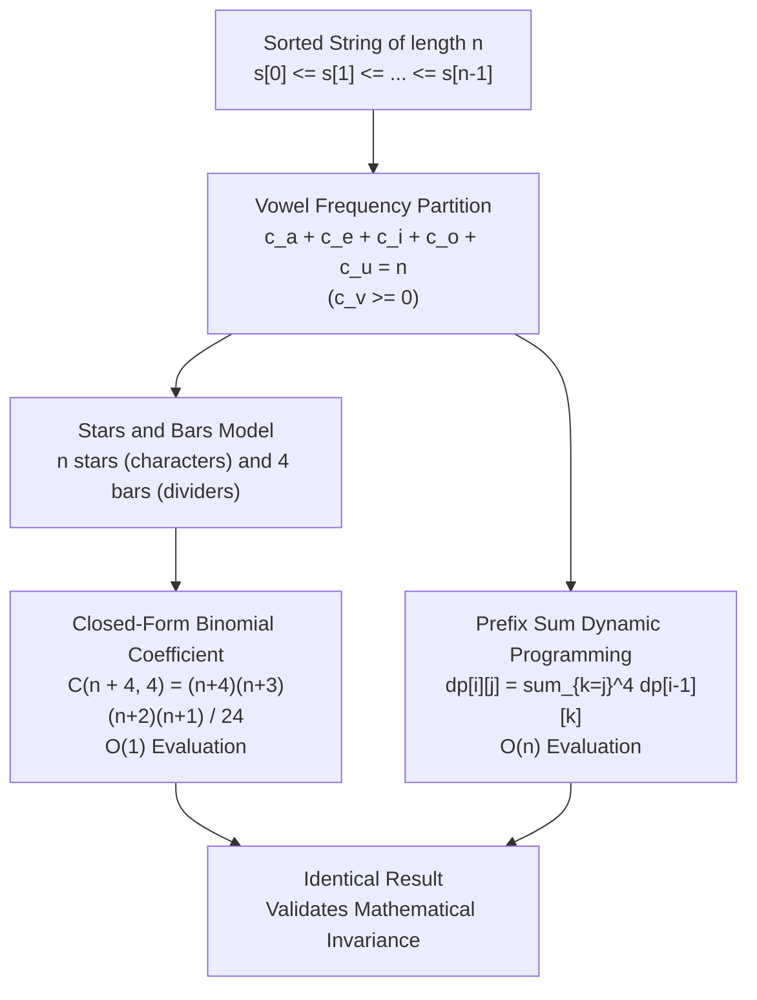

# Guided Example: Count Sorted Vowel Strings

We trace the step-by-step state accumulation and combinatorial stars-and-bars formulation for counting lexicographically sorted vowel sequences, prove the Multiset Composition Bijection Theorem and the Prefix Sum DP Monotonicity Invariant, and evaluate exact counts across representative problem instances:

- **Representative Instance 1 (Length $n = 2$):**
  - Input: `n = 2`
  - **Required Output:** `15`
  - All 15 valid strings:
    - Starting with `'a'`: `"aa"`, `"ae"`, `"ai"`, `"ao"`, `"au"` ($5$ strings)
    - Starting with `'e'`: `"ee"`, `"ei"`, `"eo"`, `"eu"` ($4$ strings)
    - Starting with `'i'`: `"ii"`, `"io"`, `"iu"` ($3$ strings)
    - Starting with `'o'`: `"oo"`, `"ou"` ($2$ strings)
    - Starting with `'u'`: `"uu"` ($1$ string)
    - Total: $5 + 4 + 3 + 2 + 1 = \mathbf{15}$.

- **Representative Instance 2 (Base Case $n = 1$):**
  - Input: `n = 1`
  - Valid strings: `"a"`, `"e"`, `"i"`, `"o"`, `"u"`
  - **Required Output:** `5`

- **Representative Instance 3 (Scaled Length $n = 5$):**
  - Input: `n = 5`
  - Closed-form evaluation: $\binom{5 + 4}{4} = \binom{9}{4} = \frac{9 \times 8 \times 7 \times 6}{24} = \mathbf{126}$.

---

## 1. Instance & Teaching Goal

Given an integer $n$, compute the number of strings of length $n$ that consist only of the vowels (`'a'`, `'e'`, `'i'`, `'o'`, `'u'`) and are sorted in non-decreasing lexicographical order:
$$
s[0] \le s[1] \le s[2] \le \dots \le s[n-1]
$$

```text
The Sorting Determinism Principle:
  In an unsorted string of length n, there are 5^n total sequences.
  However, when strings MUST be sorted:
    "ae" is valid, but "ea" is FORBIDDEN.
  Every sorted sequence is uniquely determined by the FREQUENCY of each vowel:
    Let c_a, c_e, c_i, c_o, c_u denote the number of times 'a', 'e', 'i', 'o', 'u' appear.
    Because characters must appear in alphabetical order,
    all 'a's come first, then 'e's, then 'i's, then 'o's, then 'u's!

  There is NO ambiguity in arrangement!
  Choosing a sorted string is IDENTICAL to finding non-negative integers satisfying:
    c_a + c_e + c_i + c_o + c_u = n,    where c_v >= 0.

  This transforms an exponential string generation problem into
  the classic Combinatorial Stars-and-Bars problem!
```

The decisive pedagogical goal is the **Multiset Composition Bijection Theorem & Prefix Sum DP Equivalence**:
1. **Combinations with Repetition:** Choosing $n$ elements from $5$ types with replacement yields $\binom{n + 5 - 1}{5 - 1} = \binom{n + 4}{4}$.
2. **Dynamic Programming Prefix Accumulator:** An online $\mathcal{O}(n)$ DP rolling sum where $dp[j]$ denotes the number of valid suffixes starting with vowel $j$.
3. **Equivalence of Approaches:** Demonstrating that both combinatorial closed form and cumulative DP compute identical quantities in $\mathcal{O}(1)$ auxiliary space.

---

## 2. Conceptual Foundation & The Stars-and-Bars Duality



### The Multiset Composition Bijection Theorem

Let $V = \{0, 1, 2, 3, 4\}$ correspond to the vowels $(\text{'a'}, \text{'e'}, \text{'i'}, \text{'o'}, \text{'u'})$.
1. **Bijection to Non-Negative Weak Compositions:**
   A sequence $s = (s_0, s_1, \dots, s_{n-1})$ is sorted if and only if $0 \le s_0 \le s_1 \le \dots \le s_{n-1} \le 4$.
   Define $c_v = |\{ k : s_k = v \}|$ for each $v \in \{0, 1, 2, 3, 4\}$.
   Then $\sum_{v=0}^4 c_v = n$ with each $c_v \ge 0$.
   Conversely, given any tuple $(c_0, c_1, c_2, c_3, c_4)$ summing to $n$, there is exactly one sorted sequence consisting of $c_0$ zeros, followed by $c_1$ ones, and so forth. The mapping is bijective.
2. **Combinatorial Count via Stars and Bars:**
   Placing $n$ indistinguishable stars (vowels) into $5$ distinguishable bins separated by $5 - 1 = 4$ bars requires choosing $4$ bar positions out of $n + 4$ total slots:
   $$
   N(n) = \binom{n + 4}{4} = \frac{(n + 4)(n + 3)(n + 2)(n + 1)}{4 \times 3 \times 2 \times 1} = \frac{(n + 4)(n + 3)(n + 2)(n + 1)}{24}
   $$
3. **Prefix Sum DP Recurrence:**
   Let $f(i, j)$ be the number of sorted strings of length $i$ whose first character has index $\ge j$.
   $$
   f(i, j) = \sum_{k=j}^4 f(i - 1, k)
   $$
   With base case $f(0, j) = 1$ for all $j \in \{0, 1, 2, 3, 4\}$.

---

## 3. Step-by-Step Worked Execution

### Step 1: Trace on Representative Instance $n = 2$ via Dynamic Programming

We define the state vector $DP = [w_a, w_e, w_i, w_o, w_u]$, where $w_v$ represents the number of valid suffixes of length $i$ starting with vowel index $\ge v$.

#### Length $i = 1$ (Base Length)
For a single character ($i = 1$), each vowel can be chosen:
- $w_u$: strings starting with `'u'` $\implies$ `{"u"}` $\implies 1$
- $w_o$: strings starting with $\ge \text{'o'}$ $\implies$ `{"o", "u"}` $\implies 2$
- $w_i$: strings starting with $\ge \text{'i'}$ $\implies$ `{"i", "o", "u"}` $\implies 3$
- $w_e$: strings starting with $\ge \text{'e'}$ $\implies$ `{"e", "i", "o", "u"}` $\implies 4$
- $w_a$: strings starting with $\ge \text{'a'}$ $\implies$ `{"a", "e", "i", "o", "u"}` $\implies 5$

State vector at length $1$:
$$
DP^{(1)} = [5, 4, 3, 2, 1]
$$

#### Length $i = 2$ (Target Length)
Each entry $w_v$ accumulates the valid continuations from the previous length:
- $w_u \leftarrow DP^{(1)}[4] = 1$ (Suffixes starting with `'u'`: `"uu"`)
- $w_o \leftarrow w_u + DP^{(1)}[3] = 1 + 2 = 3$ (Suffixes: `"uu"`, `"oo"`, `"ou"`)
- $w_i \leftarrow w_o + DP^{(1)}[2] = 3 + 3 = 6$ (Adding `"ii"`, `"io"`, `"iu"`)
- $w_e \leftarrow w_i + DP^{(1)}[1] = 6 + 4 = 10$ (Adding `"ee"`, `"ei"`, `"eo"`, `"eu"`)
- $w_a \leftarrow w_e + DP^{(1)}[0] = 10 + 5 = \mathbf{15}$ (Adding `"aa"`, `"ae"`, `"ai"`, `"ao"`, `"au"`)

Final count for length $2$:
$$
DP^{(2)}[0] = \mathbf{15}
$$

---

### Step 2: Verification via Stars-and-Bars Evaluation

Substitute $n = 2$ into the closed-form theorem:
$$
\binom{2 + 4}{4} = \binom{6}{4} = \binom{6}{2} = \frac{6 \times 5}{2 \times 1} = \frac{30}{2} = \mathbf{15}
$$
Both methods match identically.

---

## 4. Complete Execution Trace

### Dynamic Programming Transition Matrix ($n = 1$ to $n = 4$)

| Length $i$ | $w_u$ ('u') | $w_o$ ($\ge$'o') | $w_i$ ($\ge$'i') | $w_e$ ($\ge$'e') | $w_a$ ($\ge$'a', Total) | Binomial Verification $\binom{i+4}{4}$ |
|---|---|---|---|---|---|---|
| $i = 1$ | $1$ | $2$ | $3$ | $4$ | $\mathbf{5}$ | $\binom{5}{4} = 5$ |
| $i = 2$ | $1$ | $3$ | $6$ | $10$ | $\mathbf{15}$ | $\binom{6}{4} = 15$ |
| $i = 3$ | $1$ | $4$ | $10$ | $20$ | $\mathbf{35}$ | $\binom{7}{4} = 35$ |
| $i = 4$ | $1$ | $5$ | $15$ | $35$ | $\mathbf{70}$ | $\binom{8}{4} = 70$ |

### Frequency Partition Breakdown for $n = 2$

Every string corresponds to a partition $(c_a, c_e, c_i, c_o, c_u)$ with sum $2$:

| String | Frequency Tuple $(c_a, c_e, c_i, c_o, c_u)$ | Stars and Bars Configuration ($\star = \text{star}, \mid = \text{bar}$) |
|---|---|---|
| `"aa"` | $(2, 0, 0, 0, 0)$ | $\star \star \mid \mid \mid \mid$ |
| `"ae"` | $(1, 1, 0, 0, 0)$ | $\star \mid \star \mid \mid \mid$ |
| `"ai"` | $(1, 0, 1, 0, 0)$ | $\star \mid \mid \star \mid \mid$ |
| `"ao"` | $(1, 0, 0, 1, 0)$ | $\star \mid \mid \mid \star \mid$ |
| `"au"` | $(1, 0, 0, 0, 1)$ | $\star \mid \mid \mid \mid \star$ |
| `"ee"` | $(0, 2, 0, 0, 0)$ | $\mid \star \star \mid \mid \mid$ |
| `"ei"` | $(0, 1, 1, 0, 0)$ | $\mid \star \mid \star \mid \mid$ |
| `"eo"` | $(0, 1, 0, 1, 0)$ | $\mid \star \mid \mid \star \mid$ |
| `"eu"` | $(0, 1, 0, 0, 1)$ | $\mid \star \mid \mid \mid \star$ |
| `"ii"` | $(0, 0, 2, 0, 0)$ | $\mid \mid \star \star \mid \mid$ |
| `"io"` | $(0, 0, 1, 1, 0)$ | $\mid \mid \star \mid \star \mid$ |
| `"iu"` | $(0, 0, 1, 0, 1)$ | $\mid \mid \star \mid \mid \star$ |
| `"oo"` | $(0, 0, 0, 2, 0)$ | $\mid \mid \mid \star \star \mid$ |
| `"ou"` | $(0, 0, 0, 1, 1)$ | $\mid \mid \mid \star \mid \star$ |
| `"uu"` | $(0, 0, 0, 0, 2)$ | $\mid \mid \mid \mid \star \star$ |

---

## 5. Algorithmic Correctness

**Soundness.**
Because the five vowels have a fixed, strict ordering $\text{'a'} < \text{'e'} < \text{'i'} < \text{'o'} < \text{'u'}$, any selection of $n$ vowels with replacement has exactly one permutation that satisfies non-decreasing order. Thus, the number of sorted sequences equals the number of multisets of size $n$ chosen from a set of size $5$.

**Completeness.**
The stars-and-bars formula counts all weak compositions of $n$ into $5$ non-negative parts. Every valid sorted string generates a unique weak composition and every weak composition defines a valid sorted string. The map is a bijection, guaranteeing that no valid string is omitted and no duplicate is counted.

---

## 6. Traps This Instance Exposes

- **Permutations vs Combinations:** Treating the problem as string generation with order gives $5^n$, which massively overcounts because it includes unsorted strings like `"ba"` or `"ue"`.
- **Division Ordering in Binomial Coefficients:** When evaluating $(n+4)(n+3)(n+2)(n+1) / 24$ in integer arithmetic, performing division prematurely before complete multiplication can cause truncation errors.
- **Direction of Cumulative Sum in DP:** In the rolling array DP, computing sums from vowel index $4$ down to $0$ ensures that newly updated suffix sums are used correctly for subsequent vowels without requiring temporary duplicate arrays.

---

## 7. Complexity Derivation

- **Time Complexity:**
  - **Closed-Form Formula:** Evaluating $(n+4)(n+3)(n+2)(n+1) / 24$ requires $3$ additions, $3$ multiplications, and $1$ integer division. Total time is strictly $\mathcal{O}(1)$.
  - **Dynamic Programming:** Performing $4$ additions across $n$ steps requires $4n$ operations, which is $\mathcal{O}(n)$ time.
- **Auxiliary Space Complexity:**
  - **Closed-Form Formula:** Requires $\mathcal{O}(1)$ auxiliary space.
  - **Dynamic Programming:** Requires an array of 5 integers, which is $\mathcal{O}(1)$ auxiliary space.