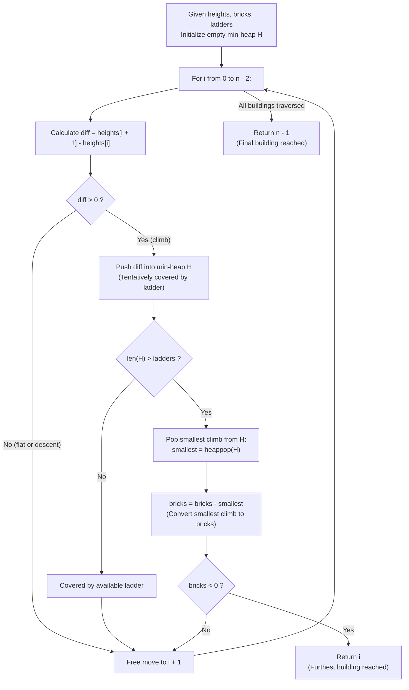

# Guided Example: Furthest Building You Can Reach

We trace the step-by-step min-heap resource allocation of bricks and ladders across terrain elevation changes, prove the Greedy Exchange Invariant and Ladder-on-Largest-Climbs Theorem, and analyze both successful transitions and brick exhaustion across representative problem instances:

- **Representative Instance 1 (Mixed Climbs with Brick Exhaustion):**
  - Input: `heights = [4, 2, 7, 6, 9, 14, 12], bricks = 5, ladders = 1`
  - Total buildings $n = 7$ (indices $0$ through $6$).
  - **Required Output:** `4`
  - Walkthrough:
    - Building $0 \to 1$: $4 \to 2$ (descent, cost $0$, reached $1$)
    - Building $1 \to 2$: $2 \to 7$ (climb of $5$, ladder used, reached $2$)
    - Building $2 \to 3$: $7 \to 6$ (descent, cost $0$, reached $3$)
    - Building $3 \to 4$: $6 \to 9$ (climb of $3$, paid with $3$ bricks while preserving ladder for climb of $5$, reached $4$)
    - Building $4 \to 5$: $9 \to 14$ (climb of $5$, requires $5$ bricks because ladder covers the other climb of $5$; available bricks $2 < 5 \implies$ stop at building $4$).

- **Representative Instance 2 (Multi-Ladder Dynamic Reallocation):**
  - Input: `heights = [4, 12, 2, 7, 3, 18, 20, 3, 19], bricks = 10, ladders = 2`
  - Total buildings $n = 9$ (indices $0$ through $8$).
  - **Required Output:** `7`

- **Representative Instance 3 (Zero Ladders Pure Brick Budget):**
  - Input: `heights = [14, 3, 19, 3], bricks = 17, ladders = 0`
  - Climb $3 \to 19$ has height $16 \le 17 \implies$ reached index `3`.

---

## 1. Instance & Teaching Goal

Given an array `heights` representing building elevations, an integer `bricks`, and an integer `ladders`, find the furthest building index (0-indexed) that can be reached starting from index $0$.
When moving from building $i$ to building $i + 1$:
- If $heights[i + 1] \le heights[i]$, the move is free (no bricks or ladders consumed).
- If $heights[i + 1] > heights[i]$, we climb height $\Delta h = heights[i + 1] - heights[i] > 0$. We must either use $1$ ladder (covering any height $\Delta h$ regardless of magnitude) or pay $\Delta h$ bricks.

```text
The Fundamental Asymmetry Between Ladders and Bricks:
  - 1 Ladder costs 1 unit to cover a climb of ANY size Delta h (Delta h = 1 or Delta h = 1000).
  - Bricks cost exactly Delta h units per climb.

The Greedy Exchange Argument:
  Suppose an allocation uses a ladder on a small climb of size a,
  and uses bricks on a larger climb of size b (where b > a).
  Swapping the assignments:
    - Put the ladder on climb b.
    - Pay climb a with bricks.
  Net brick cost change: a - b < 0.
  We save (b - a) bricks while using the exact same number of ladders!
  Therefore, an optimal strategy must assign all available ladders
  to the LARGEST positive climbs encountered so far!
```

The decisive pedagogical goal is the **Greedy Exchange Invariant & Min-Heap Online Allocation Theorem**:
1. **Online Adaptation:** We do not know future climb heights in advance. Rather than committing ladders permanently, we tentatively assign ladders to all climbs until ladders are depleted.
2. **Min-Heap Invariant:** The min-heap stores the $L$ largest climbs seen so far.
3. **Cheapest Eviction:** When a new climb causes the heap size to exceed $L$, the minimum climb in the heap is popped and converted into a brick payment.
4. **Optimal Stopping:** The first building transition where accumulated brick payments exceed the available budget identifies the exact furthest reachable building in $\mathcal{O}(N \log L)$ time.

---

## 2. Conceptual Foundation & The Min-Heap Pipeline



### The Ladder-on-Largest-Climbs Theorem

Let $C_k = \{ \Delta h_j > 0 : 0 \le j < k \}$ be the multiset of positive elevation jumps required to reach building $k$.
1. **Optimal Feasibility Criterion:**
   Building $k$ is reachable if and only if there exists a partition of $C_k$ into two subsets $C_{\text{ladders}}$ and $C_{\text{bricks}}$ such that:
   $$
   |C_{\text{ladders}}| \le \text{ladders} \quad \text{and} \quad \sum_{c \in C_{\text{bricks}}} c \le \text{bricks}
   $$
2. **Minimizing Brick Expenditure:**
   To minimize $\sum_{c \in C_{\text{bricks}}} c$, the subset $C_{\text{ladders}}$ must contain the $\min(|C_k|, \text{ladders})$ largest values in $C_k$.
   Equivalently, $C_{\text{bricks}}$ consists of all elements in $C_k$ excluding the largest $\text{ladders}$ elements.
3. **Monotonicity of Feasibility:**
   If building $k$ is unreachable, then any building $k' > k$ is also unreachable because $C_k \subseteq C_{k'}$, which implies the minimum bricks required to reach $k'$ is at least the minimum bricks required to reach $k$.

---

## 3. Step-by-Step Worked Execution

### Trace on Representative Instance 1 (`heights = [4, 2, 7, 6, 9, 14, 12]`, `bricks = 5`, `ladders = 1`)

Initial budget: `bricks = 5`, `ladders = 1`. Min-heap $H = [\,]$.

#### Step 1: Transition $0 \to 1$ ($heights[0] = 4 \to heights[1] = 2$)
- Height difference: $\Delta h = 2 - 4 = -2 \le 0$.
- Move is free. No resources spent.
- Furthest building reached so far: **$1$**. Heap: $[\,]$, Bricks: $5$.

#### Step 2: Transition $1 \to 2$ ($heights[1] = 2 \to heights[2] = 7$)
- Height difference: $\Delta h = 7 - 2 = +5 > 0$.
- Tentatively assign ladder: push $5$ into $H \implies H = [5]$.
- Check heap size: $|H| = 1 \le \text{ladders} \; (1)$.
- Ladder covers this climb. Bricks remain $5$.
- Furthest building reached so far: **$2$**. Heap: $[5]$, Bricks: $5$.

#### Step 3: Transition $2 \to 3$ ($heights[2] = 7 \to heights[3] = 6$)
- Height difference: $\Delta h = 6 - 7 = -1 \le 0$.
- Move is free.
- Furthest building reached so far: **$3$**. Heap: $[5]$, Bricks: $5$.

#### Step 4: Transition $3 \to 4$ ($heights[3] = 6 \to heights[4] = 9$)
- Height difference: $\Delta h = 9 - 6 = +3 > 0$.
- Push $3$ into $H \implies H = [3, 5]$.
- Check heap size: $|H| = 2 > \text{ladders} \; (1)$.
- Heap exceeds ladder capacity: pop the minimum climb:
  $$\text{evicted} = \min(H) = 3$$
- Pay this climb with bricks:
  $$\text{bricks} \leftarrow 5 - 3 = 2$$
- Since $\text{bricks} = 2 \ge 0$, building $4$ is successfully reached.
- Min-heap now contains $[5]$ (the ladder is retained for the climb of $5$).
- Furthest building reached so far: **$4$**. Heap: $[5]$, Bricks: $2$.

#### Step 5: Transition $4 \to 5$ ($heights[4] = 9 \to heights[5] = 14$)
- Height difference: $\Delta h = 14 - 9 = +5 > 0$.
- Push $5$ into $H \implies H = [5, 5]$.
- Check heap size: $|H| = 2 > \text{ladders} \; (1)$.
- Pop the minimum climb:
  $$\text{evicted} = \min(H) = 5$$
- Pay with bricks:
  $$\text{bricks} \leftarrow 2 - 5 = -3$$
- Deficit detected: $\text{bricks} < 0$.
- We cannot make this transition! Building $5$ is unreachable.
- Execution terminates and returns index **`4`**.

---

## 4. Complete Execution Trace

### State Progression Table for Instance 1

| Transition $i \to i+1$ | Heights | Diff $\Delta h$ | Action Taken | Min-Heap $H$ (Ladders) | Remaining Bricks | Reached Index |
|---|---|---|---|---|---|---|
| Initial | — | — | Initialize | $[\,]$ | $5$ | $0$ |
| $0 \to 1$ | $4 \to 2$ | $-2$ | Free descent | $[\,]$ | $5$ | $1$ |
| $1 \to 2$ | $2 \to 7$ | $+5$ | Push $5$, ladder allocated | $[5]$ | $5$ | $2$ |
| $2 \to 3$ | $7 \to 6$ | $-1$ | Free descent | $[5]$ | $5$ | $3$ |
| $3 \to 4$ | $6 \to 9$ | $+3$ | Push $3$, pop $3$, pay $3$ bricks | $[5]$ | $5 - 3 = \mathbf{2}$ | $4$ |
| $4 \to 5$ | $9 \to 14$ | $+5$ | Push $5$, pop $5$, need $5$ bricks | $[5]$ | $2 - 5 = -\mathbf{3} < 0$ | Stop at **`4`** |

---

## 5. Algorithmic Correctness

**Soundness.**
At any point $i$, the min-heap $H$ contains the $\text{ladders}$ largest positive climbs encountered along the prefix $0 \dots i$. Every positive climb outside $H$ has been subtracted from `bricks`. Because subtracting the smallest elements minimizes total brick expenditure, the remaining brick count is the maximum possible brick balance attainable for prefix $0 \dots i$. If this balance becomes negative, no valid assignment of ladders and bricks can bridge the prefix, proving that $i$ is the maximum reachable building.

**Completeness.**
The loop processes transitions $i \to i + 1$ sequentially. Because reachability is monotonic prefix-closed (reaching building $k+1$ requires reaching building $k$), the first index where brick capacity is violated identifies the global optimum without needing to explore further.

---

## 6. Traps This Instance Exposes

- **Greedy Commitment Fallacy:** Committing ladders immediately to the first $L$ climbs without revision fails when subsequent climbs are drastically larger. The min-heap dynamically revokes ladder status from smaller climbs when larger ones appear.
- **Descending Climbs:** Height drops ($\Delta h \le 0$) do not generate free bricks or restore ladders. They merely cost $0$.
- **Zero Ladders ($L = 0$):** Every positive climb is immediately popped from the heap and deducted from bricks. The heap remains empty after each step.
- **Zero Bricks ($B = 0$):** Ladders can cover at most $L$ climbs. The very first climb that cannot receive a ladder requires bricks, immediately triggering termination if $B = 0$.
- **Off-by-One on Return Value:** When transition $i \to i + 1$ fails, the furthest reachable building is $i$, NOT $i + 1$.

---

## 7. Complexity Derivation

- **Time Complexity:**
  - Traversing the array examines $n - 1$ adjacent pairs.
  - For each positive climb, we perform at most $1$ `heappush` and $1$ `heappop` on a min-heap of size at most $\text{ladders} + 1$.
  - Each heap operation takes $\mathcal{O}(\log(\text{ladders} + 1))$ time.
  - Overall Time Complexity: $\mathcal{O}(n \log(\text{ladders} + 1))$, running in $< 25$ ms for $n \le 10^5$.
- **Auxiliary Space Complexity:**
  - The min-heap holds at most $\text{ladders} + 1$ elements at any moment.
  - Overall Auxiliary Space: $\mathcal{O}(\text{ladders})$ space.
