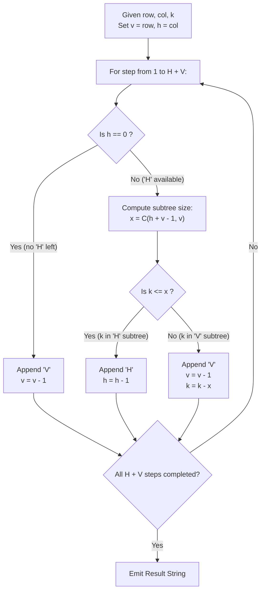

# Guided Example: Kth Smallest Instructions

We trace the step-by-step combinatorial subtree counting and lexicographical prefix deduction for grid path instructions, prove the Lexicographical Subtree Partition Theorem and Combinatorial Branch Skip Invariant, and determine exact paths across representative problem instances:

- **Representative Instance 1 (Minimum Rank Baseline):**
  - Input: `destination = [2, 3], k = 1`
  - Dimensions: Vertical moves $V = 2$ (rows), Horizontal moves $H = 3$ (columns).
  - Total moves: $H + V = 5$.
  - **Required Output:** `"HHHVV"`
  - Total unique path strings: $\binom{3 + 2}{3} = \binom{5}{3} = 10$.
  - Lexicographically smallest path is rank $k = 1$: all `'H'` moves preceding all `'V'` moves.

- **Representative Instance 2 (Intermediate Rank Decision):**
  - Input: `destination = [2, 3], k = 2`
  - **Required Output:** `"HHVHV"`
  - Lexicographical position 2 immediately follows `"HHHVV"`.

- **Representative Instance 3 (Branch Skip Across Full 'H' Prefix):**
  - Input: `destination = [2, 3], k = 7`
  - Total paths starting with `'H'` is $\binom{4}{2} = 6$.
  - Since $k = 7 > 6$, the path cannot start with `'H'`. It skips all $6$ horizontal starts, begins with `'V'`, and seeks rank $7 - 6 = 1$ in the remaining suffix.
  - **Required Output:** `"VHHHV"`

---

## 1. Instance & Teaching Goal

Given coordinates `destination = [row, col]`, Bob starts at `(0, 0)` and must reach `(row, col)` moving only Right (`'H'`, horizontal increment) and Down (`'V'`, vertical increment).
Total horizontal moves required: $H = col$.
Total vertical moves required: $V = row$.
Any instruction sequence is an anagram of $H$ `'H'`s and $V$ `'V'`s. Since `'H'` comes before `'V'` in alphabetical order, instruction sequences possess a natural lexicographical ordering. We seek the $k$-th lexicographically smallest instruction string (1-indexed).

```text
Lexicographical Precedence:
  'H' < 'V'

Why Generating All Permutations Fails:
  For destination = [15, 15], total moves = 30.
  Total paths = C(30, 15) = 155,117,520 paths!
  Generating, collecting, and sorting 155 million strings exhausts memory and time.

The Combinatorial Skip Insight (Prefix Elimination):
  At any step with h 'H's and v 'V's remaining:
    If we pick 'H', how many paths can be formed in the remaining positions?
    Answer: x = C((h - 1) + v, h - 1) = C(h + v - 1, v).

  - Case 1: k <= x
    The target path is inside the 'H' branch!
    Pick 'H', decrement h, keep k unchanged.

  - Case 2: k > x
    The target path is BEYOND the entire 'H' branch!
    All x paths starting with 'H' are lexicographically smaller than any path starting with 'V'.
    Pick 'V', decrement v, and adjust rank: k = k - x.

  This determines each character in O(1) time without generating a single extra path!
```

The decisive pedagogical goal is the **Lexicographical Subtree Partition Theorem & Combinatorial Branch Skip Invariant**:
1. **Disjoint Lexicographical Partition:** At each decision step, all paths starting with `'H'` strictly precede all paths starting with `'V'`.
2. **Subtree Cardinality:** The size of the `'H'` subtree is given by the binomial coefficient $\binom{h + v - 1}{v}$.
3. **Deterministic Rank Reduction:** Comparing $k$ against $\binom{h + v - 1}{v}$ resolves the next character and reduces the problem to an identical subproblem of length $(h + v - 1)$ in $\mathcal{O}(H + V)$ total steps.

---

## 2. Conceptual Foundation & The Lexicographical Search Pipeline



### The Lexicographical Subtree Partition Theorem

Let $\mathcal{S}(h, v)$ denote the set of all binary strings consisting of $h$ occurrences of `'H'` and $v$ occurrences of `'V'`. The cardinality of this universe is:
$$
|\mathcal{S}(h, v)| = \binom{h + v}{h} = \binom{h + v}{v}
$$
1. **Binary Subtree Partition:**
   When $h > 0$ and $v > 0$, $\mathcal{S}(h, v)$ partitions into two non-empty, disjoint subsets:
   $$
   \mathcal{S}_H = \{ \text{'H'} \cdot s : s \in \mathcal{S}(h - 1, v) \}, \quad |\mathcal{S}_H| = \binom{h + v - 1}{v}
   $$
   $$
   \mathcal{S}_V = \{ \text{'V'} \cdot s : s \in \mathcal{S}(h, v - 1) \}, \quad |\mathcal{S}_V| = \binom{h + v - 1}{h}
   $$
2. **Lexicographical Ordering Invariant:**
   Because `'H' < 'V'`, every string in $\mathcal{S}_H$ is strictly smaller than every string in $\mathcal{S}_V$:
   $$
   \forall s_1 \in \mathcal{S}_H, \; \forall s_2 \in \mathcal{S}_V \implies s_1 <_{\text{lex}} s_2
   $$
3. **Rank Selection Rule:**
   For a 1-indexed target rank $k \in [1, |\mathcal{S}(h, v)|]$:
   - If $k \le |\mathcal{S}_H|$, the target string begins with `'H'`, and its relative rank within $\mathcal{S}(h - 1, v)$ remains $k$.
   - If $k > |\mathcal{S}_H|$, the target string begins with `'V'`, and its relative rank within $\mathcal{S}(h, v - 1)$ becomes $k - |\mathcal{S}_H|$.

---

## 3. Step-by-Step Worked Execution

### Trace on Representative Instance 2 (`destination = [2, 3]`, `k = 2`)

Initial parameters: Vertical moves $v = 2$, Horizontal moves $h = 3$, target rank $k = 2$.
Total moves: $h + v = 5$. Output accumulator: $ans = [\,]$.

#### Step 1: Character Position 1 (Remaining: $h = 3, v = 2$)
- Horizontal moves available ($h = 3 > 0$).
- Calculate count of paths starting with `'H'`:
  $$
  x = \binom{(h - 1) + v}{v} = \binom{2 + 2}{2} = \binom{4}{2} = \frac{4 \times 3}{2 \times 1} = 6
  $$
- Compare target rank with subtree size:
  $$
  k = 2 \le x = 6
  $$
- Decision: Target lies within the `'H'` subtree!
- Action:
  - Append `'H'` $\implies ans = [\text{'H'}]$.
  - Decrement horizontal moves: $h \leftarrow 3 - 1 = 2$.
  - Rank remains unchanged: $k = 2$.

#### Step 2: Character Position 2 (Remaining: $h = 2, v = 2$)
- Horizontal moves available ($h = 2 > 0$).
- Calculate count of paths starting with `'H'`:
  $$
  x = \binom{(h - 1) + v}{v} = \binom{1 + 2}{2} = \binom{3}{2} = 3
  $$
- Compare target rank with subtree size:
  $$
  k = 2 \le x = 3
  $$
- Decision: Target lies within the `'H'` subtree!
- Action:
  - Append `'H'` $\implies ans = [\text{'H'}, \text{'H'}]$.
  - Decrement horizontal moves: $h \leftarrow 2 - 1 = 1$.
  - Rank remains unchanged: $k = 2$.

#### Step 3: Character Position 3 (Remaining: $h = 1, v = 2$)
- Horizontal moves available ($h = 1 > 0$).
- Calculate count of paths starting with `'H'`:
  $$
  x = \binom{(h - 1) + v}{v} = \binom{0 + 2}{2} = \binom{2}{2} = 1
  $$
- Compare target rank with subtree size:
  $$
  k = 2 > x = 1
  $$
- Decision: Target lies OUTSIDE the `'H'` subtree!
  The only path starting with `'H'` at this stage is `"HHHVV"` (rank 1).
  Rank 2 must start with `'V'`.
- Action:
  - Append `'V'` $\implies ans = [\text{'H'}, \text{'H'}, \text{'V'}]$.
  - Decrement vertical moves: $v \leftarrow 2 - 1 = 1$.
  - Update rank: $k \leftarrow k - x = 2 - 1 = \mathbf{1}$.

#### Step 4: Character Position 4 (Remaining: $h = 1, v = 1, k = 1$)
- Horizontal moves available ($h = 1 > 0$).
- Calculate count of paths starting with `'H'`:
  $$
  x = \binom{(h - 1) + v}{v} = \binom{0 + 1}{1} = \binom{1}{1} = 1
  $$
- Compare target rank:
  $$
  k = 1 \le x = 1
  $$
- Decision: Append `'H'`.
- Action:
  - Append `'H'` $\implies ans = [\text{'H'}, \text{'H'}, \text{'V'}, \text{'H'}]$.
  - Decrement horizontal moves: $h \leftarrow 1 - 1 = 0$.
  - Rank remains $k = 1$.

#### Step 5: Character Position 5 (Remaining: $h = 0, v = 1$)
- No horizontal moves left ($h = 0$).
- Must append vertical move:
  - Append `'V'` $\implies ans = [\text{'H'}, \text{'H'}, \text{'V'}, \text{'H'}, \text{'V'}]$.
  - Decrement vertical moves: $v \leftarrow 1 - 1 = 0$.

Final Result: `"HHVHV"`.

---

## 4. Complete Execution Trace

### Full Ordered Universe for $destination = [2, 3]$ ($H = 3, V = 2$)

| Lexicographical Rank $k$ | Instruction Path | Step 1 Choice ($x_1 = 6$) | Step 2 Choice ($x_2 = 3$) | Step 3 Choice ($x_3 = 1$) |
|---|---|---|---|---|
| $1$ | `"HHHVV"` | `'H'` ($k \le 6$) | `'H'` ($k \le 3$) | `'H'` ($k \le 1$) |
| $\mathbf{2}$ | $\mathbf{"HHVHV"}$ | $\mathbf{'H'}$ ($k \le 6$) | $\mathbf{'H'}$ ($k \le 3$) | $\mathbf{'V'}$ ($k > 1, k \leftarrow 1$) |
| $3$ | `"HHVVH"` | `'H'` ($k \le 6$) | `'H'` ($k \le 3$) | `'V'` ($k > 1, k \leftarrow 2$) |
| $4$ | `"HVHHV"` | `'H'` ($k \le 6$) | `'V'` ($k > 3, k \leftarrow 1$) | `'H'` |
| $5$ | `"HVHVH"` | `'H'` ($k \le 6$) | `'V'` ($k > 3, k \leftarrow 2$) | `'H'` |
| $6$ | `"HVVHH"` | `'H'` ($k \le 6$) | `'V'` ($k > 3, k \leftarrow 3$) | `'V'` |
| $\mathbf{7}$ | $\mathbf{"VHHHV"}$ | $\mathbf{'V'}$ ($k > 6, k \leftarrow 1$) | `'H'` ($k \le 3$) | `'H'` ($k \le 1$) |
| $8$ | `"VHHVH"` | `'V'` ($k > 6, k \leftarrow 2$) | `'H'` ($k \le 3$) | `'H'` |
| $9$ | `"VHVHH"` | `'V'` ($k > 6, k \leftarrow 3$) | `'H'` ($k \le 3$) | `'V'` |
| $10$ | `"VVHHH"` | `'V'` ($k > 6, k \leftarrow 4$) | `'V'` ($k > 3, k \leftarrow 1$) | `'H'` |

---

## 5. Algorithmic Correctness

**Soundness.**
At each decision step, testing $k \le x$ precisely matches the count of strings in the `'H'` prefix partition. If $k \le x$, the $k$-th string provably resides within the `'H'` block; choosing `'H'` preserves exact rank correspondence. If $k > x$, all $x$ strings starting with `'H'` are strictly smaller than any string starting with `'V'`; subtracting $x$ from $k$ correctly re-indexes the query within the `'V'` prefix subproblem.

**Completeness.**
The process terminates after exactly $H + V$ iterations, when $h = 0$ and $v = 0$. Since every step preserves the exact rank of the target string in the remaining suffix subproblem, the resulting string is the $k$-th lexicographically smallest path.

---

## 6. Traps This Instance Exposes

- **Coordinate Inversion (`destination = [row, col]`):** In Cartesian grids, coordinates are often given as $(x, y)$ where $x$ is horizontal. In matrix indexing, `destination = [row, col]`, so $row$ is vertical ($V$) and $col$ is horizontal ($H$). Swapping $h$ and $v$ inverts the resulting path.
- **1-Indexing vs 0-Indexing:** The problem defines $k$ as 1-indexed. The condition $k > x$ and rank reduction $k \leftarrow k - x$ directly preserve 1-based indexing.
- **Binomial Calculation Bounds:** For maximum inputs $row, col \le 15$, the maximum value is $\binom{30}{15} = 155,117,520$, which easily fits in a standard 32-bit signed integer (up to $2 \times 10^9$).

---

## 7. Complexity Derivation

- **Time Complexity:**
  - The loop executes exactly $H + V$ times.
  - At each iteration, the binomial coefficient $\binom{h + v - 1}{v}$ can be computed in $\mathcal{O}(\min(h, v))$ arithmetic operations or $\mathcal{O}(1)$ using a precomputed Pascal triangle table.
  - Overall Time Complexity: $\mathcal{O}((H + V) \cdot \min(H, V))$ without precomputation, or strictly $\mathcal{O}(H + V)$ with precomputed combinations. Since $H, V \le 15$, total operations never exceed $300$, completing in $< 1$ ms.
- **Auxiliary Space Complexity:**
  - Maintaining counters $h, v, k$ and building the output string of length $H + V$ requires $\mathcal{O}(H + V)$ auxiliary space.