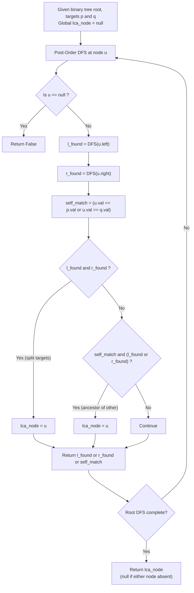

# Guided Example: Lowest Common Ancestor of a Binary Tree II

We trace the step-by-step bottom-up post-order traversal and dual-target presence verification for binary trees where query nodes may not exist, prove the Dual Target Existence Invariant and the Bottom-Up LCA Minimality Theorem, and analyze both present and absent target queries across representative problem instances:

- **Representative Instance 1 (Disjoint Left and Right Subtree Targets):**
  - Binary Tree: `root = [3, 5, 1, 6, 2, 0, 8, null, null, 7, 4]`
  - Query nodes: $p = 5, \; q = 1$
  - **Required Output:** `3`
  - Node $5$ resides in the left subtree of $3$; node $1$ resides in the right subtree of $3$. Both exist; node $3$ is their lowest common ancestor.

- **Representative Instance 2 (Ancestor-Descendant Query):**
  - Binary Tree: Same tree `[3, 5, 1, 6, 2, 0, 8, null, null, 7, 4]`
  - Query nodes: $p = 5, \; q = 4$
  - **Required Output:** `5`
  - Node $4$ is a descendant of node $5$ ($5 \to 2 \to 4$). Both exist; node $5$ is the lowest common ancestor.

- **Representative Instance 3 (Absent Target Node):**
  - Binary Tree: Same tree `[3, 5, 1, 6, 2, 0, 8, null, null, 7, 4]`
  - Query nodes: $p = 5, \; q = 10$
  - Node $10$ does NOT exist in the tree.
  - **Required Output:** `null` (None)
  - Although node $5$ exists, $q$ is absent, so no common ancestor exists.

---

## 1. Instance & Teaching Goal

Given the `root` of a binary tree and two nodes `p` and `q`, return their Lowest Common Ancestor (LCA). If either `p` or `q` does not exist in the tree, return `null`. The lowest common ancestor of two nodes $p$ and $q$ is the deepest node $u$ such that both $p$ and $q$ are descendants of $u$ (where a node is allowed to be a descendant of itself).

```text
The Standard LCA Trap (LeetCode 236 vs LeetCode 1644):
  In standard LCA (LeetCode 236):
    It is GUARANTEED that both p and q exist in the tree.
    Therefore, the standard solver short-circuits immediately:
      if root == p or root == q:
          return root
    This stops traversing the subtree below root!

  WHY EARLY-RETURN SHORT-CIRCUITING FAILS IN LCA II:
    Consider Instance 3: p = 5 exists, but q = 10 DOES NOT EXIST!
    If we short-circuit upon encountering 5, we immediately return 5,
    believing we found an ancestor, WITHOUT EVER CHECKING IF q EXISTS!
    The algorithm would erroneously return node 5 instead of null!

  The Mandatory Invariant for LCA II:
    We MUST verify that BOTH p and q exist somewhere in the tree
    before declaring any node as their LCA!
```

The decisive pedagogical goal is the **Dual Target Existence Invariant & Bottom-Up LCA Minimality Theorem**:
1. **Exhaustive Subtree Verification:** We cannot prune recursion upon finding the first target unless existence of the second target has already been confirmed.
2. **Post-Order Bottom-Up Aggregation:** A helper function returns whether the subtree contains at least one target ($\text{target\_found} \in \{\text{True}, \text{False}\}$).
3. **LCA Identification Conditions:** A node $u$ is the LCA if and only if:
   - Left subtree has one target AND Right subtree has the other target ($L \land R$), OR
   - Current node $u$ is one target AND one of its subtrees contains the other target ($(\text{self} == p \lor \text{self} == q) \land (L \lor R)$).
4. **First Bottom-Up Anchor:** In a bottom-up traversal, the first node meeting either condition is the unique lowest common ancestor.

---

## 2. Conceptual Foundation & The Post-Order Pipeline



### The Bottom-Up LCA Minimality Theorem

Let $T = (V, E)$ be a binary tree with unique node values, and let $p, q \in V$ be target queries.
For any node $u \in V$, define the target count in the subtree rooted at $u$:
$$
C(u) = |\{ x \in \{p, q\} : x \text{ is a descendant of } u \}|
$$
1. **Existence Condition:**
   Both nodes $p$ and $q$ exist in the tree if and only if $C(\text{root}) = 2$.
   If $C(\text{root}) < 2$, no common ancestor exists, and the algorithm must evaluate to `null`.
2. **Minimality Criterion:**
   A node $u$ is the Lowest Common Ancestor if and only if:
   $$
   C(u) = 2 \quad \text{and} \quad \forall v \in \{\text{left}(u), \text{right}(u)\}, \; C(v) < 2
   $$
3. **Bottom-Up Uniqueness:**
   In a post-order traversal, children are completely evaluated before their parent. The first node $u$ encountered where $C(u) = 2$ satisfies $C(v) < 2$ for all descendants, uniquely identifying $u$ as the lowest common ancestor. For all strict ancestors $w$ of $u$, $C(w) = 2$ but $w$ has a child containing $u$ with $C = 2$, violating minimality.

---

## 3. Step-by-Step Worked Execution

### Tree Architecture for Representative Instances

```text
               3
             /   \
            5     1
           / \   / \
          6   2 0   8
             / \
            7   4
```

---

### Step 1: Trace on Representative Instance 1 ($p = 5, q = 1$)

We execute bottom-up post-order traversal:
1. **Subtree under $5$:**
   - Leaves $6, 7, 4$ are visited: none match $p=5$ or $q=1$ (return `False`).
   - Node $2$: left child $7$ (`False`), right child $4$ (`False`), self $\ne p, q \implies$ returns `False`.
   - Node $5$: left child $6$ (`False`), right child $2$ (`False`), self matches $p=5$ (`True`).
   - Node $5$ returns `True` to parent $3$.
2. **Subtree under $1$:**
   - Node $0$ and Node $8$ return `False`.
   - Node $1$: self matches $q=1$ (`True`).
   - Node $1$ returns `True` to parent $3$.
3. **At Root $3$:**
   - Left child returned: $l\_found = \mathbf{True}$ (found $p = 5$).
   - Right child returned: $r\_found = \mathbf{True}$ (found $q = 1$).
   - Split condition evaluated:
     $$
     l\_found \land r\_found = \mathbf{True} \land \mathbf{True} = \mathbf{True}
     $$
   - Root $3$ contains both targets in separate subtrees!
   - Set $lca\_node = \mathbf{3}$.
4. Traversal finishes: return **`3`**.

---

### Step 2: Trace on Representative Instance 2 ($p = 5, q = 4$)

Query: $p = 5$ (ancestor), $q = 4$ (descendant).
1. **Leaf $4$:**
   - Self matches $q = 4 \implies$ returns `True`.
2. **Node $2$:**
   - Left child $7$ returns `False`, right child $4$ returns `True`.
   - Returns `True` to parent $5$.
3. **Node $5$:**
   - Left child $6$ returns `False`.
   - Right child $2$ returns `True` (found descendant $q = 4$).
   - Self matches $p = 5$ (`self_match = True`).
   - Ancestor-descendant condition evaluated:
     $$
     self\_match \land (l\_found \lor r\_found) = \mathbf{True} \land (\mathbf{False} \lor \mathbf{True}) = \mathbf{True}
     $$
   - Node $5$ is one target, and its subtree contains the second target!
   - Set $lca\_node = \mathbf{5}$.
   - Returns `True` to parent $3$.
4. **At Root $3$:**
   - Left child returns `True`, right child returns `False`. Neither condition triggered.
5. Traversal finishes: return **`5`**.

---

### Step 3: Trace on Representative Instance 3 ($p = 5, q = 10$)

Query: $p = 5$ exists, $q = 10$ is ABSENT from the tree.
1. **Subtree under $5$:**
   - Evaluates to `True` because $p = 5$ matches.
   - However, $q = 10$ is never encountered in any subtree.
   - For node $5$: $l\_found = \text{False}, r\_found = \text{False}$, so $self\_match \land (l \lor r) = \text{False}$.
2. **Subtree under $1$:**
   - Evaluates to `False` (neither $5$ nor $10$ present).
3. **At Root $3$:**
   - $l\_found = \text{True}, r\_found = \text{False}$.
   - Condition $l \land r = \text{False}$.
   - Condition $self\_match \land (l \lor r) = \text{False}$.
4. **Final State:**
   - $lca\_node$ was NEVER assigned and remains `null`!
   - Accurately returns **`null`**, successfully avoiding the standard LCA trap.

---

## 4. Complete Execution Trace

### State Verification Table across Representative Scenarios

| Scenario | Query Nodes | Node $5$ Status | Node $1$ Status | Node $3$ Condition | Assigned $lca\_node$ | Final Result |
|---|---|---|---|---|---|---|
| Instance 1 | $p = 5, q = 1$ | $5 == p$ (`True`) | $1 == q$ (`True`) | $l\_found \land r\_found$ | Node $3$ | **`3`** |
| Instance 2 | $p = 5, q = 4$ | $5 == p \land r\_found$ | `False` | $l\_found \land \neg r\_found$ | Node $5$ | **`5`** |
| Instance 3 | $p = 5, q = 10$ | $5 == p \land \neg(l \lor r)$ | `False` | $l\_found \land \neg r\_found$ | `null` | **`null`** |
| Both Absent | $p = 10, q = 20$ | `False` | `False` | Neither found | `null` | **`null`** |

---

## 5. Algorithmic Correctness

**Soundness.**
The variable $lca\_node$ is set if and only if both targets have been verified within the subtree rooted at the current node: either one target in each child branch ($l \land r$), or one target at the current node and the second in a descendant branch ($self \land (l \lor r)$). Because traversal is strictly bottom-up post-order, the first node meeting this criterion is the lowest common ancestor.

**Completeness.**
If both $p$ and $q$ exist in the tree, their paths to the root must merge at their unique lowest common ancestor $u$. At node $u$, either $p$ and $q$ diverge into separate children (satisfying $l \land r$), or one is the ancestor of the other (satisfying $self \land (l \lor r)$). Thus, the LCA is guaranteed to be detected whenever both targets exist, and correctly omitted when either is absent.

---

## 6. Traps This Instance Exposes

- **Premature Pruning (LeetCode 236 Trap):** Returning immediately upon matching $p$ without exploring its children or the rest of the tree produces false positives when $q$ is absent from the tree.
- **Node Object vs Value Comparison:** In trees with distinct integer values, comparing values (`node.val == p.val`) or node references (`node == p`) must be applied consistently.
- **Overwriting LCA on Ancestors:** When returning up the call stack, ancestors will also see both targets in their descendant subtrees. Ensuring that only the *first* node (bottom-most) records the LCA, or conditioning assignment strictly on split branches, prevents overwriting.

---

## 7. Complexity Derivation

- **Time Complexity:**
  - In the worst case (e.g., when a node is missing or at the opposite end of the tree), the algorithm visits every node in the binary tree exactly once.
  - At each node, constant-time ($\mathcal{O}(1)$) boolean combinations are performed.
  - Overall Time Complexity: $\mathcal{O}(N)$, where $N$ is the number of nodes in the tree.
- **Auxiliary Space Complexity:**
  - Memory consumption is dominated by the recursion call stack.
  - In a balanced binary tree, stack depth is $\mathcal{O}(\log N)$.
  - In a degenerate skewed tree (e.g., a linked list), stack depth is $\mathcal{O}(N)$.
  - Overall Auxiliary Space: $\mathcal{O}(H)$, where $H$ is the height of the tree.