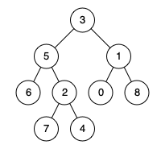

## Description

Given the `root` of a binary tree, return *the lowest common ancestor (LCA) of two given nodes, *`p`* and *`q`. If either node `p` or `q` **does not exist** in the tree, return `null`. All values of the nodes in the tree are **unique**.

According to the **<a href="https://en.wikipedia.org/wiki/Lowest_common_ancestor" target="_blank">definition of LCA on Wikipedia</a>**: "The lowest common ancestor of two nodes `p` and `q` in a binary tree `T` is the lowest node that has both `p` and `q` as **descendants** (where we allow **a node to be a descendant of itself**)". A **descendant** of a node `x` is a node `y` that is on the path from node `x` to some leaf node.
### Function Contract

**Inputs**

- `root`: The root `TreeNode` of a binary tree ($1 \le n \le 10^4$).
- `p`: A `TreeNode` representing the first target.
- `q`: A `TreeNode` representing the second target.

**Return value**

Return the lowest common ancestor `TreeNode` if both `p` and `q` exist in the binary tree rooted at `root`, otherwise `null`.

### Examples

#### Example 1

- **Input:** `root = [3,5,1,6,2,0,8,null,null,7,4], p = 5, q = 1`
- **Output:** `3`
- **Explanation:** The LCA of nodes 5 and 1 is 3.
#### Example 2

- **Input:** `root = [3,5,1,6,2,0,8,null,null,7,4], p = 5, q = 4`
- **Output:** `5`
- **Explanation:** The LCA of nodes 5 and 4 is 5. A node can be a descendant of itself according to the definition of LCA.
#### Example 3

- **Input:** `root = [3,5,1,6,2,0,8,null,null,7,4], p = 5, q = 10`
- **Output:** `null`
- **Explanation:** Node 10 does not exist in the tree, so return null.
### Constraints

- The number of nodes in the tree is in the range $[1, 10^{4}]$.

- $-10^{9} \le \text{Node.val} \le 10^{9}$

- All `Node.val` are **unique**.

- $p \neq q$

**Follow up:** Can you find the LCA traversing the tree, without checking nodes existence?