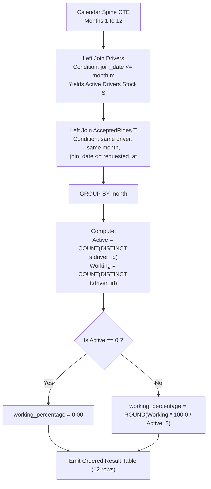

# Guided Example: Hopper Company Queries II

We trace the step-by-step relational calendar spine generation, cumulative active driver cohort calculation, and monthly working driver ratio aggregation, prove the Active-Working Cohort Invariant and Zero-Activity Safeguard Theorem, and evaluate exact monthly operational percentages across representative database instances:

- **Representative Instance 1 (Baseline Active vs Working Driver Ratio):**
  - Table `Drivers`:
    - `driver_id = 1`, `join_date = "2019-12-31"`
  - Table `Rides`:
    - `ride_id = 10`, `user_id = 7`, `requested_at = "2020-01-15"`
  - Table `AcceptedRides`:
    - `ride_id = 10`, `driver_id = 1`, `ride_distance = 5`, `ride_duration = 8`
  - **Required Output:**
    ```text
    +-------+--------------------+
    | month | working_percentage |
    +-------+--------------------+
    | 1     | 100.0              |
    | 2     | 0.0                |
    | 3     | 0.0                |
    | ...   | 0.0                |
    | 12    | 0.0                |
    +-------+--------------------+
    ```
  - Walkthrough:
    - Month 1: Active drivers = $1$ (Driver 1 joined in 2019). Working drivers = $1$ (Driver 1 accepted ride 10). Ratio: $\frac{1}{1} \times 100 = 100.0\%$.
    - Months 2 through 12: Active drivers = $1$. Working drivers = $0$. Ratio: $\frac{0}{1} \times 100 = 0.0\%$.

- **Representative Instance 2 (Mid-Year Driver Onboarding & Driver Workload Split):**
  - Driver 1 joins on `2019-11-10`.
  - Driver 2 joins on `2020-05-01`.
  - In May 2020: Both Driver 1 and Driver 2 are active ($2$ active drivers). Only Driver 1 accepts a ride.
  - Working percentage for May: $\frac{1}{2} \times 100 = 50.0\%$.

---

## 1. Instance & Teaching Goal

We are tasked with computing the **percentage of working drivers** for each month of the year 2020:
$$
\text{working\_percentage} = \frac{\text{distinct active drivers who accepted at least one ride in month } m}{\text{total distinct active drivers available in month } m} \times 100
$$
Rounded to 2 decimal places. If a month has no active drivers, the percentage is defined as $0.00$. All 12 months $[1 \dots 12]$ must appear in the final report, sorted in ascending order of `month`.

```text
The Core Architectural Distinction: Cumulative Stock vs Monthly Flow
  1. Active Drivers (Cumulative Stock):
     A driver becomes active upon joining and REMAINS active indefinitely.
     Active in month m: join_date < '2021-01-01' AND (join_year < 2020 OR join_month <= m).
     A driver who joined in 2019 is active in all 12 months of 2020!
     A driver joining in May 2020 is active in months 5 through 12!

  2. Working Drivers (Monthly Flow):
     A driver is "working" in month m if and only if they accepted >= 1 ride in month m.
     CRITICAL: If a driver accepts 10 rides in May, they count as ONE working driver!
     Use COUNT(DISTINCT driver_id), NOT COUNT(ride_id)!

  3. Zero-Activity Safeguard:
     If total active drivers in a month is 0, direct division yields NULL or ZeroDivisionError.
     We must use COALESCE or CASE WHEN to return 0.00.
```

The decisive pedagogical goal is the **Active-Working Cohort Invariant & Zero-Activity Safeguard Theorem**:
1. **Calendar Spine CTE:** Generate an unconstrained integer sequence $1 \dots 12$ to guarantee that zero-activity months are never omitted by inner joins.
2. **Cumulative Join Condition:** Join `Drivers` against the calendar spine using the non-equijoin condition `join_date <= end_of_month(m)`.
3. **Flow Join Condition:** Join `AcceptedRides` using `driver_id`, month match `MONTH(requested_at) == m`, and validity condition `join_date <= requested_at`.
4. **Distinct Ratio Projection:** Evaluate $\frac{\text{COUNT}(\text{DISTINCT } t.\text{driver\_id})}{\text{COUNT}(\text{DISTINCT } s.\text{driver\_id})} \times 100$, coalesced to $0$.

---

## 2. Conceptual Foundation & The Metric Pipeline



### The Active-Working Cohort Invariant & Safeguard Theorem

Let $\mathcal{M} = \{1, 2, \dots, 12\}$ be the set of calendar months in 2020.
1. **Active Driver Stock Monotonicity:**
   For month $m \in \mathcal{M}$, define the active driver cohort:
   $$
   \mathcal{A}_m = \{ d \in Drivers : d.\text{join\_date} \le \text{LastDay}(2020, m) \}
   $$
   Since time progresses monotonically, $\mathcal{A}_1 \subseteq \mathcal{A}_2 \subseteq \dots \subseteq \mathcal{A}_{12}$.
   Consequently, $|\mathcal{A}_m|$ is a monotonically non-decreasing function of $m$.
2. **Working Driver Flow Subsetting:**
   For month $m \in \mathcal{M}$, define the working driver set:
   $$
   \mathcal{W}_m = \{ d \in \mathcal{A}_m : \exists r \in AcceptedRides \text{ with } \text{Year}(r) = 2020, \; \text{Month}(r) = m, \; r.\text{driver\_id} = d \}
   $$
   By definition, every working driver in month $m$ must be an active driver in month $m$:
   $$
   \mathcal{W}_m \subseteq \mathcal{A}_m \implies 0 \le |\mathcal{W}_m| \le |\mathcal{A}_m|
   $$
3. **Bounded Percentage Guarantee:**
   When $|\mathcal{A}_m| > 0$:
   $$
   0\% \le \frac{|\mathcal{W}_m|}{|\mathcal{A}_m|} \times 100\% \le 100\%
   $$
   When $|\mathcal{A}_m| = 0$, defining $\text{percentage} = 0.00$ preserves bounded totality without undefined arithmetic exceptions.

---

## 3. Step-by-Step Worked Execution

### Trace on Representative Instance 1 (`Driver 1` joined `2019-12-31`, `Ride 10` in `2020-01`)

#### Step 1: Generate Calendar Spine
Recursive CTE generates 12 rows:
$$
\text{Month} = \{1, 2, 3, 4, 5, 6, 7, 8, 9, 10, 11, 12\}
$$

#### Step 2: Expand Active Drivers (CTE `S`)
Join `Month` to `Drivers`:
- Driver 1 joined on `2019-12-31` (year $< 2020$).
- Condition `YEAR(d.join_date) < 2020` evaluates to `TRUE` for every month $m \in [1 \dots 12]$.
- Driver 1 is present as an active driver in every row $m = 1, \dots, 12$.
- Count of active drivers: $|\mathcal{A}_m| = 1$ for all $m \in [1 \dots 12]$.

#### Step 3: Identify Accepted Rides in 2020 (CTE `T`)
Join `Rides` and `AcceptedRides`:
- Ride 10: `requested_at = '2020-01-15'`, driver = 1.
- Year is 2020, Month is 1.
- Month 1: Working drivers set $\mathcal{W}_1 = \{1\} \implies |\mathcal{W}_1| = 1$.
- Months 2 to 12: No accepted rides $\implies \mathcal{W}_m = \emptyset \implies |\mathcal{W}_m| = 0$.

#### Step 4: Join `S` to `T` and Calculate Percentages

- **For Month 1:**
  - Active drivers in `S`: $\text{COUNT(DISTINCT } s.\text{driver\_id}) = 1$
  - Working drivers in `T`: $\text{COUNT(DISTINCT } t.\text{driver\_id}) = 1$
  - Percentage:
    $$
    \text{ROUND}\left( \frac{1 \times 100}{1}, 2 \right) = \mathbf{100.0\%}
    $$

- **For Months 2 through 12:**
  - Active drivers in `S`: $\text{COUNT(DISTINCT } s.\text{driver\_id}) = 1$
  - Working drivers in `T`: $\text{COUNT(DISTINCT } t.\text{driver\_id}) = 0$ (all `t.driver_id` are `NULL`)
  - Percentage:
    $$
    \text{ROUND}\left( \frac{0 \times 100}{1}, 2 \right) = \mathbf{0.0\%}
    $$

---

## 4. Complete Execution Trace

### The Full 12-Month Operational Report

| Month $m$ | Month Name | Active Drivers $|\mathcal{A}_m|$ | Working Drivers $|\mathcal{W}_m|$ | Formula Calculation | Output `working_percentage` |
|---|---|---|---|---|---|
| $1$ | January | $1$ (Driver 1) | $1$ (Driver 1) | $1 \times 100 / 1$ | **`100.0`** |
| $2$ | February | $1$ (Driver 1) | $0$ | $0 \times 100 / 1$ | **`0.0`** |
| $3$ | March | $1$ (Driver 1) | $0$ | $0 \times 100 / 1$ | **`0.0`** |
| $4$ | April | $1$ (Driver 1) | $0$ | $0 \times 100 / 1$ | **`0.0`** |
| $5$ | May | $1$ (Driver 1) | $0$ | $0 \times 100 / 1$ | **`0.0`** |
| $6$ | June | $1$ (Driver 1) | $0$ | $0 \times 100 / 1$ | **`0.0`** |
| $7$ | July | $1$ (Driver 1) | $0$ | $0 \times 100 / 1$ | **`0.0`** |
| $8$ | August | $1$ (Driver 1) | $0$ | $0 \times 100 / 1$ | **`0.0`** |
| $9$ | September | $1$ (Driver 1) | $0$ | $0 \times 100 / 1$ | **`0.0`** |
| $10$ | October | $1$ (Driver 1) | $0$ | $0 \times 100 / 1$ | **`0.0`** |
| $11$ | November | $1$ (Driver 1) | $0$ | $0 \times 100 / 1$ | **`0.0`** |
| $12$ | December | $1$ (Driver 1) | $0$ | $0 \times 100 / 1$ | **`0.0`** |

---

## 5. Algorithmic Correctness

**Soundness.**
The numerator uses `COUNT(DISTINCT t.driver_id)`, which counts each distinct driver who completed at least one accepted ride in that specific month. The denominator uses `COUNT(DISTINCT s.driver_id)`, which counts each distinct driver active up to that month. Because `t.driver_id` is joined to `s.driver_id`, the set of working drivers is guaranteed to be a subset of the active drivers, bounding the percentage between $0$ and $100$.

**Completeness.**
Generating the calendar spine guarantees that every month from $1$ through $12$ is present as a group anchor. Using `LEFT JOIN` prevents months with no active drivers or no rides from being pruned, ensuring an exact twelve-row output.

---

## 6. Traps This Instance Exposes

- **Driver Deduplication (`COUNT` vs `COUNT(DISTINCT)`):** If a single driver accepts 20 rides in January, using `COUNT(t.driver_id)` would report 20 working drivers, creating an erroneous percentage of $2000\%$. `COUNT(DISTINCT)` is strictly mandatory.
- **Floating-Point vs Integer Division:** In SQL engines (PostgreSQL, SQL Server), dividing an integer by an integer yields truncated integer arithmetic (e.g., $1 / 2 = 0$). Multiplying by $100$ or $100.0$ prior to division ensures high-precision floating-point computation before rounding.
- **Unaccepted Rides Infiltration:** Table `Rides` contains all ride requests, including cancelled or unaccepted rides. Only rides joined with `AcceptedRides` must be included in the working driver calculation.
- **Drivers Joining in Future Years:** Drivers with `YEAR(join_date) > 2020` must not be included in any active cohort for 2020.

---

## 7. Complexity Derivation

- **Time Complexity:**
  - Generating the 12-row calendar spine: $\mathcal{O}(1)$ time.
  - Joining `Month` with `Drivers`: Evaluates $12 \times |Drivers|$ comparisons, which is $\mathcal{O}(|Drivers|)$ since 12 is a constant.
  - Joining `Rides` and `AcceptedRides`: $\mathcal{O}(|Rides| + |AcceptedRides|)$ via hash or index joins.
  - Grouping and aggregation across 12 rows: $\mathcal{O}(1)$ time.
  - Overall Time Complexity: $\mathcal{O}(|Drivers| + |Rides| + |AcceptedRides|)$, scanning each table once.
- **Auxiliary Space Complexity:**
  - The intermediate CTE tables and hash joins store at most $\mathcal{O}(|Drivers| + |AcceptedRides|)$ records in memory.
