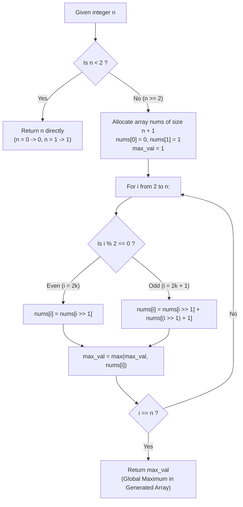

# Guided Example: Get Maximum in Generated Array

We trace the step-by-step evaluation of Stern's diatomic recurrence sequence, prove the Topological Halving Dependency Invariant and Stern Sequence Subtree Boundedness Theorem, and analyze both running maxima and boundary conditions across representative problem instances:

- **Representative Instance 1 (Odd Scaled Array $n = 7$):**
  - Input: `n = 7`
  - Array length: $n + 1 = 8$ (indices $0$ through $7$).
  - Base values: $nums[0] = 0, \; nums[1] = 1$.
  - Generated values:
    - $nums[2] = nums[1] = 1$
    - $nums[3] = nums[1] + nums[2] = 1 + 1 = 2$
    - $nums[4] = nums[2] = 1$
    - $nums[5] = nums[2] + nums[3] = 1 + 2 = 3$
    - $nums[6] = nums[3] = 2$
    - $nums[7] = nums[3] + nums[4] = 2 + 1 = 3$
  - Full Array: `[0, 1, 1, 2, 1, 3, 2, 3]`
  - **Required Output:** `3`

- **Representative Instance 2 (Small Integer $n = 3$):**
  - Input: `n = 3`
  - Array: `[0, 1, 1, 2]`
  - **Required Output:** `2`

- **Representative Instance 3 (Degenerate Boundary Inputs $n = 0, 1$):**
  - For $n = 0$: Array `[0]`, maximum is `0`.
  - For $n = 1$: Array `[0, 1]`, maximum is `1`.
  - In both boundary cases, the answer is strictly $n$.

---

## 1. Instance & Teaching Goal

Given an integer $n$, generate a 0-indexed integer array `nums` of length $n + 1$ according to the rules:
- $nums[0] = 0$
- $nums[1] = 1$
- For even indices ($i = 2k$ with $2 \le 2k \le n$):
  $$
  nums[2k] = nums[k]
  $$
- For odd indices ($i = 2k + 1$ with $2 \le 2k + 1 \le n$):
  $$
  nums[2k + 1] = nums[k] + nums[k + 1]
  $$
Our goal is to compute the maximum value present across the generated array: $\max_{0 \le i \le n} nums[i]$.

```text
The Mathematical Structure: Stern's Diatomic Sequence
  This recurrence generates Stern's Diatomic Sequence (also known as the Stern-Brocot sequence).
  Consecutive pairs (nums[i], nums[i+1]) represent coprime numerators and denominators
  that enumerate all positive rational numbers without repetition!

Topological Order Guarantee (No Forward Dependencies):
  Notice the dependencies for any index i >= 2:
    - If i is even: i = 2k ==> k = i / 2 < i.
    - If i is odd:  i = 2k + 1 ==> k = (i - 1) / 2 < i, and k + 1 = (i + 1) / 2.
      For all i >= 3, (i + 1) / 2 < i!
  Because every referenced index is strictly smaller than i,
  iterating sequentially from i = 2 up to n guarantees that all prerequisites
  are already computed and immutable!
```

The decisive pedagogical goal is the **Topological Halving Dependency Invariant & Online Running Maximum Theorem**:
1. **Topological Order:** Sequential iteration $2 \le i \le n$ is topologically valid; no memoization table or recursive call stack is needed.
2. **Online Extrema Tracking:** Instead of allocating extra passes to scan the completed array, track a running scalar maximum during the generation loop.
3. **Boundary Decoupling:** Direct early return for $n < 2$ avoids out-of-bounds array writes for $nums[1]$.

---

## 2. Conceptual Foundation & The Generation Pipeline



### The Topological Halving Dependency Theorem

Let $n \ge 2$, and let $i \in \{2, 3, \dots, n\}$.
1. **Even Index Precondition:**
   Let $i = 2k$. Then $k = \lfloor i / 2 \rfloor$.
   Since $i \ge 2$, $k = i / 2 < i$. Thus, $nums[k]$ is finalized before step $i$.
2. **Odd Index Precondition:**
   Let $i = 2k + 1$. Then $k = \lfloor i / 2 \rfloor$ and $k + 1 = \lfloor i / 2 \rfloor + 1$.
   Since $i \ge 3$:
   $$
   k + 1 = \frac{i - 1}{2} + 1 = \frac{i + 1}{2}
   $$
   We require $\frac{i + 1}{2} < i \iff i + 1 < 2i \iff i > 1$, which strictly holds for all $i \ge 3$.
   Thus, both $nums[k]$ and $nums[k + 1]$ are finalized prior to step $i$.
3. **Strict Acyclicity:**
   The dependency graph on nodes $\{0, 1, \dots, n\}$ is a Directed Acyclic Graph (DAG) whose topological sort order is identical to the standard natural ordering $0, 1, 2, \dots, n$.

---

## 3. Step-by-Step Worked Execution

### Trace on Representative Instance 1 ($n = 7$)

Initialization:
- $n = 7 \ge 2$.
- Allocate `nums` of length $8$: `[0, 0, 0, 0, 0, 0, 0, 0]`.
- Set base cases: $nums[0] = 0, \; nums[1] = 1$.
- Initialize running maximum: $\text{running\_max} = 1$.

#### Step 1: Compute Index $i = 2$
- Parity: $i = 2$ is **even** ($k = 2 >> 1 = 1$).
- Formula: $nums[2] = nums[1] = 1$.
- Array: `[0, 1, 1, 0, 0, 0, 0, 0]`.
- Running max: $\max(1, 1) = \mathbf{1}$.

#### Step 2: Compute Index $i = 3$
- Parity: $i = 3$ is **odd** ($k = 3 >> 1 = 1$).
- Formula: $nums[3] = nums[1] + nums[2] = 1 + 1 = 2$.
- Array: `[0, 1, 1, 2, 0, 0, 0, 0]`.
- Running max: $\max(1, 2) = \mathbf{2}$.

#### Step 3: Compute Index $i = 4$
- Parity: $i = 4$ is **even** ($k = 4 >> 1 = 2$).
- Formula: $nums[4] = nums[2] = 1$.
- Array: `[0, 1, 1, 2, 1, 0, 0, 0]`.
- Running max: $\max(2, 1) = \mathbf{2}$.

#### Step 4: Compute Index $i = 5$
- Parity: $i = 5$ is **odd** ($k = 5 >> 1 = 2$).
- Formula: $nums[5] = nums[2] + nums[3] = 1 + 2 = 3$.
- Array: `[0, 1, 1, 2, 1, 3, 0, 0]`.
- Running max: $\max(2, 3) = \mathbf{3}$.

#### Step 5: Compute Index $i = 6$
- Parity: $i = 6$ is **even** ($k = 6 >> 1 = 3$).
- Formula: $nums[6] = nums[3] = 2$.
- Array: `[0, 1, 1, 2, 1, 3, 2, 0]`.
- Running max: $\max(3, 2) = \mathbf{3}$.

#### Step 6: Compute Index $i = 7$
- Parity: $i = 7$ is **odd** ($k = 7 >> 1 = 3$).
- Formula: $nums[7] = nums[3] + nums[4] = 2 + 1 = 3$.
- Array: `[0, 1, 1, 2, 1, 3, 2, 3]`.
- Running max: $\max(3, 3) = \mathbf{3}$.

Final result emitted: **`3`**.

---

## 4. Complete Execution Trace

### State Progression Table for $n = 7$

| Iteration $i$ | Parity | Half-Index $k = i >> 1$ | Dependency Evaluation | Computed $nums[i]$ | Current Array Prefix | Running Maximum |
|---|---|---|---|---|---|---|
| $0$ | Even | — | Base Case | $0$ | `[0]` | $0$ |
| $1$ | Odd | — | Base Case | $1$ | `[0, 1]` | $1$ |
| $2$ | Even | $1$ | $nums[1]$ | $1$ | `[0, 1, 1]` | $1$ |
| $3$ | Odd | $1$ | $nums[1] + nums[2] = 1 + 1$ | $2$ | `[0, 1, 1, 2]` | $2$ |
| $4$ | Even | $2$ | $nums[2]$ | $1$ | `[0, 1, 1, 2, 1]` | $2$ |
| $5$ | Odd | $2$ | $nums[2] + nums[3] = 1 + 2$ | $3$ | `[0, 1, 1, 2, 1, 3]` | $\mathbf{3}$ |
| $6$ | Even | $3$ | $nums[3]$ | $2$ | `[0, 1, 1, 2, 1, 3, 2]` | $\mathbf{3}$ |
| $7$ | Odd | $3$ | $nums[3] + nums[4] = 2 + 1$ | $3$ | `[0, 1, 1, 2, 1, 3, 2, 3]` | $\mathbf{3}$ |

---

## 5. Algorithmic Correctness

**Soundness.**
The algorithm follows the generation equations directly. For every index $i \ge 2$, the dependencies $k$ and $k + 1$ are strictly less than $i$, guaranteeing that the referenced values are exact and complete. Tracking $\text{running\_max} = \max(\text{running\_max}, nums[i])$ at each step maintains the maximum of the prefix $\{0, \dots, i\}$ by the associative property of the supremum operator.

**Completeness.**
The iterative loop covers all indices from $2$ to $n$ consecutively without omissions. All values from $nums[0]$ to $nums[n]$ are computed and compared against the running maximum, guaranteeing that the global maximum across the entire array is returned.

---

## 6. Traps This Instance Exposes

- **Boundary Indexing for $n = 0$:** If an implementation blindly creates `nums = [0] * (n + 1)` and attempts `nums[1] = 1` without guarding $n \ge 1$, an `IndexError` occurs when $n = 0$.
- **Array Sizing Off-by-One:** The array requires $n + 1$ elements to include index $n$. Allocating an array of size $n$ leads to index out of bounds on the final iteration $i = n$.
- **Odd-Index Neighbor Dependency:** For an odd index $2k + 1$, the second dependency is $nums[k + 1]$, NOT $nums[k] + 1$.
- **Bit Shift Precedence:** When using bit shifts such as `i >> 1 + 1`, addition has higher precedence than bitwise shift in most languages (`i >> (1 + 1)`), corrupting the index. Proper grouping `(i >> 1) + 1` is mandatory.

---

## 7. Complexity Derivation

- **Time Complexity:**
  - Initial boundary check and allocation: $\mathcal{O}(n)$ time.
  - The loop runs $n - 1$ times. Each iteration performs a bit shift, parity check, array lookups, and scalar addition in $\mathcal{O}(1)$ time.
  - Computing the maximum either online or via a final linear scan takes $\mathcal{O}(n)$ operations.
  - Overall Time Complexity: strictly $\mathcal{O}(n)$, completing in $< 1$ ms for $n \le 100$.
- **Auxiliary Space Complexity:**
  - An array of size $n + 1$ is maintained to store the generated values.
  - Overall Auxiliary Space: $\mathcal{O}(n)$ space.
